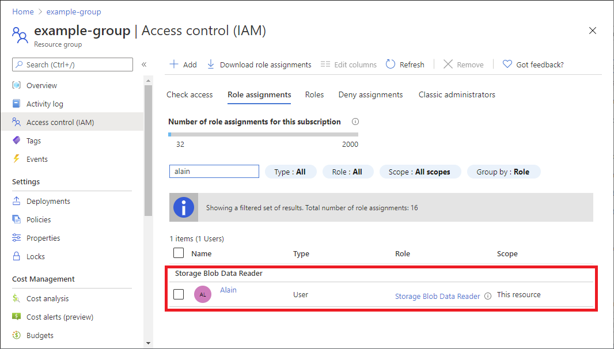

# Add or remove Azure role assignments using the Azure portal

[!INCLUDE [Azure RBAC definition grant access](../../includes/role-based-access-control/definition-grant.md)] This article describes how to assign roles using the Azure portal.

If you need to assign administrator roles in Azure Active Directory, see [View and assign administrator roles in Azure Active Directory](../active-directory/roles/manage-roles-portal.md).

## Prerequisites

[!INCLUDE [Azure role assignment prerequisites](../../includes/role-based-access-control/prerequisites-role-assignments.md)]

## Add a role assignment

In Azure RBAC, to grant access to an Azure resource, you add a role assignment. Follow these steps to assign a role.

### Step 1: Identify the needed scope

[!INCLUDE [Scope for Azure RBAC introduction](../../includes/role-based-access-control/scope-intro.md)]

[!INCLUDE [Scope for Azure RBAC least privilege](../../includes/role-based-access-control/scope-least.md)] For more information about scope, see [Understand scope](scope-overview.md).

1. Sign in to the [Azure portal](https://portal.azure.com).

1. In the Search box at the top, search for the scope you want to grant access to. For example, search for **Management groups**, **Subscriptions**, **Resource groups**, or a specific resource.

    

1. Click the specific resource for that scope.

    The following shows an example resource group.

    

### Step 2: Open the Add role assignment pane

**Access control (IAM)** is the page that you typically use to assign roles to grant access to Azure resources. It's also known as identity and access management (IAM) and appears in several locations in the Azure portal.

1. Click **Access control (IAM)**.

    The following shows an example of the Access control (IAM) page for a resource group.

    

1. Click the **Role assignments** tab to view the role assignments at this scope.

1. Click **Add** > **Add role assignment**.
   If you don't have permissions to assign roles, the Add role assignment option will be disabled.

   

    The Add role assignment pane opens.

   

### Step 3: Select the appropriate role

1. In the **Role** list, search or scroll to find the role that you want to assign.

    You can hover over the info icon to display a description for the role. For additional information, you can view the [Azure built-in roles](built-in-roles.md) article.

   

1. Click to select the role.

### Step 4: Select who needs access

1. In the **Assign access to** list, select the type of security principal to assign access to.

    | Type | Description |
    | --- | --- |
    | **User, group, or service principal** | If you want to assign the role to a user, group, or service principal (application), select this type. |
    | **User assigned managed identity** | If you want to assign the role to a [user-assigned managed identity](../active-directory/managed-identities-azure-resources/overview.md), select this type. |
    | *System assigned managed identity* | If you want to assign the role to a [system-assigned managed identity](../active-directory/managed-identities-azure-resources/overview.md), select the Azure service instance. |

   

1. If you selected a user-assigned managed identity or a system-assigned managed identity, select the **Subscription** where the managed identity is located.

1. In the **Select** section, search for security principal by entering a string or scrolling through the list.

   

1. Once you have found the security principal, click to select it.

### Step 5: Assign role

1. To assign the role, click **Save**.

   After a few moments, the security principal is assigned the role at the selected scope.

1. On the **Role assignments** tab, verify that you see the role assignment in the list.

    

## Remove a role assignment

In Azure RBAC, to remove access from an Azure resource, you remove a role assignment. Follow these steps to remove a role assignment.

1. Open **Access control (IAM)** at a scope, such as management group, subscription, resource group, or resource, where you want to remove access.

1. Click the **Role assignments** tab to view all the role assignments at this scope.

1. In the list of role assignments, add a checkmark next to the security principal with the role assignment you want to remove.

   

1. Click **Remove**.

   

1. In the remove role assignment message that appears, click **Yes**.

    If you see a message that inherited role assignments cannot be removed, you are trying to remove a role assignment at a child scope. You should open Access control (IAM) at the scope where the role was assigned and try again. A quick way to open Access control (IAM) at the correct scope is to look at the **Scope** column and click the link next to **(Inherited)**.

   

## Next steps

- [Assign a user as an administrator of an Azure subscription](role-assignments-portal-subscription-admin.md)
- [Add a role assignment for a managed identity](role-assignments-portal-managed-identity.md)
- [Troubleshoot Azure RBAC](troubleshooting.md)
