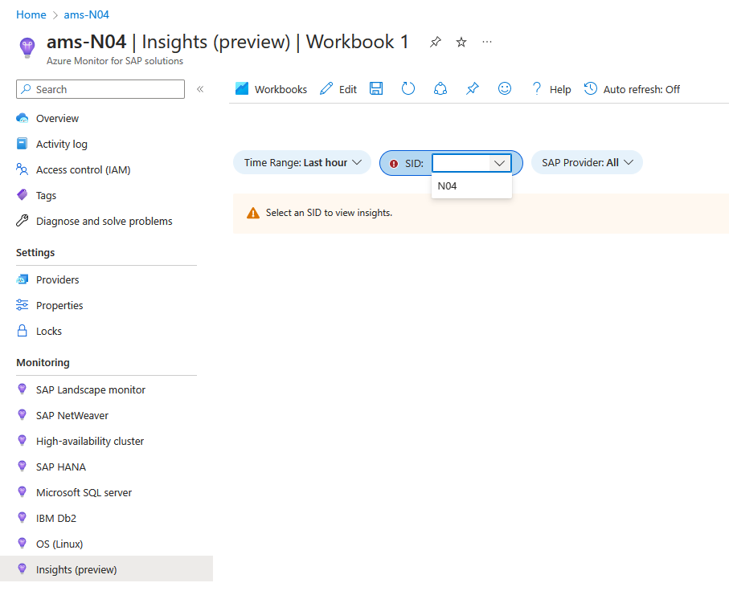
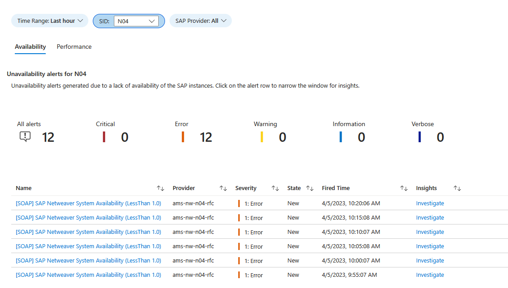
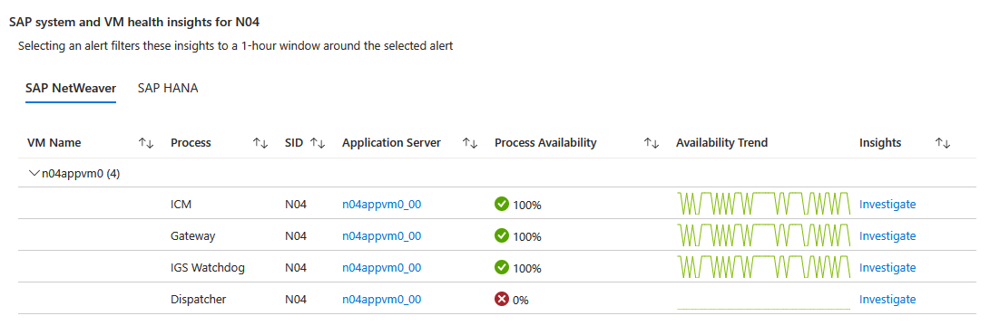
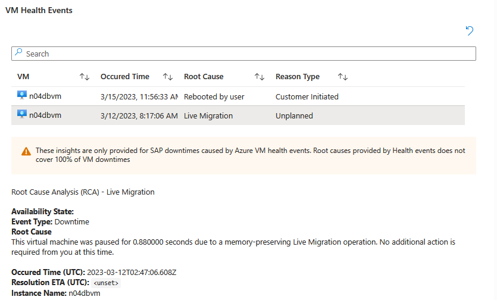
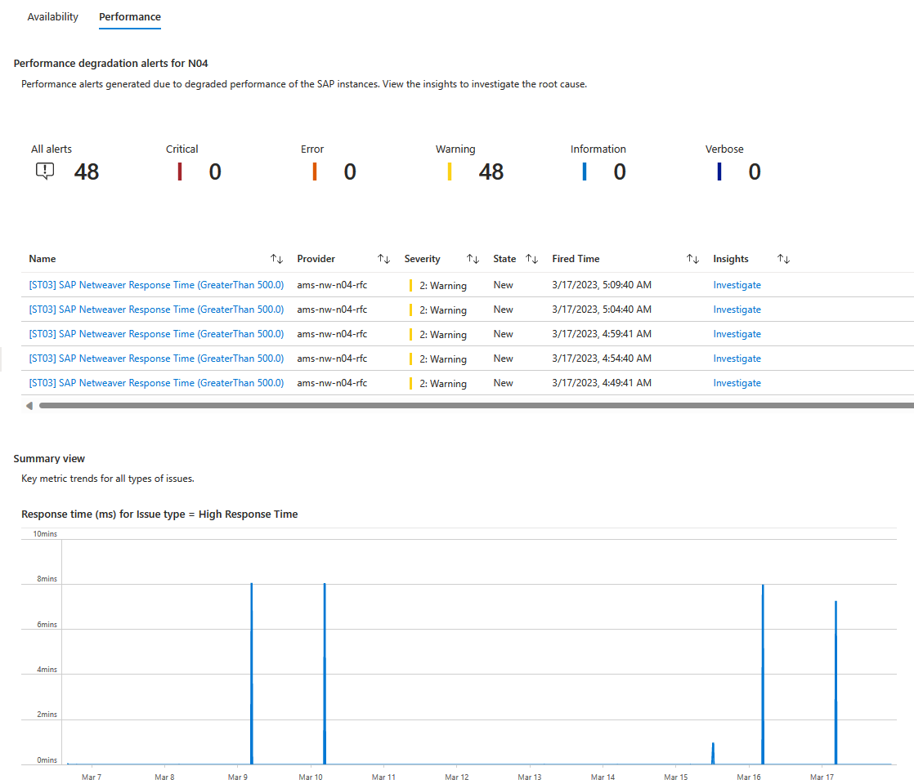

# Enable Insights to troubleshoot SAP workload issues (preview)

> [!Important]
>  The Insights feature is currently in PREVIEW. See the [Supplemental Terms of Use for Microsoft Azure Previews](https://azure.microsoft.com/support/legal/preview-supplemental-terms/) for legal terms that apply to Azure features that are in beta, preview, or otherwise not yet released into general availability.

The Insights capability in Azure Monitor for SAP Solutions helps you troubleshoot Availability and Performance issues on your SAP workloads. It helps you correlate key SAP components issues with SAP logs and Azure platform metrics and health events. 
In this how-to-guide, learn to enable Insights in Azure Monitor for SAP solutions. You can use SAP Insights with only the latest version of the service, *Azure Monitor for SAP solutions* and not *Azure Monitor for SAP solutions (classic)*

> [!NOTE]
> This section applies to only Azure Monitor for SAP solutions.

## Prerequisites

- An Azure subscription.
- An existing Azure Monitor for SAP solutions resource. To create an Azure Monitor for SAP solutions resource, see the [quickstart for the Azure portal](quickstart-portal.md) or the [quickstart for PowerShell](quickstart-powershell.md).
- An existing NetWeaver and HANA(optional) provider. To configure a NetWeaver provider, see the How to guides for [NetWeaver provider configuration](provider-netweaver.md).
- (Optional) Alerts set up for availability and/or performance issues on the NetWeaver/HANA provider. To configure a NetWeaver provider, see the How to guides for [setting up Alerts on Azure Monitor for SAP](get-alerts-portal.md)

## Steps to Enable Insights in Azure Monitor for SAP solutions

To enable Insights for Azure Monitor for SAP solutions, you need to:

1. [Run a PowerShell script for access](#run-a-powershell-script-for-access)
1. [Prerequisite - Unprotect methods](#unprotect-the-getenvironment-method)

### Run a PowerShell script for access

> [!Note]
> This step gives your Azure Monitor for SAP solutions(AMS) instance access to Azure resource graph. With this access your AMS instance will be able to pull ARM IDs of virtual machines on which the linked SAP systems are hosted. This will help your AMS instance correlate issues you face with Azure infrastructure telemetry, giving you an end-to-end troubleshooting experience. 


1. Download the onboarding script [from github](https://github.com/Azure/Azure-Monitor-for-SAP-solutions-preview/blob/main/Scripts/AMS_AIOPS_SETUP.ps1)
2. Go to the Azure portal and select the Cloud Shell tab from the menu bar at the top. Refer [this guide](../../cloud-shell/quickstart) to get started with Cloud Shell. 
3. Switch from Bash to PowerShell.
4. Upload the script downloaded in the first step.
5. Navigate to the folder where the script is present using the command:
```Powershell
cd <script_path>
```
6. Set the AMS Resource/ARM ID with the command: 
```PowerShell
$armId = "<AMS ARM ID>"
```
7.	If the VMs belong to a different subscription than AMS, set the list of subscriptions in which VMs of the SAP system are present (use subscription IDs): 
```PowerShell
$subscriptions = "<Subscription ID 1>","<Subscription ID 2>"
```
> [!Important]
> To run this script succesfully, ensure you have Contributor + User Access Admin or Owner access on all subscriptions in the list. See [steps to assign Azure roles](../../role-based-access-control/role-assignments-steps.md).

8.	Run the script uploaded from step 6 using the command:
   * If $subscriptions was set: 
```PowerShell
.\AMS_AIOPS_SETUP.ps1 -ArmId $armId -subscriptions $subscriptions
```
   * If $subscriptions wasn't set: 
```PowerShell
.\AMS_AIOPS_SETUP.ps1 -ArmId $armId
```

### Unprotect the GetEnvironment method

Follow steps to unprotect methods from the [NetWeaver provider configuration page](provider-netweaver.md#prerequisite-unprotect-methods-for-metrics). 
<br/>If you have already followed these steps during Netweaver provider setup, you can skip this section. Please ensure you have unprotected the GetEnvironment method in particular for this capability to work properly. 

> [!Important]
> You might have to wait for up to 2hrs for your AMS to start receiving the VM details that it monitors.

## Using Insights on Azure Monitor for SAP Solutions(AMS)
We have two categories of issues we help you get insights for. 
1. [Availability issues](#availability-insights)
1. [Performance degradations](#performance-insights)

#### Scope of the preview
We have insights only for a limited set of issues as part of the preview. We will be extending this to majority of the issues supported by AMS alerts before this capability is Generally Available(GA). 
* Availability insights lets you detect and troubleshoot unavailability of Netweaver system, instance and HANA DB. 
* Performance insights are provided for NetWeaver metrics - High response time(ST03) and Long running batch jobs. 

> [!Important]
> As a user of the Insights capability, you will require reader access on all virtual machines on which the SAP systems are hosted that you are trying to monitor using AMS. This is to make sure that you are able to view Azure monitor metrics and Resource health events of these virtual machines in context of SAP issues. See [steps to assign Azure roles](../../role-based-access-control/role-assignments-steps.md).

### Availability Insights
This capability helps you get an overview regarding availability of your SAP system in one place. You can also correlate SAP availability with Azure platform VM availability and its health events easing the overall root-causing process. 

#### Steps to use availability insights
1.	Open the AMS instance of your choice and visit the insights tab under Monitoring on the left navigation pane. 

1. If you have followed all [the steps mentioned](#steps-to-enable-insights-in-azure-monitor-for-sap-solutions), you should see the above screen asking for context to be set up. You can set the Time range, SID and the provider (optional, All selected by default).
1.	On the top, you are able to see all the fired alerts related to SAP system and instance availability on this screen. 

1.	If you are able to see SAP system availability trend, categorized by VM - SAP process list. If you have selected a fired alert in the previous step, you are able to see these trends in context with the fired alert. If not, this respects the time range you set on the main Time range filter. 

1.	You can see the Azure virtual machine on which the process is hosted and the corresponding availability trends for the combination. To view detailed insights, click on the Investigate link.
1.	It opens a context pane that shows you availability insights on the corresponding virtual machine and the SAP application.
It has two categories of insights:
    * Azure platform: VM health events filtered by the time range set, either by the workbook filter or the selected alert. This also consists of VM availability metric trend for the chosen VM.
    
    * SAP Application: Process availability and contextual insights on the process like error messages (SM21), Lock entries (SM12) and Canceled jobs (SM37) which can help you find issues that might exist in parallel in the system, at the point in time. 

### Performance Insights
This capability helps you get an overview regarding performance of your SAP system in one place. You can also correlate key SAP performance issues with related SAP application telemetry alongside Azure platform utilization metrics and SAP workload configuration drifts easing the overall root-causing process. 

#### Steps to use performance insights
1.	Open the AMS instance of your choice and visit the insights tab under Monitoring on the left navigation pane. 
2.	On the top, you are able to see all the fired alerts related to SAP application performance degradations.
    
3.	Next you are able to see key metrics related to performance issues and its trend dring the timerange you have chosen.
4. To view detailed insights issues, you can either choose to investigate a fired alert or view insights for a key metric. 
<br/>


5.	On investigating, you see a context pane, which shows you four categories of metrics in context of the issue/key metric chosen. 
    * Issue/Key metric details
    * SAP application
    * Azure platform
    * Configuration drift 
6. Using the set of metrics in context of the issue, the capability helps you visually correlate trends of key metrics. This eases the root-causing process of performance degradations observed in SAP workloads on Azure. 
 
 


