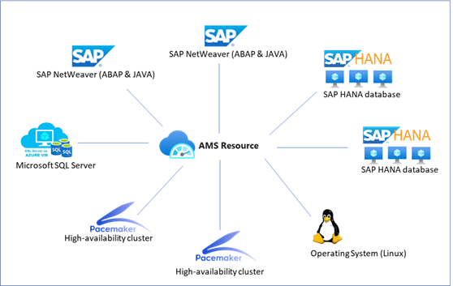
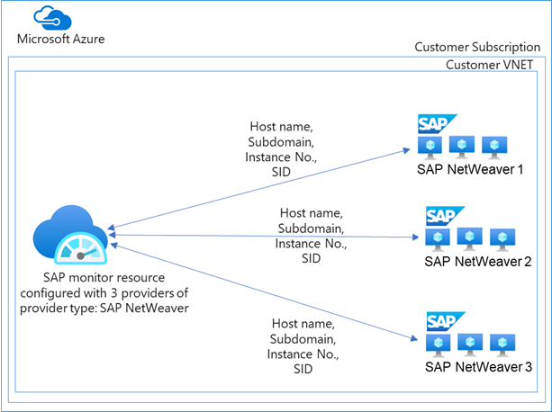
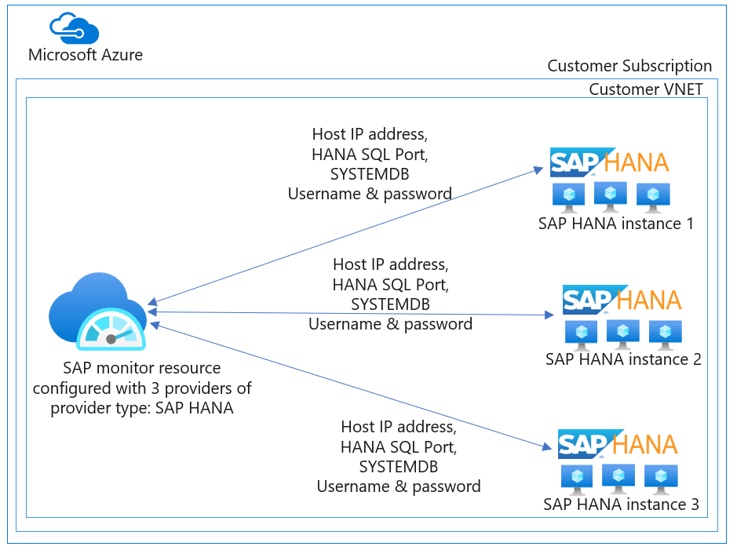
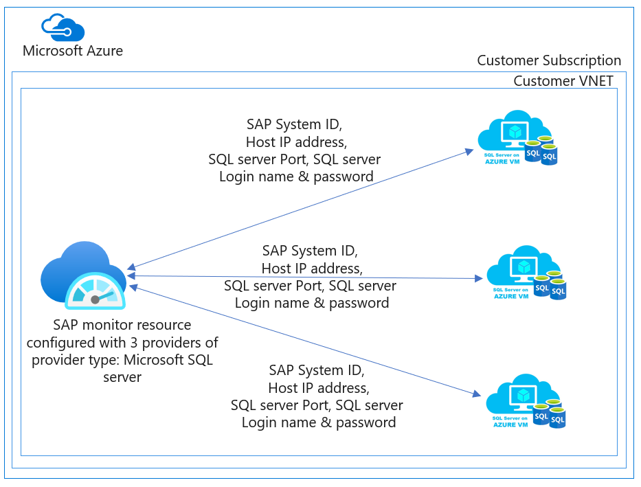
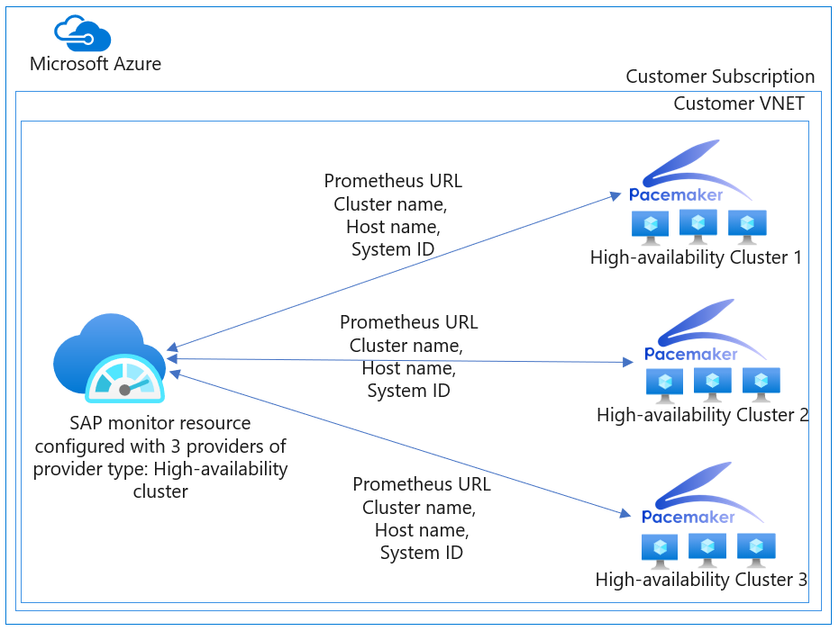
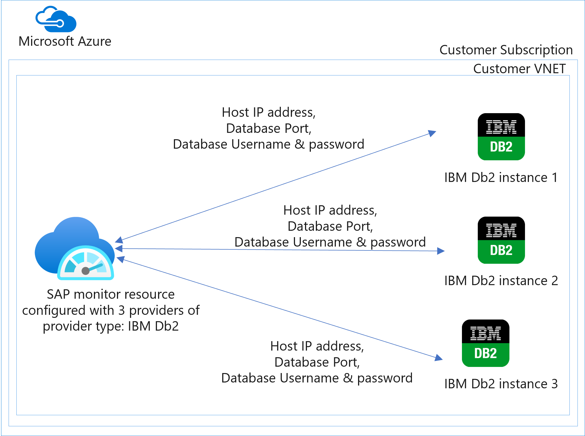

# What are providers in Azure Monitor for SAP solutions? 

In the context of *Azure Monitor for SAP solutions*, a *provider* contains the connection information for a corresponding component and helps to collect data from there. There are multiple provider types. For example, an SAP HANA provider is configured for a specific component within the SAP landscape, like an SAP HANA database. You can configure an Azure Monitor for SAP solutions resource (also known as SAP monitor resource) with multiple providers of the same type or multiple providers of multiple types.

You can choose to configure different provider types for data collection from the corresponding component in their SAP landscape. For example, you can configure one provider for the SAP HANA provider type, another provider for high availability cluster provider type, and so on.

You can also configure multiple providers of a specific provider type to reuse the same SAP monitor resource and associated managed group. For more information, see [Manage Azure Resource Manager resource groups by using the Azure portal](../../azure-resource-manager/management/manage-resource-groups-portal.md).

It's recommended to configure at least one provider when you deploy an Azure Monitor for SAP solutions resource. By configuring a provider, you start data collection from the corresponding component for which the provider is configured.

If you don't configure any providers at the time of deployment, the Azure Monitor for SAP solutions resource is still deployed, but no data is collected. You can add providers after deployment through the SAP monitor resource within the Azure portal. You can add or delete providers from the SAP monitor resource at any time.

## Provider type: SAP NetWeaver

You can configure one or more providers of provider type SAP NetWeaver to enable data collection from SAP NetWeaver layer. Azure Monitor for SAP solutions NetWeaver provider uses the existing
- [**SAPControl** Web service](https://www.sap.com/documents/2016/09/0a40e60d-8b7c-0010-82c7-eda71af511fa.html) interface to retrieve the appropriate information.
- SAP RFC - ability to collect additional information from the SAP system using Standard SAP RFC.

You can get the following data with the SAP NetWeaver provider:

- SAP system and application server availability (e.g Instance process availability of dispatcher,ICM,Gateway,Message server,Enqueue Server,IGS Watchdog) (SAPOsControl)
- Work process usage statistics and trends (SAPOsControl)
- Enqueue Lock statistics and trends (SAPOsControl)
- Queue usage statistics and trends (SAPOsControl)
- SMON Metrics (**Tcode - /SDF/SMON**) (RFC)
- SWNC Workload, Memory, Transaction, User, RFC Usage (**Tcode - St03n**) (RFC)
- Short Dumps (**Tcode - ST22**) (RFC)
- Object Lock (**Tcode - SM12**) (RFC)
- Failed Updates (**Tcode - SM13**) (RFC)
- System Logs Analysis (**Tcode - SM21**) (RFC)
- Batch Jobs Statistics (**Tcode - SM37**) (RFC)
- Outbound Queues (**Tcode - SMQ1**) (RFC)
- Inbound Queues (**Tcode - SMQ2**) (RFC)
- Transactional RFC (**Tcode - SM59**) (RFC)
- STMS Change Transport System Metrics (**Tcode - STMS**) (RFC)

Configuring the SAP NetWeaver provider requires:

For SOAP Web Methods:
   - Fully Qualified Domain Name of SAP Web dispatcher OR SAP Application server.
   - SAP System ID, Instance no.
   - Host file entries of all SAP application servers that get listed via SAPcontrol "GetSystemInstanceList" web method.

For SOAP+RFC:
   - Fully Qualified Domain Name of SAP Web dispatcher OR SAP Application server.
   - SAP System ID, Instance no.
   - SAP Client ID, HTTP port, SAP Username and Password for login.
   - Host file entries of all SAP application servers that get listed via SAPcontrol "GetSystemInstanceList" web method.

Check [SAP NetWeaver provider](./provider-netweaver) creation for more detail steps.

## Provider type: SAP HANA

You can configure one or more providers of provider type *SAP HANA* to enable data collection from SAP HANA database. The SAP HANA provider connects to the SAP HANA database over SQL port, pulls data from the database, and pushes it to the Log Analytics workspace in your subscription. The SAP HANA provider collects data every 1 minute from the SAP HANA database.

You can see the following data with the SAP HANA provider:

- Underlying infrastructure usage
- SAP HANA host status
- SAP HANA system replication
- SAP HANA Backup data
- Fetching Services
- Network throughput between the nodes in a scaleout system
- SAP HANA Long Idling Cursors
- SAP HANA Long Running Transactions
- Checks for configuration parameter values
- SAP HANA Uncommitted Write Transactions
- SAP HANA Disk Fragmentation
- SAP HANA Statistics Server Health
- SAP HANA High Memory Usage Service
- SAP HANA Blocking Transactions

Configuring the SAP HANA provider requires:
- The host IP address,
- HANA SQL port number
- **SYSTEMDB** username and password

It's recommended to configure the SAP HANA provider against **SYSTEMDB**. However, more providers can be configured against other database tenants.

Check [SAP HANA provider](./provider-hana) creation for more detail steps.

## Provider type: Microsoft SQL server

You can configure one or more Microsoft SQL Server providers to enable data collection from [SQL Server on Virtual Machines](https://azure.microsoft.com/services/virtual-machines/sql-server/). The SQL Server provider connects to Microsoft SQL Server over the SQL port. It then pulls data from the database and pushes it to the Log Analytics workspace in your subscription. Configure SQL Server for SQL authentication and for signing in with the SQL Server username and password. Set the SAP database as the default database for the provider. The SQL Server provider collects data from every 60 seconds up to every hour from the SQL server.

You can get the following data with the SQL Server provider:
- Underlying infrastructure usage
- Top SQL statements
- Top largest table
- Problems recorded in the SQL Server error log
- Blocking processes and others

Configuring Microsoft SQL Server provider requires:
- The SAP System ID
- The Host IP address
- The SQL Server port number
- The SQL Server username and password

Check [SQL Database provider](./provider-sql-server) creation for more detail steps.

## Provider type: High-availability cluster

You can configure one or more providers of provider type *High-availability cluster* to enable data collection from Pacemaker cluster within the SAP landscape. The High-availability cluster provider connects to Pacemaker using the [ha_cluster_exporter](https://github.com/ClusterLabs/ha_cluster_exporter) for **SUSE** based clusters and by using [Performance co-pilot](https://access.redhat.com/articles/6139852) for **RHEL** based clusters. Azure Monitor for SAP solutions then pulls data from cluster and pushes it to Log Analytics workspace in your subscription. The High-availability cluster provider collects data every 60 seconds from Pacemaker.

You can get the following data with the High-availability cluster provider:
 - Cluster status represented as a roll-up of node and resource status
 - Location constraints
 - Trends
 - [others](https://github.com/ClusterLabs/ha_cluster_exporter/blob/master/doc/metrics.md)

To configure a High-availability cluster provider, two primary steps are involved:

1. Install [ha_cluster_exporter](./ha_cluster_exporter) in *each* node within the Pacemaker cluster.

   You have two options for installing ha_cluster_exporter:

   - Use Azure Automation scripts to deploy a high-availability cluster. The scripts install [ha_cluster_exporter](https://github.com/ClusterLabs/ha_cluster_exporter) on each cluster node.
   - Do a [manual installation](https://github.com/ClusterLabs/ha_cluster_exporter#manual-clone--build).

2. Configure a High-availability cluster provider for *each* node within the Pacemaker cluster.

   To configure the High-availability cluster provider, the following information is required:

   - **Name**. A name for this provider. It should be unique for this Azure Monitor for SAP solutions instance.
   - **Prometheus Endpoint**. `http://<servername or ip address>:9664/metrics`.
   - **SID**. For SAP systems, use the SAP SID. For other systems (for example, NFS clusters), use a three-character name for the cluster. The SID must be distinct from other clusters that are monitored.
   - **Cluster name**. The cluster name used when creating the cluster. The cluster name can be found in the cluster property `cluster-name`.
   - **Hostname**. The Linux hostname of the virtual machine (VM).

  Check [High Availability Cluster provider](./provider-ha-pacemaker-cluster) creation for more detail steps.

## Provider type: OS (Linux)

You can configure one or more providers of provider type OS (Linux) to enable data collection from a BareMetal or VM node. The OS (Linux) provider connects to BareMetal or VM nodes using the [Node_Exporter](https://github.com/prometheus/node_exporter) endpoint. It then pulls data from the nodes and pushes it to Log Analytics workspace in your subscription. The OS (Linux) provider collects data every 60 seconds for most of the metrics from the nodes.

You can get the following data with the OS (Linux) provider:

   - CPU usage, CPU usage by process
   - Disk usage, I/O read & write
   - Memory distribution, memory usage, swap memory usage
   - Network usage, network inbound & outbound traffic details

To configure an OS (Linux) provider, two primary steps are involved:

1. Install [Node_Exporter](https://github.com/prometheus/node_exporter) on each BareMetal or VM node.
   You have two options for installing [Node_exporter](https://github.com/prometheus/node_exporter):
      - For automated installation with Ansible, use [Node_Exporter](https://github.com/prometheus/node_exporter) on each BareMetal or VM node to install the OS (Linux) Provider.
      - Do a [manual installation](https://prometheus.io/docs/guides/node-exporter/).

1. Configure an OS (Linux) provider for each BareMetal or VM node instance in your environment.
   To configure the OS (Linux) provider, the following information is required:
      - **Name**: a name for this provider, unique to the Azure Monitor for SAP solutions instance.
      - **Node Exporter endpoint**: usually `http://<servername or ip address>:9100/metrics`.

Port 9100 is exposed for the **Node_Exporter** endpoint.

Check [Operating System provider](./provider-linux) creation for more detail steps.

> [!Warning]
> Make sure **Node-Exporter** keeps running after the node reboot.

## Provider type: IBM Db2

You can configure one or more IBM Db2 providers to enable data collection from IBM Db2 servers. The Db2 Server provider connects to database over given port. It then pulls data from the database and pushes it to the Log Analytics workspace in your subscription. The Db2 Server provider collects data from every 60 seconds up to every hour from the DB2 server.

You can get the following data with the IBM Db2 provider:

- Database availability
- Number of connections
- Logical and physical reads
- Waits and current locks
- Top 20 runtime and executions

Configuring IBM Db2 provider requires:
- The SAP System ID
- The Host IP address
- The Database Name
- The Port number of the DB2 Server to connect to
- The Db2 Server username and password

Check [IBM Db2 provider](./provider-ibm-db2) creation for more detail steps.

## Next steps

Learn how to deploy Azure Monitor for SAP solutions from the Azure portal.

> [!div class="nextstepaction"]
> [Deploy Azure Monitor for SAP solutions by using the Azure portal](./quickstart-portal.md)
