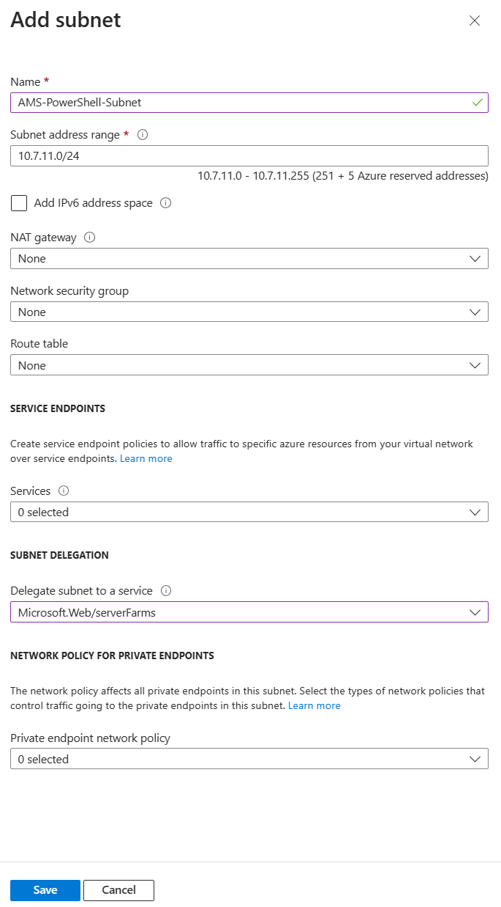

# Quickstart: Deploy Azure Monitor for SAP solutions by using the Azure portal

In this quickstart, you get started with Azure Monitor for SAP solutions by using the [Azure portal](https://azure.microsoft.com/features/azure-portal) to deploy resources and configure providers.

## Prerequisites

- If you don't have an Azure subscription, create a [free account](https://azure.microsoft.com/free/) before you begin.
- [Set up a network](./set-up-network.md) before you create an Azure Monitor instance.
- Create or choose a virtual network for Azure Monitor for SAP solutions that has access to the virtual network for the source SAP systems.
- Create a new subnet with an address range of IPv4/25 or larger in the virtual network that's associated with Azure Monitor for SAP solutions, with subnet delegation assigned to **Microsoft.Web/serverFarms**.

   > [!div class="mx-imgBorder"]
   > 

## Create a monitoring resource for Azure Monitor for SAP solutions

1. Sign in to the [Azure portal](https://portal.azure.com).

2. In the search box, search for and select **Azure Monitor for SAP solutions**.

3. On the **Basics** tab, provide the required values:

   1. **Subscription** Add relevant Azure subscription details
   2. **Resource group** Create a new or Select an existing Resource Group under the given subscription
   3. **Resource name** Enter the name for Azure Monitor for SAP solutions
   4. **Workload region** is the region where the monitoring resources are created, make sure to select a region that is same as your virtual network.
   5. **Service region** is where proxy resource gets created which manages monitoring resources deployed in the workload region. Service region is automatically selected based on your Workload Region selection.
   6. For **Virtual network** field select a virtual network, which has connectivity to your SAP systems for monitoring.
   7. For the **Subnet** field, select a subnet that has connectivity to your SAP systems. You can use an existing subnet or create a new subnet. Make sure that you select a subnet, which is an **IPv4/25 block or larger**.
   8. For **Log analytics**, you can use an existing Log Analytics workspace or create a new one. If you create a new workspace, it is created inside the managed resource group along with other monitoring resources.
   9. When entering **Managed resource group name**, make sure to use a unique name. This name is used to create a resource group, which will contain all the monitoring resources. Managed Resource Group name can't be changed once the resource is created.

  > [!div class="mx-imgBorder"]
  > 

4. On the **Providers** tab, you can start creating providers along with the monitoring resource. You can also create providers later by navigating to the **Providers** tab in the Azure Monitor for SAP solutions resource.

5. On the **Tags** tab, you can add tags to the monitoring resource. Make sure to add all the mandatory tags in case you have a tag policy in place.

6. On the **Review + create** tab, review the details and click **Create**.

## Create provider in Azure Monitor for SAP solutions

Refer to the following for each provider instance creation:

- [SAP NetWeaver Provider Creation](provider-netweaver.md)
- [SAP HANA Provider Creation](provider-hana.md)
- [SAP Microsoft SQL Provider Creation](provider-sql-server.md)
- [SAP IBM DB2 Provider Creation](provider-ibm-db2.md)
- [SAP Operating System Provider Creation](provider-linux.md)
- [SAP High Availability Provider Creation](provider-ha-pacemaker-cluster.md)

## Next steps

Learn more about Azure Monitor for SAP solutions.

> [!div class="nextstepaction"]
> [Configure Azure Monitor for SAP solution providers](provider-netweaver.md)
