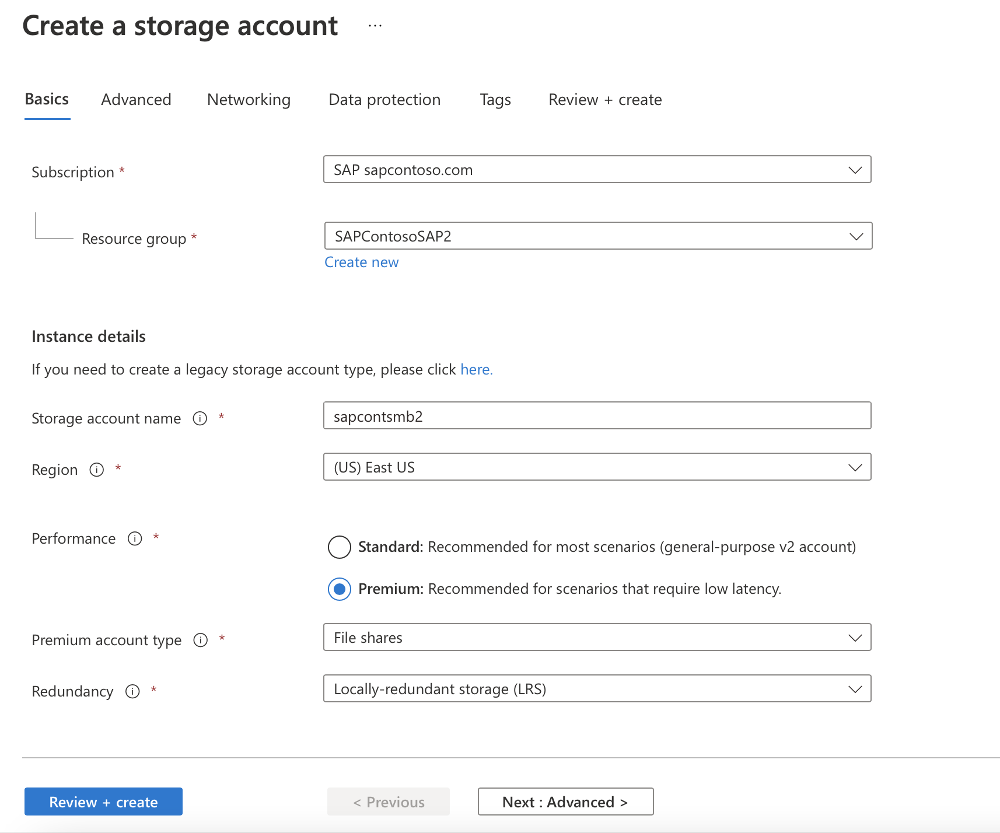
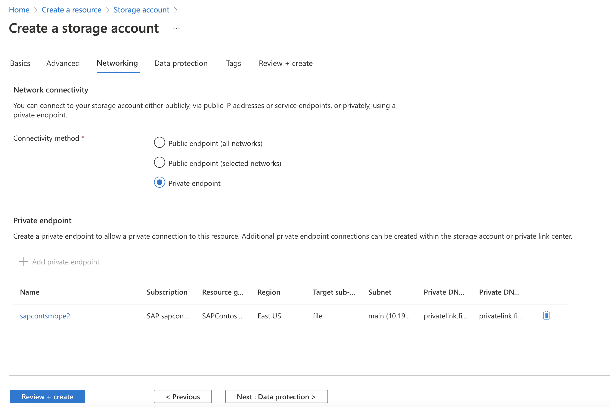
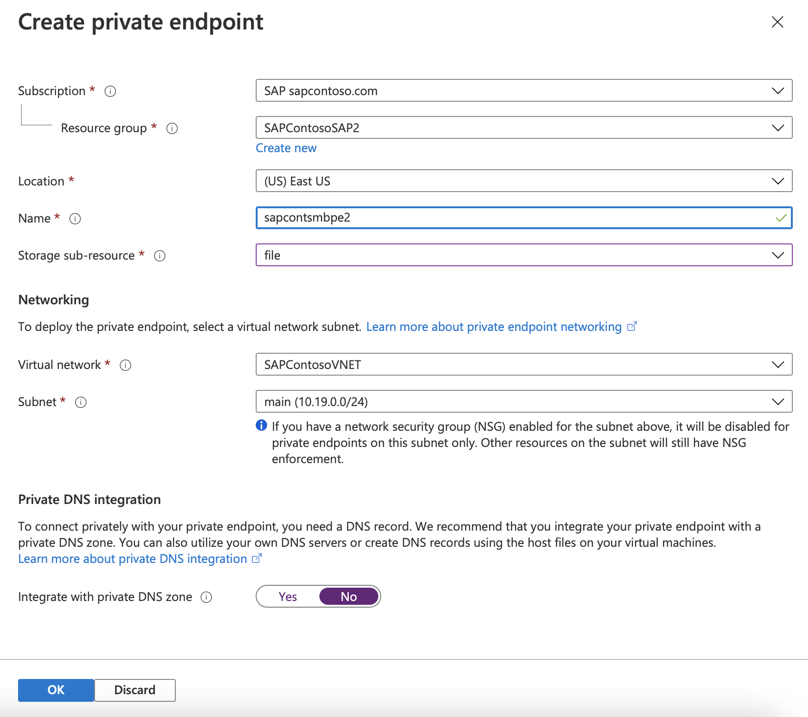
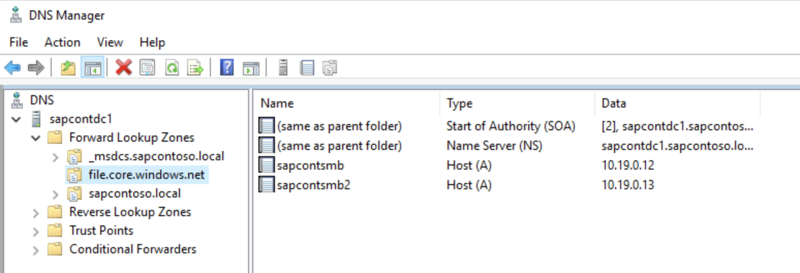
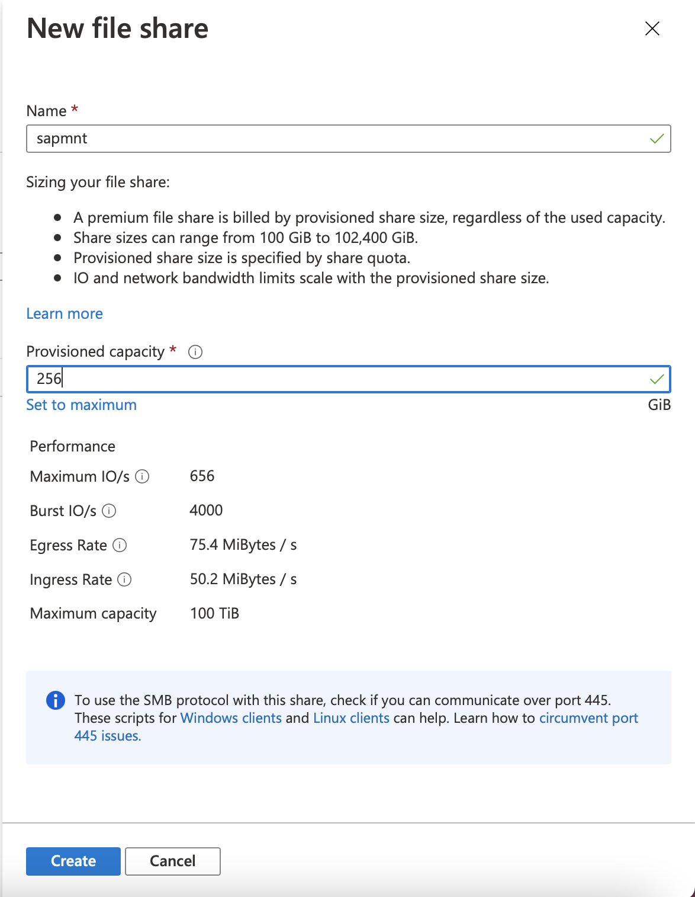
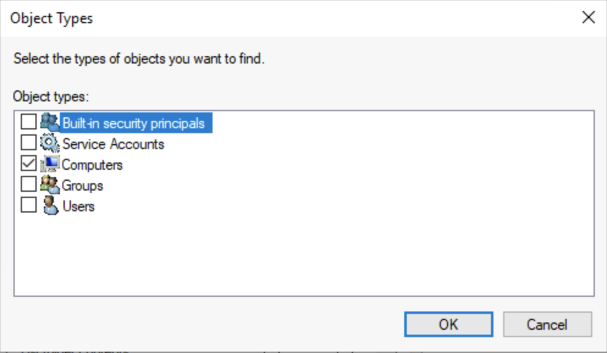
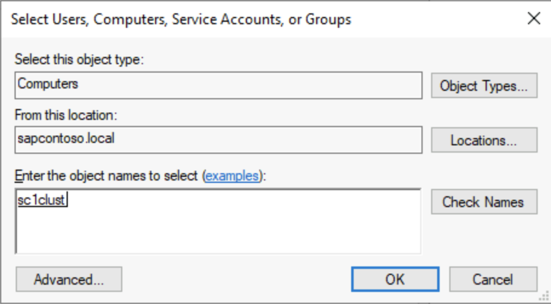
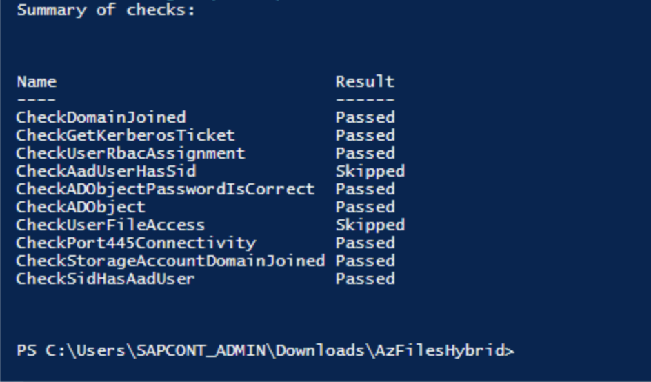
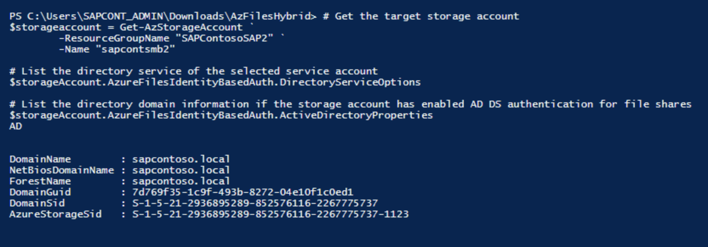

# High availability for SAP NetWeaver on Azure VMs on Windows with Azure Files Premium SMB for SAP applications

## Introduction
Azure Files Premium SMB is now fully supported by Microsoft and SAP. **SWPM 1.0 SP32** and **SWPM 2.0 SP09** and above support Azure Files Premium SMB storage.  There are special requirements for sizing Azure Files Premium SMB shares. This documentation contains specific recommendations on how to distribute workload on Azure Files Premium SMB, how to adequately size Azure Files Premium SMB and the minimum installation requirements for Azure Files Premium SMB.

High Availability SAP solutions need a highly available File share for hosting **sapmnt**, **trans** and **interface directories**. Azure Files Premium SMB is a simple Azure PaaS solution for Shared File Systems for SAP on Windows environments. Azure Files Premium SMB can be used in conjunction with Availability Sets and Availability Zones. Azure Files Premium SMB can also be used for Disaster Recovery scenarios to another region.  

> [!NOTE]
> Clustering SAP ASCS/SCS instances by using a file share is supported for SAP systems with SAP Kernel 7.22 (and later). For details see SAP note [2698948](https://launchpad.support.sap.com/#/notes/2698948)
 
## Sizing & Distribution of Azure Files Premium SMB for SAP Systems

The following points should be evaluated when planning the deployment of Azure Files Premium SMB:
* The File share name **sapmnt** can be created once per storage account.  It is possible to create additional SIDs as directories on the same **/sapmnt** share such as - **/sapmnt/\<SID1\>** and **/sapmnt/\<SID2\>** 
* Choose an appropriate size, IOPS and throughput.  A suggested size for the share is 256GB per SID.  The maximum size for a Share is 5120 GB
* Azure Files Premium SMB may not perform optimally for very large **sapmnt** shares with more than 1-2 million files per storage account.  Customers that have millions of batch jobs creating millions of job log files should regularly reorganize them as per [SAP Note 16083][16083] If needed, old job logs may be moved/archived to another Azure Files Premium SMB.  If **sapmnt** is expected to be very large then alternate options (such as Azure ANF) should be considered.
* It is recommended to use a Private Network Endpoint
* Avoid consolidating too many SIDs to a single storage account and its file share.
* As general guidance no more than between 2 to 4 non-prod SIDs can be consolidated together.
* Do not consolidate the entire Development, QAS + Production landscape to one storage account and/or file share.  Failure of the share will lead to downtime of the entire SAP landscape.
* It is not advisable to consolidate the **sapmnt** and **transport directories** on the same storage account except for very small systems. During the installation of the SAP PAS Instance, SAPInst will request a Transport Hostname.  The FQDN of a different storage account should be entered <storage_account>.file.core.windows.net.
* Do not consolidate the file system used for Interfaces onto the same storage account as **/sapmnt/\<SID>** 
* The SAP users/groups must be added to the ‘sapmnt’ share and should have this permission set in the Azure portal: **Storage File Data SMB Share Elevated Contributor**.

There are important reasons for separating **Transport**, **Interface** and **sapmnt** onto separate storage accounts.  Distributing these components onto separate storage accounts improves throughput, resiliency and simplifies the performance analysis.  If many SIDs and other file systems are consolidated onto a single Azure Files Storage account and the storage account performance is poor due to hitting the throughput limits, it is extremely difficult to identify which SID or application is causing the problem. 

## Planning 
> [!IMPORTANT]
> Installation of SAP High Availability Systems on Azure Files Premium SMB with Active Directory Integration requires cross team collaboration.  It is highly recommended that the Basis Team, the Active Directory Team and the Azure Team work together to complete these tasks: 
>
* Azure Team – setup and configuration of Storage Account, Script Execution and AD Directory Synchronization.
* Active Directory Team – Creation of User Accounts and Groups.
* Basis Team – Run SWPM and set ACLs (if required).

Prerequisites for the installation of SAP NetWeaver High Availability Systems on Azure Files Premium SMB with Active Directory Integration.

* The SAP servers must be joined to an Active Directory Domain.
* The Active Directory Domain containing the SAP servers must be replicated to Azure Active Directory using Azure AD connect.
* It is highly recommended that there is at least one Active Directory Domain controller in the Azure landscape to avoid traversing the Express Route to contact Domain Controllers on-premises.
* The Azure support team should review the Azure Files SMB with [Active Directory Integration](../../storage/files/storage-files-identity-auth-active-directory-enable.md#videos) documentation. *The video shows additional configuration options which were modified (DNS) and skipped (DFS-N) for simplification reasons.* Nevertheless these are valid configuration options. 
* The user executing the Azure Files PowerShell script must have permission to create objects in Active Directory.
* **SWPM version 1.0 SP32 and SWPM 2.0 SP09 or higher are required. SAPInst patch must be 749.0.91 or higher.**
* An up-to-date release of PowerShell should be installed on the Windows Server where the script is executed. 

## Installation sequence
 1. The Active Directory administrator should create in advance 3 Domain users with **Local Administrator** rights and one global group in the **local Windows AD**: **SAPCONT_ADMIN@SAPCONTOSO.local** has Domain Admin rights and is used to run **SAPInst**, **\<sid>adm** and **SAPService\<SID>** as SAP system users and the **SAP_\<SAPSID>_GlobalAdmin** group. The SAP Installation Guide contains the specific details required for these accounts.  **SAP user accounts should not be Domain Administrator**. It is generally recommended **not to use \<sid>adm to run SAPInst**.
 2. The Active Directory administrator or Azure Administrator should check **Azure AD Connect** Synchronization Service Manager. By default it takes approximately 30 minutes to replicate to the **Azure Active Directory**. 
 3. The Azure administrator should complete the following tasks:
     1. Create a Storage Account with either **Premium ZRS** or **LRS**. Customers with Zonal deployment should choose ZRS. Here the choice between setting up a **Standard** or **Premium Account** needs to be made:
     Azure portal Screenshot for create storage account - Step 1
         > [!IMPORTANT]
         > For productive use the recommendation is using a **Premium Account**. For non-productive using a **Standard Account** will be sufficient. 
         >
         Azure portal Screenshot for create storage account - Step 2
         
         In this screen the default settings should be ok.
        
         Azure portal Screenshot for create storage account - Step 3 
         
         In this step the decision to use a private endpoint is made.
     1. **Select Private Network Endpoint** for the storage account.
     If required add a DNS A-Record into Windows DNS for the **<storage_account_name>.file.core.windows.net** (this may need to be in a new DNS Zone).  Discuss this topic with the DNS administrator.  The new zone should not update outside of an organization.  
         Azure portal screenshot for the private endpoint definition.
         DNS server screenshot for private endpoint DNS definition.    
     1. Create the **sapmnt** File share with an appropriate size.  The suggested size is 256GB which delivers 650 IOPS, 75 MB/sec Egress and 50 MB/sec Ingress.
         Azure portal screenshot for the SMB share definition. 
      
     1. Download the [Azure Files GitHub](../../storage/files/storage-files-identity-ad-ds-enable.md#download-azfileshybrid-module) content and execute the [script](../../storage/files/storage-files-identity-ad-ds-enable.md#run-join-azstorageaccount).   
     This script will create either a Computer Account or Service Account in Active Directory.  The user running the script must have the following properties: 
         * The user running the script must have permission to create objects in the Active Directory Domain containing the SAP servers. Typically, a domain administrator account is used such as **SAPCONT_ADMIN@SAPCONTOSO.local** 
         * Before executing the script confirm that this Active Directory Domain user account is synchronized with Azure Active Directory (AAD).  An example of this would be to open the Azure portal and navigate to AAD users and check that the user **SAPCONT_ADMIN@SAPCONTOSO.local** exists and verify the AAD user account **SAPCONT_ADMIN@SAPCONTOSO.onmicrosoft.com**.
         * Grant the **Contributor RBAC** role to this Azure Active Directory user account for the Resource Group containing the storage account holding the File Share.  In this example the user **SAPCONT_ADMIN@SAPCONTOSO.onmicrosoft.com** is granted **Contributor Role** to the respective Resource Group 
         * The script should be executed while logged on to a Windows server using an Active Directory Domain user account with the permission as specified above, in this example the account **SAPCONT_ADMIN@SAPCONTOSO.local** would be used.
         >[!IMPORTANT]
         > When executing the PowerShell script command **Connect-AzAccount**, it is highly recommended to enter the Azure Active Directory user account that corresponds and maps to the Active Directory Domain user account used to logon to a Windows Server, in this example this is the user account **SAPCONT_ADMIN@SAPCONTOSO.onmicrosoft.com**
         >
         In this example scenario the Active Directory Administrator would logon to the Windows Server as **SAPCONT_ADMIN@SAPCONTOSO.local** and when using the **PS command Connect-AzAccount** connect as user **SAPCONT_ADMIN@SAPCONTOSO.onmicrosoft.com**.  Ideally the Active Directory Administrator and the Azure Administrator should work together on this task.
         Screenshot of the PowerShell script creating local AD account.

         Azure portal screenshot after successful PowerShell script execution. 

         The following should appear as “Configured”  
         Storage -> Files Shares “Active Directory: Configured”
     1. Assign SAP users **\<sid>adm**, **SAPService\<SID>** and the **SAP_\<SAPSID>_GlobalAdmin** group to the Azure Files Premium SMB File Share with Role **Storage File Data SMB Share Elevated Contributor** in the Azure portal 
     1. Check the ACL on the **sapmnt file share** after the installation and add **DOMAIN\CLUSTER_NAME$** account, **DOMAIN\\\<sid>adm**, **DOMAIN\SAPService\<SID>** and the **Group SAP_\<SID>_GlobalAdmin**. These accounts and group **should have full control of sapmnt directory**.

         > [!IMPORTANT]
         > This step must be completed before the SAPInst installation or it will be difficult or impossible to change ACLs after SAPInst has created directories and files on the File Share
         >
         Windows Explorer screenshot of the assigned user rights.

         The following screenshots show how to add Computer machine accounts by selecting the Object Types -> Computers
         Windows Server screenshot of adding the cluster name to the local AD.
         
         The DOMAIN\CLUSTER_NAME$ can be found by selecting “Computers” from the “Object Types”  
         Screenshot of adding AD computer account - Step 2
         Screenshot of adding AD computer account - Step 3
         Screenshot of computer account access properties.

     8. If required move the Computer Account created for Azure Files to an Active Directory Container that does not have account expiry.  The name of the Computer Account will be the short name of the storage account 

     
     > [!IMPORTANT]
     > In order to initialize the Windows ACL for the SMB share the share needs to be mounted once to a drive letter.
     >
     The storage key is the password and the user is **Azure\\\<SMB share name>** as shown here:
     Windows screenshot of the net use one-time mount of the SMB share.

 4. Basis administrator should complete the tasks below:
     1. [Install the Windows Cluster on ASCS/ERS Nodes and add the Cloud witness](sap-high-availability-infrastructure-wsfc-shared-disk.md#0d67f090-7928-43e0-8772-5ccbf8f59aab)
     2. The first Cluster Node installation will ask for the Azure Files SMB storage account name.  Enter the FQDN <storage_account_name>.file.core.windows.net.  If SAPInst does not accept >13 characters then the SWPM version is too old.
     3. [Modify the SAP Profile of the ASCS/SCS Instance](sap-high-availability-installation-wsfc-shared-disk.md#10822f4f-32e7-4871-b63a-9b86c76ce761)
     4. [Update the Probe Port for the SAP \<SID> role in WSFC](sap-high-availability-installation-wsfc-shared-disk.md#10822f4f-32e7-4871-b63a-9b86c76ce761)
     5. Continue with SWPM Installation for the second ASCS/ERS Node. SWPM will only require path of profile directory.  Enter the full UNC path to the profile directory.
     6. Enter the UNC profile path for the DB and PAS/AAS Installation.
     7. PAS Installation will ask for Transport hostname. Provide the FQDN of a separate storage account name for transport directory.
     8. Verify the ACLs on the SID and trans directory.

## Disaster Recovery setup
Disaster Recovery scenarios or Cross-Region Replication scenarios are supported with Azure Files Premium SMB. All data in Azure Files Premium SMB directories can be continuously synchronized to a DR region storage account using [Synchronize Files under Transfer data with AzCopy and file storage.](../../storage/common/storage-use-azcopy-files.md#synchronize-files) After a Disaster Recovery event and failover of the ASCS instance to the DR region, change the SAPGLOBALHOST profile parameter to the point to Azure Files SMB in the DR region. The same preparation steps should be performed on the DR storage account to join the storage account to Active Directory and assign RBAC roles for SAP users and groups.

## Troubleshooting
The PowerShell scripts downloaded in step 3.c contain a debug script to conduct some basic checks to validate the configuration.
```powershell
Debug-AzStorageAccountAuth -StorageAccountName $StorageAccountName -ResourceGroupName $ResourceGroupName -Verbose
```
PowerShell screenshot of the debug script output.

The following screen shows the technical information to validate a successful domain join.
## Useful links & resources

* SAP Note [2273806][2273806] SAP support for storage or file system related solutions 
* [Install SAP NetWeaver high availability on a Windows failover cluster and file share for SAP ASCS/SCS instances on Azure](./sap-high-availability-installation-wsfc-file-share.md) 
* [Azure Virtual Machines high-availability architecture and scenarios for SAP NetWeaver](./sap-high-availability-architecture-scenarios.md)
* [Add probe port in ASCS cluster configuration](sap-high-availability-installation-wsfc-file-share.md)
* [Installation of an (A)SCS Instance on a Failover Cluster](https://www.sap.com/documents/2017/07/f453332f-c97c-0010-82c7-eda71af511fa.html)

[16083]:https://launchpad.support.sap.com/#/notes/16083
[2273806]:https://launchpad.support.sap.com/#/notes/2273806

## Optional configurations

The following diagrams show multiple SAP instances on Azure VMs running Microsoft Windows Failover Cluster to reduce the total number of VMs.

This can either be local SAP Application Servers on a SAP ASCS/SCS cluster or a SAP ASCS/SCS Cluster Role on Microsoft SQL Server Always On nodes.

> [!IMPORTANT]
> Installing a local SAP Application Server on a SQL Server Always On node is not supported.
>

Both, SAP ASCS/SCS and the Microsoft SQL Server database, are single points of failure (SPOF). To protect these SPOFs in a Windows environment Azure Files SMB is used.

While the resource consumption of the SAP ASCS/SCS is fairly small, a reduction of the memory configuration for either SQL Server or the SAP Application Server by 2 GB is recommended.

### <a name="5121771a-7618-4f36-ae14-ccf9ee5f2031"></a>SAP Application Servers on WSFC nodes using Azure Files SMB

SAP application Servers locally installed.

> [!NOTE]
> The picture shows the use of additional local disks. This is optional for customers who will not install application software on the OS drive (C:\)
>

### <a name="01541cf2-0a03-48e3-971e-e03575fa7b4f"></a> SAP ASCS/SCS on SQL Server Always On nodes using Azure Files SMB

> [!IMPORTANT]
> Using Azure Files SMB for any SQL Server volume is not supported.
> 

SAP ASCS/SCS on SQL Server Always On nodes using Azure Files SMB

> [!NOTE]
> The picture shows the use of additional local disks. This is optional for customers who will not install application software on the OS drive (C:\)
>
### Using Windows DFS-N to support flexible SAPMNT share creation for SMB based file share
Using DFS-N allows you to utilize individual sapmnt volumes for SAP systems deployed within the same Azure region and subscription. [Using Windows DFS-N to support flexible SAPMNT share creation for SMB-based file share][dfs-n-reference] shows how to set this up.
