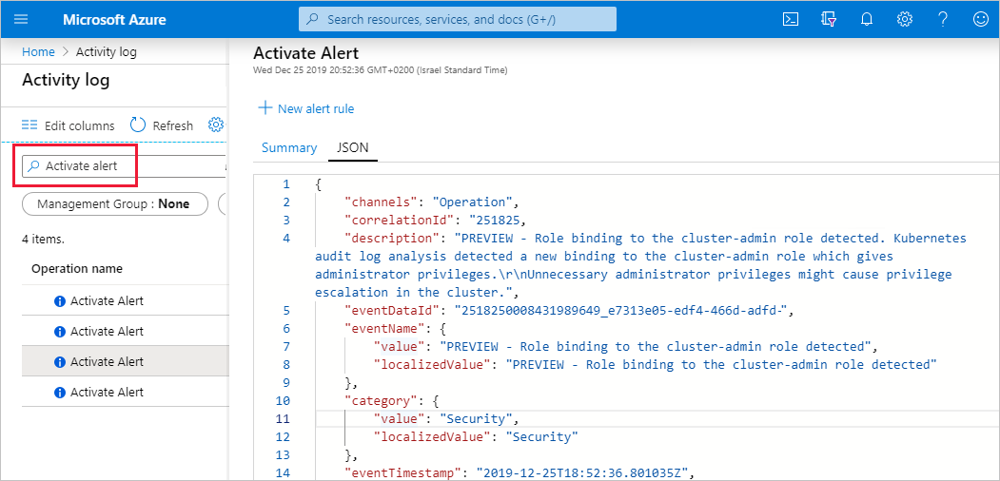

# Security alerts schemas

If your subscription has enhanced security features enabled, you'll receive security alerts when Defender for Cloud detects threats to their resources.

You can view these security alerts in Microsoft Defender for Cloud's pages - [overview dashboard](overview-page.md), [alerts](tutorial-security-incident.md), [resource health pages](investigate-resource-health.md), or [workload protections dashboard](workload-protections-dashboard.md) - and through external tools such as:

- [Microsoft Sentinel](../sentinel/index.yml) - Microsoft's cloud-native SIEM. The Sentinel Connector gets alerts from Microsoft Defender for Cloud and sends them to the [Log Analytics workspace](../azure-monitor/logs/quick-create-workspace.md) for Microsoft Sentinel.
- Third-party SIEMs - Send data to [Azure Event Hubs](../event-hubs/index.yml). Then integrate your Event Hub data with a third-party SIEM. Learn more in [Stream alerts to a SIEM, SOAR, or IT Service Management solution](export-to-siem.md).
- [The REST API](/rest/api/securitycenter/) - If you're using the REST API to access alerts, see the [online Alerts API documentation](/rest/api/securitycenter/alerts).

If you're using any programmatic methods to consume the alerts, you'll need the correct schema to find the fields that are relevant to you. Also, if you're exporting to an Event Hub or trying to trigger Workflow Automation with generic HTTP connectors, use the schemas to properly parse the JSON objects.

>[!IMPORTANT]
> The schema is slightly different for each of these scenarios, so make sure you select the relevant tab below.


## The schemas 


### [Microsoft Sentinel](#tab/schema-sentinel)

The Sentinel Connector gets alerts from Microsoft Defender for Cloud and sends them to the Log Analytics Workspace for Microsoft Sentinel.

To create an Microsoft Sentinel case or incident using Defender for Cloud alerts, you'll need the schema for those alerts shown below. 

For more information about Microsoft Sentinel, see [the documentation](../sentinel/index.yml).

[!INCLUDE [Sentinel and workspace schema](../../includes/security-center-alerts-schema-log-analytics-workspace.md)]


### [Azure Activity Log](#tab/schema-activitylog)

Microsoft Defender for Cloud audits generated Security alerts as events in Azure Activity Log.

You can view the security alerts events in Activity Log by searching for the Activate Alert event as shown:

[](media/alerts-schemas/sample-activity-log-alert.png#lightbox)


### Sample JSON for alerts sent to Azure Activity Log

```json
{
    "channels": "Operation",
    "correlationId": "2518250008431989649_e7313e05-edf4-466d-adfd-35974921aeff",
    "description": "PREVIEW - Role binding to the cluster-admin role detected. Kubernetes audit log analysis detected a new binding to the cluster-admin role which gives administrator privileges.\r\nUnnecessary administrator privileges might cause privilege escalation in the cluster.",
    "eventDataId": "2518250008431989649_e7313e05-edf4-466d-adfd-35974921aeff",
    "eventName": {
        "value": "PREVIEW - Role binding to the cluster-admin role detected",
        "localizedValue": "PREVIEW - Role binding to the cluster-admin role detected"
    },
    "category": {
        "value": "Security",
        "localizedValue": "Security"
    },
    "eventTimestamp": "2019-12-25T18:52:36.801035Z",
    "id": "/subscriptions/SUBSCRIPTION_ID/resourceGroups/RESOURCE_GROUP_NAME/providers/Microsoft.Security/locations/centralus/alerts/2518250008431989649_e7313e05-edf4-466d-adfd-35974921aeff/events/2518250008431989649_e7313e05-edf4-466d-adfd-35974921aeff/ticks/637128967568010350",
    "level": "Informational",
    "operationId": "2518250008431989649_e7313e05-edf4-466d-adfd-35974921aeff",
    "operationName": {
        "value": "Microsoft.Security/locations/alerts/activate/action",
        "localizedValue": "Activate Alert"
    },
    "resourceGroupName": "RESOURCE_GROUP_NAME",
    "resourceProviderName": {
        "value": "Microsoft.Security",
        "localizedValue": "Microsoft.Security"
    },
    "resourceType": {
        "value": "Microsoft.Security/locations/alerts",
        "localizedValue": "Microsoft.Security/locations/alerts"
    },
    "resourceId": "/subscriptions/SUBSCRIPTION_ID/resourceGroups/RESOURCE_GROUP_NAME/providers/Microsoft.Security/locations/centralus/alerts/2518250008431989649_e7313e05-edf4-466d-adfd-35974921aeff",
    "status": {
        "value": "Active",
        "localizedValue": "Active"
    },
    "subStatus": {
        "value": "",
        "localizedValue": ""
    },
    "submissionTimestamp": "2019-12-25T19:14:03.5507487Z",
    "subscriptionId": "SUBSCRIPTION_ID",
    "properties": {
        "clusterRoleBindingName": "cluster-admin-binding",
        "subjectName": "for-binding-test",
        "subjectKind": "ServiceAccount",
        "username": "masterclient",
        "actionTaken": "Detected",
        "resourceType": "Kubernetes Service",
        "severity": "Low",
        "intent": "[\"Persistence\"]",
        "compromisedEntity": "ASC-IGNITE-DEMO",
        "remediationSteps": "[\"Review the user in the alert details. If cluster-admin is unnecessary for this user, consider granting lower privileges to the user.\"]",
        "attackedResourceType": "Kubernetes Service"
    },
    "relatedEvents": []
}
```

### The data model of the schema

|Field|Description|
|----|----|
|**channels**|Constant, "Operation"|
|**correlationId**|The Microsoft Defender for Cloud alert ID|
|**description**|Description of the alert|
|**eventDataId**|See correlationId|
|**eventName**|The value and localizedValue subfields contain the alert display name|
|**category**|The value and localizedValue subfields are constant - "Security"|
|**eventTimestamp**|UTC timestamp for when the alert was generated|
|**id**|The fully qualified alert ID|
|**level**|Constant, "Informational"|
|**operationId**|See correlationId|
|**operationName**|The value field is constant - "Microsoft.Security/locations/alerts/activate/action", and the localized value will be "Activate Alert" (can potentially be localized par the user locale)|
|**resourceGroupName**|Will include the resource group name|
|**resourceProviderName**|The value and localizedValue subfields are constant - "Microsoft.Security"|
|**resourceType**|The value and localizedValue subfields are constant - "Microsoft.Security/locations/alerts"|
|**resourceId**|The fully qualified Azure resource ID|
|**status**|The value and localizedValue subfields are constant - "Active"|
|**subStatus**|The value and localizedValue subfields are empty|
|**submissionTimestamp**|The UTC timestamp of event submission to Activity Log|
|**subscriptionId**|The subscription ID of the compromised resource|
|**properties**|A JSON bag of additional properties pertaining to the alert. These can change from one alert to the other, however, the following fields will appear in all alerts:<br>- severity: The severity of the attack<br>- compromisedEntity: The name of the compromised resource<br>- remediationSteps: Array of remediation steps to be taken<br>- intent: The kill-chain intent of the alert. Possible intents are documented in the [Intentions table](alerts-reference.md#intentions)|
|**relatedEvents**|Constant - empty array|
|||


### [Workflow automation](#tab/schema-workflow-automation)

For the alerts schema when using workflow automation, see the [connectors documentation](/connectors/ascalert/).


### [Continuous export](#tab/schema-continuousexport)

Defender for Cloud's continuous export feature passes alert data to:

- Azure Event Hub using the same schema as [the alerts API](/rest/api/securitycenter/alerts).
- Log Analytics workspaces according to the [SecurityAlert schema](/azure/azure-monitor/reference/tables/SecurityAlert) in the Azure Monitor data reference documentation.


### [MS Graph API](#tab/schema-graphapi)

Microsoft Graph is the gateway to data and intelligence in Microsoft 365. It provides a unified programmability model that you can use to access the tremendous amount of data in Microsoft 365, Windows 10, and Enterprise Mobility + Security. Use the wealth of data in Microsoft Graph to build apps for organizations and consumers that interact with millions of users.

The schema and a JSON representation for security alerts sent to MS Graph, are available in [the Microsoft Graph documentation](/graph/api/resources/alert).

---


## Next steps

This article described the schemas that Microsoft Defender for Cloud's threat protection tools use when sending security alert information.

For more information on the ways to access security alerts from outside Defender for Cloud, see the following pages:

- [Microsoft Sentinel](../sentinel/index.yml) - Microsoft's cloud-native SIEM
- [Azure Event Hubs](../event-hubs/index.yml) - Microsoft's fully managed, real-time data ingestion service
- [Continuously export Defender for Cloud data](continuous-export.md)
- [Log Analytics workspaces](../azure-monitor/logs/quick-create-workspace.md) - Azure Monitor stores log data in a Log Analytics workspace, a container that includes data and configuration information