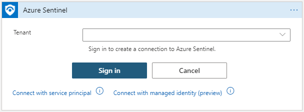
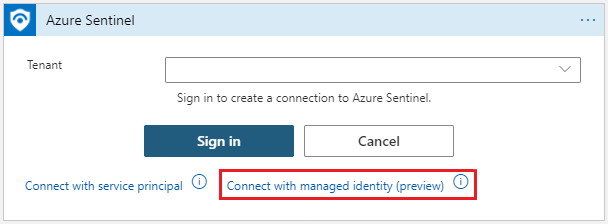
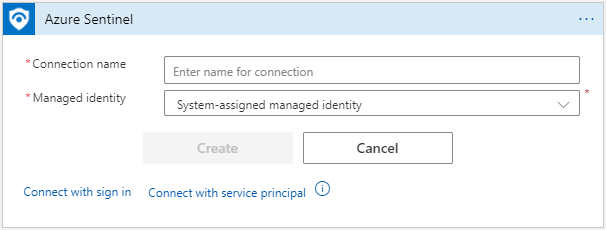
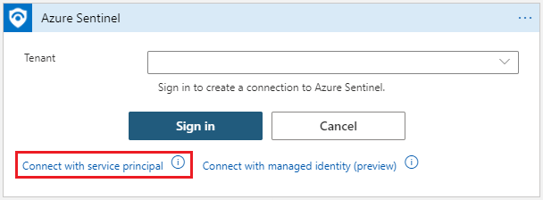
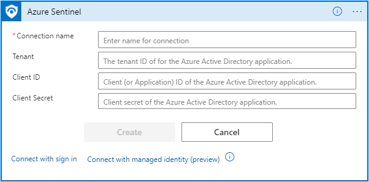
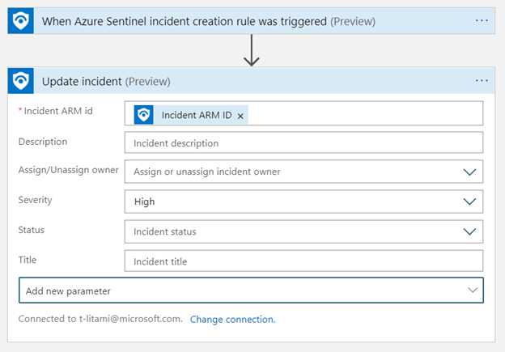
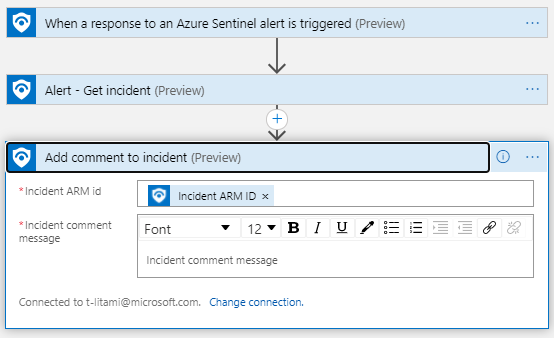

# Connect and authenticate playbooks to Azure Sentinel

One thing to always keep in mind when working with playbooks, but that may be a source of confusion, is that playbooks are resources provided by the Azure Logic Apps service. As such, they are not natively part of the core Azure Sentinel service (which is why their use is billed separately). The way Logic Apps works, it has to connect separately and authenticate independently to every resource of every type that it interacts with, including to Azure Sentinel itself. Logic Apps uses [specialized connectors](/connectors/connector-reference/) for this purpose, with each resource type having its own connector. This document explains the types of connection and authentication in the [Logic Apps Azure Sentinel connector](/connectors/azuresentinel/), that playbooks can use to interact with Azure Sentinel in order to have access to the information in your workspace's tables. It further shows you how to get to specific types of Azure Sentinel information that you are likely to need.

This document is a companion to our other playbook documentation - [Tutorial: Use playbooks with automation rules in Azure Sentinel](tutorial-respond-threats-playbook.md). The two documents will refer to each other back and forth.

For an introduction to playbooks, see [Automate threat response with playbooks in Azure Sentinel](automate-responses-with-playbooks.md).

For the complete specification of the Azure Sentinel connector, see the [Logic Apps connector documentation](/connectors/azuresentinel/).

## Authentication

The Azure Sentinel connector in Logic Apps, and its component triggers and actions, can operate on behalf of any identity that has the necessary permissions (read and/or write) on the relevant workspace. The connector supports multiple identity types:

- [Managed identity (Preview)](#authenticate-with-managed-identity)
- [Azure AD user](#authenticate-as-an-azure-ad-user)
- [Service principal (Azure AD application)](#authenticate-as-a-service-principal-azure-ad-application)

    

### Permissions required

| Roles \ Connector components | Triggers | "Get" actions | Update incident, add a comment |
| ------------- | :-----------: | :------------: | :-----------: |
| **[Azure Sentinel Reader](/azure/role-based-access-control/built-in-roles#azure-sentinel-reader)** | &#10003; | &#10003; | &#10007; |
| **Azure Sentinel [Responder](/azure/role-based-access-control/built-in-roles#azure-sentinel-responder)/[Contributor](/azure/role-based-access-control/built-in-roles#azure-sentinel-contributor)** | &#10003; | &#10003; | &#10003; |
| 

[Learn more about permissions in Azure Sentinel](/azure/sentinel/roles).

### Authenticate with managed identity

This authentication method allows you to give permissions directly to the playbook (a Logic App workflow resource), so that Azure Sentinel connector actions taken by the playbook will operate on the playbook's behalf, as if it were an independent object with its own permissions on Azure Sentinel. Using this method lowers the number of identities you have to manage. 

To authenticate with managed identity:

1. [Enable managed identity](/azure/logic-apps/create-managed-service-identity#enable-system-assigned-identity-in-azure-portal) on the Logic Apps workflow resource. To summarize:

    - On the logic app menu, under **Settings**, select **Identity**. Select **System assigned > On > Save**. When Azure prompts you to confirm, select **Yes**.

    - Your logic app can now use the system-assigned identity, which is registered with Azure AD and is represented by an object ID.

1. [Give that identity access](/azure/logic-apps/create-managed-service-identity#assign-access-in-the-azure-portal) to the Azure Sentinel workspace, by assigning it the [Azure Sentinel Contributor](/azure/role-based-access-control/built-in-roles#azure-sentinel-contributor) role.

    Learn more about the available [roles in Azure Sentinel](/azure/sentinel/roles).

1. Enable the managed identity authentication method in the Azure Sentinel Logic Apps connector:

    1. In the Logic Apps designer, add an Azure Sentinel Logic Apps connector step. If the connector is already enabled for an existing connection, click the **Change connection** link.

        

    1. In the resulting list of connections, select **Add new** at the bottom. 

    1. Create a new connection by selecting **Connect with managed identity (preview)**.

        

    1. Fill in a name for this connection, select **System-assigned managed identity** and select **Create**.

        

### Authenticate as an Azure AD user

To make a connection, select **Sign in**. You will be prompted to provide your account information. Once you have done so, follow the remaining instructions on the screen to create a connection.

### Authenticate as a service principal (Azure AD application)

Service principals can be created by registering an Azure AD application. It is **preferable** to use a registered application as the connector's identity, instead of using a user account, as you will be better able to control permissions, manage credentials, and enable certain limitations on the use of the connector.

To use your own application with the Azure Sentinel connector, perform the following steps:

1. Register the application with Azure AD and create a service principal. [Learn how](/azure/active-directory/develop/howto-create-service-principal-portal#register-an-application-with-azure-ad-and-create-a-service-principal).

1. Get credentials (for future authentication).

    In the registered application blade, get the application credentials for signing in:

    - **Client ID**: under **Overview**
    - **Client secret**: under **Certificates & secrets**.

1. Grant permissions to the Azure Sentinel workspace.

    In this step, the app will get permission to work with Azure Sentinel workspace.

    1. In the Azure Sentinel workspace, go to **Settings** -> **Workspace Settings** -> **Access control (IAM)**

    1. Select **Add role assignment**.

    1. Select the role you wish to assign to the application. For example, to allow the application to perform actions that will make changes in the Sentinel workspace, like updating an incident, select the **Azure Sentinel Contributor** role. For actions which only read data, the **Azure Sentinel Reader** role is sufficient. [Learn more about the available roles in Azure Sentinel](/azure/sentinel/roles).

    1. Find the required application and save. By default, Azure AD applications aren't displayed in the available options. To find your application, search for the name and select it.

1. Authenticate

    In this step we use the app credentials to authenticate to the Sentinel connector in Logic Apps.

    - Select **Connect with Service Principal**.

        

    - Fill in the required parameters (can be found in the registered application blade)
        - **Tenant**: under **Overview**
        - **Client ID**: under **Overview**
        - **Client Secret**: under **Certificates & secrets**
        
        

### Manage your API connections

Every time an authentication is created for the first time, a new Azure resource of type API Connection is created. The same API connection can be used in all the Azure Sentinel actions and triggers in the same Resource Group.

All the API connections can be found in the **API connections** blade (search for *API connections* in the Azure portal).

You can also find them by going to the **Resources** blade and filtering the display by type *API Connection*. This way allows you to select multiple connections for bulk operations.

In order to change the authorization of an existing connection, enter the connection resource, and select **Edit API connection**.

## Azure Sentinel triggers summary

Though the Azure Sentinel connector can be used in a variety of ways, the connector's components can be divided into 2 flows, each triggered by a different Azure Sentinel occurrence:

| Trigger | Full trigger name in Logic Apps Designer | When to use it | Known limitations 
| --------- | ------------ | -------------- | -------------- | 
| **Incident trigger** | "When Azure Sentinel incident creation rule was triggered (Preview)" | Recommended for most incident automation scenarios.  The playbook receives incident objects, including entities and alerts. Using this trigger allows the playbook to be attached to an **Automation rule**, so it can be triggered when an incident is created in Azure Sentinel, and all the [benefits of automation rules](/azure/sentinel/automate-incident-handling-with-automation-rules) can be applied to the incident. | Playbooks with this trigger can't be run manually from Azure Sentinel.  Playbooks with this trigger do not support alert grouping, meaning they will receive only the first alert sent with each incident.
| **Alert trigger** | "When a response to an Azure Sentinel alert is triggered" | Advisable for playbooks that need to be run on alerts manually from the Azure Sentinel portal, or for **scheduled** analytics rules that don't generate incidents for their alerts. | This trigger cannot be used to automate responses for alerts generated by **Microsoft security** analytics rules.  Playbooks using this trigger cannot be called by **automation rules**. |
|

The schemas used by these two flows are not identical.
The recommended practice is to use the **Azure Sentinel incident trigger** flow, which is applicable to most scenarios.

### Incident dynamic fields

The **Incident** object received from **When Azure Sentinel incident creation rule was triggered** includes the following dynamic fields:

- Incident properties (Shown as "Incident: field name")

- Alerts (array)

  - Alert properties (Shown as "Alert: field name")

    When selecting an alert property such as **Alert: \<property name>**, a *for each* loop is automatically generated, since an incident can include multiple alerts.

- Entities (array of all an alert's entities)

- Workspace info fields (applies to the Sentinel workspace where the incident was created)
  - Subscription ID
  - Workspace name
  - Workspace ID
  - Resource group name

## Azure Sentinel actions summary

| Component | When to use it |
| --------- | -------------- |
| **Alert - Get Incident** | In playbooks that start with Alert trigger. Useful for getting the incident properties, or retrieving the **Incident ARM ID** to use with the **Update incident** or **Add comment to incident** actions. |
| **Get Incident** | When triggering a playbook from an external source or with a non-Sentinel trigger. Identify with an **Incident ARM ID**. Retrieves the incident properties and comments. |
| **Update Incident** | To change an incident's **Status** (for example, when closing the incident), assign an **Owner**, add or remove a tag, or to change its **Severity**, **Title**, or **Description**.
| **Add comments to incident** | To enrich the incident with information collected from external sources; to audit the actions taken by the playbook on the entities; to supply additional information valuable for incident investigation. |
| **Entities - Get \<*entity type*\>** | In playbooks that work on a specific entity type (**IP**, **Account**, **Host**, **URL** or **FileHash**) which is known at playbook creation time, and you need to be able to parse it and work on its unique fields. |
|

## Work with incidents - Usage Examples

> [!TIP] 
> The actions **Update Incident** and **Add a Comment to Incident** require the **Incident ARM ID**.  
Use the **Alert - Get Incident** action beforehand to get the **Incident ARM ID**.

### Update an incident
-  Playbook is triggered **when an incident is created**

    

-  Playbook is triggered **when an alert is generated**

    
      
### Use Incident Information

Basic playbook to send incident details over mail:
-  Playbook is triggered **when an incident is created**

    

-  Playbook is triggered **when an alert is generated**

    

### Add a comment to the incident

-  Playbook is triggered **when an incident is created**

    

-  Playbook is triggered **when an alert is generated**

    

## Work with specific Entity type

The **Entities** dynamic field is an array of JSON objects, each of which represents an entity. Each entity type has its own schema, depending on its unique properties.

The **"Entities - Get \<entity name>"** action allows you to do the following:

- Filter the array of entities by the requested type.
- Parse the specific fields of this type, so they can be used as dynamic fields in further actions.

The input is the **Entities** dynamic field.

The response is an array of entities, where the special properties are parsed and can be directly used in a *For each* loop.

Currently supported entity types are:

- [IP](/connectors/azuresentinel/#entities---get-ips)
- [Host](/connectors/azuresentinel/#entities---get-hosts)
- [Account](/connectors/azuresentinel/#entities---get-accounts)
- [URL](/connectors/azuresentinel/#entities---get-urls)
- [FileHash](/connectors/azuresentinel/#entities---get-filehashes)

    :::image type="content" source="media/sentinel-connectors/entities-actions.png" alt-text="Entities Actions List":::

For other entity types, similar functionality can be achieved using Logic Apps' built-in actions:

- Filter the array of entities by the requested type using [**Filter Array**](/azure/logic-apps/logic-apps-perform-data-operations#filter-array-action).

- Parse the specific fields of this type, so they can be used as dynamic fields in further actions using [**Parse JSON**](/azure/logic-apps/logic-apps-perform-data-operations#parse-json-action).
    
## Known issues and limitations

### Cannot trigger Logic App called by Azure Sentinel trigger using "Run Trigger" button

This item refers to the button on the overview blade of the Logic Apps resource.

Triggering an Azure Logic Apps is made by a POST REST call, which its body is the input for the trigger. Logic Apps that start with Azure Sentinel triggers expect to get an alert or an incident in the body of the call. When trying to do so from Logic Apps overview blade, the call is empty, and there for an error is expected. Proper ways to trigger:

Proper ways to trigger:

- Manual trigger in Azure Sentinel
- Automated response of an analytic rule in Azure Sentinel
- Use "Resubmit" button in an existing Logic Apps run blade
- [Call directly the Logic Apps endpoint](/azure/logic-apps/logic-apps-http-endpoint#call-logic-app-through-endpoint-url) (attaching an alert/incident as the body)

### Updating the same incident in parallel *For each* loops

*For each* loops are set by default to run in parallel, but can be easily [set to run sequentially](/azure/logic-apps/logic-apps-control-flow-loops#foreach-loop-sequential). If a *for each* loop might update the same Azure Sentinel incident in separate iterations, it should be configured to run sequentially.

### Restoring alert's original query is currently not supported via Logic Apps

Usage of the **Azure Monitor Logs connector** to retrieve the events captured by the scheduled alert analytics rule is not consistently reliable.

- Azure Monitor Logs do not support the definition of a custom time range. Restoring the exact same query results requires defining the exact same time range as in the original query.
- Alerts may be delayed in appearing in the Log Analytics workspace after the rule triggers the playbook.

## Available resources

### Azure Sentinel docs
- [Advance automation with playbooks](/azure/sentinel/automate-responses-with-playbooks)
- [Tutorial: Use playbooks with automation rules in Azure Sentinel](/azure/sentinel/tutorial-respond-threats-playbook)

### Azure Sentinel References
- [Azure Sentinel Github templates gallery](https://github.com/Azure/Azure-Sentinel/tree/master/Playbooks)
- [Azure Sentinel API reference](/rest/api/securityinsights)

### Azure Logic Apps

- [Scenarios, examples and walkthroughs for Azure Logic Apps](/azure/logic-apps/logic-apps-examples-and-scenarios)
- [Logic Apps expressions](/azure/logic-apps/workflow-definition-language-functions-reference)
