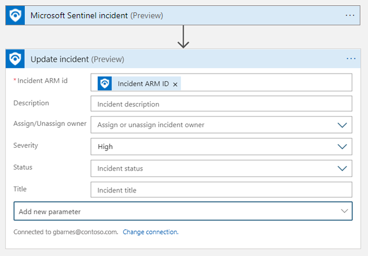
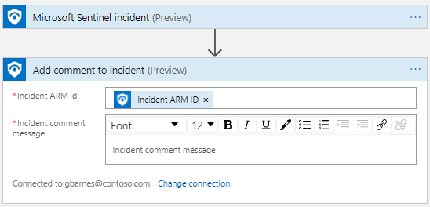

# Recommended playbook use cases, templates, and examples

This article lists sample use cases for Microsoft Sentinel playbooks, as well as example playbooks and recommended playbook templates.

## Recommended playbook use cases

We recommend starting with Microsoft Sentinel playbooks for the following SOC scenarios, for which we provide ready-made [Create and customize Microsoft Sentinel playbooks from content templates](../use-playbook-templates.md) out of the box. For more information, see also [Recommended playbook templates](#recommended-playbook-templates).

### Enrichment

**Collect data and attach it to the incident in order to make smarter decisions.**

For example:

A Microsoft Sentinel incident is created from an alert by an analytics rule that generates IP address entities.

The incident triggers an automation rule, which runs a playbook with the following steps:

1. Start when a [new Microsoft Sentinel incident is created](/connectors/azuresentinel/#triggers). The entities represented in the incident are stored in the incident trigger's dynamic fields.

1. For each IP address, query an external Threat Intelligence provider, such as [Virus Total](https://www.virustotal.com/), to retrieve more data.

1. Add the returned data and insights as comments of the incident.

### Bi-directional sync

**Playbooks can be used to sync your Microsoft Sentinel incidents with other ticketing systems.**

For example:

Create an automation rule for all incident creation, and attach a playbook that opens a ticket in ServiceNow:

- Start when a [new Microsoft Sentinel incident is created](/connectors/azuresentinel/#triggers).

- Create a new ticket in [ServiceNow](/connectors/service-now/).

- Include in the ticket the incident name, important fields, and a URL to the Microsoft Sentinel incident for easy pivoting.

### Orchestration

**Use the SOC chat platform to better control the incidents queue.**

For example:

A Microsoft Sentinel incident is created from an alert by an analytics rule that generates username and IP address entities.

The incident triggers an automation rule, which runs a playbook with the following steps:

- Start when a [new Microsoft Sentinel incident is created](/connectors/azuresentinel/#triggers).

- Send a message to your security operations channel in [Microsoft Teams](/connectors/teams/) or [Slack](/connectors/slack/) to make sure your security analysts are aware of the incident.

- Send all the information in the alert by email to your senior network admin and security admin. The email message includes **Block** and **Ignore** user option buttons.

- Wait until a response is received from the admins, then continue to run.

- If the admins select **Block**, send a command to the firewall to block the IP address in the alert, and another to Microsoft Entra ID to disable the user.

### Response

**Immediately respond to threats, with minimal human dependencies.**

Two examples:

**Example 1:** Respond to an analytics rule that indicates a compromised user, as discovered by [Microsoft Entra ID Protection](/azure/active-directory/identity-protection/overview-identity-protection.md):

1. Start when a [new Microsoft Sentinel incident is created](/connectors/azuresentinel/#triggers).

1. For each user entity in the incident suspected as compromised:

    1. Send a Teams message to the user, requesting confirmation that the user took the suspicious action.

    1. Check with Microsoft Entra ID Protection to [confirm the user's status as compromised](/connectors/azureadip/#confirm-a-risky-user-as-compromised). Microsoft Entra ID Protection will label the user as **risky**, and apply any enforcement policy already configured - for example, to require the user to use MFA when next signing in.

    > [!NOTE]
    > This particular Microsoft Entra action does not initiate any enforcement activity on the user, nor does it initiate any configuration of enforcement policy. It only tells Microsoft Entra ID Protection to apply any already defined policies as appropriate. Any enforcement depends entirely on the appropriate policies being defined in Microsoft Entra ID Protection.

**Example 2:** Respond to an analytics rule that indicates a compromised machine, as discovered by [Microsoft Defender for Endpoint](/windows/security/threat-protection/):

1. Start when a [new Microsoft Sentinel incident is created](/connectors/azuresentinel/#triggers).

1. Use the **Entities - Get Hosts** action in Microsoft Sentinel to parse the suspicious machines that are included in the incident entities.

1. Issue a command to Microsoft Defender for Endpoint to [isolate the machines](/connectors/wdatp/#actions---isolate-machine) in the alert.

### Manual response during investigation or while hunting (Preview)

**Respond to threats in the course of active investigative activity without pivoting out of context.**

Use the [entity trigger](/connectors/azuresentinel/#triggers) to take immediate action on individual threat actors you discover during an investigation, one at a time, right from within the investigation. This option is also available in the threat hunting context, unconnected to any particular incident. You can select an entity in context and perform actions on it right there, saving time and reducing complexity.

The actions you can take on entities using this playbook type include:

- Blocking a compromised user.
- Blocking traffic from a malicious IP address in your firewall.
- Isolating a compromised host on your network.
- Adding an IP address to a safe/unsafe address watchlist, or to your external configuration management database (CMDB).
- Getting a file hash report from an external threat intelligence source and adding it to an incident as a comment.

## Sample playbook configurations

This section provides several sample playbook configurations.

### Update an incident

Configure your playbook to update an incident based on a new incident or alert. For example, the following screenshots show such a playbook configuration, triggered by a new incident and alert, respectively:

-  A playbook that updates an incident based on a new incident trigger:

    

-  A playbook that updates an incident based on a new alert trigger:

    

### Use incident details

Configure your playbook to use incident details elsewhere in your flow. For example, the following screenshots show such a playbook configuration, triggered by a new incident and alert, respectively:

- A playbook that sends incident details over mail, triggered by a new incident:

    

-  A playbook that sends incident details over mail, triggered by a new alert:

    

### Add a comment to an incident

Configure your playbook to add a comment to an incident. For example, the following screenshots show such a playbook configuration, triggered by a new incident and alert, respectively:

-  A playbook that adds a comment to an incident based on a new incident trigger:

    

-  A playbook that adds a comment to an incident based on a new alert trigger:

    

### Disable a user

Configure your playbook to disable a user account. For example, the following screenshot shows such a playbook configuration, based on a Microsoft Sentinel entity trigger:

:::image type="content" source="../media/playbook-triggers-actions/entity-trigger-actions.png" alt-text="Screenshot showing actions to take in an entity-trigger playbook to disable a user.":::

## Recommended playbook templates

The following recommended playbooks, and other similar playbooks are available to you in the [Content hub](../sentinel-solutions-deploy.md), or in the [Microsoft Sentinel GitHub repository](https://github.com/Azure/Azure-Sentinel/tree/master/Playbooks):

- **Notification playbooks** are triggered when an alert or incident is created and send a notification to a configured destination:

    | Playbook | Folder in GitHub&nbsp;repository | Solution in Content hub/ Azure Marketplace |
    | -------- | ----------------------------------- | --------------------------------------------- |
    | **Post a message in a Microsoft Teams channel** | [Post-Message-Teams](https://github.com/Azure/Azure-Sentinel/tree/master/Solutions/SentinelSOARessentials/Playbooks/Post-Message-Teams) | [Sentinel SOAR Essentials solution](https://azuremarketplace.microsoft.com/en-us/marketplace/apps/azuresentinel.azure-sentinel-solution-sentinelsoaressentials?tab=Overview) |
    | **Send an Outlook email notification** | [Send-basic-email](https://github.com/Azure/Azure-Sentinel/tree/master/Solutions/SentinelSOARessentials/Playbooks/Send-basic-email) | [Sentinel SOAR Essentials solution](https://azuremarketplace.microsoft.com/en-us/marketplace/apps/azuresentinel.azure-sentinel-solution-sentinelsoaressentials?tab=Overview) |
    | **Post a message in a Slack channel** | [Post-Message-Slack](https://github.com/Azure/Azure-Sentinel/tree/master/Solutions/SentinelSOARessentials/Playbooks/Post-Message-Slack) | [Sentinel SOAR Essentials solution](https://azuremarketplace.microsoft.com/en-us/marketplace/apps/azuresentinel.azure-sentinel-solution-sentinelsoaressentials?tab=Overview) |
    | **Send Microsoft Teams adaptive card on incident creation** | [Send-Teams-adaptive-card-on-incident-creation](https://github.com/Azure/Azure-Sentinel/tree/master/Solutions/SentinelSOARessentials/Playbooks/Send-Teams-adaptive-card-on-incident-creation) | [Sentinel SOAR Essentials solution](https://azuremarketplace.microsoft.com/en-us/marketplace/apps/azuresentinel.azure-sentinel-solution-sentinelsoaressentials?tab=Overview) |

- **Blocking playbooks** are triggered when an alert or incident is created, gather entity information like the account, IP address, and host, and blocks them from further actions:

    | Playbook | Folder in GitHub&nbsp;repository | Solution in Content&nbsp;hub/ Azure Marketplace |
    | -------- | ----------------------------------- | ----------------------------------------- |
    | **Block an IP address in Azure Firewall** | [AzureFirewall-BlockIP-addNewRule](https://github.com/Azure/Azure-Sentinel/tree/master/Solutions/Azure%20Firewall/Playbooks/AzureFirewall-BlockIP-addNewRule) | [Azure Firewall Solution for Sentinel](https://azuremarketplace.microsoft.com/en-US/marketplace/apps/sentinel4azurefirewall.sentinel4azurefirewall?tab=Overview) |
    | **Block a Microsoft Entra user** | Block-AADUser | [Microsoft Entra solution](https://azuremarketplace.microsoft.com/en-US/marketplace/apps/azuresentinel.azure-sentinel-solution-azureactivedirectory?tab=Overview) |
    | **Reset a Microsoft Entra user password** | Reset-AADUserPassword | [Microsoft Entra solution](https://azuremarketplace.microsoft.com/en-US/marketplace/apps/azuresentinel.azure-sentinel-solution-azureactivedirectory?tab=Overview) |
    | **Isolate or unisolate device using Microsoft Defender for Endpoint** | [Isolate-MDEMachine](https://github.com/Azure/Azure-Sentinel/tree/master/Solutions/MicrosoftDefenderForEndpoint/Playbooks/Isolate-MDEMachine) [Unisolate-MDEMachine](https://github.com/Azure/Azure-Sentinel/tree/master/Solutions/MicrosoftDefenderForEndpoint/Playbooks/Unisolate-MDEMachine) | [Microsoft Defender for Endpoint solution](https://azuremarketplace.microsoft.com/en-us/marketplace/apps/azuresentinel.azure-sentinel-solution-microsoftdefenderendpoint?tab=Overview) |

- **Create, update, or close playbooks** can create, update, or close incidents in Microsoft Sentinel, Microsoft 365 security services, or other ticketing systems:

    | Playbook | Folder in GitHub&nbsp;repository | Solution in Content hub/ Azure Marketplace |
    | -------- | ----------------------------------- | --------------------------------------------- |
    | **Create an incident using Microsoft Forms** | [CreateIncident-MicrosoftForms](https://github.com/Azure/Azure-Sentinel/tree/master/Solutions/SentinelSOARessentials/Playbooks/CreateIncident-MicrosoftForms) | [Sentinel SOAR Essentials solution](https://azuremarketplace.microsoft.com/en-us/marketplace/apps/azuresentinel.azure-sentinel-solution-sentinelsoaressentials?tab=Overview) |
    | **Relate alerts to incidents** | [relateAlertsToIncident-basedOnIP](https://github.com/Azure/Azure-Sentinel/tree/master/Solutions/SentinelSOARessentials/Playbooks/relateAlertsToIncident-basedOnIP) | [Sentinel SOAR Essentials solution](https://azuremarketplace.microsoft.com/en-us/marketplace/apps/azuresentinel.azure-sentinel-solution-sentinelsoaressentials?tab=Overview) |
    | **Create a ServiceNow incident** | [Create-SNOW-record](https://github.com/Azure/Azure-Sentinel/tree/master/Solutions/Servicenow/Playbooks/Create-SNOW-record) | [ServiceNow solution](https://azuremarketplace.microsoft.com/en-US/marketplace/apps/azuresentinel.azure-sentinel-solution-servicenow?tab=Overview) |