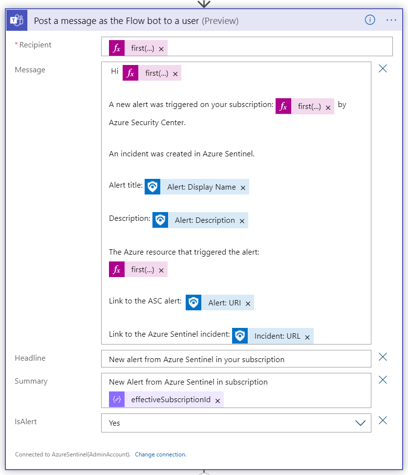
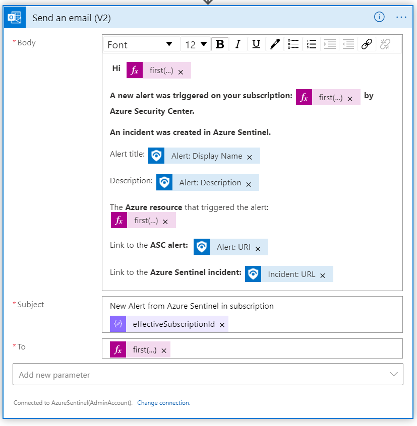
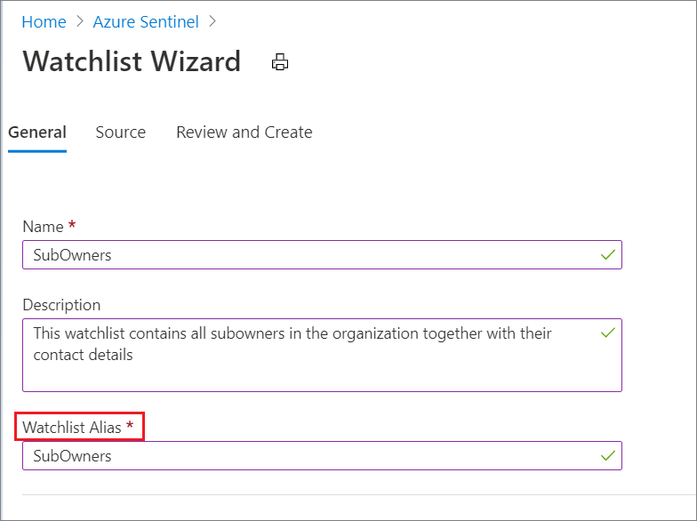
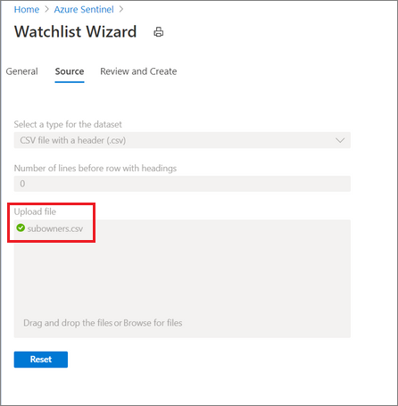

# Use an Azure Sentinel watchlist and playbook to inform owners of alerts

Azure Security Center alerts inform the Security Operations Center (SOC) about possible security attacks on Azure resources. If the SOC doesn't have access permissions to a potentially compromised resource, they need to contact the resource owner during alert investigation to:

- Find out whether they're familiar with the detected activity in their resource.
- Ask them to take mitigation steps on their resource.
 
Rather than manually find the relevant contact and reach them every time a new alert occurs, you can easily automate this process by using the Azure Sentinel watchlists feature with a playbook. For simplicity, this article uses the subscription owner level, but you can implement this solution for any specified resource owner.

> [!NOTE]
> This playbook uses the Azure Sentinel incident trigger. You can implement a similar solution by creating scheduled alerts with Azure Security Center, and then using the alert trigger.

## Solution summary

1. An Azure Sentinel watchlist maps each subscription in the organization to the owner and their contact email address.
1. A [Watchlists-InformSubowner-IncidentTrigger](https://github.com/Azure/Azure-Sentinel/tree/master/Playbooks/Watchlist-InformSubowner-IncidentTrigger) playbook is attached to a Security Center Defender incident creation rule. Every new instance of the Defender alert that flows to Azure Sentinel creates an Azure Sentinel incident.
1. The playbook then triggers, receiving the incident with the contained alert as input.
1. The playbook queries the watchlist and finds the relevant resource's subscription owner details.
1. The playbook sends the subscription owner a Teams message and email with details about the potential resource compromise.

## Prerequisites

- A user or registered application with Azure Sentinel Contributor role to use with the Azure Sentinel connector to Logic Apps
- The incident creation rule enabled for Security Center Defender
- A user to authenticate to Microsoft Teams, and a user to authenticate to Office 365 Outlook

## Playbook steps

The following image shows the [Watchlists-InformSubowner-IncidentTrigger](https://github.com/Azure/Azure-Sentinel/tree/master/Playbooks/Watchlist-InformSubowner-IncidentTrigger) playbook in the Logic App designer.


The playbook runs the following steps:

1. **When Azure Sentinel incident creation rule was triggered**, the playbook receives the created incident as input.

1. **For each Alert** in the incident, probably one alert, the playbook does the following steps:

   1. **Filter array to get AzureResource identifier**. An Azure Defender alert might have two kinds of identifiers: `AzureResource` or resource ID shown in Log Analytics, and Log Analytics information about the workspace that stores the alerts. This action returns an array of just the AzureResource identifiers for later use.
   
   1. **Parse Json to get subscriptionId**. This step gets the Subscription ID from the Additional Data of the Security Center alert.
   
   1. **Run query and list results - Get Watchlist**. The Azure Monitor Log Analytics connector gets the watchlist items. **Subscription**, **Resource Group**, and **Resource Name** are the Azure Sentinel workspace details where the watchlist is located. Use the `project` argument to specify which fields are relevant for your use.
      
      
   
   1. **Filter array to get relevant subscription owners**. This step keeps the watchlist results only for the subscription you're looking for. The Logic Apps expression argument on the right is:
      
      `string(body('Parse_JSON_to_get_subscriptionId')?['properties']?['effectiveSubscriptionId'])`
      
      
   
   1. **Post a message as the flow bot to a user**. This step sends a message to the subscription owner in Microsoft Teams with any details you want to share about the new alert.
      
      
   
   1. **Send an Email**. This step sends a message to the subscription owner in Outlook with any details you want to share about the new alert.
      
      

## Setup

1. Create and upload the watchlist.

1. Create an input comma-separated values (CSV) file. You can create a table in Office 365 Excel and save as a CSV file.
   
   The following example shows a simple CSV table, where each row represents a subscription in a tenant. There are four columns: **SubscriptionId**, **SubscriptionName**, **OwnerName**, and **OwnerEmail**.
   
   ```text
   SubscriptionId,SubscriptionName,OwnerName,OwnerEmail
   00000000-0000-0000-0000-000000000001,DemoSubscription1,Megan Bowen,mbowen@contoso.com
   00000000-0000-0000-0000-000000000002,DemoSubscription2,MOD Admin,MODadmin@contoso.com
   ```
   
1. Upload your table.

   1. In Azure Sentinel, go to **Watchlist**.
   
   1. Select **Add new**.
      
      
   
   1. Fill in the required details. The **Watchlist Alias** will be used to query this Watchlist in the playbook query step.
      
      
      
   1. Upload the CSV file.
      
      
   
1. Review and create the watchlist.

## Playbook deployment

To deploy the playbook:

1. Open the [Watchlists-InformSubowner-IncidentTrigger playbook](https://github.com/Azure/Azure-Sentinel/tree/master/Playbooks/Watchlist-InformSubowner-IncidentTrigger) in the Azure Sentinel Playbooks repository.
   
1. Scroll down and select the **Deploy to Azure** or **Deploy to Azure Gov** button, depending on your needs.

1. Fill out the parameters:

   - **Basics**: Fill in the Sentinel workspace subscription, resource group, and location.
   - **Settings**. Fill in a **Playbook name** to identify the playbook in your subscription, and a **User name** to determine the names of the API connections resources.
   
1. Check the Terms and Conditions, and select **Purchase**.

1. The Azure Resource Manager (ARM) template containing the Logic App Playbook workflow and API connections deploys to Azure. When it finishes, you're taken to the Azure ARM template summary page.

1. Select the Logic Apps name to go to the Logic Apps resource for the playbook.

## Configure API connections

1. On the left menu, select **API connections**.
1. For each product used in the playbook, select the connection name, select **Authorize** to sign in with your user name, and save.

## Next steps

- [Azure Sentinel Logic Apps connector](/connectors/azuresentinel)
- [Microsoft Teams Logic Apps connector](/connectors/teams/)
- [Office 365 Outlook Logic Apps connector](/connectors/office365)
- [Create incidents from alerts in Azure Sentinel](create-incidents-from-alerts.md)
- [Watchlists-InformSubowner-IncidentTrigger playbook](https://github.com/Azure/Azure-Sentinel/tree/master/Playbooks/Watchlist-InformSubowner-IncidentTrigger) in the Azure Sentinel Playbooks repository

