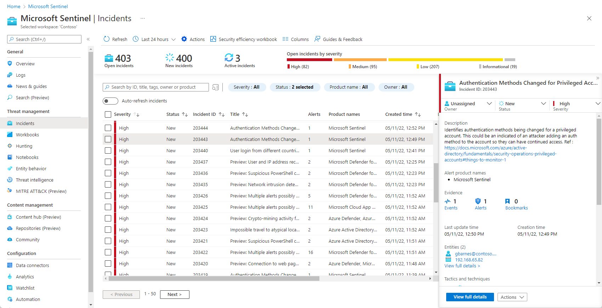
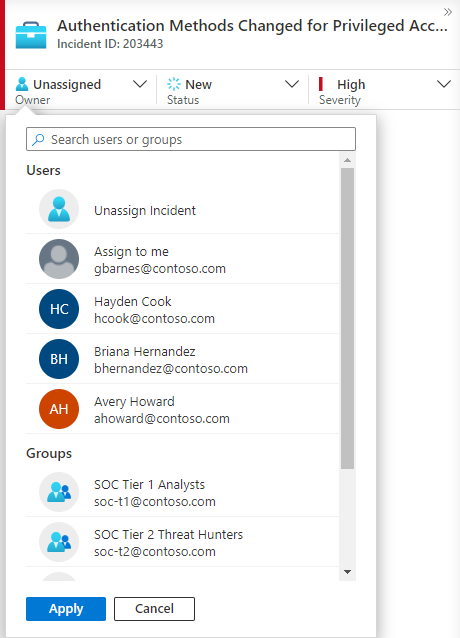
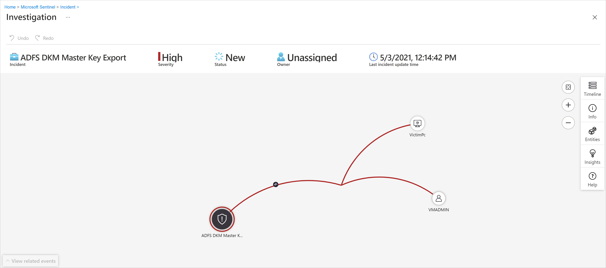
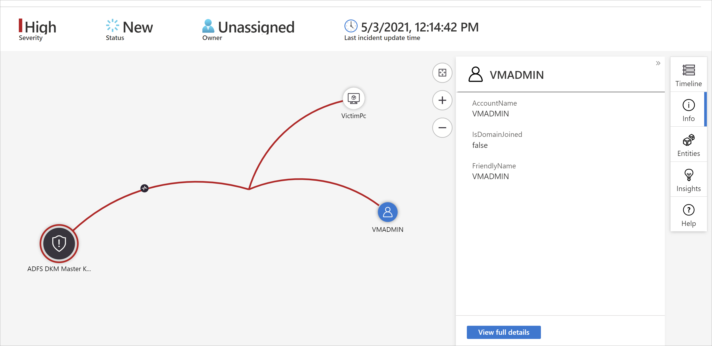
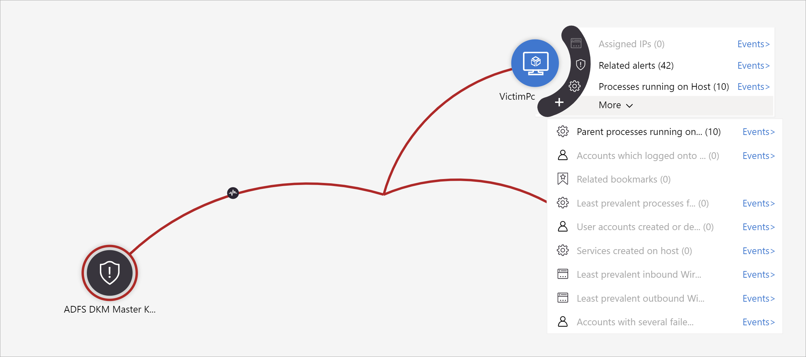
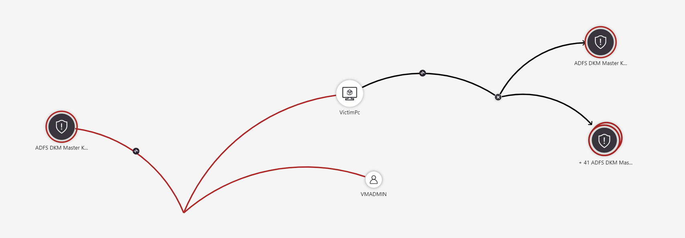
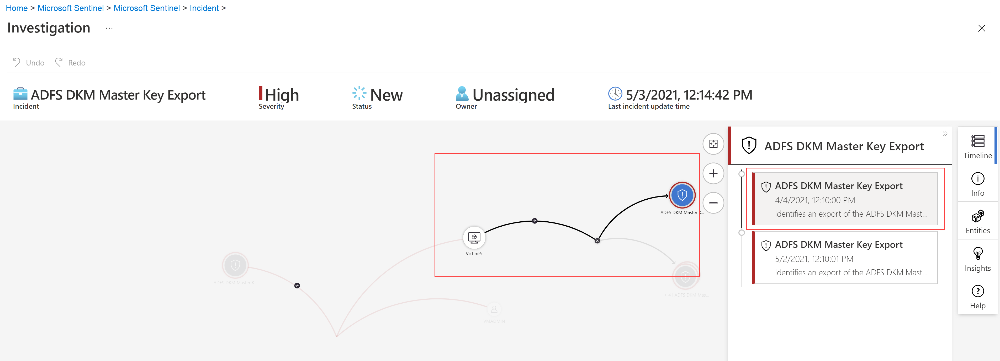

# Investigate incidents with Microsoft Sentinel

[!INCLUDE [Banner for top of topics](./includes/banner.md)]

> [!IMPORTANT]
> Noted features are currently in PREVIEW. The [Azure Preview Supplemental Terms](https://azure.microsoft.com/support/legal/preview-supplemental-terms/) include additional legal terms that apply to Azure features that are in beta, preview, or otherwise not yet released into general availability.
>

This article helps you investigate incidents with Microsoft Sentinel. After you connected your data sources to Microsoft Sentinel, you want to be notified when something suspicious happens. To enable you to do this, Microsoft Sentinel lets you create advanced alert rules, that generate incidents that you can assign and investigate.

This article covers:
> [!div class="checklist"]
> * Investigate incidents
> * Use the investigation graph
> * Respond to threats

An incident can include multiple alerts. It's an aggregation of all the relevant evidence for a specific investigation. An incident is created based on analytics rules that you created in the **Analytics** page. The properties related to the alerts, such as severity and status, are set at the incident level. After you let Microsoft Sentinel know what kinds of threats you're looking for and how to find them, you can monitor detected threats by investigating incidents.

## Prerequisites

- You'll only be able to investigate the incident if you used the entity mapping fields when you set up your analytics rule. The investigation graph requires that your original incident includes entities.

- If you have a guest user that needs to assign incidents, the user must be assigned the [Directory Reader](../active-directory/roles/permissions-reference.md#directory-readers) role in your Azure AD tenant. Regular (non-guest) users have this role assigned by default.

## How to investigate incidents

1. Select **Incidents**. The **Incidents** page lets you know how many incidents you have, how many are open, how many you've set to **In progress**, and how many are closed. For each incident, you can see the time it occurred, and the status of the incident. Look at the severity to decide which incidents to handle first.

    

1. You can filter the incidents as needed, for example by status or severity. For more information, see [Search for incidents](#search-for-incidents).

1. To begin an investigation, select a specific incident. On the right, you can see detailed information for the incident including its severity, summary of the number of entities involved, the raw events that triggered this incident, the incident’s unique ID, and any mapped MITRE ATT&CK tactics or techniques.

1. To view more details about the alerts and entities in the incident, select **View full details** in the incident page and review the relevant tabs that summarize the incident information. 

    

    For example:

    - In the **Timeline** tab, review the timeline of alerts and bookmarks in the incident, which can help you reconstruct the timeline of attacker activity.
    - In the **Alerts** tab, review the alert itself. You can see all relevant information about the alert – the query that triggered the alert, the number of results returned per query, and the ability to run playbooks on the alerts. To drill down even further into the incident, select the number of **Events**. This opens the query that generated the results and the events that triggered the alert in Log Analytics. 
    - In the **Entities** tab, you can see all the entities that you mapped as part of the alert rule definition.

1. If you're actively investigating an incident, it's a good idea to set the incident's status to **In progress** until you close it.

1. Incidents can be assigned to a specific user or to a group. For each incident you can assign an owner, by setting the **Owner** field. All incidents start as unassigned. You can also add comments so that other analysts will be able to understand what you investigated and what your concerns are around the incident.

    

    Recently selected users and groups will appear at the top of the pictured drop-down list.

1. Select **Investigate** to view the investigation map.

## Use the investigation graph to deep dive

The investigation graph enables analysts to ask the right questions for each investigation. The investigation graph helps you understand the scope, and identify the root cause, of a potential security threat by correlating relevant data with any involved entity. You can dive deeper and investigate any entity presented in the graph by selecting it and choosing between different expansion options.  
  
The investigation graph provides you with:

- **Visual context from raw data**: The live, visual graph displays entity relationships extracted automatically from the raw data. This enables you to easily see connections across different data sources.

- **Full investigation scope discovery**: Expand your investigation scope using built-in exploration queries to surface the full scope of a breach.

- **Built-in investigation steps**: Use predefined exploration options to make sure you are asking the right questions in the face of a threat.

To use the investigation graph:

1. Select an incident, then select **Investigate**. This takes you to the investigation graph. The graph provides an illustrative map of the entities directly connected to the alert and each resource connected further.

    

   > [!IMPORTANT] 
   > - You'll only be able to investigate the incident if you used the entity mapping fields when you set up your analytics rule. The investigation graph requires that your original incident includes entities.
   >
   > - Microsoft Sentinel currently supports investigation of **incidents up to 30 days old**.

1. Select an entity to open the **Entities** pane so you can review information on that entity.

    
  
1. Expand your investigation by hovering over each entity to reveal a list of questions that was designed by our security experts and analysts per entity type to deepen your investigation. We call these options **exploration queries**.

    

   For example, on a computer you can request related alerts. If you select an exploration query, the resulting entitles are added back to the graph. In this example, selecting **Related alerts** returned the following alerts into the graph:

    

1. For each exploration query, you can select the option to open the raw event results and the query used in Log Analytics, by selecting **Events\>**.

1. In order to understand the incident, the graph gives you a parallel timeline.

    

1. Hover over the timeline to see which things on the graph occurred at what point in time.

    

## Comment on incidents

As a security operations analyst, when investigating an incident you will want to thoroughly document the steps you take, both to ensure accurate reporting to management and to enable seamless cooperation and collaboration amongst coworkers. Microsoft Sentinel gives you a rich commenting environment to help you accomplish this.

Another important thing that you can do with comments is enrich your incidents automatically. When you run a playbook on an incident that fetches relevant information from external sources (say, checking a file for malware at VirusTotal), you can have the playbook place the external source's response - along with any other information you define - in the incident's comments.

Comments are simple to use. You access them through the **Comments** tab on the incident details page.

:::image type="content" source="media/investigate-cases/comments-screen.png" alt-text="Screenshot of viewing and entering comments.":::

### Frequently asked questions

There are several considerations to take into account when using incident comments. The following list of questions points to these considerations.

#### What kinds of input are supported?

- **Text:** Comments in Microsoft Sentinel support text inputs in plain text, basic HTML, and Markdown. You can also paste copied text, HTML, and Markdown into the comment window.

- **Images:** You can insert links to images in comments and the images will be displayed inline, but the images must already be hosted in a publicly accessible location such as Dropbox, OneDrive, Google Drive and the like. Images can't be uploaded directly to comments.

#### Is there a size limit on comments?

- **Per comment:** A single comment can contain up to **30,000 characters**. 

- **Per incident:** A single incident can contain up to **100 comments**.  

    > [!NOTE]
    > The size limit of a single incident record in the *SecurityIncident* table in Log Analytics is 64 KB. If this limit is exceeded, comments (starting with the earliest) will be truncated, which may affect the comments that will appear in [advanced search](#search-for-incidents) results.
    >
    > The actual incident records in the incidents database will not be affected.

#### Who can edit or delete comments?

- **Editing:** Only the author of a comment has permission to edit it.

- **Deleting:** Only users with the [Microsoft Sentinel Contributor](roles.md) role have permission to delete comments. Even the comment's author must have this role in order to delete it.

## Closing an incident

Once you have resolved a particular incident (for example, when your investigation has reached its conclusion), you should set the incident’s status to **Closed**. When you do so, you will be asked to classify the incident by specifying the reason you are closing it. This step is mandatory. Click **Select classification** and choose one of the following from the drop-down list:

- True Positive - suspicious activity
- Benign Positive - suspicious but expected
- False Positive - incorrect alert logic
- False Positive - incorrect data
- Undetermined

:::image type="content" source="media/investigate-cases/closing-reasons-dropdown.png" alt-text="Screenshot that highlights the classifications available in the Select classification list.":::

For more information about false positives and benign positives, see [Handle false positives in Microsoft Sentinel](false-positives.md).

After choosing the appropriate classification, add some descriptive text in the **Comment** field. This will be useful in the event you need to refer back to this incident. Click **Apply** when you’re done, and the incident will be closed.

:::image type="content" source="media/investigate-cases/closing-reasons-comment-apply.png" alt-text="{alt-text}":::

## Search for incidents

To find a specific incident quickly, enter a search string in the search box above the incidents grid and press **Enter** to modify the list of incidents shown accordingly. If your incident isn't included in the results, you may want to narrow your search by using **Advanced search** options.

To modify the search parameters, select the **Search** button and then select the parameters where you want to run your search.

For example:

:::image type="content" source="media/investigate-cases/advanced-search.png" alt-text="Screenshot of the incident search box and button to select basic and/or advanced search options.":::

By default, incident searches run across the **Incident ID**, **Title**, **Tags**, **Owner**, and **Product name** values only. In the search pane, scroll down the list to select one or more other parameters to search, and select **Apply** to update the search parameters. Select **Set to default** reset the selected parameters to the default option.

> [!NOTE]
> Searches in the **Owner** field support both names and email addresses.
>

Using advanced search options changes the search behavior as follows:

| Search behavior  | Description  |
|---------|---------|
| **Search button color**     | The color of the search button changes, depending on the types of parameters currently being used in the search. <ul><li>As long as only the default parameters are selected, the button is grey. <li>As soon as different parameters are selected, such as advanced search parameters, the button turns blue.         |
| **Auto-refresh**     | Using advanced search parameters prevents you from selecting to automatically refresh your results.        |
| **Entity parameters**     | All entity parameters are supported for advanced searches. When searching in any entity parameter, the search runs in all entity parameters.         |
| **Search strings**     | Searching for a string of words includes all of the words in the search query. Search strings are case sensitive.     |
| **Cross workspace support**     | Advanced searches are not supported for cross-workspace views.     |
| **Number of search results displayed** | When you're using advanced search parameters, only 50 results are shown at a time. |

> [!TIP]
>  If you're unable to find the incident you're looking for, remove search parameters to expand your search. If your search results in too many items, add more filters to narrow down your results.
>

## Next steps
In this article, you learned how to get started investigating incidents using Microsoft Sentinel. For more information, see:

- [Tutorial: Use playbooks with automation rules in Microsoft Sentinel](tutorial-respond-threats-playbook.md)
- [Investigate incidents with UEBA data](investigate-with-ueba.md)
