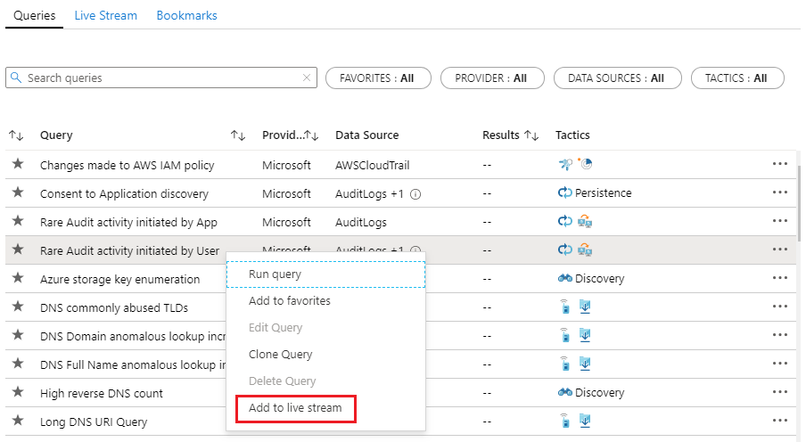

# Use hunting livestream in Microsoft Sentinel to detect threats

[!INCLUDE [Banner for top of topics](./includes/banner.md)]

> [!IMPORTANT]
>
> - The cross-resource query experience (see marked items below) are currently in **PREVIEW**. See the [Supplemental Terms of Use for Microsoft Azure Previews](https://azure.microsoft.com/support/legal/preview-supplemental-terms/) for additional legal terms that apply to Azure features that are in beta, preview, or otherwise not yet released into general availability.
>

Use hunting livestream to create interactive sessions that let you test newly created queries as events occur, get notifications from the sessions when a match is found, and launch investigations if necessary. You can quickly create a livestream session using any Log Analytics query.

- **Test newly created queries as events occur**
    
    You can test and adjust queries without any conflicts to current rules that are being actively applied to events. After you confirm these new queries work as expected, it's easy to promote them to custom alert rules by selecting an option that elevates the session to an alert.

- **Get notified when threats occur**
    
    You can compare threat data feeds to aggregated log data and be notified when a match occurs. Threat data feeds are ongoing streams of data that are related to potential or current threats, so the notification might indicate a potential threat to your organization. Create a livestream session instead of a custom alert rule when you want to be notified of a potential issue without the overheads of maintaining a custom alert rule.

- **Launch investigations**
    
    If there is an active investigation that involves an asset such as a host or user, you can view specific (or any) activity in the log data as it occurs on that asset. You can be notified when that activity occurs.

## Create a livestream session

You can create a livestream session from an existing hunting query, or create your session from scratch.

1. In the Azure portal, navigate to **Sentinel** > **Threat management** > **Hunting**.

1. To create a livestream session from a hunting query:
    
    1. From the **Queries** tab, locate the hunting query to use.
    1. Right-click the query and select **Add to livestream**. For example:
    
    > [!div class="mx-imgBorder"]
    > 

1. To create a livestream session from scratch: 
    
    1. Select the **Livestream** tab
    1. Click **+ New livestream**.
    
1. On the **Livestream** pane:
    
    - If you started livestream from a query, review the query and make any changes you want to make.
    - If you started livestream from scratch, create your query.

    > [!NOTE]
    > Livestream supports **cross-resource queries** (in preview) of data in Azure Data Explorer. [**Learn more about cross-resource queries**](../azure-monitor/logs/azure-monitor-data-explorer-proxy.md#cross-query-your-log-analytics-or-application-insights-resources-and-azure-data-explorer).

1. Select **Play** from the command bar.
    
    The status bar under the command bar indicates whether your livestream session is running or paused. In the following example, the session is running:
    
    > [!div class="mx-imgBorder"]
    > 

1. Select **Save** from the command bar.
    
    Unless you select **Pause**, the session continues to run until you are signed out from the Azure portal.

## View your livestream sessions

1. In the Azure portal, navigate to **Sentinel** > **Threat management** > **Hunting** > **Livestream** tab.

1. Select the livestream session you want to view or edit. For example:
    
    > [!div class="mx-imgBorder"]
    > 
    
    Your selected livestream session opens for you to play, pause, edit, and so on.

## Receive notifications when new events occur

Because livestream notifications for new events use Azure portal notifications, you see these notifications whenever you use the Azure portal. For example:

Select the notification to open the **Livestream** pane.
 
## Elevate a livestream session to an alert

You can promote a livestream session to a new alert by selecting **Elevate to alert** from the command bar on the relevant livestream session:

> [!div class="mx-imgBorder"]
> 

This action opens the rule creation wizard, which is prepopulated with the query that is associated with the livestream session.

## Next steps

In this article, you learned how to use hunting livestream in Microsoft Sentinel. To learn more about Microsoft Sentinel, see the following articles:

- [Proactively hunt for threats](hunting.md)
- [Use notebooks to run automated hunting campaigns](notebooks.md)
