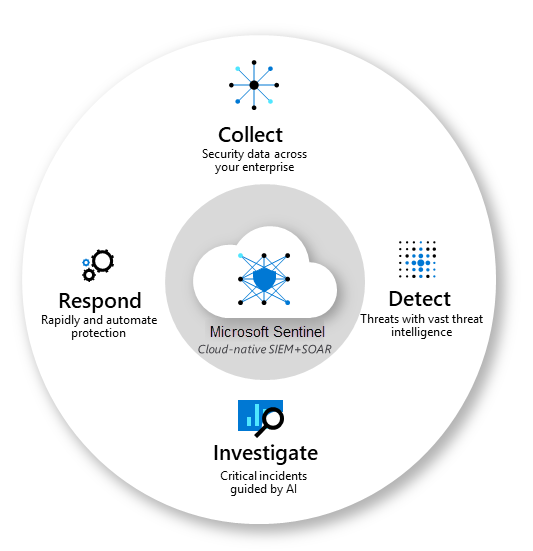
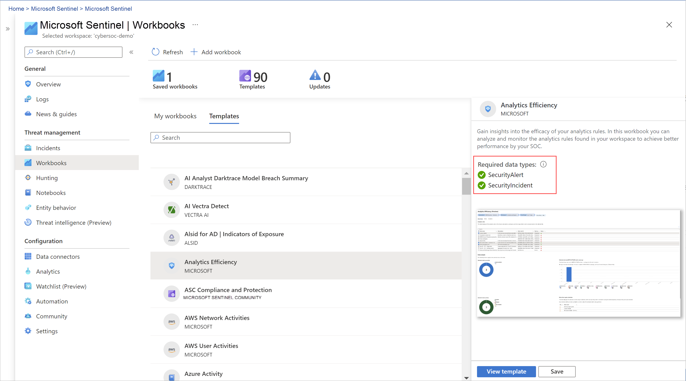
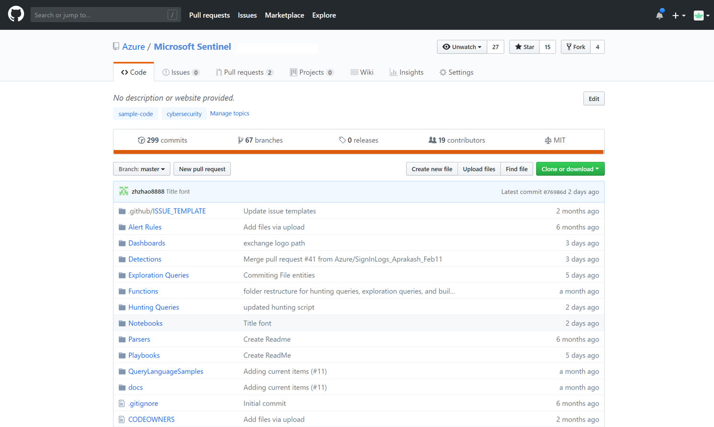

# What is Microsoft Sentinel?

Microsoft Sentinel is a scalable solution that provides:

- Cloud-native, security information and event management (SIEM)
- Security orchestration, automation, and response (SOAR)

Microsoft Sentinel delivers intelligent security analytics and threat intelligence across the enterprise. With Microsoft Sentinel, you get a single solution for attack detection, threat visibility, proactive hunting, and threat response.

Microsoft Sentinel is your bird's-eye view across the enterprise alleviating the stress of increasingly sophisticated attacks, increasing volumes of alerts, and long resolution time frames.

- **Collect data at cloud scale** across all users, devices, applications, and infrastructure, both on-premises and in multiple clouds.

- **Detect previously undetected threats**, and [minimize false positives](false-positives.md) using Microsoft's analytics and unparalleled threat intelligence.

- **Investigate threats with artificial intelligence**, and hunt for suspicious activities at scale, tapping into years of cyber security work at Microsoft.

- **Respond to incidents rapidly** with built-in orchestration and automation of common tasks.

Microsoft Sentinel natively incorporates proven Azure services, like Log Analytics, and Logic Apps. Microsoft Sentinel enriches your investigation and detection with AI, and provides Microsoft's threat intelligence stream and enables you to bring your own threat intelligence.

## Collect data by using data connectors

To on-board Microsoft Sentinel, you first need to [connect to your security sources](connect-data-sources.md).

Microsoft Sentinel comes with many connectors for Microsoft solutions that are available out of the box and provide real-time integration. Some of these connectors include:

- Microsoft 365 Defender solutions
- Microsoft 365 sources like Office 365, Azure AD, Microsoft Defender for Identity, and Microsoft Defender for Cloud Apps

Microsoft Sentinel has built-in connectors to the broader security ecosystem for non-Microsoft solutions. You can also use common event format, Syslog or REST-API to connect your data sources with Microsoft Sentinel.

For more information, see [Find your data connector](data-connectors-reference.md).

[!INCLUDE [azure-lighthouse-supported-service](../../includes/azure-lighthouse-supported-service.md)]

## Create interactive reports by using workbooks

After you [connected your data sources](quickstart-onboard.md) to Microsoft Sentinel, you can monitor the data using the Microsoft Sentinel integration with Azure Monitor Workbooks, which provides versatility in creating custom workbooks.

While Workbooks are displayed differently in Microsoft Sentinel, it may be useful for you to see how to [Create interactive reports with Azure Monitor Workbooks](../azure-monitor/visualize/workbooks-overview.md). Microsoft Sentinel allows you to create custom workbooks across your data, and also comes with built-in workbook templates to allow you to quickly gain insights across your data as soon as you connect a data source.

- Workbooks are intended for SOC engineers and analysts of all tiers to visualize data.

- While Workbooks are best used for high-level views of Microsoft Sentinel data, and require no coding knowledge, you can't integrate Workbooks with external data.

## Correlate alerts into incidents by using analytic rules

To help you reduce noise and minimize the number of alerts you have to review and investigate, Microsoft Sentinel uses [analytics to correlate alerts into incidents](detect-threats-built-in.md). Incidents are groups of related alerts that together create an actionable possible-threat that you can investigate and resolve. Use the built-in correlation rules as-is, or use them as a starting point to build your own. Microsoft Sentinel also provides machine learning rules to map your network behavior and then look for anomalies across your resources. These analytics connect the dots, by combining low fidelity alerts about different entities into potential high-fidelity security incidents.

## Automate and orchestrate common tasks by using playbooks

Automate your common tasks and [simplify security orchestration with playbooks](tutorial-respond-threats-playbook.md) that integrate with Azure services and your existing tools.

Microsoft Sentinel's automation and orchestration solution provides a highly extensible architecture that enables scalable automation as new technologies and threats emerge. To build playbooks with Azure Logic Apps, you can choose from a growing gallery of built-in playbooks. These include [200+ connectors](../connectors/apis-list.md) for services such as Azure functions. The connectors allow you to apply any custom logic in code like:

- ServiceNow
- Jira
- Zendesk
- HTTP requests
- Microsoft Teams
- Slack
- Windows Defender ATP
- Defender for Cloud Apps

For example, if you use the ServiceNow ticketing system, use Azure Logic Apps to automate your workflows and open a ticket in ServiceNow each time a particular event is detected.

- Playbooks are intended for SOC engineers and analysts of all tiers, to automate and simplify tasks, including data ingestion, enrichment, investigation, and remediation.

- Playbooks work best with single, repeatable tasks, and require no coding knowledge. Playbooks aren't suitable for ad-hoc or complex task chains, or for documenting and sharing evidence.

## Identify the scope and root cause of a security threat

Microsoft Sentinel [deep investigation](investigate-cases.md) tools help you to understand the scope and find the root cause, of a potential security threat. You can choose an entity on the interactive graph to ask interesting questions for a specific entity, and drill down into that entity and its connections to get to the root cause of the threat. 

## Detect threats by using the MITRE framework

Use Microsoft Sentinel's [powerful hunting search-and-query tools](hunting.md), based on the MITRE framework, which enable you to proactively hunt for security threats across your organization’s data sources, before an alert is triggered. Create custom detection rules based on your hunting query. Then, surface those insights as alerts to your security incident responders.

While hunting, create bookmarks to return to  interesting events later. Use a bookmark to share an event with others. Or, group events with other correlating events to create a compelling incident for investigation.

## Hunt for security threats with notebooks

Microsoft Sentinel supports Jupyter notebooks in Azure Machine Learning workspaces, including full libraries for machine learning, visualization, and data analysis.

[Use notebooks in Microsoft Sentinel](notebooks.md) to extend the scope of what you can do with Microsoft Sentinel data. For example:

- Perform analytics that aren't built in to Microsoft Sentinel, such as some Python machine learning features
- Create data visualizations that aren't built in to Microsoft Sentinel, such as custom timelines and process trees
- Integrate data sources outside of Microsoft Sentinel, such as an on-premises data set.

:::image type="content" source="media/notebooks/sentinel-notebooks-on-machine-learning.png" alt-text="Screenshot of a Sentinel notebook in an AML workspace.":::

Notebooks are intended for threat hunters or Tier 2-3 analysts, incident investigators, data scientists, and security researchers. They require a higher learning curve and coding knowledge. They have limited automation support.

Notebooks in Microsoft Sentinel provide:

- Queries to both Microsoft Sentinel and external data
- Features for data enrichment, investigation, visualization, hunting, machine learning, and big data analytics

Notebooks are best for:

- More complex chains of repeatable tasks
- Ad-hoc procedural controls
- Machine learning and custom analysis

Notebooks support rich Python libraries for manipulating and visualizing data. They're useful to document and share analysis evidence.

## Download security content from the community

The Microsoft Sentinel community is a powerful resource for threat detection and automation. Our Microsoft security analysts constantly create and add new workbooks, playbooks, hunting queries, and more. They post these content items to the community for you to use in your environment. Download sample content from the private community GitHub [repository](https://aka.ms/asicommunity) to create custom workbooks, hunting queries, notebooks, and playbooks for Microsoft Sentinel.

## Next steps

- To get started with Microsoft Sentinel, you need a subscription to Microsoft Azure. If you don't have a subscription, you can sign up for a [free trial](https://azure.microsoft.com/free/).
- Learn how to [onboard your data to Microsoft Sentinel](quickstart-onboard.md), and [get visibility into your data, and potential threats](get-visibility.md).
