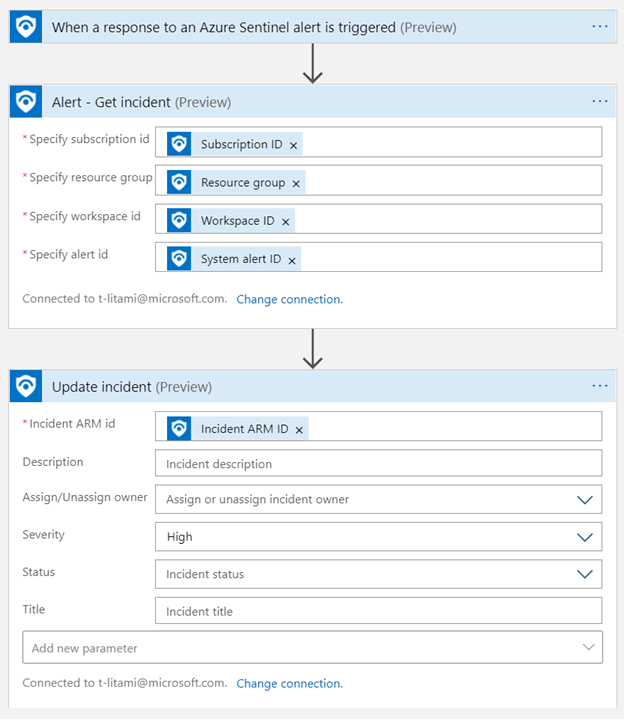
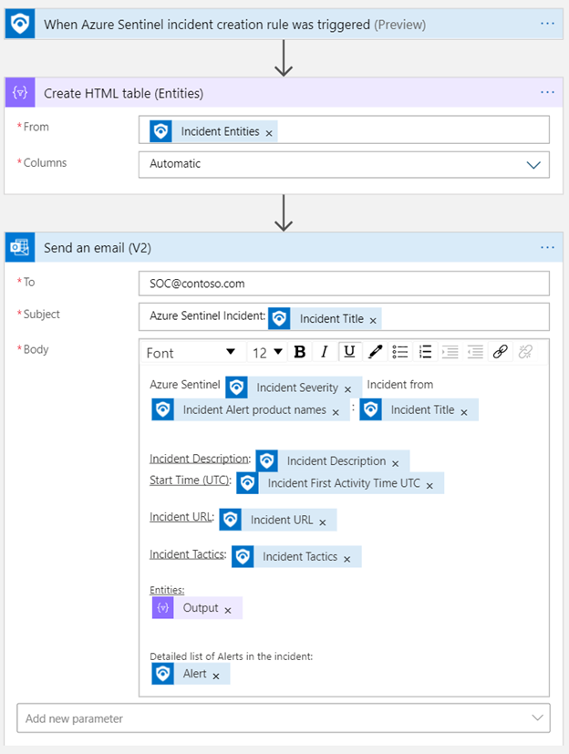
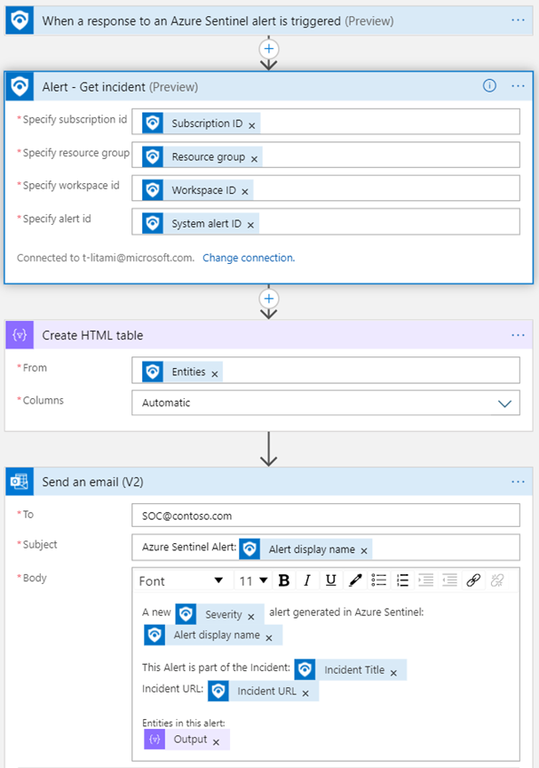
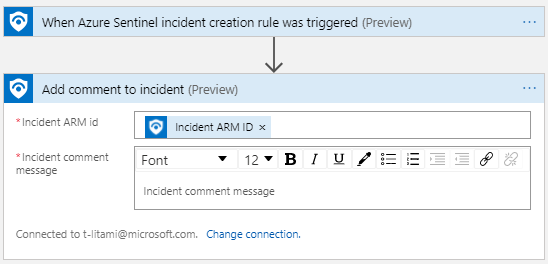

# Authenticate playbooks to Azure Sentinel

This document explains the types of connection and authentication in the [Logic Apps Azure Sentinel connector](/connectors/azuresentinel/), that playbooks can use to interact with Azure Sentinel in order to have access to the information in your workspace's tables. It further shows you how to get to specific types of Azure Sentinel information that you are likely to need.

This document is a companion to our other playbook documentation - [Tutorial: Use playbooks with automation rules in Azure Sentinel](tutorial-respond-threats-playbook.md). The two documents will refer to each other back and forth.

For an introduction to playbooks, see [Automate threat response with playbooks in Azure Sentinel](automate-responses-with-playbooks.md).

For the complete specification of the Azure Sentinel connector, see the [Logic Apps connector documentation](/connectors/azuresentinel/).

## Permissions required

| Roles \ Connector components | Triggers | "Get" actions | Update incident, add a comment |
| ------------- | :-----------: | :------------: | :-----------: |
| **[Azure Sentinel Reader](/azure/role-based-access-control/built-in-roles#azure-sentinel-reader)** | &#10003; | &#10003; | &#10007; |
| **Azure Sentinel [Responder](/azure/role-based-access-control/built-in-roles#azure-sentinel-responder)/[Contributor](/azure/role-based-access-control/built-in-roles#azure-sentinel-contributor)** | &#10003; | &#10003; | &#10003; |
| 

[Learn more about permissions in Azure Sentinel](/azure/sentinel/roles).

## Azure Sentinel triggers summary

Though the Azure Sentinel connector can be used in a variety of ways, the connector's components can be divided into 2 flows, each triggered by a different Azure Sentinel occurrence:

| Trigger | Full trigger name in Logic Apps Designer | When to use it | Known limitations 
| --------- | ------------ | -------------- | -------------- | 
| **Incident trigger** | "When Azure Sentinel incident creation rule was triggered (Preview)" | Recommended for most incident automation scenarios.  The playbook receives incident objects, including entities and alerts. Using this trigger allows the playbook to be attached to an **Automation rule**, so it can be triggered when an incident is created in Azure Sentinel, and all the [benefits of automation rules](/azure/sentinel/automate-incident-handling-with-automation-rules) can be applied to the incident. | Playbooks with this trigger can't be run manually from Azure Sentinel.  Playbooks with this trigger do not support alert grouping, meaning they will receive only the first alert sent with each incident.
| **Alert trigger** | "When a response to an Azure Sentinel alert is triggered" | Advisable for playbooks that need to be run on alerts manually from the Azure Sentinel portal, or for **scheduled** analytics rules that don't generate incidents for their alerts. | This trigger cannot be used to automate responses for alerts generated by **Microsoft security** analytics rules.  Playbooks using this trigger cannot be called by **automation rules**. |
|

The schemas used by these two flows are not identical.
The recommended practice is to use the **Azure Sentinel incident trigger** flow, which is applicable to most scenarios.

### Incident dynamic fields

The **Incident** object received from **When Azure Sentinel incident creation rule was triggered** includes the following dynamic fields:

- Incident properties (Shown as "Incident: field name")

- Alerts (array)

  - Alert properties (Shown as "Alert: field name")

    When selecting an alert property such as **Alert: \<property name>**, a *for each* loop is automatically generated, since an incident can include multiple alerts.

- Entities (array of all an alert's entities)

- Workspace info fields (applies to the Sentinel workspace where the incident was created)
  - Subscription ID
  - Workspace name
  - Workspace ID
  - Resource group name

## Azure Sentinel actions summary

| Component | When to use it |
| --------- | -------------- |
| **Alert - Get Incident** | In playbooks that start with Alert trigger. Useful for getting the incident properties, or retrieving the **Incident ARM ID** to use with the **Update incident** or **Add comment to incident** actions. |
| **Get Incident** | When triggering a playbook from an external source or with a non-Sentinel trigger. Identify with an **Incident ARM ID**. Retrieves the incident properties and comments. |
| **Update Incident** | To change an incident's **Status** (for example, when closing the incident), assign an **Owner**, add or remove a tag, or to change its **Severity**, **Title**, or **Description**.
| **Add comments to incident** | To enrich the incident with information collected from external sources; to audit the actions taken by the playbook on the entities; to supply additional information valuable for incident investigation. |
| **Entities - Get \<*entity type*\>** | In playbooks that work on a specific entity type (**IP**, **Account**, **Host**, **URL** or **FileHash**) which is known at playbook creation time, and you need to be able to parse it and work on its unique fields. |
|

## Work with incidents - Usage Examples

> [!TIP] 
> The actions **Update Incident** and **Add a Comment to Incident** require the **Incident ARM ID**.  
Use the **Alert - Get Incident** action beforehand to get the **Incident ARM ID**.

### Update an incident
-  Playbook is triggered **when an incident is created**

    

-  Playbook is triggered **when an alert is generated**

    
      
### Use Incident Information

Basic playbook to send incident details over mail:
-  Playbook is triggered **when an incident is created**

    

-  Playbook is triggered **when an alert is generated**

    

### Add a comment to the incident

-  Playbook is triggered **when an incident is created**

    

-  Playbook is triggered **when an alert is generated**

    

## Work with specific Entity types

The **Entities** dynamic field is an array of JSON objects, each of which represents an entity. Each entity type has its own schema, depending on its unique properties.

The **"Entities - Get \<entity name>"** action allows you to do the following:

- Filter the array of entities by the requested type.
- Parse the specific fields of this type, so they can be used as dynamic fields in further actions.

The input is the **Entities** dynamic field.

The response is an array of entities, where the special properties are parsed and can be directly used in a *For each* loop.

Currently supported entity types are:

- [IP](/connectors/azuresentinel/#entities---get-ips)
- [Host](/connectors/azuresentinel/#entities---get-hosts)
- [Account](/connectors/azuresentinel/#entities---get-accounts)
- [URL](/connectors/azuresentinel/#entities---get-urls)
- [FileHash](/connectors/azuresentinel/#entities---get-filehashes)

    :::image type="content" source="media/sentinel-connectors/entities-actions.png" alt-text="Entities Actions List":::

For other entity types, similar functionality can be achieved using Logic Apps' built-in actions:

- Filter the array of entities by the requested type using [**Filter Array**](/azure/logic-apps/logic-apps-perform-data-operations#filter-array-action).

- Parse the specific fields of this type, so they can be used as dynamic fields in further actions using [**Parse JSON**](/azure/logic-apps/logic-apps-perform-data-operations#parse-json-action).

## Work with custom details

    
## Next steps

- bla bla
