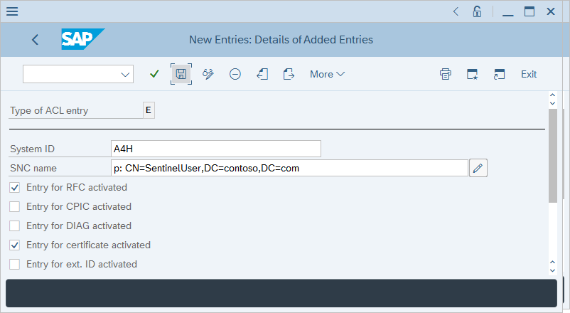

# Deploy the Microsoft Sentinel SAP data connector with SNC

Continuous Threat Monitoring for SAP data connector agent connects to ABAP server using RFC connection and users username and password for authentication.
In some environments, requirements may exist, that require connection over an encrypted connection and authentication to be carried out using client certificate.<br>
Before enabling connectivity over encrypted (SNC) connection, a number of prerequisites must be met


## Prerequisites

- SAP Cryptographic library [Download the SAP Cryptographic Library](https://help.sap.com/viewer/d1d04c0d65964a9b91589ae7afc1bd45/5.0.4/en-US/86921b29cac044d68d30e7b125846860.html)
- Network connectivity. SNC uses ports *48xx* (where xx is the instance number) to connect to the ABAP server
- SAP server configured to support SNC authentication.
- Self-signed, or enterprise CA-issued certificate for user authentication
 
> [!NOTE]
> The step-by-step guide is a sample guide on configuring SNC. In production environments it is strongly recommended to consult with SAP administrators on the steps to carry out

## SNC configuration step-by-step guide

1) Export server certificate<br>
   1) Run **STRUST** transaction
   1) Navigate and expand the **SNC SAPCryptolib** section in the left hand pane
   1) Select the system, then click the value of the **Subject** field<br>
   Note that server certificate information will be displayed in the **Certificate** section at the bottom of the page
   1) Click **Export certificate** button at the bottom of the page<br>
   
   1) In **Export Certificate** dialog box select **Base64** as file format, click double boxes next to **File Path** field and select a filename to export certificate to, then click click the green checkbox to export the certificate
> [!IMPORTANT]
> Next section explains how to import a certificate, so it's trusted by ABAP server<br>
> It is important to understand which certificate needs to be imported into the SAP system. In any case, only public keys of the certificates need to be imported into SAP system.<br>
> **If user certificate is self-signed**<br>
> Import user certificate<br>
> **If user certificate is issued by an enterprise CA**<br>
> Import enterprise CA certificate ( in case root and subordinate CA servers are used, import both root and subordinate CA public certificates)

2) Importing a certificate
    1) Run **STRUST** transaction   
    1) Click **Display<->Change** button
    1) Click **Import certificate** button at the bottom of the page
    1) In the **Import certificate** dialog box, click double boxes next to **File path** field and locate the certificate.<br>
    Locate the file containing the certificate (public key only) and click green checkbox to import the certificate.<br>
    Notice certificate information is displayed in **Certificate** section<br>
    Click **Add to Certificate List** button<br>
    Notice that certificate will appear in **Certificate List**
1) Associate certificate with a user account
    1) Run **SM30** transaction
    1) In **Table/View** field type **USRACLEXT**, then click **Maintain**
    1) Review the output, identify whether target user already has an associates SNC name. If not, click **New Entries**<br>
    
    1) Type in username in **User** field and user's certificate subject name prefixed with **p:**, then click **Save**<br>
    
1) Grant logon rights using certificate
    1) Run **SM30** transaction
    1) In **Table/View** field type **VSNCSYSACL**, then click **Maintain**
    1) Confirm the informational prompt that the table is cross-client
    1) In **Determine Work Area: Entry** type **E** in **Type of ACL entry** field and press the green checkbox
    1) Review the output, identify whether target user already has an associates SNC name. If not, click **New Entries**<br>
    
    1) Enter system ID and user certificate subject name with a **p:** prefix<br>
    
    1) Ensure **Entry for RFC activated** and **Entry for certificate activated** checkboxes are checked, then press **Save**
1) Setup the container
    1) Transfer **libsapcrypto.so**, **sapgenpse** to the target system where container will be created
    1) Transfer client certificate (private and public key) to the target system where container will be created<br>
    Client certificate and key can be in .p12, .pfx, or Base-64 .crt and .key format.
    1) Transfer server certificate (public key only) to the target system where container will be created. Server certificate must be in Base-64 .crt format
    1) In case client certificate is issued by an enterprise certification authority, transfer issuing CA, root CA certificates to the target system where container will be created.
    1) retreive the kickstart script from the github repository
    ```bash
    wget https://raw.githubusercontent.com/Azure/Azure-Sentinel/master/Solutions/SAP/sapcon-sentinel-kickstart.sh
    ```
    1) Change script permissions to make it executable
    ```bash
    chmod +x ./sapcon-sentinel-kickstart.sh
    ```
    1) Run the script specifying the following parameters
    ```bash
    ./sapcon-sentinel-kickstart.sh \
    --use-snc \
    --cryptolib <path to sapcryptolib.so> \
    --sapgenpse <path to sapgenpse> \
    --client-cert <path to client certificate public key> \
    --client-key <path to client certificate private key> \
    --server-cert <path to server certificate public key> \
    ```
    example:
    ````bash
    ./sapcon-sentinel-kickstart.sh \
    --use-snc \
    --cryptolib /home/azureuser/libsapcrypto.so \
    --sapgenpse /home/azureuser/sapgenpse \
    --client-cert /home/azureuser/client.crt \
    --client-key /home/azureuser/client.key \
    --server-cert /home/azureuser/server.crt \
    ````
    >[!NOTE]
    >If client certificate is in .pfx or .p12 format, instead of `--client-cert` and `--client-key` parameters, use `--client-pfx <pfx filename>` and `--client-pfx-passwd <password>` switches
    >[!NOTE]
    >If client certificate is signed by an enteprise certification authority, add `--cacert <path to ca certificate>` switch for every certificate authority used in the trust chain, for example `--cacert /home/azureuser/issuingca.crt --cacert /home/azureuser/rootca.crt`

    For additional information on options available in the kickstart script, review [Reference: Kickstart script](reference-kickstart.md)

