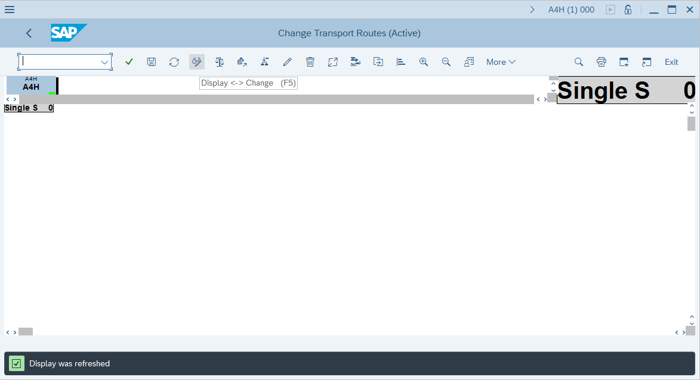
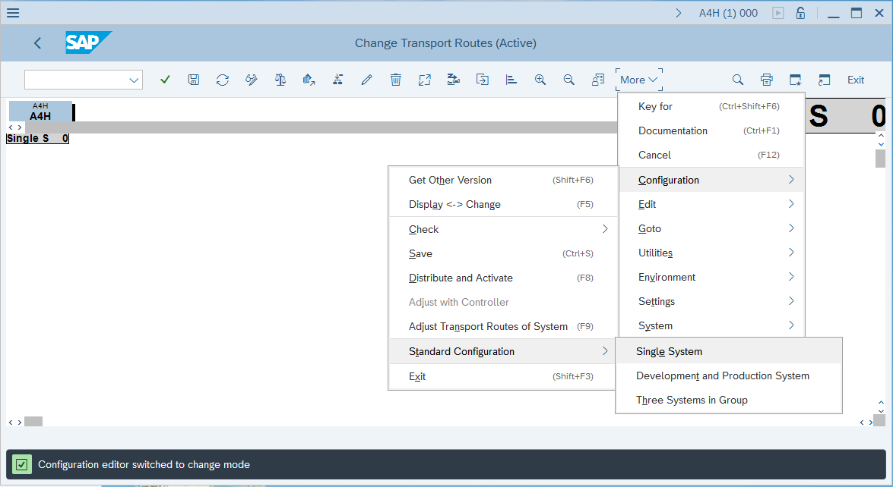

# Configure SAP Transport Management System

This article shows you how to configure the SAP Transport Management System in order to successfully deploy the Continuous Threat Monitoring solution for SAP in Microsoft Sentinel.

SAP's Transport Management System is normally already configured on production systems. However, in a lab environment, where CRs often haven't been previously installed, configuration may be required.

If you get this error running the **STMS_IMPORT** transaction while [preparing your SAP environment](preparing-sap.md), you'll need to configure the Transport Management System.

The following steps are a sample on how to configure a transport management system.
> [!IMPORTANT] 
> In production systems always consult with SAP administrator on the steps to configure a transport management system
>
1. Run a new instance of SAP Logon and logon to Client number `000` as `DDIC` user 

1. Run the **STMS** transaction 
 To run the transaction, type the name of the transaction **STMS** in the field in the top-left corner of the screen and press **Enter**
1. Delete existing TMS configuration
 In **Transport Management System** Delete the existing TMS Configuration
 To delete the TMS configuration, click on **More**, select **Extras** and select **Delete TMS Configuration**
 
 Confirm deletion of configuration by pressing **Yes**
 After deletion of the configuration, TMS transport domain needs to be configured.
 In the **TMS: Configure Transport Domain** press **Save**
 In the **Set Password for User TMSADM**, define a password complex password, make a note of the password in a secure location and click the green checkbox.
1. Configure Transport routes
 In **Transport Management System** click **Transport Routes**
 
 In **Change Transport Routes (Active)** click **Display <-> Change**
 
 In **Change Transport Routes (Active)** click **More**, select **Configuration**, select **Standard Configuration**, select **Single System**
 
 In **Change Transport Routes (Revised)** click **Save**
 In **Configuration Short Text** window click **Save**
 In **Distribute and Activate** window click **Yes**
  
After steps above have been carried out, Transport management system will be configured and `STMS_IMPORT` transaction will work.
Close SAP GUI logged on to client `000` as `DDIC` and return to SAP GUI logged on to client `001`

-->

## Next steps

After the steps above are complete, the CRs required for Sentinel continuous protection for SAP operation are deployed, sample role is provisioned and a user account is created with necessary role profile assigned.
The next step is to deploy the data connector agent container.

> [!div class="nextstepaction"]
> [Deploy and configure the data connector agent container](deploy_data_connector_agent_container.md)

