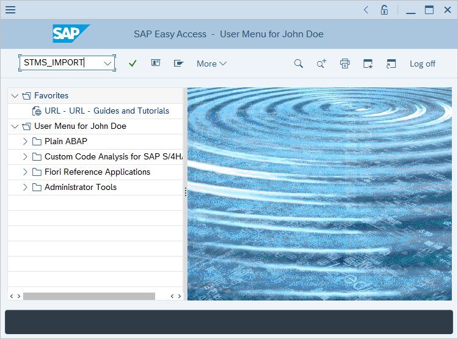
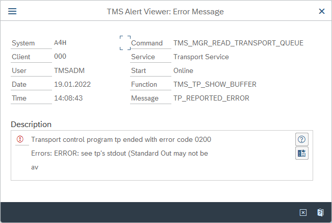
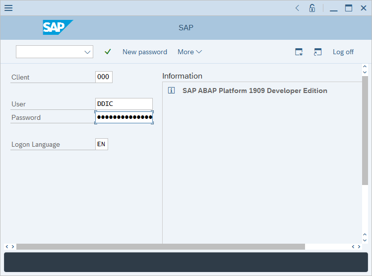
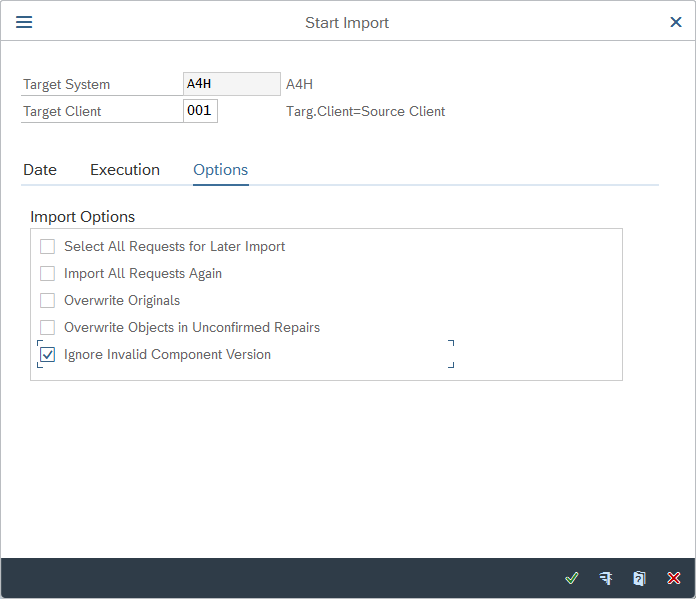

# Deploy SAP Change Requests (CRs) and configure authorization

[!INCLUDE [Banner for top of topics](../includes/banner.md)]

This article shows you how to deploy the SAP Change Requests (CRs) necessary to prepare the environment for the installation of the SAP agent, so that it can properly connect to your SAP systems.

> [!IMPORTANT]
> The Microsoft Sentinel SAP solution is currently in PREVIEW. The [Azure Preview Supplemental Terms](https://azure.microsoft.com/support/legal/preview-supplemental-terms/) include additional legal terms that apply to Azure features that are in beta, preview, or otherwise not yet released into general availability.

## Deployment milestones
Deployment of the SAP continuous threat monitoring solution is divided into the following sections

1. [Deployment overview](deployment-overview.md)

1. [Prerequisites](prerequisites-for-deploying-sap-continuous-threat-monitoring.md)

1. **Deploy SAP CRs and configure authorization (*You are here*)**

1. [Deploy and configure the data connector agent container](deploy_data_connector_agent_container.md)

1. [Deploy SAP security content](deploy_sap_security_content.md)

1. Optional deployment steps
   - [Configure auditing](configure_audit.md)
   - [Configure SAP data connector to use SNC](configure_snc.md)

> [!IMPORTANT]
> This article outlines a step-by-step guide on how to deploy required CRs: [Express: Change request and authorization configuration step-by-step guide](#change-request-and-authorization-configuration-step-by-step-guide)
> Experienced SAP administrators that are familiar with CR deployment process should obtain relevant CRs from [SAP environment validation steps](prerequisites-for-deploying-sap-continuous-threat-monitoring.md#sap-environment-validation-steps) section of the guide and deploy them. Note that **NPLK900163** CR deploys a sample role and is optional. Instead, role can be manually defined following required authorizations list in [Required ABAP authorizations](#required-abap-authorizations)

> [!NOTE]
> 
> It is strongly recommended that deployment of the CRs is carried out by an experienced SAP system administrator
>
> The steps below may differ depending on the version of the SAP system and should be considered as a sample only
> 
> Obtain details of the **SAP system version**, **SID**, **System number**, **Client number**, **IP address**, **administrative username** and **password** before beginning
> For this guide, the following is assumed: a `SAP ABAP Platfor 1909 Developer edition`, SID `A4H`, System number `00` and Client number `001` installed on a host with IP address `192.168.136.4`. Administrator user of this instance is `a4hadm`, however SSH connection to the SAP system is established with `root` user credentials. 

Deployment of Sentinel continuous protection for SAP requires installation of several CRs, more details about the required CRs can be found in the [Validate and configure existing SAP environment](#required-abap-authorizations) step of this guide.

To deploy the CRs, follow the steps outlined below:

### Change request and authorization configuration step-by-step guide

1. Transfer the CR files to the SAP system, logon to SAP system via ssh or telnet and change ownership of the files to user \<sid\>adm and group sapsys
1. Copy the cofiles (K-prefixed files) to `/usr/sap/trans/cofiles` folder and data files (R-prefixed files) to `/usr/sap/trans/data` folder, preserving the permissions (use `cp` with `-p` switch).
1. Launch **SAP Logon** and logon to the SAP GUI 

4. Run the **STMS_IMPORT** transaction 
To run the transaction, type the name of the transaction **STMS_IMPORT** in the field in the top-left corner of the screen and press **Enter** 

> [!NOTE]
> If an error occurs at this step, SAP transport management system has to be configured. Expand section below to review the details, else proceed with next steps
> 

Steps to configure transport management system

Transport management system is normally already configured on production systems, however in a lab environment, where CRs haven't been previously installed, configuration may be required. 
If an error similar to the below appears, transport management system has to be configured

 
The following steps are a sample on how to configure a transport management system.
> [!IMPORTANT] 
> In production systems always consult with SAP administrator on the steps to configure a transport management system
>
1. Run a new instance of SAP Logon and logon to Client number `000` as `DDIC` user 

1. Run the **STMS** transaction 
 To run the transaction, type the name of the transaction **STMS** in the field in the top-left corner of the screen and press **Enter**
1. Delete existing TMS configuration
 In **Transport Management System** Delete the existing TMS Configuration
 To delete the TMS configuration, click on **More**, select **Extras** and select **Delete TMS Configuration**
 
 Confirm deletion of configuration by pressing **Yes**
 After deletion of the configuration, TMS transport domain needs to be configured.
 In the **TMS: Configure Transport Domain** press **Save**
 In the **Set Password for User TMSADM**, define a password complex password, make a note of the password in a secure location and click the green checkbox.
1. Configure Transport routes
 In **Transport Management System** click **Transport Routes**
 
 In **Change Transport Routes (Active)** click **Display <-> Change**
 
 In **Change Transport Routes (Active)** click **More**, select **Configuration**, select **Standard Configuration**, select **Single System**
 
 In **Change Transport Routes (Revised)** click **Save**
 In **Configuration Short Text** window click **Save**
 In **Distribute and Activate** window click **Yes**
  
After steps above have been carried out, Transport management system will be configured and `STMS_IMPORT` transaction will work.
Close SAP GUI logged on to client `000` as `DDIC` and return to SAP GUI logged on to client `001`

5. In **Import Queue** window, click **More**, select **Extras**->**Other Requests**->**Add** 

1. In **Add Transport Requests to Import Queue** click on the boxes next to *Transp. Request* field
1. **Transport requests** window should display a list of CRs available to be deployed. Select a CR and click the green checkbox
1. In **Add Transport Request to Import Queue** click **Continue**
1. In **Add Transport Request** click **Yes**
1. Repeat the procedure in steps 5-9 to add all additional Change Requests that need to be deployed
1. In **Import Queue** window, click **Import All Requests** 

1. In **Start Import** window, click on boxes next to **Target Client** field and select client to deploy the CRs to, then click green checkbox in **Input Help..** window, then select **Options** tab and select **Ignore Invalid Component Version** checkbox, then click the green checkbox at the bottom 

1. In the **Start Import** window click **Yes** to confirm the import
1. In the **Import Queue** window click **Refresh** button, wait until the import operation completes and import queue becomes empty
1. To review import status, in the **Import History** window click **More**, select **Go To**, select **Import History** 

1. NPLK900180 Change request is expected to end with a Warning, click on the entry to verify that the warning is associated with Table \<tablename\> was activated 
 

### Role configuration step-by-step guide

After the NPLK900163 CR (change request) is deployed, a **/MSFTSEN/SENTINEL_CONNECTOR** role is created in SAP. If the role is created manually, it may bear a different name.
In this guide, it will be assumed that the role created has a name **/MSFTSEN/SENTINEL_CONNECTOR**
 

The next step is to generate an active role profile

1. Run the **PFCG** transaction 
To run the transaction, in main SAP GUI window type **PFCG** in the top-left corner and press **Enter**
1. In **Role Maintenance** window in the **Role** textbox type the role name `/MSFTSEN/SENTINEL_CONNECTOR` and click  **Change** button
1. In **Change Roles** window select the **Authorizations** tab
1. In the **Change Roles** **Authorizations** window select **Change Authorization Data** 

1. In the **Information** window click the green checkbox
1. In the **Change Role: Authorizations** window click **Generate**
 
 Notice that after clicking, **Status** field changes from **Unchanged** to **generated**
1. In the **Change Role: Authorizations** window click **Back**
8. In the **Change Roles** window validate **Authorizations** tab displays a green box, then click **Save** button
 

### User creation step-by-step guide

Sentinel continuous protection for SAP requires a user account to connect to SAP system

The following steps outline the basics on how to create a user account and assign it to the role that was created in the previous step.
This step-by-step guide will assume the role name is `/MSFTSEN/SENTINEL_CONNECTOR`

1. In SAP GUI run the **SU01** transaction 
To run the transaction, in SAP GUI type **SU01** in top-left corner and press **Enter**
2. In **User Maintenance: Initial Screen** screen type in the name of the new user in the **User** field and press **Create Technical User button**
3. In **Maintain Users** screen select **User Type** of **System**, compose and enter a complicated password in **New Password** and **Repeat Password** fields, then select the **Roles** tab
4. In **Roles** tab, in the **Role Assignments** section, write down the full name of the role and press **Enter**
 After pressing **Enter**, verify that the right-hand side of the **Role Assignments** section populates with data, such as **Change Start Date**
5. Navigate to **Profiles** tab, verify profile for role is populated in the **Assigned Authorization Profiles** section and press **Save**

### Required ABAP authorizations

The following table lists the ABAP authorizations required to ensure SAP logs can be correctly retreived by the account used by Microsoft Sentinel data connector.

Required authorizations are listed by log type. Only authorizations listed for the types of logs that are planneed to be ingested into Microsoft Sentinel are required.

> [!TIP]
> To create the role with all required authorizations, deploy the SAP change request NPLK900163 on the SAP system. 
> Change request NPLK900163 creates the **/MSFTSEN/SENTINEL_CONNECTOR** role that has all the relevant permissions for the data connector to operate.

| Authorization Object | Field | Value |
| -------------------- | ----- | ----- |
| **All RFC logs** | | |
| S_RFC | FUGR | /OSP/SYSTEM_TIMEZONE |
| S_RFC | FUGR | ARFC |
| S_RFC | FUGR | STFC |
| S_RFC | FUGR | RFC1 |
| S_RFC | FUGR | SDIFRUNTIME  |
| S_RFC | FUGR | SMOI |
| S_RFC | FUGR | SYST |
| S_RFC | FUGR/FUNC | SRFC/RFC_SYSTEM_INFO |
| S_RFC | FUGR/FUNC | THFB/TH_SERVER_LIST |
| S_TCODE | TCD | SM51 |
| **ABAP Application Log**  | | |
| S_APPL_LOG | ACTVT | Display |
| S_APPL_LOG | ALG_OBJECT | * |
| S_APPL_LOG | ALG_SUBOBJ | * |
| S_RFC | FUGR | SXBP_EXT |
| S_RFC | FUGR | /MSFTSEN/_APPLOG |
| **ABAP Change Documents Log** | | |
| S_RFC | FUGR | /MSFTSEN/_CHANGE_DOCS |
| **ABAP CR Log** | | |
| S_RFC | FUGR | CTS_API |
| S_RFC | FUGR | /MSFTSEN/_CR |
| S_TRANSPRT | ACTVT | Display |
| S_TRANSPRT | TTYPE | * |
| **ABAP DB Table Data Log** | | |
| S_RFC | FUGR | /MSFTSEN/_TD |
| S_TABU_DIS | ACTVT | Display |
| S_TABU_DIS | DICBERCLS | &NC& |
| S_TABU_DIS | DICBERCLS | + Any object required for logging |
| S_TABU_NAM | ACTVT | Display |
| S_TABU_NAM | TABLE | + Any object required for logging |
| S_TABU_NAM | TABLE | DBTABLOG |
| **ABAP Job Log** | | |
| S_RFC | FUGR | SXBP |
| S_RFC | FUGR | /MSFTSEN/_JOBLOG |
| **ABAP Job Log, ABAP Application Log** | | |
| S_XMI_PRD | INTERFACE | XBP |
| **ABAP Security Audit Log - XAL** | | |
| All RFC | S_RFC | FUGR |
| S_ADMI_FCD | S_ADMI_FCD | AUDD |
| S_RFC | FUGR | SALX |
| S_USER_GRP | ACTVT | Display |
| S_USER_GRP | CLASS | * |
| S_XMI_PRD | INTERFACE | XAL |
| **ABAP Security Audit Log - XAL, ABAP Job Log, ABAP Application Log** | | |
| S_RFC | FUGR | SXMI |
| S_XMI_PRD | EXTCOMPANY | Microsoft |
| S_XMI_PRD | EXTPRODUCT | Microsoft Sentinel |
| **ABAP Security Audit Log - SAL** | | |
| S_RFC | FUGR | RSAU_LOG |
| S_RFC | FUGR | /MSFTSEN/_AUDITLOG |
| **ABAP Spool Log, ABAP Spool Output Log** | | |
| S_RFC | FUGR | /MSFTSEN/_SPOOL |
| **ABAP Workflow Log** | | |
| S_RFC | FUGR | SWRR |
| S_RFC | FUGR | /MSFTSEN/_WF |
| **User Data** | | |
| S_RFC | FUNC | RFC_READ_TABLE |
| | |

## Next steps

After the steps above are complete, the CRs required for Sentinel continuous protection for SAP operation are deployed, sample role is provisioned and a user account is created with necessary role profile assigned.
The next step is to deploy the data connector agent container.

> [!div class="nextstepaction"]
> [Deploy and configure the data connector agent container](deploy_data_connector_agent_container.md)

