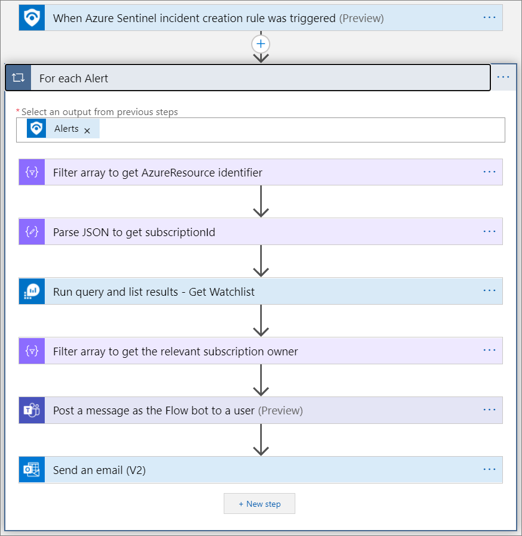
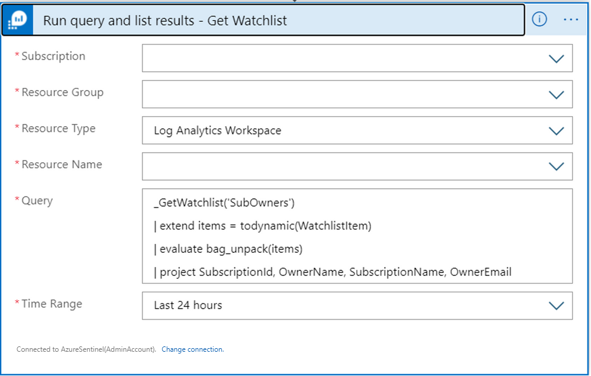

# Use Microsoft Sentinel watchlists and playbook to inform owners of alerts

[Microsoft Defender for Cloud alerts](/azure/defender-for-cloud/defender-for-cloud-introduction) inform the Security Operations Center (SOC) about possible security attacks on Azure resources.

If the SOC doesn't have access permissions to a potentially compromised resource, they need to contact the resource owner during alert investigation to find out whether they're familiar with the detected activity in their resource and ask them to take mitigation steps on their resource.

Rather than manually finding the relevant contact and reaching out to them each time a new alert occurs, this article shows how you can use Microsoft Sentinel watchlists and a playbook to make that contact automatically. For the sake of simplicity, this article uses the subscription owner level, but you can implement this solution for any specified resource owner.

> [!NOTE]
> The playbook described in this article uses the [Microsoft Sentinel incident trigger](/connectors/azuresentinel/#triggers). You can implement a similar solution by creating scheduled alerts with Microsoft Defender for Cloud, and then using the alert trigger.
>

## Prerequisites

To use the process described in this article, you must have the following prerequisites:

- A user or registered application with [Microsoft Sentinel Contributor](../role-based-access-control/built-in-roles.md#microsoft-sentinel-contributor) role to use with the Microsoft Sentinel connector to Azure Logic Apps

- The [Defender for Cloud data connector](connect-azure-security-center.md) and [incident creation rule](automate-incident-handling-with-automation-rules.md#creating-and-managing-automation-rules) enabled

- A user to authenticate to Microsoft Teams, and a user to authenticate to Office 365 Outlook

## Process summary and playbook steps

The process described in this article includes the following steps:

1. A Microsoft Sentinel watchlist maps each subscription in the organization to its owner and their contact email address.

1. A [Watchlists-InformSubowner-IncidentTrigger](https://github.com/Azure/Azure-Sentinel/tree/master/Playbooks/Watchlist-InformSubowner-IncidentTrigger) playbook is attached to a Defender for Cloud incident creation rule. 

   Every new instance of the Defender for Cloud alert that flows to Microsoft Sentinel creates a Microsoft Sentinel incident.

1. The playbook then triggers, receiving the incident with the contained alert as input.

1. The playbook queries the watchlist and finds the relevant resource's subscription owner details.

1. The playbook sends the subscription owner a Teams message and email with details about the potential resource compromise.


The following image shows the [Watchlists-InformSubowner-IncidentTrigger](https://github.com/Azure/Azure-Sentinel/tree/master/Playbooks/Watchlist-InformSubowner-IncidentTrigger) playbook in the Logic App designer.



The playbook runs the following steps:

1. **When Microsoft Sentinel incident creation rule was triggered**, the playbook receives the created incident as input.

1. **For each alert** in the incident, typically one alert, the playbook runs the following steps:

   1. **Filter array to get AzureResource identifier**. A Microsoft Defender for Cloud alert might have two kinds of identifiers: `AzureResource` or a resource ID shown in Log Analytics, and Log Analytics information about the workspace that stores the alerts. This action returns an array of just the `AzureResource` identifiers for later use.

   1. **Parse Json to get subscriptionId**. This step gets the Subscription ID from the SecAdditional Data of the Defender for Cloud alert.

   1. **Run query and list results - Get Watchlist**. The Azure Monitor Log Analytics connector gets the watchlist items. **Subscription**, **Resource Group**, and **Resource Name** are the Microsoft Sentinel workspace details where the watchlist is located. Use the `project` argument to specify which fields are relevant for your use.

      

   1. **Filter array to get relevant subscription owners**. This step keeps the watchlist results only for the subscription you're looking for. The Logic Apps expression argument on the right is:

      `string(body('Parse_JSON_to_get_subscriptionId')?['properties']?['effectiveSubscriptionId'])`

      

   1. **Post a message as the flow bot to a user**. This step sends a message to the subscription owner in Microsoft Teams with any details you want to share about the new alert.

      

   1. **Send an Email**. This step sends a message to the subscription owner in Outlook with any details you want to share about the new alert.

      

## Set up your watchlist and deploy the playbook

Use the following steps to create and upload the watchlist, deploy the [playbook](https://github.com/Azure/Azure-Sentinel/tree/master/Playbooks/Watchlist-InformSubowner-IncidentTrigger), and then confirm your API connections.

**To create and upload the watchlist:**

1. Create an input comma-separated value (CSV) file with the following columns: **SubscriptionId**, **SubscriptionName**, **OwnerName**, **OwnerEmail**, where each row represents a subscription in an Azure tenant. For example:

   ```csv
   SubscriptionId,SubscriptionName,OwnerName,OwnerEmail
   00000000-0000-0000-0000-000000000001,DemoSubscription1,Megan Bowen,mbowen@contoso.com
   00000000-0000-0000-0000-000000000002,DemoSubscription2,MOD Admin,MODadmin@contoso.com
   ```

1. Upload the table to the Microsoft Sentinel **Watchlist** area. Make a note of the value you use as the **Watchlist Alias**, as you'll use it to query this watchlist from the playbook.

    For more information, see [Use Microsoft Sentinel watchlists](watchlists.md).

**To deploy the playbook**:

1. Open the [Watchlists-InformSubowner-IncidentTrigger playbook](https://github.com/Azure/Azure-Sentinel/tree/master/Playbooks/Watchlist-InformSubowner-IncidentTrigger) in the Microsoft Sentinel Playbooks repository.

1. Scroll down and select the **Deploy to Azure** or **Deploy to Azure Gov** button, depending on your needs.

1. Fill out the parameters:

   - **Basics**: Fill in the Sentinel workspace subscription, resource group, and location.
   - **Settings**. Fill in a **Playbook name** to identify the playbook in your subscription, and a **User name** to determine the names of the API connections resources.
   
1. Check the Terms and Conditions, and select **Purchase**.

1. The Azure Resource Manager (ARM) template containing the Logic App playbook workflow and API connections deploys to Azure. When the deployment finishes, it shows the Azure ARM template summary page.


1. In Logic Apps, select the playbook name to go to the logic app resource for the playbook.
1. On the left menu, select **API connections**.
1. Select the connection for each product in the playbook to confirm the connection. For any unconnected products, select **Authorize**, sign in with your user name, and save.

## Next steps

- [Microsoft Sentinel Logic Apps connector](/connectors/azuresentinel)
- [Microsoft Teams Logic Apps connector](/connectors/teams/)
- [Office 365 Outlook Logic Apps connector](/connectors/office365)
- [Create incidents from alerts in Microsoft Sentinel](create-incidents-from-alerts.md)
- [Watchlists-InformSubowner-IncidentTrigger playbook](https://github.com/Azure/Azure-Sentinel/tree/master/Playbooks/Watchlist-InformSubowner-IncidentTrigger) in the Microsoft Sentinel Playbooks repository

