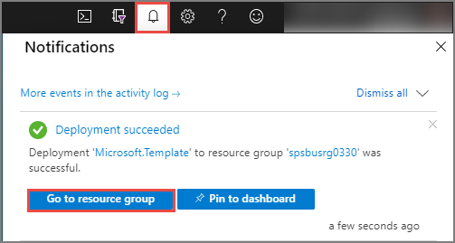
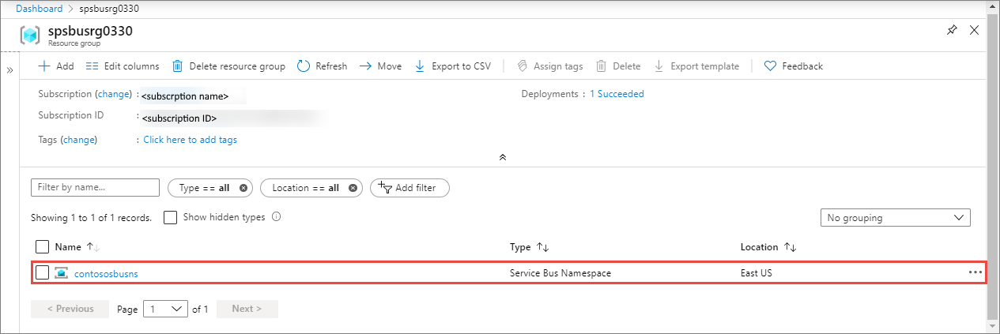
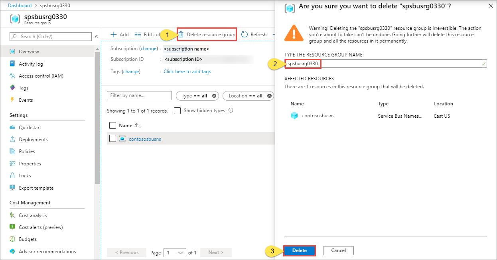

# Quickstart: Create a Service Bus namespace and a queue using an ARM template

This article shows how to use an Azure Resource Manager template (ARM template) that creates a Service Bus namespace and a queue within that namespace. The article explains how to specify which resources are deployed and how to define parameters that are specified when the deployment is executed. You can use this template for your own deployments, or customize it to meet your requirements.

[!INCLUDE [About Azure Resource Manager](../../includes/resource-manager-quickstart-introduction.md)]

If your environment meets the prerequisites and you're familiar with using ARM templates, select the **Deploy to Azure** button. The template will open in the Azure portal.

## Prerequisites

If you don't have an Azure subscription, [create a free account](https://azure.microsoft.com/free/) before you begin.

## Review the template

The template used in this quickstart is from [Azure Quickstart Templates](https://azure.microsoft.com/resources/templates/servicebus-create-queue/).

:::code language="json" source="~/quickstart-templates/quickstarts/microsoft.servicebus/servicebus-create-queue/azuredeploy.json":::

The resources defined in the template include:

- [**Microsoft.ServiceBus/namespaces**](/azure/templates/microsoft.servicebus/namespaces?pivots=deployment-language-arm-template)
- [**Microsoft.ServiceBus/namespaces/queues**](/azure/templates/microsoft.servicebus/namespaces/queues?pivots=deployment-language-arm-template)

> [!NOTE]
> The following ARM templates are available for download and deployment.
>
> - [Create a Service Bus namespace with queue and authorization rule](service-bus-resource-manager-namespace-auth-rule.md)
> - [Create a Service Bus namespace with topic and subscription](service-bus-resource-manager-namespace-topic.md)
> - [Create a Service Bus namespace](service-bus-resource-manager-namespace.md)
> - [Create a Service Bus namespace with topic, subscription, and rule](service-bus-resource-manager-namespace-topic-with-rule.md)

You can find more template from [Azure Quickstart Templates](https://azure.microsoft.com/resources/templates/?resourceType=Microsoft.Servicebus&pageNumber=1&sort=Popular)

## Deploy the template

With this template, you deploy a Service Bus namespace with a queue.

[Service Bus queues](service-bus-queues-topics-subscriptions.md#queues) offer First In, First Out (FIFO) message delivery to one or more competing consumers.

To run the deployment automatically, click the following button: Create a new resource group for the deployment so that you can easily clean up later.

## Validate the deployment

1. Select **Notifications** at the top to see the status of the deployment. Wait until the deployment succeeds. Then, select **Go to resource group** in the notification message to navigate to the page for the resource group that contains the Service Bus namespace.

    
2. Confirm that you see your Service Bus namespace in the list of resources.

    
3. Select the namespace from the list to see the **Service Bus Namespace** page.

## Clean up resources

1. In the Azure portal, navigate to the **Resource group** page for your resource group.
2. Select **Delete resource group** from the toolbar.
3. Type the name of the resource group, and select **Delete**.

    

## Next steps

See the following topic that shows how to create an authorization rule for the namespace/queue:

[Create a Service Bus authorization rule for namespace and queue using an ARM template](service-bus-resource-manager-namespace-auth-rule.md)

Learn how to manage these resources by viewing these articles:

- [Manage Service Bus with PowerShell](service-bus-manage-with-ps.md)
- [Manage Service Bus resources with the Service Bus Explorer](https://github.com/paolosalvatori/ServiceBusExplorer/releases)

[Authoring Azure Resource Manager templates]: ../azure-resource-manager/templates/syntax.md
[Service Bus namespace and queue template]: https://github.com/Azure/azure-quickstart-templates/blob/master/quickstarts/microsoft.servicebus/servicebus-create-queue/azuredeploy.json/
[Azure Quickstart Templates]: https://azure.microsoft.com/resources/templates/?term=service+bus
[Learn more about Service Bus queues]: service-bus-queues-topics-subscriptions.md
[Using Azure PowerShell with Azure Resource Manager]: ../azure-resource-manager/management/manage-resources-powershell.md
[Using the Azure CLI for Mac, Linux, and Windows with Azure Resource Management]: ../azure-resource-manager/management/manage-resources-cli.md
