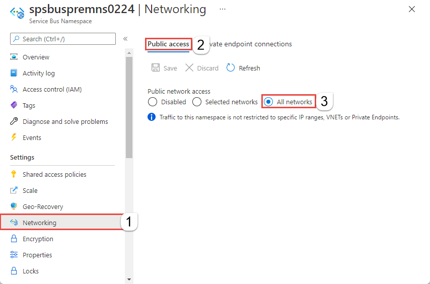
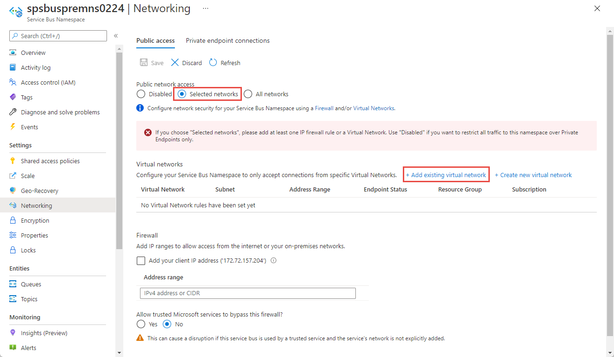
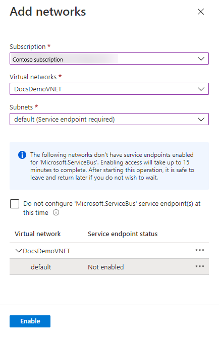
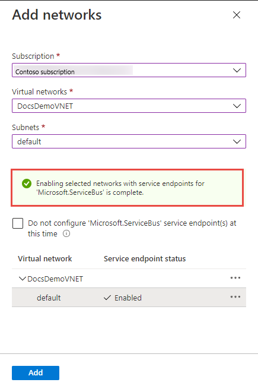
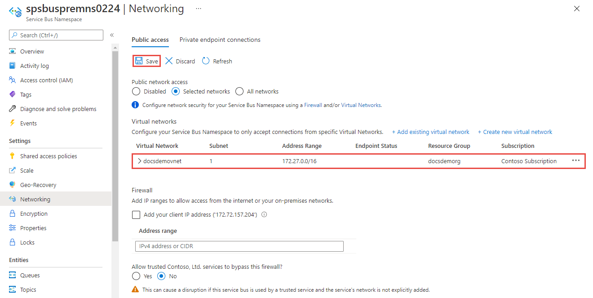

# Allow access to Azure Service Bus namespace from specific virtual networks
The integration of Service Bus with [Virtual Network (VNet) service endpoints][vnet-sep] enables secure access to messaging capabilities from workloads like virtual machines that are bound to virtual networks, with the network traffic path being secured on both ends.

Once configured to be bound to at least one virtual network subnet service endpoint, the respective Service Bus namespace will no longer accept traffic from anywhere but authorized virtual network(s) and, optionally, specific internet IP addresses. From the virtual network perspective, binding a Service Bus namespace to a service endpoint configures an isolated networking tunnel from the virtual network subnet to the messaging service.

The result is a private and isolated relationship between the workloads bound to the subnet and the respective Service Bus namespace, in spite of the observable network address of the messaging service endpoint being in a public IP range.

>[!WARNING]
> Implementing Virtual Networks integration can prevent other Azure services from interacting with Service Bus. As an exception, you can allow access to Service Bus resources from certain trusted services even when network service endpoints are enabled. For a list of trusted services, see [Trusted services](#trusted-microsoft-services).
>
> The following Microsoft services are required to be on a virtual network
> - Azure App Service
> - Azure Functions

Virtual Networks are supported only in [Premium tier](service-bus-premium-messaging.md) Service Bus namespaces. When using VNet service endpoints with Service Bus, you should not enable these endpoints in applications that mix standard and premium tier Service Bus namespaces. Because the standard tier does not support VNets. The endpoint is restricted to Premium tier namespaces only.

> [!IMPORTANT]
> Specify at least one IP rule or virtual network rule for the namespace to allow traffic only from the specified IP addresses or subnet of a virtual network. If there are no IP and virtual network rules, the namespace can be accessed over the public internet (using the access key).  

## Advanced security scenarios enabled by VNet integration 

Solutions that require tight and compartmentalized security, and where virtual network subnets provide the segmentation between the compartmentalized services, generally still need communication paths between services residing in those compartments.

Any immediate IP route between the compartments, including those carrying HTTPS over TCP/IP, carries the risk of exploitation of vulnerabilities from the network layer on up. Messaging services provide completely insulated communication paths, where messages are even written to disk as they transition between parties. Workloads in two distinct virtual networks that are both bound to the same Service Bus instance can communicate efficiently and reliably via messages, while the respective network isolation boundary integrity is preserved.
 
That means your security sensitive cloud solutions not only gain access to Azure industry-leading reliable and  scalable asynchronous messaging capabilities, but they can now use messaging to create communication paths between secure solution compartments that are inherently more secure than what is achievable with any peer-to-peer communication mode, including HTTPS and other TLS-secured socket protocols.

## Binding Service Bus to Virtual Networks

*Virtual network rules* are the firewall security feature that controls whether your Azure Service Bus server accepts connections from a particular virtual network subnet.

Binding a Service Bus namespace to a virtual network is a two-step process. You first need to create a **Virtual Network service endpoint** on a Virtual Network subnet and enable it for **Microsoft.ServiceBus** as explained in the [service endpoint overview][vnet-sep]. Once you have added the service endpoint, you bind the Service Bus namespace to it with a **virtual network rule**.

The virtual network rule is an association of the Service Bus namespace with a virtual network subnet. While the rule exists, all workloads bound to the subnet are granted access to the Service Bus namespace. Service Bus itself never establishes outbound connections, does not need to gain access, and is therefore never granted access to your subnet by enabling this rule.

> [!NOTE]
> Remember that a network service endpoint provides applications running in the virtual network the access to the Service Bus namespace. The virtual network controls the reachability of the endpoint, but not what operations can be done on Service Bus entities (queues, topics, or subscriptions). Use Azure Active Directory (Azure AD) to authorize operations that the applications can perform on the namespace and its entities. For more information, see [Authenticate and authorize an application with Azure AD to access Service Bus entities](authenticate-application.md).


## Use Azure portal
This section shows you how to use Azure portal to add a virtual network service endpoint. To limit access, you need to integrate the virtual network service endpoint for this Event Hubs namespace.

1. Navigate to your **Service Bus namespace** in the [Azure portal](https://portal.azure.com).
2. On the left menu, select **Networking** option under **Settings**.  

    > [!NOTE]
    > You see the **Networking** tab only for **premium** namespaces.  
    
    >[!WARNING]
    > If you select the **Selected networks** option and don't add at least one IP firewall rule or a virtual network on this page, the namespace can be accessed over public internet (using the access key).

    :::image type="content" source="./media/service-bus-ip-filtering/default-networking-page.png" alt-text="Networking page - default" lightbox="./media/service-bus-ip-filtering/default-networking-page.png":::
    
    If you select the **All networks** option, your Service Bus namespace accepts connections from any IP address. This default setting is equivalent to a rule that accepts the 0.0.0.0/0 IP address range. 

    
2. To restrict access to specific virtual networks, select the **Selected networks** option if it isn't already selected.
1. In the **Virtual Network** section of the page, select **+Add existing virtual network**. 

    
3. Select the virtual network from the list of virtual networks, and then pick the **subnet**. You have to enable the service endpoint before adding the virtual network to the list. If the service endpoint isn't enabled, the portal will prompt you to enable it.
   
   

4. You should see the following successful message after the service endpoint for the subnet is enabled for **Microsoft.ServiceBus**. Select **Add** at the bottom of the page to add the network. 

    

    > [!NOTE]
    > If you are unable to enable the service endpoint, you may ignore the missing virtual network service endpoint using the Resource Manager template. This functionality is not available on the portal.
6. Select **Save** on the toolbar to save the settings. Wait for a few minutes for the confirmation to show up in the portal notifications. The **Save** button should be disabled. 

    

    > [!NOTE]
    > For instructions on allowing access from specific IP addresses or ranges, see [Allow access from specific IP addresses or ranges](service-bus-ip-filtering.md).

[!INCLUDE [service-bus-trusted-services](../../includes/service-bus-trusted-services.md)]

## Use Resource Manager template
The following sample Resource Manager template adds a virtual network rule to an existing Service Bus namespace. For the network rule, it specifies the ID of a subnet in a virtual network. 

The ID is a fully qualified Resource Manager path for the virtual network subnet. For example, `/subscriptions/{id}/resourceGroups/{rg}/providers/Microsoft.Network/virtualNetworks/{vnet}/subnets/default` for the default subnet of a virtual network.

When adding virtual network or firewalls rules, set the value of `defaultAction` to `Deny`.

Template:

```json
{
    "$schema": "https://schema.management.azure.com/schemas/2015-01-01/deploymentTemplate.json#",
    "contentVersion": "1.0.0.0",
    "parameters": {
      "servicebusNamespaceName": {
        "type": "string",
        "metadata": {
          "description": "Name of the Service Bus namespace"
        }
      },
      "virtualNetworkName": {
        "type": "string",
        "metadata": {
          "description": "Name of the Virtual Network Rule"
        }
      },
      "subnetName": {
        "type": "string",
        "metadata": {
          "description": "Name of the Virtual Network Sub Net"
        }
      },
      "location": {
        "type": "string",
        "metadata": {
          "description": "Location for Namespace"
        }
      }
    },
    "variables": {
      "namespaceNetworkRuleSetName": "[concat(parameters('servicebusNamespaceName'), concat('/', 'default'))]",
      "subNetId": "[resourceId('Microsoft.Network/virtualNetworks/subnets/', parameters('virtualNetworkName'), parameters('subnetName'))]"
    },
    "resources": [
      {
        "apiVersion": "2018-01-01-preview",
        "name": "[parameters('servicebusNamespaceName')]",
        "type": "Microsoft.ServiceBus/namespaces",
        "location": "[parameters('location')]",
        "sku": {
          "name": "Premium",
          "tier": "Premium"
        },
        "properties": { }
      },
      {
        "apiVersion": "2017-09-01",
        "name": "[parameters('virtualNetworkName')]",
        "location": "[parameters('location')]",
        "type": "Microsoft.Network/virtualNetworks",
        "properties": {
          "addressSpace": {
            "addressPrefixes": [
              "10.0.0.0/23"
            ]
          },
          "subnets": [
            {
              "name": "[parameters('subnetName')]",
              "properties": {
                "addressPrefix": "10.0.0.0/23",
                "serviceEndpoints": [
                  {
                    "service": "Microsoft.ServiceBus"
                  }
                ]
              }
            }
          ]
        }
      },
      {
        "apiVersion": "2018-01-01-preview",
        "name": "[variables('namespaceNetworkRuleSetName')]",
        "type": "Microsoft.ServiceBus/namespaces/networkruleset",
        "dependsOn": [
          "[concat('Microsoft.ServiceBus/namespaces/', parameters('servicebusNamespaceName'))]"
        ],
        "properties": {
          "virtualNetworkRules": 
          [
            {
              "subnet": {
                "id": "[variables('subNetId')]"
              },
              "ignoreMissingVnetServiceEndpoint": false
            }
          ],
          "ipRules":[<YOUR EXISTING IP RULES>],
          "trustedServiceAccessEnabled": false,          
          "defaultAction": "Deny"
        }
      }
    ],
    "outputs": { }
  }
```

To deploy the template, follow the instructions for [Azure Resource Manager][lnk-deploy].

> [!IMPORTANT]
> If there are no IP and virtual network rules, all the traffic flows into the namespace even if you set the `defaultAction` to `deny`.  The namespace can be accessed over the public internet (using the access key). Specify at least one IP rule or virtual network rule for the namespace to allow traffic only from the specified IP addresses or subnet of a virtual network.  

## Next steps

For more information about virtual networks, see the following links:

- [Azure virtual network service endpoints][vnet-sep]
- [Azure Service Bus IP filtering][ip-filtering]

[vnet-sep]: ../virtual-network/virtual-network-service-endpoints-overview.md
[lnk-deploy]: ../azure-resource-manager/templates/deploy-powershell.md
[ip-filtering]: service-bus-ip-filtering.md
