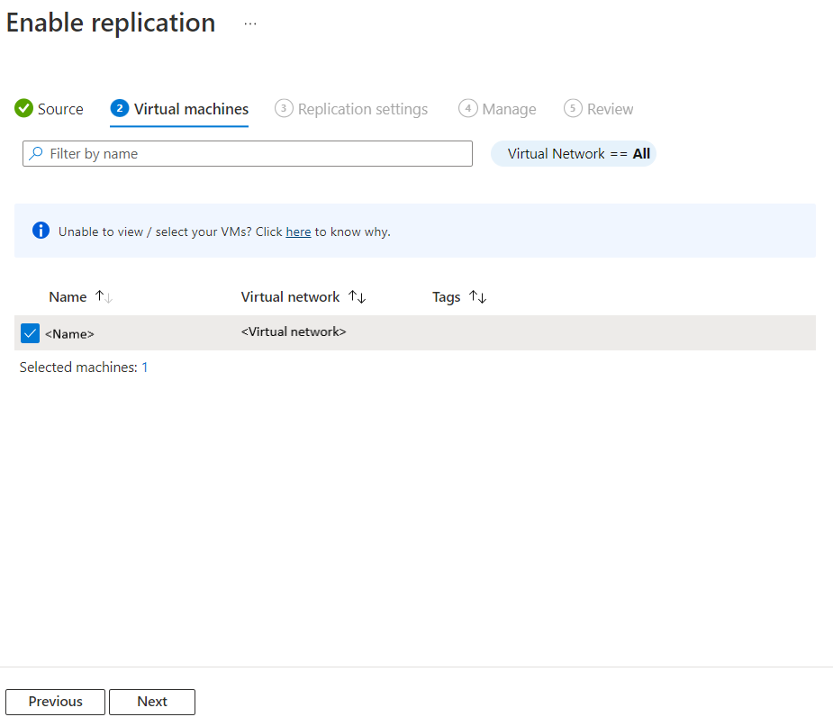
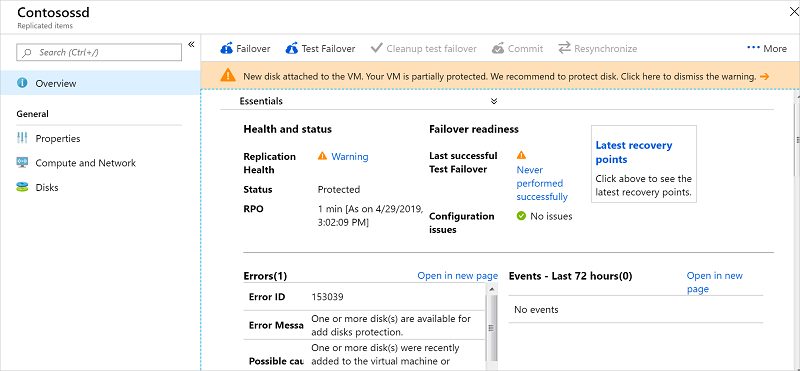
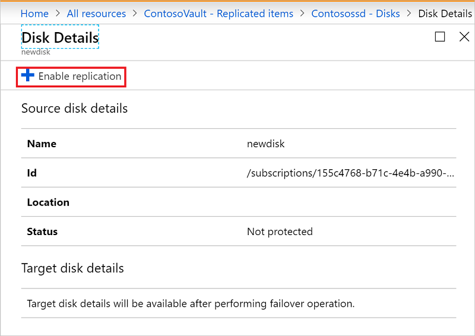

# Replicate Azure VMs to another Azure region

This article describes how to enable replication of Azure VMs, from one Azure region to another.

## Before you start

This article assumes that you've prepared for Site Recovery deployment, as described in the [Azure to Azure disaster recovery tutorial](azure-to-azure-tutorial-enable-replication.md).

Prerequisites should be in place, and you should have created a Recovery Services vault.

## Enable replication

Use the following procedure to replicate Azure VMs to another Azure region. As an example, primary Azure region is East Asia, and the secondary is Southeast Asia.

1. In the vault > **Site Recovery** page, under **Azure virtual machines**, select **Enable replication**.
1. In the **Enable replication** page, under **Source**, do the following:
   - **Region**: Select the Azure region from where you want to protect your VMs. 
   For example, the source location is *East Asia*.
     >[!NOTE]
     >For cross-regional disaster recovery, the source location should be different from the Recovery Services Vault and its Resource Group's location. However, it can be the same as any of them for zonal disaster recovery.
   - **Subscription**: Select the subscription to which your source VMs belong. This can be any subscription within the same Azure Active Directory tenant where your recovery services vault exists.
   - **Resource group**: Select the resource group to which your source virtual machines belong. All the VMs in the selected resource group are listed for protection in the next step.
   - **Virtual machine deployment model**: Select Azure deployment model of the source machines.
   - **Disaster recovery between availability zones**: Select **Yes** if you want to perform zonal disaster recovery on virtual machines.

     :::image type="fields needed to configure replication" source="./media/azure-to-azure-how-to-enable-replication/source.png" alt-text="Screenshot that highlights the fields needed to configure replication.":::
1. Select **Next**.
1. In **Virtual machines**, select each VM that you want to replicate. You can only select machines for which replication can be enabled. You can select up to ten VMs. Then select **Next**.

   

1. In **Replication settings**, you can configure the following settings:
    1. Under **Location and Resource group**,
       - **Target location**: Select the location where your source virtual machine data must be replicated. Depending on the location of selected machines, Site Recovery will provide you the list of suitable target regions. We recommend that you keep the target location the same as the Recovery Services vault location.
       - **Target subscription**: Select the target subscription used for disaster recovery. By default, the target subscription will be same as the source subscription.
       - **Target resource group**: Select the resource group to which all your replicated virtual machines belong.
           - By default, Site Recovery creates a new resource group in the target region with an *asr* suffix in the name.
           - If the resource group created by Site Recovery already exists, it's reused.
           - You can customize the resource group settings.
           - The location of the target resource group can be any Azure region, except the region in which the source VMs are hosted.
           
            >[!Note]
            > You can also create a new target resource group by selecting **Create new**. 
        
    1. Under **Network**,
       - **Failover virtual network**: Select the failover virtual network.
         >[!Note]
         > You can also create a new failover virtual network by selecting **Create new**.
       - **Failover subnet**: Select the failover subnet.
    1. **Storage**: By default, Site Recovery creates a new target storage account by mimicking your source VM storage configuration. If a storage account already exists, it's reused.
    1. **Availability options**: By default, Site Recovery creates a new availability option in the target region. The name has the *asr* suffix. If an availability set that was created by Site Recovery already exists, it's reused.
        >[!NOTE]
        >- While configuring the target availability sets, configure different availability sets for differently sized VMs.
        >- You cannot change the availability type - single instance, availability set or availability zone, after you enable replication. You must disable and enable replication to change the availability type.     
    1. **Capacity reservation**: Capacity Reservation lets you purchase capacity in the recovery region, and then failover to that capacity. You can either create a new Capacity Reservation Group or use an existing one. For more information, see [how capacity reservation works](https://learn.microsoft.com/azure/virtual-machines/capacity-reservation-overview).
    
     :::image type="enable replication parameters" source="./media/azure-to-azure-how-to-enable-replication/enable-vm-replication.png" alt-text="Screenshot that displays the enable replication parameters.":::

1. Select **Next**.
1. In **Manage**, do the following:
    1. Under **Replication policy**,
       - **Replication policy**: Select the replication policy. Defines the settings for recovery point retention history and app-consistent snapshot frequency. By default, Site Recovery creates a new replication policy with default settings of 24 hours for recovery point retention and 60 minutes for app-consistent snapshot frequency.
       - **Replication group**: Create replication group.
    1. Under **Extension settings**, 
       - Select **Update settings** and **Automation account**.
   
   :::image type="manage" source="./media/azure-to-azure-how-to-enable-replication/manage.png" alt-text="Screenshot that displays the manage tab.":::

1. Select **Next**
1. In **Review**, review the VM settings and select **Enable replication**.

   :::image type="review" source="./media/azure-to-azure-how-to-enable-replication/review.png" alt-text="Screenshot that displays the review tab.":::

1.  After the VMs are enabled for replication, you can check the status of VM health under **Replicated items**. The time taken for initial replication depends on various factors such as the disk size, used storage on the disks, etc. Data transfer happens at ~23% of the disk throughput. Initial replication creates a snapshot of the disk and transfers that snapshot.

### Enable replication for added disks

If you add disks to an Azure VM for which replication is enabled, the following occurs:
-	Replication health for the VM shows a warning, and a note informs telling you that one or more disks are available for protection.
-	If you enable protection for the added disks, the warning will disappear after the initial replication of the disk.
-	If you choose not to enable replication for the disk, you can select to dismiss the warning.

    

To enable replication for an added disk, do the following:

1.	In the vault > **Replicated Items**, click the VM to which you added the disk.
1.	Click **Disks**, and then select the data disk for which you want to enable replication (these disks have a **Not protected** status).
1.	In **Disk Details**, click **Enable replication**.

    

After the enable replication job runs, and the initial replication finishes, the replication health warning for the disk issue is removed.

## Customize target resources

You can modify the default target settings used by Site Recovery.

1. Click **Customize:** to modify replication settings.
1. In **Multi-VM consistency**, select the VMs that you want to replicate together.
    - All the machines in a replication group will have shared crash consistent and app-consistent recovery points when failed over.
    - Enabling multi-VM consistency can impact workload performance (as it is CPU intensive). It should only be enabled if machines are running the same workload, and you need consistency across multiple machines.
    - For example, if an application has 2 SQL Server virtual machines and two web servers, then you should add only the SQL Server VMs to a replication group.
    - You can choose to have a maximum of 16 VMs in a replication group.
    - If you enable multi-VM consistency, machines in the replication group communicate with each other over port 20004.
    - Ensure there's no firewall appliance blocking the internal communication between the VMs over port 20004.
    - If you want Linux VMs to be part of a replication group, ensure the outbound traffic on port 20004 is manually opened according to guidance for the specific Linux version.

1. Click **View or Edit Capacity Reservation group assignment** to modify the capacity reservation settings. On triggering Failover, the new VM will be created in the assigned Capacity Reservation Group.

    Capacity Reservation lets you purchase capacity in the recovery region, and then failover to that capacity. You can either create a new Capacity Reservation Group, or use an existing one. For more information on how capacity reservation works, [read here](../virtual-machines/capacity-reservation-overview.md).

   
1. Click **Create target resource** > **Enable Replication**.
1. After the VMs are enabled for replication, you can check the status of VM health under **Replicated items**

>[!NOTE]
>
> - During initial replication the status might take some time to refresh, without progress. Click the **Refresh** button, to get the latest status.
> - If a recovery point has not been generated in last 60 minutes, the replication health of the virtual machine will become critical.

## Next steps

[Learn more](site-recovery-test-failover-to-azure.md) about running a test failover.