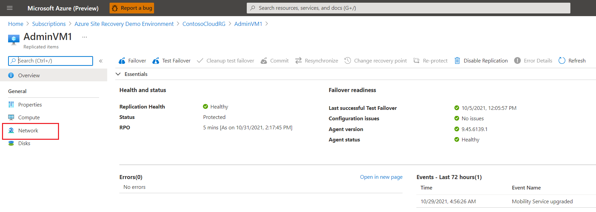

# Configure Failover of Multiple IP Addresses with Azure Site Recovery

Every NIC attached to a VM has one or more IP configurations associated to it. Each configuration is assigned one static or dynamic private IP address. Each configuration may also have one public IP address resource associated to it. A public IP address resource has either a dynamic or static public IP address assigned to it. To learn more about [IP addresses in Azure](../virtual-network/ip-services/public-ip-addresses.md), read the IP addresses in Azure article.

Today, Site Recovery automatically configures the failover of the Primary IP Configuration. This article describes how you can configure failover of Secondary IP Configs with Site Recovery. Please note that this is supported only for Azure VMs.

## Configure Secondary IP Address Failover via Azure Portal

Site Recovery automatically configures the failover of your Primary IP Configuration when you Enable Replication for the VM. Secondary IP Configurations need to be manually configured after the Enable Replication completes. For this you need a protected VM that has one or more Secondary IP Configurations.

Follow the steps as outlined:
1. Navigate to the **Network** blade on the Replicated Items page.

2. You will see the following highlighted text.  Click on **Edit** to modify it.
 

3. Click on "+ IP Configurations". You will see two options, Either add all IP Configurations, or selectively add IP Configurations.

4. On clicking **Add all secondary IP Configurations**, all of them will appear in the grid below, and then you can configure them as you like.

5. Alternatively, on clicking **Select and add secondary IP Configurations**, a blade will open where you can pick and add IP Configurations you'd like to configure for failover.

Now, for each IP Configuration that you've added, you can configure the values for Private IP, Public IP, and Backend Pool for Failover and Test Failover separately. After you've done it all, don't forget to Save changes.

## Next steps
- Learn more about [Traffic Manager with Azure Site Recovery](../site-recovery/concepts-traffic-manager-with-site-recovery.md)
- Learn more about Traffic Manager [routing methods](../traffic-manager/traffic-manager-routing-methods.md).
- Learn more about [recovery plans](site-recovery-create-recovery-plans.md) to automate application failover.
