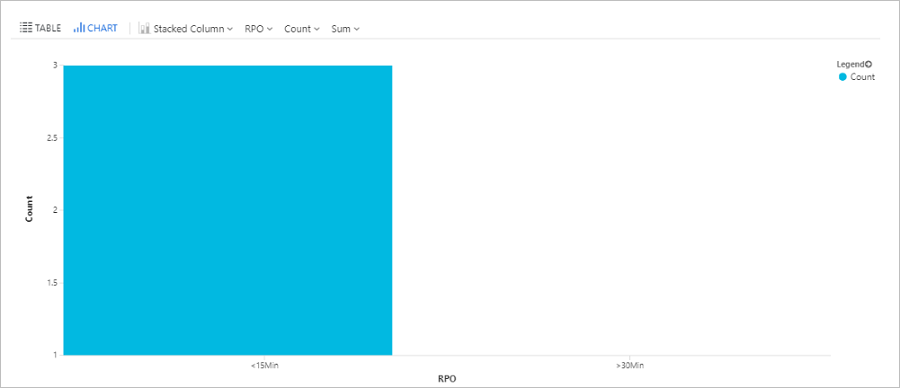
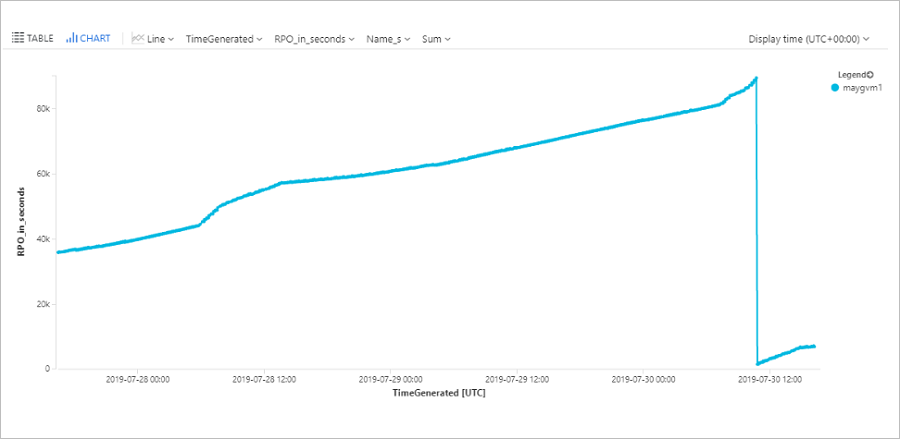
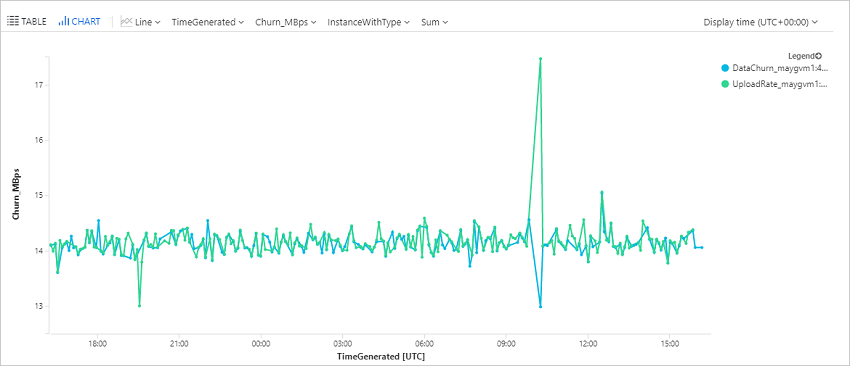

# Monitor Site Recovery with Azure Monitor Logs

This article describes how to monitor machines replicated by Azure [Site Recovery](site-recovery-overview.md), using [Azure Monitor Logs](../azure-monitor/logs/data-platform-logs.md), and [Log Analytics](../azure-monitor/logs/log-query-overview.md).

Azure Monitor Logs provide a log data platform that collects activity and resource logs, along with other monitoring data. Within Azure Monitor Logs, you use Log Analytics to write and test log queries, and to interactively analyze log data. You can visualize and query log results, and configure alerts to take actions based on monitored data.

For Site Recovery, you can use Azure Monitor Logs to help you do the following:

- **Monitor Site Recovery health and status**. For example, you can monitor replication health, test failover status, Site Recovery events, recovery point objectives (RPOs) for protected machines, and disk/data change rates.
- **Set up alerts for Site Recovery**. For example, you can configure alerts for machine health, test failover status, or Site Recovery job status.

Using Azure Monitor Logs with Site Recovery is supported for **Azure to Azure** replication, and **VMware VM/physical server to Azure** replication.

> [!NOTE]
> To get the churn data logs and upload rate logs for VMware and physical machines, you need to install a Microsoft monitoring agent on the Process Server. This agent sends the logs of the replicating machines to the workspace. This capability is available only for 9.30 mobility agent version onwards.

## Before you start

Here's what you need:

- At least one machine protected in a Recovery Services vault.
- A Log Analytics workspace to store Site Recovery logs. [Learn about](../azure-monitor/logs/quick-create-workspace.md) setting up a workspace.
- A basic understanding of how to write, run, and analyze log queries in Log Analytics. [Learn more](../azure-monitor/logs/log-analytics-tutorial.md).

We recommend that you review [common monitoring questions](monitoring-common-questions.md) before you start.

## Configure Site Recovery to send logs

1. In the vault, click **Diagnostic settings** > **Add diagnostic setting**.

    

2. In **Diagnostic settings**, specify a name, and check the box **Send to Log Analytics**.
3. Select the Azure Monitor Logs subscription, and the Log Analytics workspace.
4. Select **Azure Diagnostics** in the toggle.
5. From the log list, select all the logs with the prefix **AzureSiteRecovery**. Then click **OK**.

    

The Site Recovery logs start to feed into a table (**AzureDiagnostics**) in the selected workspace.

## Configure Microsoft monitoring agent on the Process Server to send churn and upload rate logs

You can capture the data churn rate information and source data upload rate information for your VMware/physical machines at on-premises. To enable this, a Microsoft monitoring agent is required to be installed on the Process Server.

1. Go to the Log Analytics workspace and click on **Advanced Settings**.
2. Click on **Connected Sources** page and further select **Windows Servers**.
3. Download the Windows Agent (64 bit) on the Process Server. 
4. [Obtain the workspace ID and key](../azure-monitor/agents/agent-windows.md#workspace-id-and-key)
5. [Configure agent to use TLS 1.2](../azure-monitor/agents/agent-windows.md#configure-agent-to-use-tls-12)
6. [Complete the agent installation](../azure-monitor/agents/agent-windows.md#install-agent-using-setup-wizard) by providing the obtained workspace ID and key.
7. Once the installation is complete, go to Log Analytics workspace and click on **Advanced Settings**. Go to the **Data** page and further click on **Windows Performance Counters**. 
8. Click on **'+'** to add the following two counters with sample interval of 300 seconds:

    - ASRAnalytics(*)\SourceVmChurnRate
    - ASRAnalytics(*)\SourceVmThrpRate

The churn and upload rate data will start feeding into the workspace.


## Query the logs - examples

You retrieve data from logs using log queries written with the [Kusto query language](../azure-monitor/logs/get-started-queries.md). This section provides a few examples of common queries you might use for Site Recovery monitoring.

> [!NOTE]
> Some of the examples use **replicationProviderName_s** set to **A2A**. This retrieves Azure VMs that are replicated to a secondary Azure region using Site Recovery. In these examples, you can replace **A2A** with **InMageAzureV2**, if you want to retrieve on-premises VMware VMs or physical servers that are replicated to Azure using Site Recovery.


### Query replication health

This query plots a pie chart for the current replication health of all protected Azure VMs, broken down into three states: Normal, Warning, or Critical.

```
AzureDiagnostics  
| where replicationProviderName_s == "A2A"   
| where isnotempty(name_s) and isnotnull(name_s)  
| summarize hint.strategy=partitioned arg_max(TimeGenerated, *) by name_s  
| project name_s , replicationHealth_s  
| summarize count() by replicationHealth_s  
| render piechart   
```
### Query Mobility service version

This query plots a pie chart for Azure VMs replicated with Site Recovery, broken down by the version of the Mobility agent that they're running.

```
AzureDiagnostics  
| where replicationProviderName_s == "A2A"   
| where isnotempty(name_s) and isnotnull(name_s)  
| summarize hint.strategy=partitioned arg_max(TimeGenerated, *) by name_s  
| project name_s , agentVersion_s  
| summarize count() by agentVersion_s  
| render piechart 
```

### Query RPO time

This query plots a bar chart of Azure VMs replicated with Site Recovery, broken down by recovery point objective (RPO): Less than 15 minutes, between 15-30 minutes, more than 30 minutes.

```
AzureDiagnostics 
| where replicationProviderName_s == "A2A"   
| where isnotempty(name_s) and isnotnull(name_s)  
| extend RPO = case(rpoInSeconds_d <= 900, "<15Min",   
rpoInSeconds_d <= 1800, "15-30Min", ">30Min")  
| summarize hint.strategy=partitioned arg_max(TimeGenerated, *) by name_s  
| project name_s , RPO  
| summarize Count = count() by RPO  
| render barchart 
```



### Query Site Recovery jobs

This query retrieves all Site Recovery jobs (for all disaster recovery scenarios), triggered in the last 72 hours, and their completion state.

```
AzureDiagnostics  
| where Category == "AzureSiteRecoveryJobs"  
| where TimeGenerated >= ago(72h)   
| project JobName = OperationName , VaultName = Resource , TargetName = affectedResourceName_s, State = ResultType  
```

### Query Site Recovery events

This query retrieves all Site Recovery events (for all disaster recovery scenarios) raised in the last 72 hours, along with their severity. 

```
AzureDiagnostics   
| where Category == "AzureSiteRecoveryEvents"   
| where TimeGenerated >= ago(72h)   
| project AffectedObject=affectedResourceName_s , VaultName = Resource, Description_s = healthErrors_s , Severity = Level  
```

### Query test failover state (pie chart)

This query plots a pie chart for the test failover status of Azure VMs replicated with Site Recovery.

```
AzureDiagnostics  
| where replicationProviderName_s == "A2A"   
| where isnotempty(name_s) and isnotnull(name_s)  
| where isnotempty(failoverHealth_s) and isnotnull(failoverHealth_s)  
| summarize hint.strategy=partitioned arg_max(TimeGenerated, *) by name_s  
| project name_s , Resource, failoverHealth_s  
| summarize count() by failoverHealth_s  
| render piechart 
```

### Query test failover state (table)

This query plots a table for the test failover status of Azure VMs replicated with Site Recovery.

```
AzureDiagnostics   
| where replicationProviderName_s == "A2A"   
| where isnotempty(name_s) and isnotnull(name_s)   
| where isnotempty(failoverHealth_s) and isnotnull(failoverHealth_s)   
| summarize hint.strategy=partitioned arg_max(TimeGenerated, *) by name_s   
| project VirtualMachine = name_s , VaultName = Resource , TestFailoverStatus = failoverHealth_s 
```

### Query machine RPO

This query plots a trend graph that tracks the RPO  of a specific Azure VM (ContosoVM123) for the last 72 hours.

```
AzureDiagnostics   
| where replicationProviderName_s == "A2A"   
| where TimeGenerated > ago(72h)  
| where isnotempty(name_s) and isnotnull(name_s)   
| where name_s == "ContosoVM123"  
| project TimeGenerated, name_s , RPO_in_seconds = rpoInSeconds_d   
| render timechart 
```


### Query data change rate (churn) and upload rate for an Azure VM

This query plots a trend graph for a specific Azure VM (ContosoVM123), that represents the data change rate (Write Bytes per Second), and data upload rate. 

```
AzureDiagnostics   
| where Category in ("AzureSiteRecoveryProtectedDiskDataChurn", "AzureSiteRecoveryReplicationDataUploadRate")   
| extend CategoryS = case(Category contains "Churn", "DataChurn",   
Category contains "Upload", "UploadRate", "none")  
| extend InstanceWithType=strcat(CategoryS, "_", InstanceName_s)   
| where TimeGenerated > ago(24h)   
| where InstanceName_s startswith "ContosoVM123"   
| project TimeGenerated , InstanceWithType , Churn_MBps = todouble(Value_s)/1048576   
| render timechart  
```


### Query data change rate (churn) and upload rate for a VMware or physical machine

> [!Note]
> Ensure you set up the monitoring agent on the Process Server to fetch these logs. Refer [steps to configure monitoring agent](#configure-microsoft-monitoring-agent-on-the-process-server-to-send-churn-and-upload-rate-logs).

This query plots a trend graph for a specific disk **disk0** of a replicated item **win-9r7sfh9qlru**, that represents the data change rate (Write Bytes per Second), and data upload rate. You can find the disk name on **Disks** blade of the replicated item in the recovery services vault. Instance name to be used in the query is DNS name of the machine followed by _ and disk name as in this example.

```
Perf
| where ObjectName == "ASRAnalytics"
| where InstanceName contains "win-9r7sfh9qlru_disk0"
| where TimeGenerated >= ago(4h) 
| project TimeGenerated ,CounterName, Churn_MBps = todouble(CounterValue)/5242880 
| render timechart
```
Process Server pushes this data every 5 minutes to the Log Analytics workspace. These data points represent the average computed for 5 minutes.

### Query disaster recovery summary (Azure to Azure)

This query plots a summary table for Azure VMs replicated to a secondary Azure region.  It shows VM name, replication and protection status, RPO, test failover status, Mobility agent version, any active replication errors, and the source location.

```
AzureDiagnostics 
| where replicationProviderName_s == "A2A"   
| where isnotempty(name_s) and isnotnull(name_s)   
| summarize hint.strategy=partitioned arg_max(TimeGenerated, *) by name_s   
| project VirtualMachine = name_s , Vault = Resource , ReplicationHealth = replicationHealth_s, Status = protectionState_s, RPO_in_seconds = rpoInSeconds_d, TestFailoverStatus = failoverHealth_s, AgentVersion = agentVersion_s, ReplicationError = replicationHealthErrors_s, SourceLocation = primaryFabricName_s 
```

### Query disaster recovery summary (VMware/physical servers)

This query plots a summary table for VMware VMs and physical servers replicated to Azure.  It shows  machine name, replication and protection status, RPO, test failover status, Mobility agent version, any active replication errors, and the relevant process server.

```
AzureDiagnostics  
| where replicationProviderName_s == "InMageAzureV2"   
| where isnotempty(name_s) and isnotnull(name_s)   
| summarize hint.strategy=partitioned arg_max(TimeGenerated, *) by name_s   
| project VirtualMachine = name_s , Vault = Resource , ReplicationHealth = replicationHealth_s, Status = protectionState_s, RPO_in_seconds = rpoInSeconds_d, TestFailoverStatus = failoverHealth_s, AgentVersion = agentVersion_s, ReplicationError = replicationHealthErrors_s, ProcessServer = processServerName_g  
```

## Set up alerts - examples

You can set up Site Recovery alerts based on Azure Monitor data. [Learn more](../azure-monitor/alerts/alerts-log.md#create-a-log-alert-rule-with-the-azure-portal) about setting up log alerts. 

> [!NOTE]
> Some of the examples use **replicationProviderName_s** set to **A2A**. This sets alerts for Azure VMs that are replicated to a secondary Azure region. In these examples, you can replace **A2A** with **InMageAzureV2** if you want to set alerts for on-premises VMware VMs or physical servers replicated to Azure.

### Multiple machines in a critical state

Set up an alert if more than 20 replicated Azure VMs go into a Critical state.

```
AzureDiagnostics   
| where replicationProviderName_s == "A2A"   
| where replicationHealth_s == "Critical"  
| where isnotempty(name_s) and isnotnull(name_s)   
| summarize hint.strategy=partitioned arg_max(TimeGenerated, *) by name_s   
| summarize count() 
```
For the alert, set **Threshold value** to 20.

### Single machine in a critical state

Set up an alert if a specific replicated Azure VM goes into a Critical state.

```
AzureDiagnostics   
| where replicationProviderName_s == "A2A"   
| where replicationHealth_s == "Critical"  
| where name_s == "ContosoVM123"  
| where isnotempty(name_s) and isnotnull(name_s)   
| summarize hint.strategy=partitioned arg_max(TimeGenerated, *) by name_s   
| summarize count()  
```
For the alert, set **Threshold value** to 1.

### Multiple machines exceed RPO

Set up an alert if the RPO for more than 20 Azure VMs exceeds 30 minutes.
```
AzureDiagnostics   
| where replicationProviderName_s == "A2A"   
| where isnotempty(name_s) and isnotnull(name_s)   
| where rpoInSeconds_d > 1800  
| summarize hint.strategy=partitioned arg_max(TimeGenerated, *) by name_s   
| project name_s , rpoInSeconds_d   
| summarize count()  
```
For the alert, set **Threshold value** to 20.

### Single machine exceeds RPO

Set up an alert if the RPO for a single Azure VM exceeds 30 minutes.

```
AzureDiagnostics   
| where replicationProviderName_s == "A2A"   
| where isnotempty(name_s) and isnotnull(name_s)   
| where name_s == "ContosoVM123"  
| where rpoInSeconds_d > 1800  
| summarize hint.strategy=partitioned arg_max(TimeGenerated, *) by name_s   
| project name_s , rpoInSeconds_d   
| summarize count()  
```
For the alert, set **Threshold value** to 1.

### Test failover for multiple machines exceeds 90 days

Set up an alert if the last successful test failover was more than 90 days, for more than 20 VMs. 

```
AzureDiagnostics  
| where replicationProviderName_s == "A2A"   
| where Category == "AzureSiteRecoveryReplicatedItems"  
| where isnotempty(name_s) and isnotnull(name_s)   
| where lastSuccessfulTestFailoverTime_t <= ago(90d)   
| summarize hint.strategy=partitioned arg_max(TimeGenerated, *) by name_s   
| summarize count()  
```
For the alert, set **Threshold value** to 20.

### Test failover for single machine exceeds 90 days

Set up an alert if the last successful test failover for a specific VM was more than 90 days ago.
```
AzureDiagnostics  
| where replicationProviderName_s == "A2A"   
| where Category == "AzureSiteRecoveryReplicatedItems"  
| where isnotempty(name_s) and isnotnull(name_s)   
| where lastSuccessfulTestFailoverTime_t <= ago(90d)   
| where name_s == "ContosoVM123"  
| summarize hint.strategy=partitioned arg_max(TimeGenerated, *) by name_s   
| summarize count()  
```
For the alert, set **Threshold value** to 1.

### Site Recovery job fails

Set up an alert if a Site Recovery job (in this case the Reprotect job) fails for any Site Recovery scenario, during the last day. 
```
AzureDiagnostics   
| where Category == "AzureSiteRecoveryJobs"   
| where OperationName == "Reprotect"  
| where ResultType == "Failed"  
| summarize count()  
```

For the alert, set **Threshold value** to 1, and **Period** to 1440 minutes, to check failures in the last day.

## Next steps

[Learn about](site-recovery-monitor-and-troubleshoot.md) inbuilt Site Recovery monitoring.