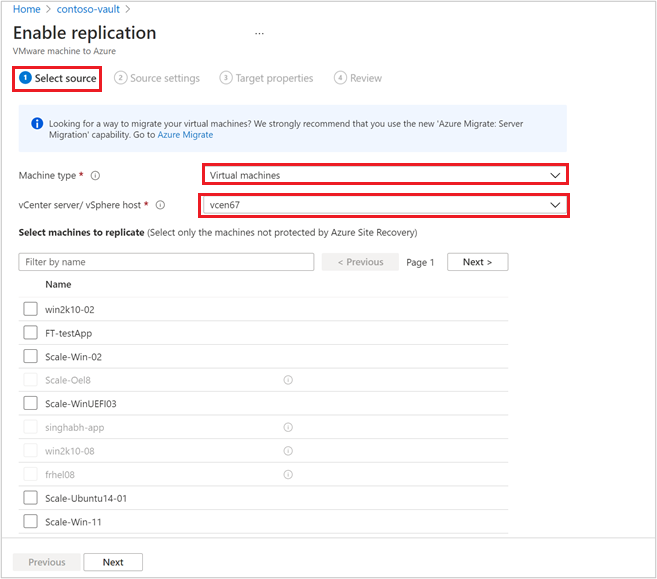
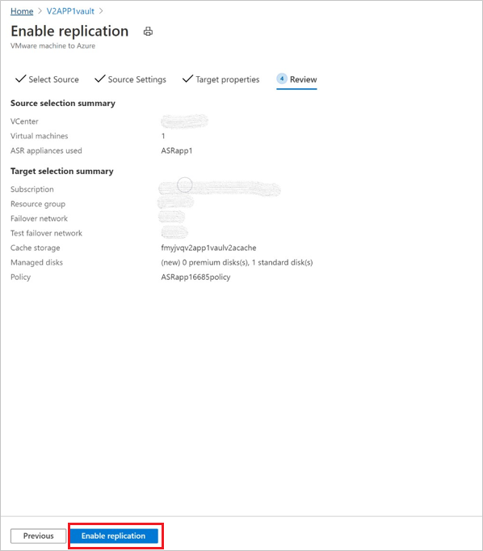

# Quickstart: Set up disaster recovery to Azure for on-premises VMware VMs - Modernized

This quickstart describes how to enable replication for on-premises VMware VMs, for disaster recovery to Azure using the Modernized VMware/Physical machine protection experience using [Azure Site Recovery](site-recovery-overview.md).

## Before you start

This article assumes that you've already set up disaster recovery for on-premises VMware VMs. If you haven't, follow the [set up disaster recovery to Azure for on-premises VMware VMs - Modernized](./vmware-azure-set-up-replication-tutorial-modernized.md).

## Prerequisites

To complete this tutorial, ensure the following are completed:

- Ensure that the [pre-requisites](vmware-physical-azure-support-matrix.md) across storage and networking are met.
- [Prepare an Azure account](./vmware-azure-set-up-replication-tutorial-modernized.md#grant-required-permissions-to-the-vault)
- [Create a recovery Services vault](./quickstart-create-vault-template.md?tabs=CLI)

## Enable replication of VMware VMs

After an Azure Site Recovery replication appliance is added to a vault, you can get started with protecting the machines.

Follow these steps to enable replication:

1. Select **Site Recovery** under **Getting Started** section.
1. Select **Enable Replication (Modernized)** under the VMware section.

1. Choose the machine type you want to protect through Azure Site Recovery.

   > [!NOTE]
   > In Modernized, the support is limited to virtual machines.

   

3. After choosing the machine type, select the vCenter server added to Azure Site Recovery replication appliance, registered in this vault.

4.	Search the source machine name to protect it. To review the selected machines, select **Selected resources**.

5. After you select the list of VMs, select **Next** to proceed to source settings. Here, select the [replication appliance](#appliance-selection) and VM credentials. These credentials will be used to push mobility agent on the machine by Azure Site Recovery replication appliance to complete enabling Azure Site Recovery. Ensure accurate credentials are chosen.

   >[!NOTE]
   >For Linux OS, ensure to provide the root credentials. For Windows OS, a user account with admin privileges should be added. These credentials will be used to push Mobility Service on to the source machine during enable replication operation.

   

6. Select **Next** to provide target region properties. By default, Vault subscription and Vault resource group are selected. You can choose a subscription and resource group of your choice. Your source machines will be deployed in this subscription and resource group when you failover in the future.

   

7. Next, you can select an existing Azure network or create a new target network to be used during failover. If you select **Create new**, you will be redirected to create virtual network context blade and asked to provide address space and subnet details. This network will be created in the target subscription and target resource group selected in the previous step.

8. Then, provide the test failover network details.

   > [!NOTE]
   > Ensure that the test failover network is different from the failover network. This is to make sure the failover network is readily available in case of an actual disaster.

9. Select the storage.

    - Cache storage account:
      Now, choose the cache storage account which Azure Site Recovery uses for staging purposes - caching and storing logs before writing the changes on to the managed disks.

      By default, a new LRS v1 type storage account will be created by Azure Site Recovery for the first enable replication operation in a vault. For the next operations, the same cache storage account will be re-used.
    -  Managed disks

       By default, Standard HDD managed disks are created in Azure. You can customize the type of Managed disks by Selecting **Customize**. Choose the type of disk based on the business requirement. Ensure [appropriate disk type is chosen](../virtual-machines/disks-types.md#disk-type-comparison) based on the IOPS of the source machine disks. For pricing information, see managed disk pricing document [here](https://azure.microsoft.com/pricing/details/managed-disks/).

       >[!NOTE]
       > If Mobility Service is installed manually before enabling replication, you can change the type of managed disk, at a disk level. Else, by default, one managed disk type can be chosen at a machine level

10. Create a new replication policy if needed.

     A default replication policy gets created under the vault with 3 days recovery point retention and app-consistent recovery points disabled by default. You can create a new replication policy or modify the existing one as per your RPO requirements.

     - Select **Create new**.

     - Enter the **Name**.

     - Enter a value for **Retention period (in days)**. You can enter any value ranging from 0 to 15.

     - **Enable app consistency frequency** if you wish and enter a value for **App-consistent snapshot frequency (in hours)** as per business requirements.

     - Select **OK** to save the policy.

     The policy will be created and can be used for protecting the chosen source machines.

11. After choosing the replication policy, select **Next**. Review the Source and Target properties. Select **Enable  Replication** to initiate the operation.

    

    A job is created to enable replication of the selected machines. To track the progress, navigate to Site Recovery jobs in the recovery services vault.

## Appliance selection

- You can select any of the Azure Site Recovery replication appliances registered under a vault to protect a machine.
- Same replication appliance can be used both for forward and backward protection operations, if it is in a non-critical state. It should not impact the performance of the replications.

## Next steps

Learn how to [run a disaster recovery drill](site-recovery-test-failover-to-azure.md).

