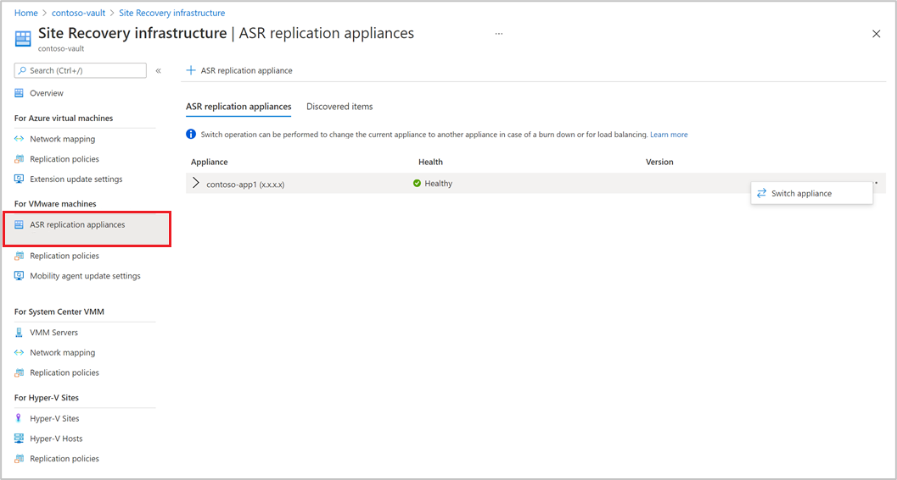
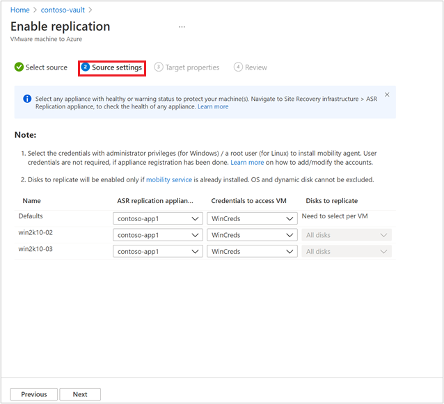
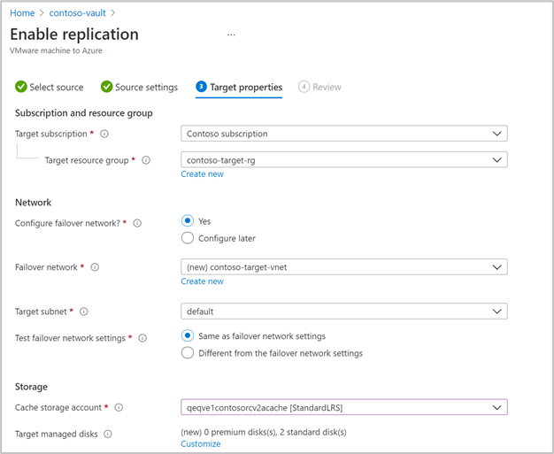

# Quickstart: Set up disaster recovery to Azure for on-premises VMware VMs - Modernized

The [Azure Site Recovery](/azure/site-recovery/site-recovery-overview) service contributes to your business continuity and disaster recovery (BCDR) strategy by keeping your business applications online during planned and unplanned outages. Site Recovery manages and orchestrates disaster recovery of on-premises machines and Azure virtual machines (VM), including replication, failover, and recovery.

This quickstart describes how to enable replication for on-premises VMware VMs, for disaster recovery to Azure using the Modernized VMware/Physical machine protection experience.

For information on how to set up disaster recovery in Azure Site Recovery Classic releases, see [the tutorial](vmware-azure-tutorial.md).

## Prerequisites
To complete this tutorial, you need an Azure subscription and a VM.

>- If you don't have an Azure account with an active subscription, you can [create an account for free](/free/?WT.mc_id=A261C142F).
>- A VM with a minimum 1 GB of RAM is recommended. [Learn more](/azure/virtual-machines/windows/quick-create-portal) about how to create a VM.

## Sign in to Azure

- Sign in to the [Azure portal](https://portal.azure.com/).

## Prepare Azure account

To create and register the Azure Site Recovery replication appliance, you need an Azure account with:

- Contributor or Owner permissions on the Azure subscription.
- Permissions to register Azure Active Directory (AAD) apps.
- Owner or Contributor and User Access Administrator permissions on the Azure subscription to create a Key Vault, used during agentless VMware migration.

If you just created a free Azure account, you're the owner of your subscription. If you're not the subscription owner, work with the owner for the required permissions.

Use the following steps to assign the required permissions:

1. In the Azure portal, search for **Subscriptions**, and under **Services**, select **Subscriptions** search box to search for the required Azure subscription.

2. In the **Subscriptions page**, select the subscription in which you created the Recovery Services vault.

3. In the subscription, select **Access control** (IAM) > **Check access**. In **Check access**, search for the relevant user account.

4. In **Add a role assignment**, Select **Add,** select the Contributor or Owner role, and select the account. Then Select **Save**.

5. To register the Azure Site Recovery replication appliance, your Azure account needs permissions to register the AAD apps.

**Follow these steps to assign required permissions**:

1. In Azure portal, navigate to **Azure Active Directory** > **Users** > **User Settings**. In **User settings**, verify that Azure AD users can register applications (set to *Yes* by default).

2. In case the **App registrations** settings is set to *No*, request the tenant/global admin to assign the required permission. Alternately, the tenant/global admin can assign the Application Developer role to an account to allow the registration of AAD App.

## Prepare infrastructure - set up Azure Site Recovery Replication appliance

You need to [set up an Azure Site Recovery replication appliance on the on-premises environment](deploy-vmware-azure-replication-appliance-modernized.md) to channel mobility agent communications.

## Enable replication of VMware VMs

After an Azure Site Recovery replication appliance is added to a vault, you can get started with protecting the machines.

Ensure the [pre-requisites](vmware-physical-azure-support-matrix.md) across storage and networking are met.

Follow these steps to enable replication:

1. Select **Site Recovery** under **Getting Started** section. Click **Enable Replication (Modernized)** under the VMware section.

2. Choose the machine type you want to protect through Azure Site Recovery.

   > [!NOTE]
   > In Modernized, the support is limited to virtual machines.

   

3. After choosing the machine type, select the vCenter server added to Azure Site Recovery replication appliance, registered in this vault.

4.	Search the source machine name to protect it. To review the selected machines, select **Selected resources**.

5. After you select the list of VMs, select **Next** to proceed to source settings. Here, select the replication appliance and VM credentials. These credentials will be used to push mobility agent on the machine by Azure Site Recovery replication appliance to complete enabling Azure Site Recovery. Ensure accurate credentials are chosen.

   >[!NOTE]
   >For Linux OS, ensure to provide the root credentials. For Windows OS, a user account with admin privileges should be added. These credentials will be used to push Mobility Service on to the source machine during enable replication operation.

   

6. Select **Next** to provide target region properties. By default, Vault subscription and Vault resource group are selected. You can choose a subscription and resource group of your choice. Your source machines will be deployed in this subscription and resource group when you failover in the future.

   

7. Next, you can select an existing Azure network or create a new target network to be used during failover. If you select **Create new**, you will be redirected to create virtual network context blade and asked to provide address space and subnet details. This network will be created in the target subscription and target resource group selected in the previous step.

8. Then, provide the test failover network details.

   > [!NOTE]
   > Ensure that the test failover network is different from the failover network. This is to make sure the failover network is readily available readily in case of an actual disaster.

9. Select the storage.

    - Cache storage account:
      Now, choose the cache storage account which Azure Site Recovery uses for staging purposes - caching and storing logs before writing the changes on to the managed disks.

      By default, a new LRS v1 type storage account will be created by Azure Site Recovery for the first enable replication operation in a vault. For the next operations, the same cache storage account will be re-used.
    -  Managed disks

       By default, Standard HDD managed disks are created in Azure. You can customize the type of Managed disks by Selecting **Customize**. Choose the type of disk based on the business requirement. Ensure [appropriate disk type is chosen](../virtual-machines/disks-types.md#disk-type-comparison) based on the IOPS of the source machine disks. For pricing information, refer to the managed disk pricing document [here](https://azure.microsoft.com/pricing/details/managed-disks/).

       >[!NOTE]
       > If Mobility Service is installed manually before enabling replication, you can change the type of managed disk, at a disk level. Else, by default, one managed disk type can be chosen at a machine level

10. Create a new replication policy if needed.

     A default replication policy gets created under the vault with 3 days recovery point retention and app-consistent recovery points disabled by default. You can create a new replication policy or modify the existing one as per your RPO requirements.

     - Select **Create new**.

     - Enter the **Name**.

     - Enter a value for **Retention period (in days)**. You can enter any value ranging from 0 to 15.

     - **Enable app consistency frequency** if you wish and enter a value for **App-consistent snapshot frequency (in hours)** as per business requirements.

     - Select **OK** to save the policy.

     The policy will be created and can be used for protecting the chosen source machines.

11. After choosing the replication policy, select **Next**. Review the Source and Target properties. Select **Enable  Replication** to initiate the operation.

    

    A job is created to enable replication of the selected machines. To track the progress, navigate to Site Recovery jobs in the recovery services vault.

## Next steps
After enabling replication, run a drill to make sure everything's working as expected.
> [!div class="nextstepaction"]
> [Run a disaster recovery drill](site-recovery-test-failover-to-azure.md)