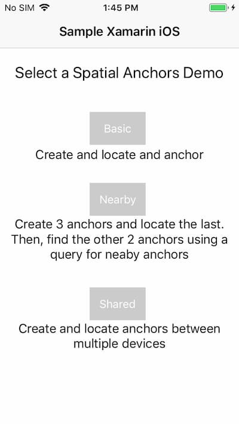
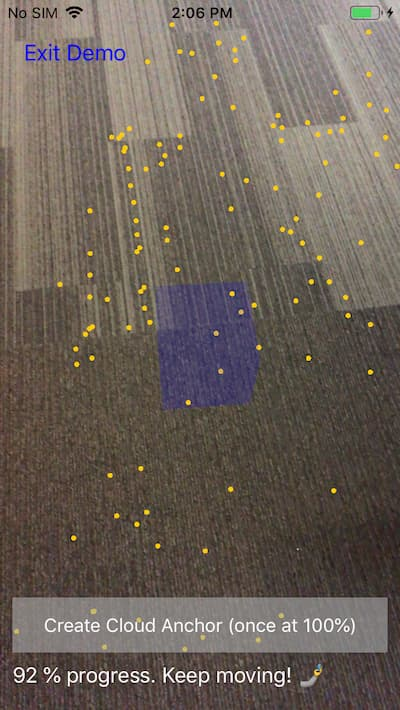
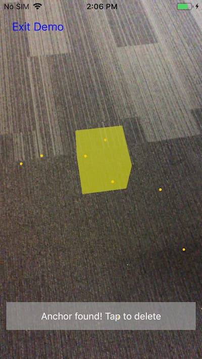

# Quickstart: Create a Xamarin iOS app with Azure Spatial Anchors

This quickstart covers how to create an iOS app with Xamarin using [Azure Spatial Anchors](../overview.md). Azure Spatial Anchors is a cross-platform developer service that allows you to create mixed reality experiences using objects that persist their location across devices over time. When you're finished, you'll have an iOS app that can save and recall a spatial anchor.

You'll learn how to:

> [!div class="checklist"]
> * Create a Spatial Anchors account
> * Configure the Spatial Anchors account identifier and account key
> * Deploy and run on an iOS device

[!INCLUDE [quickstarts-free-trial-note](../../../includes/quickstarts-free-trial-note.md)]

## Prerequisites

To complete this quickstart, make sure you have:
- A Mac running macOS High Sierra (10.13) or above with:
  - The latest version of Xcode and iOS SDK installed from the [App Store](https://itunes.apple.com/us/app/xcode/id497799835?mt=12).
  - An up-to-date version of <a href="/visualstudio/mac/installation?view=vsmac-2019&preserve-view=true" target="_blank">Visual Studio for Mac 8.1+</a>.
  - <a href="https://git-scm.com/download/mac" target="_blank">Git for macOS</a>.
  - <a href="https://git-lfs.github.com/">Git LFS</a>.

[!INCLUDE [Create Spatial Anchors resource](../../../includes/spatial-anchors-get-started-create-resource.md)]

## Open the sample project

[!INCLUDE [Clone Sample Repo](../../../includes/spatial-anchors-clone-sample-repository.md)]

Open `Xamarin/SampleXamarin.sln` in Visual Studio.

## Configure account identifier and key

The next step is to configure the app to use your account identifier and account key. You copied them into a text editor when [setting up the Spatial Anchors resource](#create-a-spatial-anchors-resource).

Open `Xamarin/SampleXamarin.Common/AccountDetails.cs`.

Locate the `SpatialAnchorsAccountKey` field and replace `Set me` with the account key.

Locate the `SpatialAnchorsAccountId` field and replace `Set me` with the account identifier.

Locate the `SpatialAnchorsAccountDomain` field and replace `Set me` with the account domain.

## Deploy the app to your iOS device

Power on the iOS device, sign in, and connect it to the computer using a USB cable.

Set the startup project to **SampleXamarin.iOS**, change the **Solution Configuration** to **Release**, and select the device you want to deploy to in the device selector drop-down.

Select **Run** > **Start Without Debugging** to deploy and start your app.

In the app, select **Basic** to run the demo and follow the instructions to place and recall an anchor.

> 
> 
> 

[!INCLUDE [Clean-up section](../../../includes/clean-up-section-portal.md)]

[!INCLUDE [Next steps](../../../includes/spatial-anchors-quickstarts-nextsteps.md)]

> [!div class="nextstepaction"]
> [Tutorial: Share Spatial Anchors across devices](../tutorials/tutorial-share-anchors-across-devices.md)
