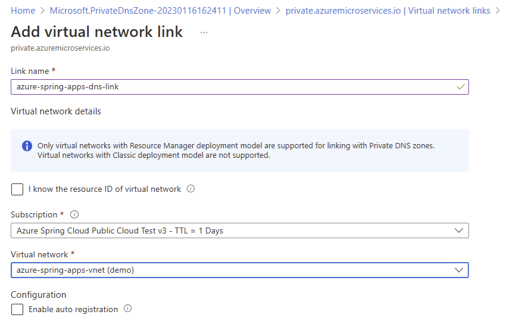
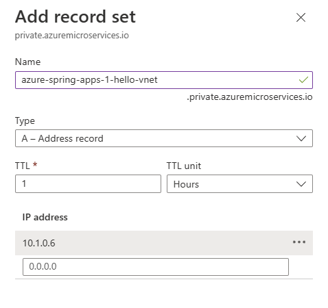
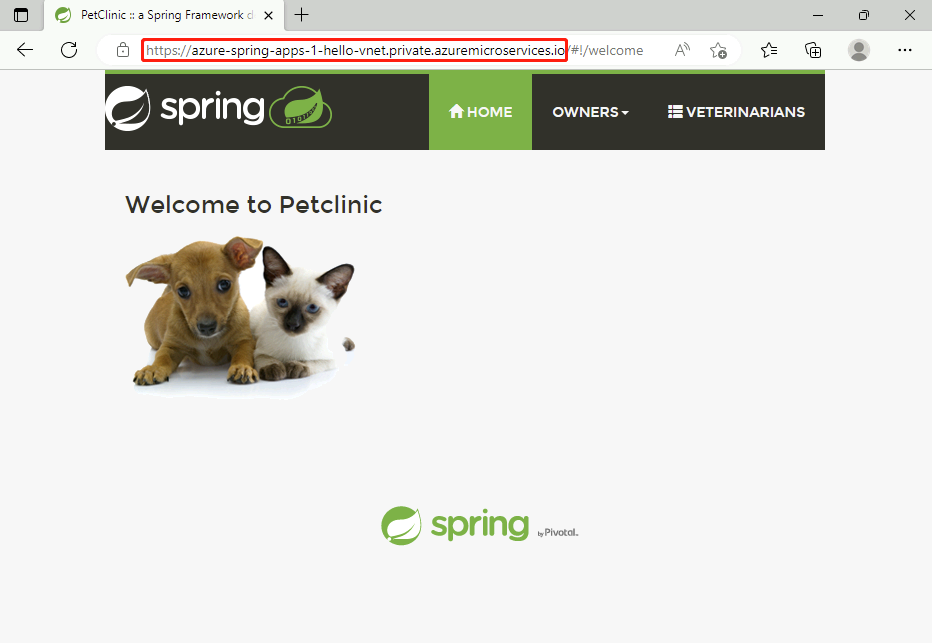
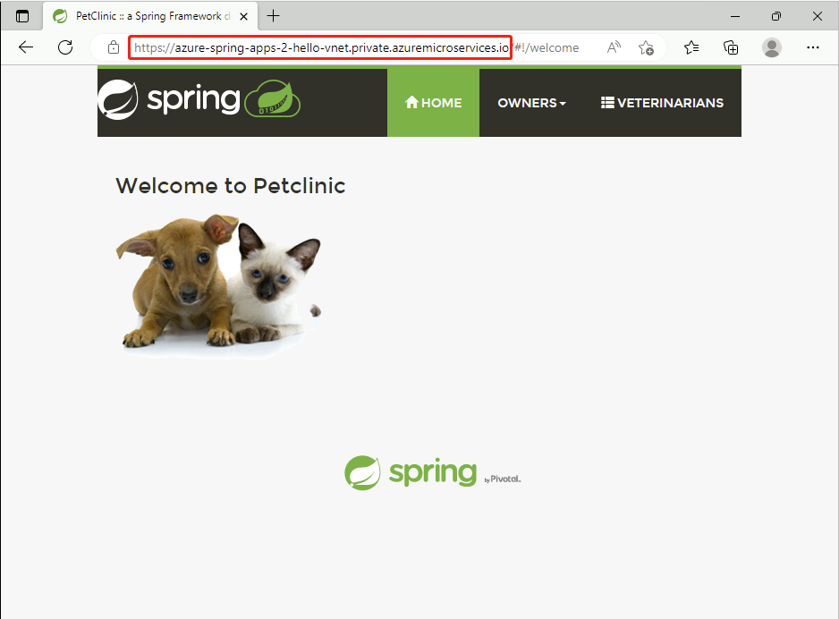
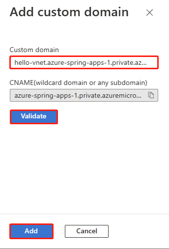
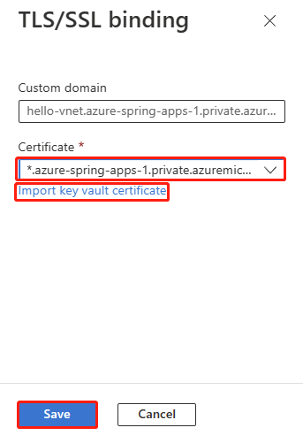
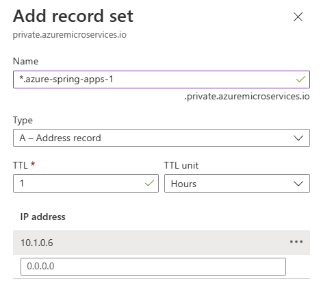
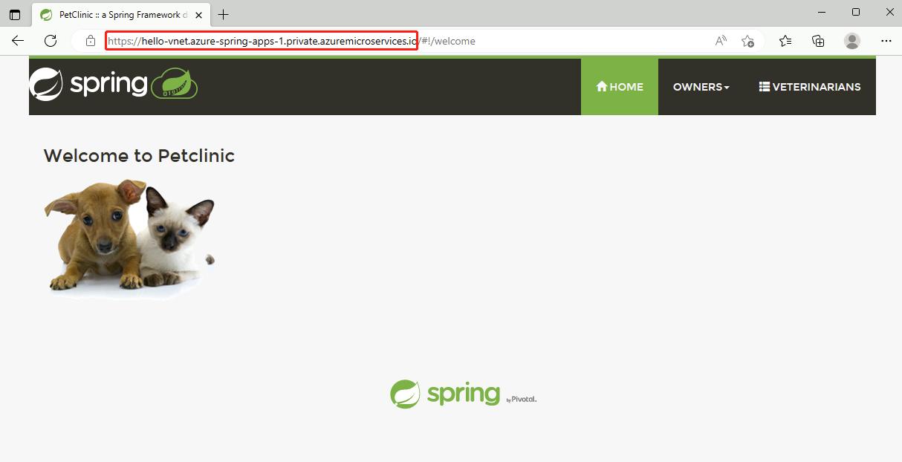
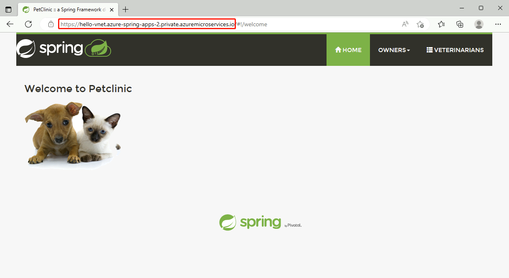

# Map DNS for the applications in multiple Azure Spring Apps in the same VNET

> [!NOTE]
> Azure Spring Apps is the new name for the Azure Spring Cloud service. Although the service has a new name, you'll see the old name in some places for a while as we work to update assets such as screenshots, videos, and diagrams.

**This article applies to:** ✔️ Standard tier ✔️ Enterprise tier


There are two approaches to Map DNS for the applications in multiple Azure Spring Apps in the same VNET. Using the Microsoft provided fully qualified domain name (FQDN) or using the custom domain. This doc will show you how to achieve that with two Azure Spring Apps instance azure-spring-apps-1 and azure-spring-apps-2 in the same VNET as an example.


## Shared steps

### Find the IP for your applications

#### [Portal](#tab/azure-portal)

1. Select the virtual network resource you created as explained in [Deploy Azure Spring Apps in your Azure virtual network (VNet injection)](./how-to-deploy-in-azure-virtual-network.md).

2. In the **Connected devices** search box, enter *kubernetes-internal*.

3. In the filtered result, find the **Device** connected to the service runtime **Subnet** of those service instance, and copy its **IP Address**. In this sample, the IP Address of azure-spring-apps-1 is *10.1.0.6*, the IP Adress of azure-spring-apps-2 is *10.1.2.6*.

    [  ](media/spring-cloud-access-app-vnet-multiple-instance/create-dns-record.png#lightbox)

#### [CLI](#tab/azure-CLI)

Find the IP Address for each of your Spring Cloud services. Customize the value of your Azure Spring Apps instance name based on your real environment.

   ```azurecli
   SPRING_CLOUD_NAME='spring-cloud-name'
   SERVICE_RUNTIME_RG=`az spring show \
       --resource-group $RESOURCE_GROUP \
       --name $SPRING_CLOUD_NAME \
       --query "properties.networkProfile.serviceRuntimeNetworkResourceGroup" \
       --output tsv`
   IP_ADDRESS=`az network lb frontend-ip list \
       --lb-name kubernetes-internal \
       --resource-group $SERVICE_RUNTIME_RG \
       --query "[0].privateIpAddress" \
       --output tsv`
   ```

---

### Create a private DNS zone

The following procedure creates a private DNS zone for an application in the private network.

> [!NOTE]
> If you are using Azure China, please replace `private.azuremicroservices.io` with `private.microservices.azure.cn` in this article. Learn more about [Check Endpoints in Azure](/azure/china/resources-developer-guide#check-endpoints-in-azure).

#### [Portal](#tab/azure-portal)

1. Open the Azure portal. From the top search box, search for **Private DNS zones**, and select **Private DNS zones** from the results.

2. On the **Private DNS zones** page, select **Add**.

3. Fill out the form on the **Create Private DNS zone** page. Enter *private.azuremicroservices.io* as the **Name** of the zone.

4. Select **Review + Create**.

5. Select **Create**.

#### [CLI](#tab/azure-CLI)

1. Define variables for your subscription, resource group, and Azure Spring Apps instance. Customize the values based on your real environment.

   ```azurecli
   SUBSCRIPTION='subscription-id'
   RESOURCE_GROUP='my-resource-group'
   VIRTUAL_NETWORK_NAME='azure-spring-apps-vnet'
   ```

1. Sign in to the Azure CLI and choose your active subscription.

   ```azurecli
   az login
   az account set --subscription ${SUBSCRIPTION}
   ```

2. Create the private DNS zone. 

   ```azurecli
   az network private-dns zone create \
       --resource-group $RESOURCE_GROUP \
       --name private.azuremicroservices.io
   ```

---

It may take a few minutes to create the zone.

### Link the virtual network

To link the private DNS zone to the virtual network, you need to create a virtual network link.

#### [Portal](#tab/azure-portal)

1. Select the private DNS zone resource created above: *private.azuremicroservices.io*

2. On the left pane, select **Virtual network links**, then select **Add**.

4. Enter *azure-spring-apps-dns-link* for the **Link name**.

5. For **Virtual network**, select the virtual network you created as explained in [Deploy Azure Spring Apps in your Azure virtual network (VNet injection)](./how-to-deploy-in-azure-virtual-network.md).

    

6. Select **OK**.

#### [CLI](#tab/azure-CLI)

Link the private DNS zone you created to the virtual network holding your Azure Spring Apps services.

   ```azurecli
   az network private-dns link vnet create \
       --resource-group $RESOURCE_GROUP \
       --name azure-spring-apps-dns-link \
       --zone-name private.azuremicroservices.io \
       --virtual-network $VIRTUAL_NETWORK_NAME \
       --registration-enabled false
   ```
---

### Assign private FQDN for your applications

After following the procedure in [Deploy Azure Spring Apps in a virtual network](./how-to-deploy-in-azure-virtual-network.md), you can assign a private FQDN for your application. Here this doc use the hello-vnet app in azure-spring-apps-1 as an example.

#### [Portal](#tab/azure-portal)

1. Select the Azure Spring Apps service instance deployed in your virtual network, and open the **Apps** tab in the menu on the left.

2. Select the application to show the **Overview** page.

3. Select **Assign Endpoint** to assign a private FQDN to your application. Assigning an FQDN can take a few minutes.

    


#### [CLI](#tab/azure-CLI)

Update your app to assign an endpoint to it. Customize the value of your app name based on your real environment.

```azurecli
SPRING_CLOUD_APP='your spring cloud app'
az spring app update \
    --resource-group $RESOURCE_GROUP \
    --name $SPRING_CLOUD_APP \
    --service $SPRING_CLOUD_NAME \
    --assign-endpoint true
```

---


## Extra steps by using Microsoft provided Fully qualified domain name

Using this Microsoft provided fully qualified domain name requires you to add DNS record for each applications. Before using this approach, please make sure that you have read [Access your application in a private network](how-to-prepare-app-deployment.md).

When Assign Endpoint on applications in an Azure Spring Apps service instance is deployed in your virtual network, the endpoint is a private fully qualified domain name. By default, the fully qualified domain name is unique per app across service instances with formart <service\-name>-<app\-name>.private.azuremicroservices.io. In this approach, we need to create DNS record for each application.
 

### Create DNS record for all the applications

To use the private DNS zone to translate/resolve DNS, you must create an "A" type record in the zone for each of your applications.
This doc use the hello-vnet app in azure-spring-apps-1 as an example, and you should create DNS record for all of your applications in those service instance

#### [Portal](#tab/azure-portal)

1. Select the private DNS zone resource created above: *private.azuremicroservices.io*.

1. Select **Record set**.

1. In **Add record set**, enter or select this information:

    |Setting     |Value                                                                      |
    |------------|---------------------------------------------------------------------------|
    |Name        |Enter *azure-spring-apps-1-hello-vnet*                                      |
    |Type        |Select **A**                                                               |
    |TTL         |Enter *1*                                                                  |
    |TTL unit    |Select **Hours**                                                           |
    |IP address  |Enter the IP address copied in *Find the IP for your applications*. In the sample, the IP is *10.1.0.6*.    |

1. Select **OK**.

    

#### [CLI](#tab/azure-CLI)

Use the [IP address](#find-the-ip-for-your-applications) to create the A record in your DNS zone. 

   ```azurecli
   az network private-dns record-set a add-record \
     --resource-group $RESOURCE_GROUP \
     --zone-name private.azuremicroservices.io \
     --record-set-name 'azure-spring-apps-1-hello-vnet' \
     --ipv4-address $IP_ADDRESS
   ```

---

### Access application private FQDN

After the assignment, you can access all those application's private FQDN in the private network. For example, you can create a jumpbox machine in the same virtual network, or a peered virtual network. Then, on that jumpbox or virtual machine, the private FQDN of those applications are all accessible.





## Extra steps by using Custom domain

By using Custom domain, you only need to add DNS record for each azure spring apps instance. But instead, you need to configure custom domain for each applications. please make sure that you have read [Tutorial: Map an existing custom domain to Azure Spring Apps](tutorial-custom-domain.md).

We will reuse the private DNS zone *private.azuremicroservices.io* to add custom domain related DNS record to simplify this example, so the private fully qualified domain name we use is in format <app\-name>.<service\-name>.private.azuremicroservices.io. Technically, you could use any private fully qualified domain name you want. In that case, you have to create a new private DNS zone corresponding to the fully qualified domain name you choose.

### Map your custom domain to Azure Spring Apps app

#### [Portal](#tab/Azure-portal)
Go to application page.

1. Select **Custom Domain**.
2. Then **Add Custom Domain**.

3. Type the fully qualified domain name you want to use and make sure it is corresponding to the certificate to use in ssl binding later. In this example, we will use *hello-vnet.azure-spring-apps-1.private.azuremicroservices.io*. Please do not care about the CNAME part.

4. Select **Validate** to enable the **Add** button.
5. Select **Add**.



When you've successfully mapped your custom domain to the app, you'll see it on the custom domain table.


#### [CLI](#tab/Azure-CLI)
```azurecli
az spring app custom-domain bind --domain-name <domain name> --app <app name> --resource-group <resource group name> --service <service name>
```

To show the list of custom domains:

```azurecli
az spring app custom-domain list --app <app name> --resource-group <resource group name> --service <service name>
```

---

> [!NOTE]
> A **Not Secure** label for your custom domain means that it's not yet bound to an SSL certificate. Any HTTPS request from a browser to your custom domain will receive an error or warning.

### Add SSL binding

Before doing this step, please make sure you have prepare your certificates and import them into Azure Spring Apps. For detailed information, see [Tutorial: Map an existing custom domain to Azure Spring Apps](tutorial-custom-domain.md).

#### [Portal](#tab/Azure-portal)
In the custom domain table, select **Add ssl binding** as shown in the previous figure.
1. Select your **Certificate** or import it.
1. Select **Save**.



#### [CLI](#tab/Azure-CLI)
```azurecli
az spring app custom-domain update --domain-name <domain name> --certificate <cert name> --app <app name> --resource-group <resource group name> --service <service name>
```

---

After you successfully add SSL binding, the domain state will be secure: **Healthy**.


### Create DNS record for all the applications

To use the private DNS zone to translate/resolve DNS, you must create an "A" type record in the zone for each of you service instance.
This doc use the azure-spring-apps-1 instanceas an example, and you should create DNS record for all of your instance.

#### [Portal](#tab/azure-portal)

1. Select the private DNS zone resource created above: *private.azuremicroservices.io*.

1. Select **Record set**.

1. In **Add record set**, enter or select this information:

    |Setting     |Value                                                                      |
    |------------|---------------------------------------------------------------------------|
    |Name        |Enter *\*.azure-spring-apps-1*                                      |
    |Type        |Select **A**                                                               |
    |TTL         |Enter *1*                                                                  |
    |TTL unit    |Select **Hours**                                                           |
    |IP address  |Enter the IP address copied in *Find the IP for your applications*. In the sample, the IP is *10.1.0.6*.|

1. Select **OK**.

    

#### [CLI](#tab/azure-CLI)

Use the [IP address](#find-the-ip-for-your-applications) to create the A record in your DNS zone. 

   ```azurecli
   az network private-dns record-set a add-record \
     --resource-group $RESOURCE_GROUP \
     --zone-name private.azuremicroservices.io \
     --record-set-name '*.azure-spring-apps-1' \
     --ipv4-address $IP_ADDRESS
   ```

---

### Access application private FQDN

After the assignment, you can access all those application's private FQDN in the private network. For example, you can create a jumpbox machine in the same virtual network, or a peered virtual network. Then, on that jumpbox or virtual machine, the private FQDN of those applications are all accessible.




## Clean up resources

If you plan to continue working with subsequent articles, you might want to leave these resources in place. When no longer needed, delete the resource group, which deletes the resources in the resource group. To delete the resource group by using Azure CLI, use the following command:

```azurecli
az group delete --name $RESOURCE_GROUP
```
