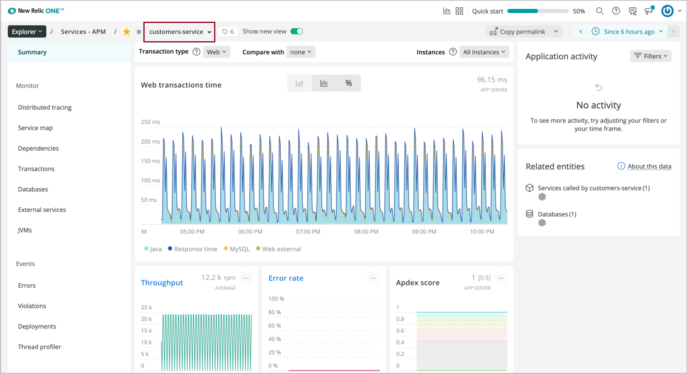
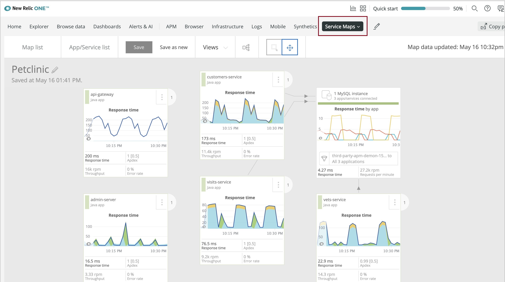
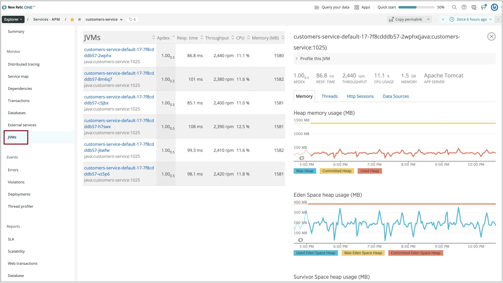
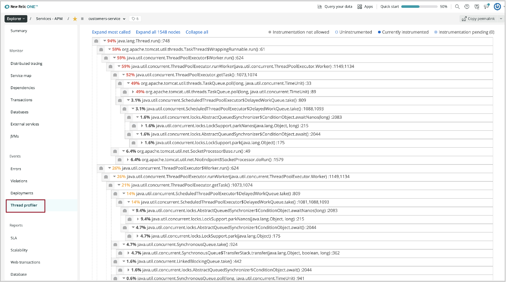

# How to monitor Spring Boot apps using New Relic Java agent (Preview)

> [!NOTE]
> Azure Spring Apps is the new name for the Azure Spring Cloud service. Although the service has a new name, you'll see the old name in some places for a while as we work to update assets such as screenshots, videos, and diagrams.

**This article applies to:** ✔️ Basic/Standard tier ✔️ Enterprise tier

This article shows you how to monitor of Spring Boot applications in Azure Spring Apps with the New Relic Java agent.

With the New Relic Java agent, you can:

* Consume the New Relic Java agent.
* Configure the New Relic Java agent using environment variables.
* Check all monitoring data from the New Relic dashboard.

The following video describes how to activate and monitor Spring Boot applications in Azure Spring Apps using New Relic One.

<br>

> [!VIDEO https://www.youtube.com/embed/4GQPwJSP3ys?list=PLPeZXlCR7ew8LlhnSH63KcM0XhMKxT1k_]

## Prerequisites

* A [New Relic](https://newrelic.com/) account.
* [Azure CLI version 2.0.67 or later](/cli/azure/install-azure-cli).

## Activate the New Relic Java in process agent

Use the following procedure to access the agent:

1. Create an instance of Azure Spring Apps.

2. Create an application.

    ```azurecli
      az spring app create --name "appName" --is-public true \
      -s "resourceName" -g "resourceGroupName"
    ```

3. Create a deployment with the New Relic agent and environment variables.

    ```azurecli
    az spring app deploy --name "appName" --jar-path app.jar \
       -s "resourceName" -g "resourceGroupName" \
       --jvm-options="-javaagent:/opt/agents/newrelic/java/newrelic-agent.jar" \
       --env NEW_RELIC_APP_NAME=appName NEW_RELIC_LICENSE_KEY=newRelicLicenseKey
    ```

Azure Spring Apps pre-installs the New Relic Java agent to */opt/agents/newrelic/java/newrelic-agent.jar*. Customers can activate the agent from applications' **JVM options**, as well as configure the agent using the [New Relic Java agent environment variables](https://docs.newrelic.com/docs/agents/java-agent/configuration/java-agent-configuration-config-file/#Environment_Variables).

## Azure portal

You can also activate this agent from portal with the following procedure.

1. Find the app from **Settings**/**Apps** in the navigation pane.

   :::image type="content" source="media/new-relic-monitoring/find-app.png" alt-text="Screenshot of the Azure portal showing the Apps page for an Azure Spring Apps instance." lightbox="media/new-relic-monitoring/find-app.png":::

2. Select the application to jump to the **Overview** page.

   :::image type="content" source="media/new-relic-monitoring/overview-page.png" alt-text="Screenshot of the Azure portal showing the Overview page for an app in an Azure Spring Apps instance." lightbox="media/new-relic-monitoring/overview-page.png":::

3. Select **Configuration** in the left navigation pane to add/update/delete the **Environment variables** of the application.

   :::image type="content" source="media/new-relic-monitoring/configurations-update-environment.png" alt-text="Screenshot of the Azure portal showing the Configuration page for an app in an Azure Spring Apps instance, with the Environmental variables tab selected." lightbox="media/new-relic-monitoring/configurations-update-environment.png":::

4. Select **General settings** to add/update/delete the **JVM options** of the application.

   :::image type="content" source="media/new-relic-monitoring/update-jvm-option.png" alt-text="Screenshot of the Azure portal showing the Configuration page for an app in an Azure Spring Apps instance, with the General settings tab selected." lightbox="media/new-relic-monitoring/update-jvm-option.png":::

5. View the application api/gateway **Summary** page from the New Relic dashboard.

   [](media/new-relic-monitoring/app-summary-page.png)

6. View the application customers-service **Summary** page from the New Relic dashboard.

   [](media/new-relic-monitoring/customers-service.png)

7. View the **Service Map** page from the New Relic dashboard.

   [](media/new-relic-monitoring/service-map.png)

8. View the **JVMs** page of the application from the New Relic dashboard.

   [](media/new-relic-monitoring/jvm-page.png)

9. View the application profile from the New Relic dashboard.

   [](media/new-relic-monitoring/profile-app.png)

## Automate provisioning

You can also run a provisioning automation pipeline using Terraform, Bicep, or an Azure Resource Manager template (ARM template). This pipeline can provide a complete hands-off experience to instrument and monitor any new applications that you create and deploy.

### Automate provisioning using Terraform

To configure the environment variables in a Terraform template, add the following code to the template, replacing the *\<...>* placeholders with your own values. For more information, see [Manages an Active Azure Spring Apps Deployment](https://registry.terraform.io/providers/hashicorp/azurerm/latest/docs/resources/spring_cloud_active_deployment).

```terraform
resource "azurerm_spring_cloud_java_deployment" "example" {
  ...
  jvm_options = "-javaagent:/opt/agents/newrelic/java/newrelic-agent.jar"
  ...
    environment_variables = {
      "NEW_RELIC_APP_NAME": "<app-name>",
      "NEW_RELIC_LICENSE_KEY": "<new-relic-license-key>"
  }
}
```

### Automate provisioning using a Bicep file

To configure the environment variables in a Bicep file, add the following code to the template, replacing the *\<...>* placeholders with your own values. For more information, see [Microsoft.AppPlatform Spring/apps/deployments](/azure/templates/microsoft.appplatform/spring/apps/deployments?tabs=bicep).

```bicep
deploymentSettings: {
  environmentVariables: {
    NEW_RELIC_APP_NAME : '<app-name>',
    NEW_RELIC_LICENSE_KEY : '<new-relic-license-key>'
  },
  jvmOptions: '-javaagent:/opt/agents/newrelic/java/newrelic-agent.jar',
  ...
}
```

### Automate provisioning using an ARM template

To configure the environment variables in an ARM template, add the following code to the template, replacing the *\<...>* placeholders with your own values. For more information, see [Microsoft.AppPlatform Spring/apps/deployments](/azure/templates/microsoft.appplatform/spring/apps/deployments?tabs=json).

```json
"deploymentSettings": {
  "environmentVariables": {
    "NEW_RELIC_APP_NAME" : "<app-name>",
    "NEW_RELIC_LICENSE_KEY" : "<new-relic-license-key>"
  },
  "jvmOptions": "-javaagent:/opt/agents/newrelic/java/newrelic-agent.jar",
  ...
}
```

## View New Relic Java Agent logs

By default, Azure Spring Apps will print the logs of the New Relic Java agent to `STDOUT`. The logs will be mixed with the application logs. You can find the explicit agent version from the application logs.

You can also get the logs of the New Relic agent from the following locations:

* Azure Spring Apps logs
* Azure Spring Apps Application Insights
* Azure Spring Apps LogStream

You can leverage some environment variables provided by New Relic to configure the logging of the New Agent, such as, `NEW_RELIC_LOG_LEVEL` to control the level of logs. For more information, see [New Relic Environment Variables](https://docs.newrelic.com/docs/agents/java-agent/configuration/java-agent-configuration-config-file/#Environment_Variables).

> [!CAUTION]
> We strongly recommend that you *do not* override the logging default behavior provided by Azure Spring Apps for New Relic. If you do, the logging scenarios in above scenarios will be blocked, and the log file(s) may be lost. For example, you should not pass the following environment variables to your applications. Log file(s) may be lost after restart or redeployment of application(s).
>
> * NEW_RELIC_LOG
> * NEW_RELIC_LOG_FILE_PATH

## New Relic Java Agent update/upgrade

The New Relic Java agent will update/upgrade the JDK regularly. The agent update/upgrade may impact following scenarios.

* Existing applications that use the New Relic Java agent before update/upgrade will be unchanged.
* Existing applications that use the New Relic Java agent before update/upgrade require restart or redeploy to engage the new version of the New Relic Java agent.
* New applications created after update/upgrade will use the new version of the New Relic Java agent.

## Vnet Injection Instance Outbound Traffic Configuration

For a vnet injection instance of Azure Spring Apps, you need to make sure the outbound traffic is configured correctly for the New Relic Java agent. For more information, see [Networks of New Relic](https://docs.newrelic.com/docs/using-new-relic/cross-product-functions/install-configure/networks/#agents).

## Next steps

* [Distributed tracing and App Insights](how-to-distributed-tracing.md)
