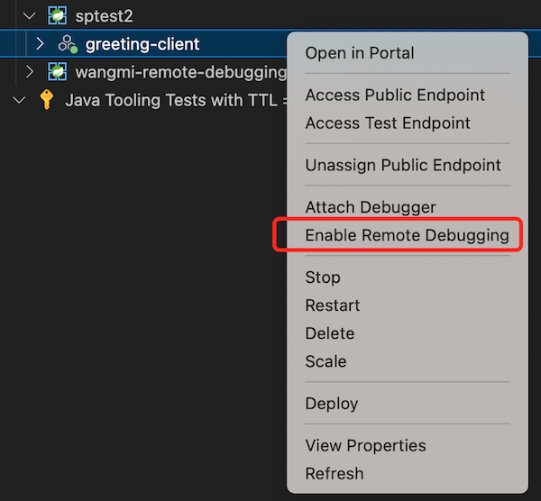
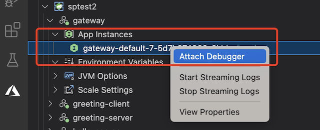

# How to do remote debugging for Spring apps

This feature enables you to remote debugging java applications in Azure Spring Apps.

## Prerequisites
* Azure CLI and Spring Apps extension are installed.
* App already deployed.

## Enable/disable remote debugging
For security, remote debugging is disabled by default. You can enable/disable remote debugging by cli, portal and ide extensions.

### [Portal](#tab/portal)
Go to application page.

1. Select **Remote Debugging**.
2. Enable remote debugging and set the debugging port


### [Cli](#tab/cli)
To enable remote debugging
```azurecli
az spring app enable-remote-debugging -n <app name> -d <deloyment name> --resource-group <resource group name> --service <service name> --port <port>
```

To disable remote debugging
```azurecli
az spring app disable-remote-debugging -n <app name> -d <deloyment name> --resource-group <resource group name> --service <service name>
```

To show the configuration of remote debugging
```azurecli
az spring app get-remote-debugging-config -n <app name> -d <deloyment name> --resource-group <resource group name> --service <service name>
```

---

## Remote debugging app instance
#### [Intellij extension](#tab/Intellij-extension)

### Prerequisites
* [Azure Toolkit for Intellij](https://learn.microsoft.com/en-us/azure/developer/java/toolkit-for-intellij/install-toolkit) is installed


### Enable/disable Remote Debugging


### Attach Debugger

#### Assign an azure role
First of first, you should enable remote debugging against the target app. Based on your company policy, you may either be allowed to do it by yourself or ask an admin role to enable it for you if permitted.

You must be granted the role "Azure Spring Apps Remote Debugging Role" because it requires a new Data Action permission `Microsoft.AppPlatform/Spring/apps/deployments/remotedebugging/action`. It can be achieved by the following command:

```azurecli
az role assignment create --role 'Azure Spring Apps Remote Debugging Role' --scope '<Resource id of your service instance>' --assignee '<your identity>'
```


1. Choose one of the app instance and run "Attach Debugger". Intellij will help you to connect to the app instance and start remote debugging.


2. We will create remote debugging configuration for you, you can find it under "Remote Jvm Debug". Please configure the module class path to your source code which is used for remote debugging.
   

 

### Troubleshooting
1. Failed to attach debugger, the error looks like "java.net.SocketException, connection reset", "Failed to attach to remote debugger, ClosedConnectionException"

   - Please check the [RBAC role](#assign-an-azure-role) to ensure you are authorized to remote debugging an app instance.
   - Please ensure you access to a valid instance. You can refresh the deployment to get the latest instances.

     
2. Successfully attach debugger but cannot remote debugging the app instance.
   - Please ensure your ide contains the source code you want to debug.
   - Please ensure the debug configuration has the correct module class path.


#### [Vscode extension](#tab/Vscode-extension)

### Prerequisites
* [Azure Spring Apps Vscode plugin](https://marketplace.visualstudio.com/items?itemName=vscjava.vscode-azurespringcloud) is installed.


### Enable/disable Remote Debugging


### Attach Debugger

#### Assign an azure role
First of first, you should enable remote debugging against the target app. Based on your company policy, you may either be allowed to do it by yourself or ask an admin role to enable it for you if permitted.

You must be granted the role "Azure Spring Apps Remote Debugging Role" because it requires a new Data Action permission `Microsoft.AppPlatform/Spring/apps/deployments/remotedebugging/action`. It can be achieved by the following command:

```azurecli
az role assignment create --role 'Azure Spring Apps Remote Debugging Role' --scope '<Resource id of your service instance>' --assignee '<your identity>'
```

1. Choose one of the app instance and run "Attach Debugger". Vscode will help you to connect to the app instance and start remote debugging.



 

### Troubleshooting
1. Failed to attach debugger, the error looks like "java.net.SocketException, connection reset", "Failed to attach to remote debugger, ClosedConnectionException"
   
   - Please check the [RBAC role](#assign-an-azure-role) to ensure you are authorized to remote debugging an app instance.
   - Please ensure you access to a valid instance. You can refresh the deployment to get the latest instances.
     
     
2. Successfully attach debugger but cannot remote debugging the app instance.
   - Please ensure your ide contains the source code you want to debug.


---

## Limitations
Remote debugging is only supported for java applications.

| Tier                    | Deployment Type   | Supported |
|-------------------------|-------------------|-----------|
| Standard and basic tier | Jar               | Yes       |
| Standard and basic tier | Source code(Java) | Yes       |
| Standard and basic tier | Custom Image      | No        |
| Enterprise tier         | Java Application  | Yes       |
| Enterprise tier         | Source code(Java) | Yes       |
| Enterprise tier         | Custom Image      | No        |


## Tips
- Java remote debugging is very dangerous because it allows remote code execution. ASA will help you to secure the communication among your client ide and the remote application.
Even so, please do disable remote debugging and remove the RBAC role after you finished.
- You'd better scale in the app instance to one to ensure the traffic can go to the instance, it will make your remote debugging easier.