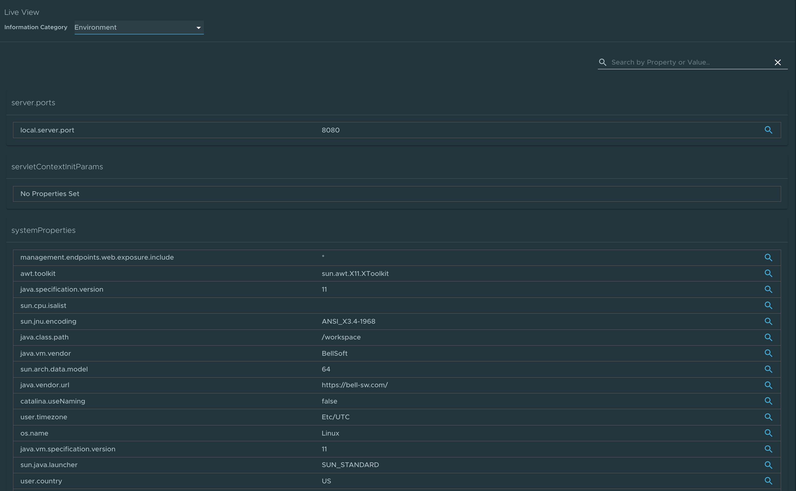
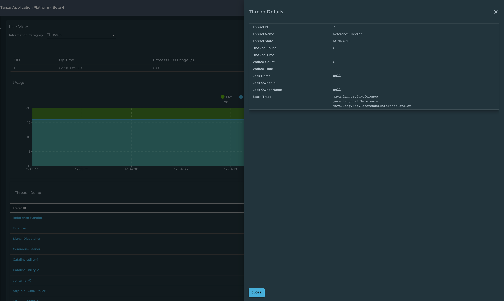
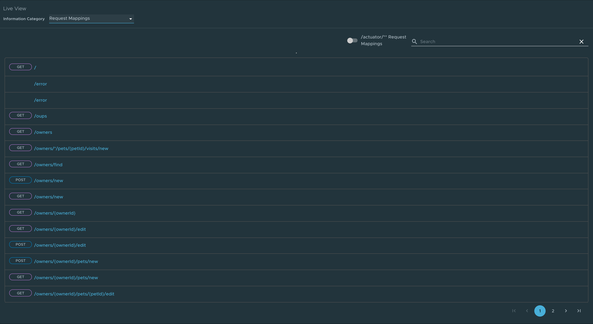
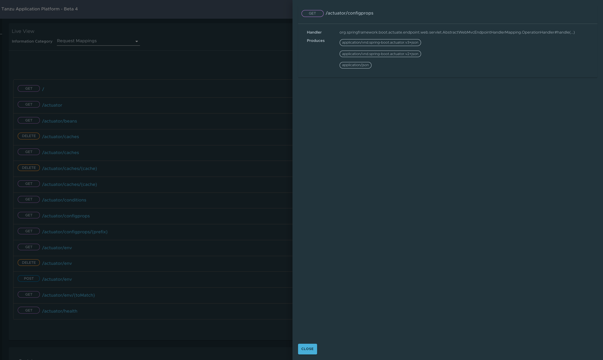

# Monitor apps by Application Live View for VMware Tanzu with Azure Spring Apps Enterprise Tier

> [!NOTE]
> Azure Spring Apps is the new name for the Azure Spring Cloud service. Although the service has a new name, you'll see the old name in some places for a while as we work to update assets such as screenshots, videos, and diagrams.

**This article applies to:** ❌ Basic/Standard tier ✔️ Enterprise tier

The Application Live View encompasses a sophisticated UI that provides visual insights into running apps by inspecting the app actuator information. The actuator data from the app serves as the source of truth. Application Live View provides a live view of the data from inside of the app only. Application Live View does not store any of the app data for further analysis or historical views. This easy-to-use interface provides ways to troubleshoot, learn, and maintain an overview of certain aspects of the apps. It gives a certain level of control to the users to change some parameters such as log levels and environment properties of running apps.

This article explains the Application Live View UI features and describe the pages and views included in the Application Live View user interface.

## Prerequities
- Have Application Live View enabled and can view your application through the dashboard. If not, see [Use Application Live View](./how-to-use-application-live-view.md)

## Details page

This is the default page loaded in the **Live View** section. This page gives a tabular overview containing the following:

*   App name
*   Instance ID
*   Location
*   Actuator location
*   Health endpoint
*   Direct actuator access
*   Framework
*   Version
*   New patch version
*   New major version
*   Build version

You can navigate between **Information Categories** by selecting from the drop-down at the top right corner of the page.

## Health page

To navigate to the Health page, select the **Health** option from the **Information Category** drop-down. The health page provides detailed information about the health of the app.

The page includes the following features:

*   View a list of all the components that make up the health of the app, such as readiness, liveness, and disk space.
*   View a display of the status and details associated with each of the components.

## Environment page

To navigate to the Environment page, select the **Environment** option from the **Information Category** drop-down. The environment page contains details of the app's environment. It contains properties including, but not limited to, system properties, environment variables, and configuration properties such as `application.properties` in a Spring Boot app.

The page includes the following features:

*   Search for a property or values using the search feature.
*   View all occurrences of a specific using the search icon at the right corner. property key quickly, without manually typing in the search field. Clicking on this button trims down the page to that property name.
*   Probe the app to refresh all the environment properties by clicking **Refresh Scope** at the top right corner of the page.
*   Edit existing properties by clicking **override** in the row and editing the value. After the value is saved, you can see the updated property in the **Applied overrides** section at the top of the page.
*   Reset the environment property to the original state by clicking **Reset**.
*   Add new environment properties to the app, and edit or remove overridden environment variables in the **Applied Overrides** section.

> **Note:** You must set the `management.endpoint.env.post.enabled=true` in the app config properties of the app as well as a corresponding, editable Environment has to be present in the app. For example in the following image it is a Spring Boot app.

Log Levels page
---------------

To navigate to the Log Levels page, select the **Log Levels** option from the **Information Category** drop-down. The log levels page provides access to the app's loggers and the configuration of their levels.

The page includes the following features:

*   Configure the log levels, such as `INFO`, `DEBUG`, `TRACE`, in real-time from the UI.
*   Search for a package and edit its respective log level.
*   Configure the log levels at a specific class and package.
*   Deactivate all the log levels by modifying the log level of root logger to `OFF`.
*   Display the changed log levels using the **Changes Only** toggle.
*   Search by logger name using the search feature.
*   Reset the log levels to the original state clicking **Reset**.
*   Reset all the loggers to default state by clicking **Reset All** at the top right corner of the page.

# Threads page

To navigate to the Threads page, select the **Threads** option from the **Information Category** drop-down. This page displays all details related to JVM threads and running processes of the app. This tracks live threads and daemon threads real-time. It is a snapshot of different thread states.

The page includes the following features:

*   Navigate to a thread state to display all the information about a particular thread and its stack trace.
*   Search for threads by thread ID or state using the search feature.
*   Refresh to the latest state of the threads using the refresh icon.
*   View more thread details by clicking on the thread ID.
*   Download a thread dump for analysis purposes.

## Memory page

To navigate to the Memory page, select the **Memory** option from the **Information Category** drop-down.

The memory page highlights the memory use inside of the JVM. It displays a graphical representation of the different memory regions within heap and non-heap memory. For Spring Boot apps running on a JVM, this visualizes data from inside of the JVM, and therefore provides memory insights into the app in contrast to "outside" information about the Kubernetes pod level.

The page includes the following features:

*   View real-time graphs that display a stacked overview of the different spaces in memory along with the total memory used and total memory size.
*   View graphs to display the GC pauses and GC events.
*   Download heap dump data using the **Heap Dump** button at the top right corner.

> **Note:** This graphical visualization happens in real-time and shows real-time data only. As mentioned previously, the Application Live View features do not store any information. That means the graphs visualize the data over time only for as long as you stay on that page.

## Request Mappings page

To navigate to the Request Mappings page, select the **Request Mappings** option from the **Information Category** drop-down. This page provides information about the app's request mappings. For each mapping, the page displays the request handler method.

The page includes the following features:

*   View more details about the request mapping, such as the header metadata of the app including the `produces`, `consumes`, and `HTTP` methods, by clicking on the mapping.
*   Search on the request mapping or the method.
*   View the actuator related mappings for the app using the toggle **/actuator/\*\* Request Mappings**

> **Note:** When the app actuator endpoint is exposed on `management.server.port`, the app does not return any actuator request mappings data in the context. In this case, a message is displayed when the actuator toggle is enabled.

## HTTP Requests page

To navigate to the HTTP Requests page, select the **HTTP Requests** option from the **Information Category** drop-down. The HTTP Requests page provides information about HTTP request-response exchanges to the app. The graph visualizes the requests per second indicating the response status of all the requests.

The page includes the following features:

*   Filter on the response statuses which include `info`, `success`, `redirects`, `client-errors`, and `server-errors`.
*   View the trace data, captured in detail in a tabular format with metrics such as timestamp, method, path, status, content-type, length, and time.
*   Filter the traces based on the search field value using the search feature on the table
*   View more details of the request such as method, headers, and response of the app by clicking on the timestamp.
*   Click the refresh icon above the graph to load the latest traces for the app.
*   Display the actuator related traces for the app using the toggle **/actuator/\*\*** at the top right corner of the page.

> **Note:** When the app actuator endpoint is exposed on `management.server.port`, no actuator HTTP Traces data is returned for the app. In this case, a message is displayed when the actuator toggle is enabled.

## Caches page

To navigate to the Caches page, select the **Caches** option from the **Information Category** drop-down. The Caches page provides access to the app's caches. It gives the details of the cache managers associated with the app, including the fully qualified name of the native cache.

The page includes the following features:

*   Search for a specific cache or cache manager using the search feature.
*   Remove individual caches by clicking **Evict**, which causes the cache to be cleared.
*   Remove all the caches by clicking **Evict All**. If there are no cache managers for the app, a message is displayed `No cache managers available for the application`.

## Configuration Properties page

To navigate to the Configuration Properties page, select the **Configuration Properties** option from the **Information Category** drop-down. The configuration properties page provides information about the configuration properties of the app. For Spring Boot, it displays the app's `@ConfigurationProperties` beans. It gives a snapshot of all the beans and their associated configuration properties.

The page includes the following feature:

*   Look up a key-value for a property or bean name using the search feature.

## Conditions page

To navigate to the Conditions page, select the **Conditions** option from tthe **Information Category** drop-down. The conditions evaluation report provides information about the evaluation of conditions on configuration and auto-configuration classes. For Spring Boot, this gives the user a clear view of all the beans configured in the app.

The page includes the following features:

*   Click on the bean name to view the conditions and the reason for the conditional match. If beans are not configured, it shows both the matched and unmatched conditions of the bean if any. In addition to this, it also displays names of unconditional auto configuration classes if any.
*   Filter on the beans and the conditions using the search feature.

## Scheduled Tasks page

To navigate to the Scheduled Tasks page, select the **Scheduled Tasks** option from the **Information Category** drop-down. The scheduled tasks page provides information about the app's scheduled tasks. It includes cron tasks, fixed delay tasks and fixed rate tasks, custom tasks and the properties associated with them.

The page includes the following feature:

*   Search for a particular property or a task in the search bar to retrieve the task or property details.

## Beans page

To navigate to the Beans page, select the **Beans** option from the **Information Category** drop-down. The beans page provides information about a list of all app beans and its dependencies. It displays the information about the bean type, dependencies, and its resource.

The page includes the following feature:

*   Search by the bean name or its corresponding fields.

## Metrics Page

To navigate to the Metrics page, select the **Metrics** option from the **Information Category** drop-down. The metrics page provides access to app metrics information.

The page includes the following features:

*   Choose from the list of various metrics available for the app such as `jvm.memory.used`, `jvm.memory.max`, `http.server.request`. After you choose the metric, you can view the associated tags.
*   Choose the value of each of the tags based on filtering criteria.
*   Click **Add Metric** to add the metric, which is refreshed every five seconds by default.
*   Pause the auto refresh feature by disabling the **Auto Refresh** toggle.
*   Refresh the metrics manually by clicking **Refresh All**.
*   Change the format of the metric value according to your needs.
*   Delete a particular metric by clicking on the minus symbol in the same row.

## Actuator Page

To navigate to the Actuator page, select the **Actuator** option from the **Information Category** drop-down. The actuator page provides a tree view of the actuator data.

The page includes the following feature:

*   Choose from a list of actuator endpoints and parse through the raw actuator data.

