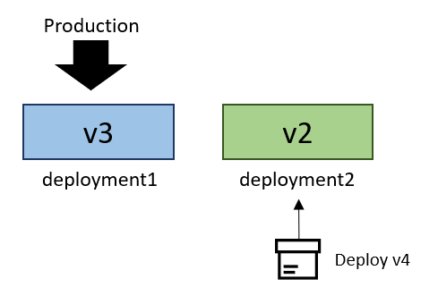
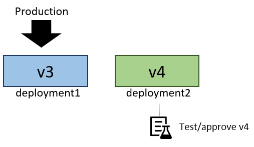
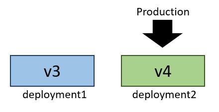
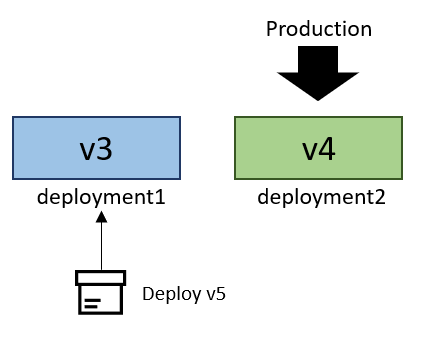
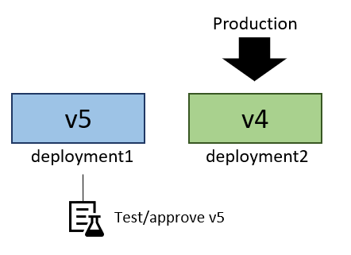
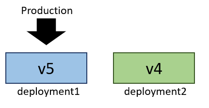
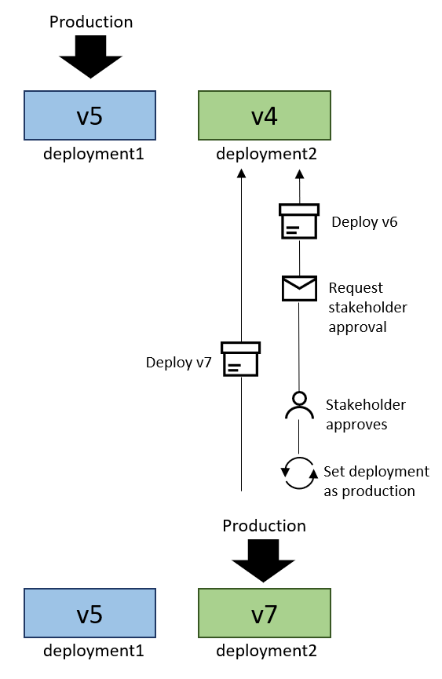
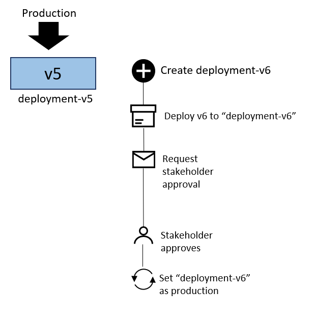
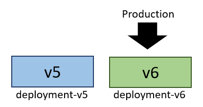
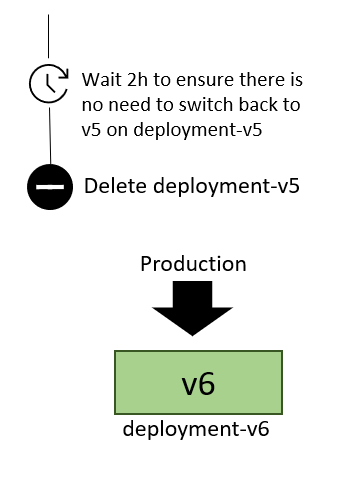

# Blue-green deployment strategies in Azure Spring Cloud

This article describes the blue-green deployment support in Azure Spring Cloud.

Azure Spring Cloud (Standard tier and higher) permits two deployments for every app, only one of which receives production traffic. This pattern is commonly known as blue-green deployment. Azure Spring Cloud's support for blue-green deployment, together with a [Continuous Delivery (CD)](/azure/devops/learn/what-is-continuous-delivery) pipeline and rigorous automated testing, allows agile application deployments with high confidence.

## Alternating deployments

The simplest way to implement blue-green deployment with Azure Spring Cloud is to create two fixed deployments and always deploy to the deployment that isn't receiving production traffic. With the Azure Spring Cloud task for Azure Pipelines, you can deploy this way just by setting the `UseStagingDeployment` flag to `true`.

Here's how the alternating deployments approach works in practice:

Suppose your application has two deployments: `deployment1` and `deployment2`. Currently, `deployment1` is set as the production deployment, and is running version `v3` of the application.

This makes `deployment2` the staging deployment. Thus, when the Continuous Delivery (CD) pipeline is ready to run, it deploys the next version of the app, version `v4`, onto the staging deployment `deployment2`.

Once `v4` has started up on `deployment2`, automated and manual tests can be run against it through a private test endpoint to ensure `v4` meets all expectations.

Once confidence in `v4` has been established, `deployment2` can be set as the production deployment. Now, it receives all production traffic. `v3` remains running on `deployment1` in case a critical issue is discovered that requires rolling back.

Now, `deployment1` is the staging deployment. So the next run of the deployment pipeline deploys onto `deployment1`.

You can now test `V5` on `deployment1`'s private test endpoint.

Finally, once `v5` has been shown to meet all expectations, `deployment1` is once again set as production deployment, so that `v5` receives all production traffic.

### Tradeoffs of the Alternating Deployments Approach

The Alternating Deployments approach is simple and fast, as it does not require the creation of new deployments. However, it does present several disadvantages:

#### Persistent staging deployment

The staging deployment always remains running, and thus consuming resources of the Azure Spring Cloud instance. This effectively doubles the resources requirements of each application on Azure Spring Cloud.

#### The approval race condition

Suppose in the above application, the release pipeline requires manual approval before each new version of the application can receive production traffic. This creates the risk that while one version (`v6`) awaits manual approval on the staging deployment, the deployment pipeline will run again and overwrite it with a newer version (`v7`). Then, when the approval for `v6` is granted, the pipeline that deployed `v6` will set the staging deployment as production. But now it will be the unapproved `v7` not the approved `v6` that is deployed on that deployment and receives traffic.

You may be able to prevent the race condition by ensuring that the deployment flow for one version cannot begin until the deployment flow for all previous versions is complete or aborted. Another way to prevent the approval race condition is to use the Named Deployments approach described below.

## Named deployments

In the Named Deployments approach, a new deployment is created for each new version of the application being deployed. Once the application is tested on its bespoke deployment, that deployment is set as the production deployment. The deployment containing the previous version can be allowed to persist just long enough to be confident that a rollback will not be needed.

In the illustration below, version `v5` is running on the deployment `deployment-v5`. The deployment name now contains the version as the deployment was created specifically for this version. There is no other deployment at the outset. Now, to deploy version `v6`, the deployment pipeline creates a new deployment `deployment-v6` and deploys app version `v6` there.

Note that there is no risk of another version being deployed in parallel. First, Azure Spring Cloud does not allow the creation of a third deployment while two deployments already exist. Second, even if it was possible to have more than two deployments, each deployment is identified by the version of the application it contains. Thus, the pipeline orchestrating the deployment of `v6` would only attempt to set `deployment-v6` as the production deployment.

Once the deployment created for the new version receives production traffic, it is necessary to remove the deployment containing the previous version, to make room for future deployments. You may wish to postpone by some number of minutes or hours so you can roll back to the previous version should a critical issue be discovered in the new version.

### Tradeoffs of the Named Deployments Approach

The named deployments approach has the following benefits:

* It prevents the approval race condition.
* It reduces resource consumption by deleting the staging deployment when it's not in use.

However, there are drawbacks as well, as described in the following section.

#### Deployment pipeline failures

Between the time a deployment starts and the time the staging deployment is deleted, any additional attempts to run the deployment pipeline will fail. The pipeline will attempt to create a new deployment, which will result in an error because only two deployments are permitted per Azure Spring Cloud application.

Therefore, the deployment orchestration must either have the means to retry a failed deployment process at a later time, or the means to ensure that the deployment flows for each version will remain queued until the flow is completed for all previous versions.
