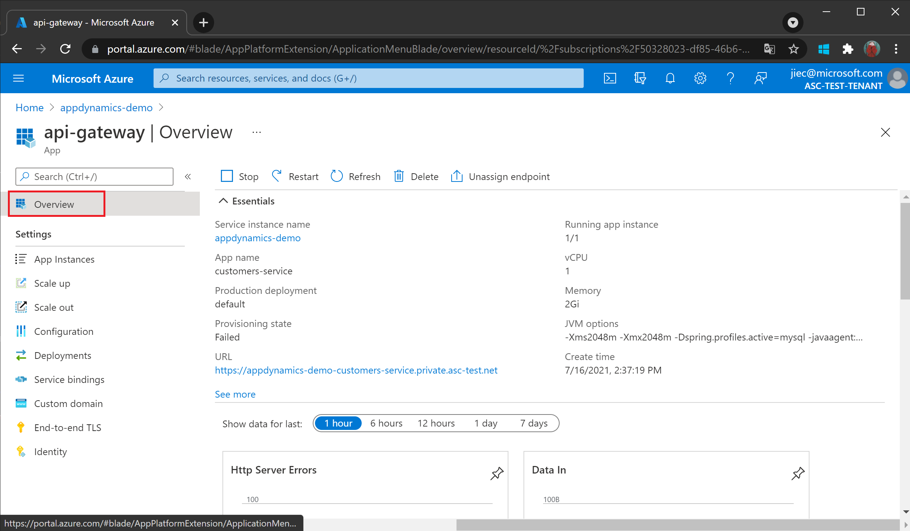
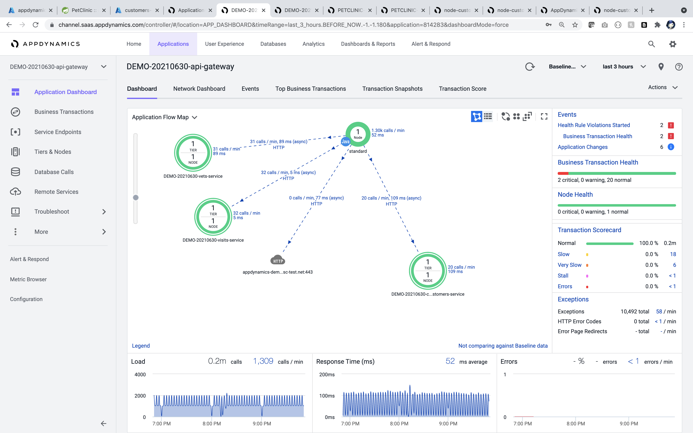
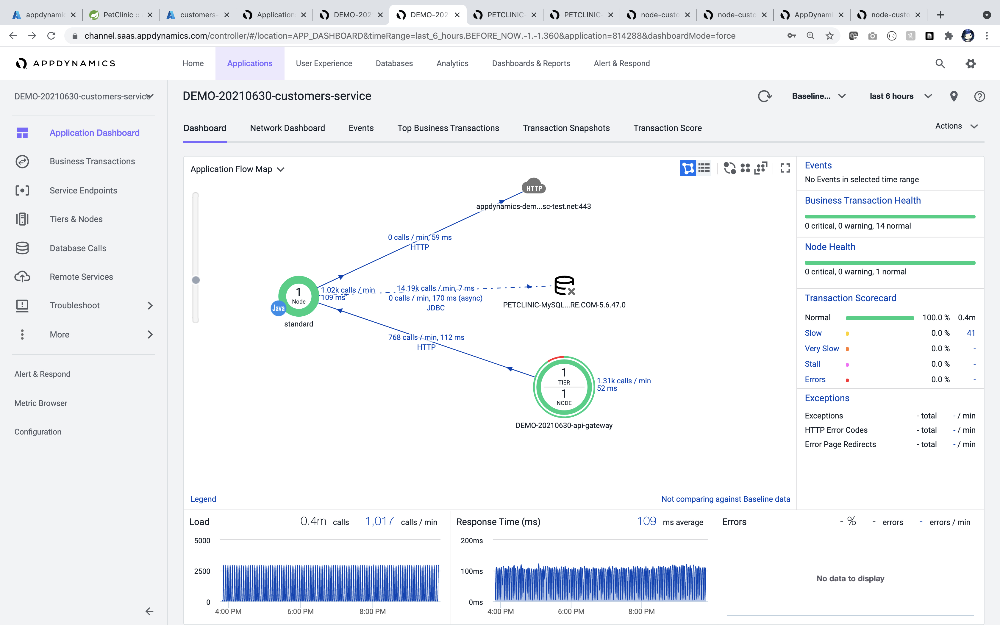
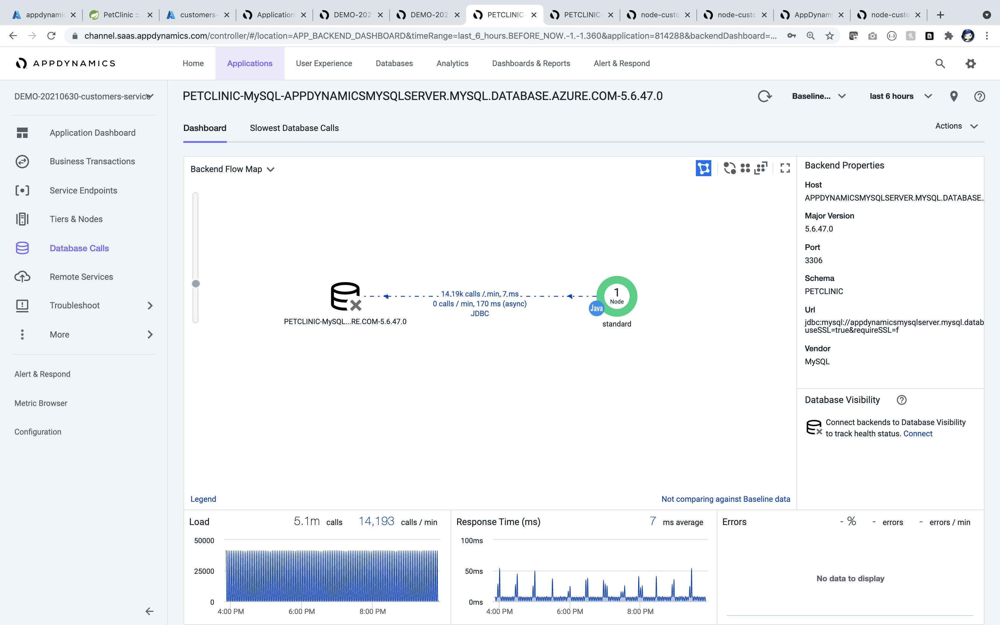
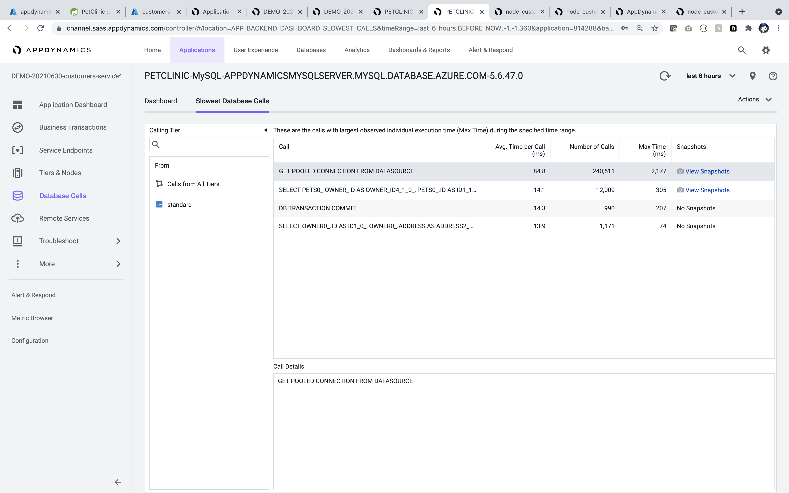
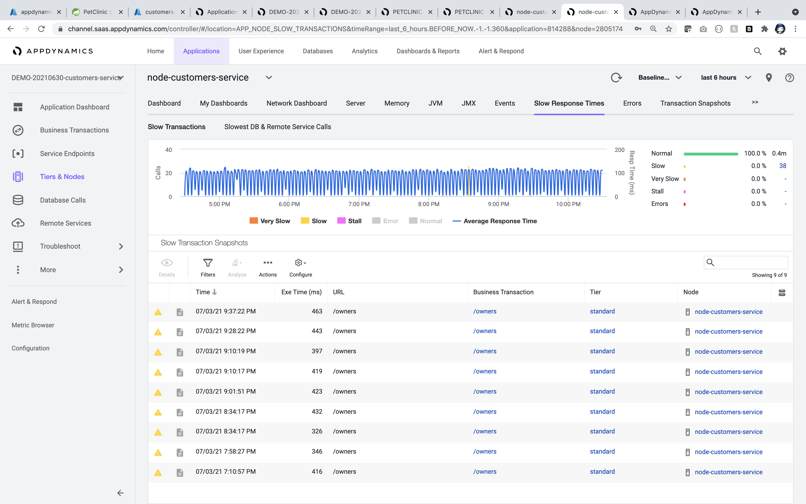
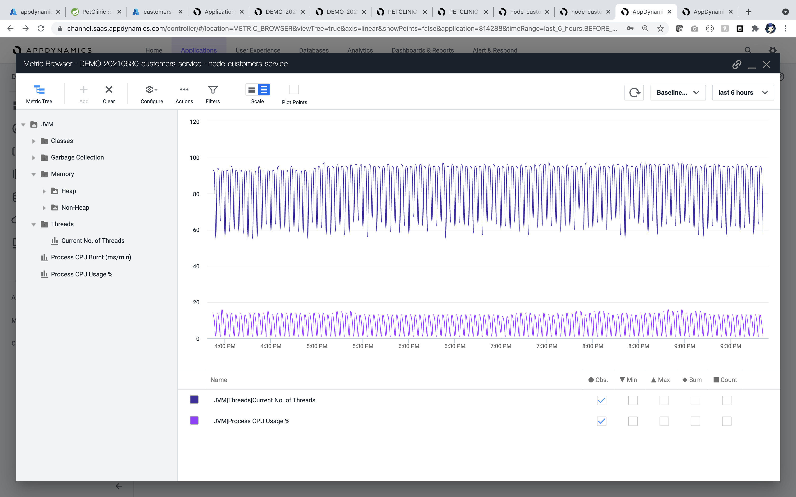

# How to monitor Azure Spring Cloud applications with AppDynamics Java agent (Preview)

> [!Note]
> This document is in progress and will undergo further editorial review.  
> Remove this section before publish.


This feature enables monitoring of Azure Spring Cloud apps with the AppDynamics Java agent.

With the AppDynamics Java agent, you can:

- Monitor apps with the AppDynamics Java agent.
- Configure the AppDynamics Java agent using Environment Variables.
- Check all monitoring data from the AppDynamics dashboard.


The following video introduces AppDynamics Java In-Process Agent.
<br>
> [!VIDEO https://www.youtube.com/embed/8o-xNoqUFsQ]


## Prerequisites
To monitor your Spring Cloud workloads with AppDynamics, you **must** integrate Agent with your Azure Spring Cloud application. You will need the following to use these features:
* AppDynamics account.
* [Install the Azure CLI](https://docs.microsoft.com/cli/azure/install-azure-cli).

## Integrate Azure Spring Cloud with AppDynamics Java In-Process Agent
### Option 1: Integrate by Azure CLI

1. Create a resource group.
2. Create an instance of Azure Spring Cloud.
3. Create an application.
    ```shell
    az spring-cloud app create --name "appName" --is-public true \
        -s "serviceName" -g "resourceGroupName"
    ```
4. Create a deployment with the AppDynamics agent and **Environment Variables**.

   >You should already get the `APPDYNAMICS_AGENT_ACCOUNT_ACCESS_KEY`, `APPDYNAMICS_AGENT_ACCOUNT_NAME` and `APPDYNAMICS_CONTROLLER_HOST_NAME` to connect to AppDynamics. And customize other variables as your wish. For details please refer to [AppDynamics's Doc (not ready yet, should tell user how to get these variables, how these variables work)]()
    ```azurecli
    az spring-cloud app deploy --name "appName" --jar-path app.jar \
       -s "serviceName" -g "resourceGroupName" \
       --jvm-options="-javaagent:/opt/agents/appdynamics/java/javaagent.jar" \
       --env APPDYNAMICS_AGENT_APPLICATION_NAME=<YOUR_APPLICATION_NAME> \
             APPDYNAMICS_AGENT_ACCOUNT_ACCESS_KEY=<YOUR_AGENT_ACCESS_KEY> \
             APPDYNAMICS_AGENT_ACCOUNT_NAME=<YOUR_AGENT_ACCOUNT_NAME> \
             APPDYNAMICS_AGENT_NODE_NAME=<YOUR_AGENT_NODE_NAME> \
             APPDYNAMICS_AGENT_TIER_NAME=<YOUR_AGENT_TIER_NAME> \
             APPDYNAMICS_CONTROLLER_HOST_NAME=<YOUR_APPDYNAMICS_CONTROLLER_HOST_NAME> \
             APPDYNAMICS_CONTROLLER_SSL_ENABLED=true \
             APPDYNAMICS_CONTROLLER_PORT=443
    ```

  Azure Spring Cloud pre-installs the AppDynamics Java agent to the path `/opt/agents/appdynamics/java/javaagent.jar`. Customers can integrate the agent from applications' **Jvm Options**, and then configure the agent using the [AppDynamics Java agent environment variables](https://docs.appdynamics.com/21.7/en/application-monitoring/install-app-server-agents/java-agent/install-the-java-agent/use-environment-variables-for-java-agent-settings).

### Option 2: Integrate by Azure Portal

1. Find the application from **Settings**/**Apps** in the navigation pane.

   

2. Click the application to jump to the **Overview** page.

   

3. Click **Configuration** in the left navigation pane to add/update/delete the **Environment Variables** of the application.

   

4. Click **General settings** to add/update/delete the **Jvm Option** of the application.

   

## Automation

Using Terraform or an Azure Resource Manager template (ARM template), you can also run a provisioning automation pipeline. This pipeline can provide a complete hands-off experience to instrument and monitor any new applications that you create and deploy.

### Terraform

To configure the environment variables in a Terraform template, add the following code to the template, replacing the *\<...>* placeholders with your own values. For more information, see [Manages an Active Azure Spring Cloud Deployment](https://registry.terraform.io/providers/hashicorp/azurerm/latest/docs/resources/spring_cloud_active_deployment).

```terraform
resource "azurerm_spring_cloud_java_deployment" "example" {
  ...
  jvm_options = "-javaagent:/opt/agents/appdynamics/java/javaagent.jar"
  ...
    environment_variables = {
      "APPDYNAMICS_AGENT_APPLICATION_NAME" : "<YOUR_APPLICATION_NAME>",
      "APPDYNAMICS_AGENT_APPLICATION_NAME" : "<YOUR_APPLICATION_NAME>",
      "APPDYNAMICS_AGENT_ACCOUNT_ACCESS_KEY" : "<YOUR_AGENT_ACCESS_KEY>",
      "APPDYNAMICS_AGENT_ACCOUNT_NAME" : "<YOUR_AGENT_ACCOUNT_NAME>",
      "APPDYNAMICS_AGENT_NODE_NAME" : "<YOUR_AGENT_NODE_NAME>",
      "APPDYNAMICS_AGENT_TIER_NAME" : "<YOUR_AGENT_TIER_NAME>",
      "APPDYNAMICS_CONTROLLER_HOST_NAME" : "<YOUR_APPDYNAMICS_CONTROLLER_HOST_NAME>",
      "APPDYNAMICS_CONTROLLER_SSL_ENABLED" : "<YOUR_CASE>",
      "APPDYNAMICS_CONTROLLER_PORT" : "<YOUR_CASE>"
  }
}
```

### ARM template

To configure the environment variables in an ARM template, add the following code to the template, replacing the *\<...>* placeholders with your own values. For more information, see [Microsoft.AppPlatform Spring/apps/deployments](/azure/templates/microsoft.appplatform/spring/apps/deployments?tabs=json).

```ARM template
"deploymentSettings": {
  "environmentVariables": {
    "APPDYNAMICS_AGENT_APPLICATION_NAME" : "<YOUR_APPLICATION_NAME>",
    "APPDYNAMICS_AGENT_APPLICATION_NAME" : "<YOUR_APPLICATION_NAME>",
    "APPDYNAMICS_AGENT_ACCOUNT_ACCESS_KEY" : "<YOUR_AGENT_ACCESS_KEY>",
    "APPDYNAMICS_AGENT_ACCOUNT_NAME" : "<YOUR_AGENT_ACCOUNT_NAME>",
    "APPDYNAMICS_AGENT_NODE_NAME" : "<YOUR_AGENT_NODE_NAME>",
    "APPDYNAMICS_AGENT_TIER_NAME" : "<YOUR_AGENT_TIER_NAME>",
    "APPDYNAMICS_CONTROLLER_HOST_NAME" : "<YOUR_APPDYNAMICS_CONTROLLER_HOST_NAME>",
    "APPDYNAMICS_CONTROLLER_SSL_ENABLED" : "<YOUR_CASE>",
    "APPDYNAMICS_CONTROLLER_PORT" : "<YOUR_CASE>"
  },
  "jvmOptions": "-javaagent:/opt/agents/appdynamics/java/javaagent.jar",
  ...
}
```

## Review reports in AppDynamics Dashboard
1. You can take a overview of your apps in the AppDynamics dashboard
   
2. You can find the overall information for your apps
   - `api-gateway`
   
   - `customers-service`
   
3. You can find the basic information for database calls
   
4. You can dig deeper to find slowest database calls
   
   
5. You can find the memory usage analysis
  
6. You can find the garbage collection process
  
7. You can find slowest transactions 

8. You can define more metrics for JVM



## AppDynamics Agent Logging

By default, Azure Spring Cloud will print the **info** level logs of the AppDynamics Agent to `STDOUT`. The logs will be mixed with the application logs. You can find the explicit agent version from the application logs.

There are several way to get the logs of AppDynamics Agent:

* Azure Spring Cloud Logs.
* Azure Spring Cloud Application Insights.
* Azure Spring Cloud LogStream.

## AppDynamics Agent upgrade

The AppDynamics Agent will be upgraded regularly with JDK (quarterly). Agent upgrade may affect the following scenarios:

* Existing applications using AppDynamics Agent before upgrade will be unchanged, but will require restart or redeploy to engage the new version of AppDynamics Agent.
* Applications created after upgrade will use the new version of AppDynamics Agent.

## Vnet Injection Instance Outbound Traffic Configuration

For vnet injection instances of Azure Spring Cloud, you need to make sure the outbound traffic is configured correctly for AppDynamics Agent. Please refer to [AppDynamics Network Properties(**not ready yet**)]() and [Customer responsibilities for running Azure Spring Cloud in VNET](vnet-customer-responsibilities.md) for details.

## Limitaions
Please refer to [Limitations when integrate azure spring cloud with AppDynamics Java In-Process Agent (**not ready yet**)]()

## Next Step
* [Use distributed tracing with Azure Spring Cloud](how-to-distributed-tracing.md)
