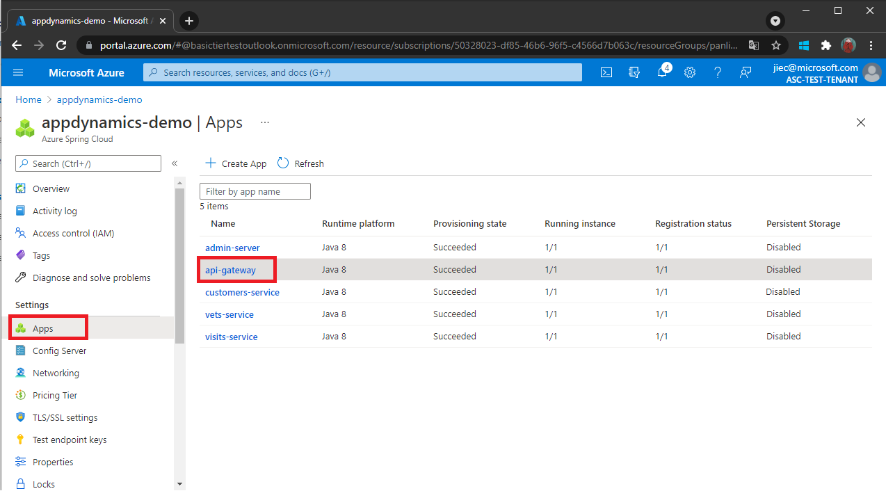
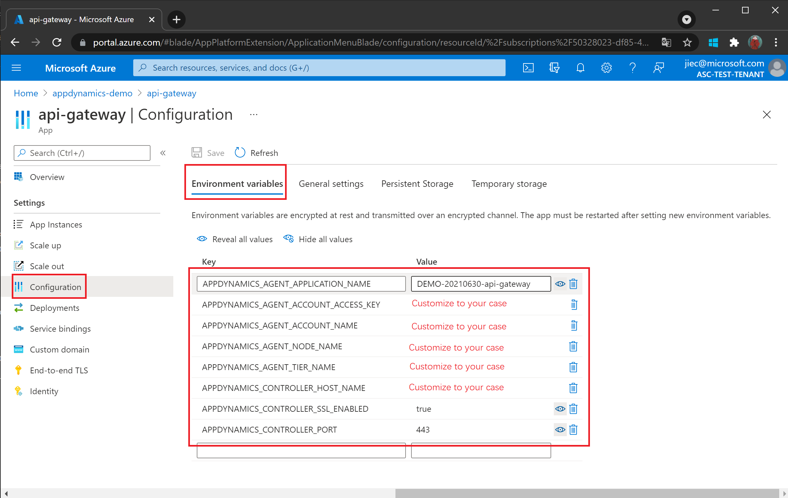
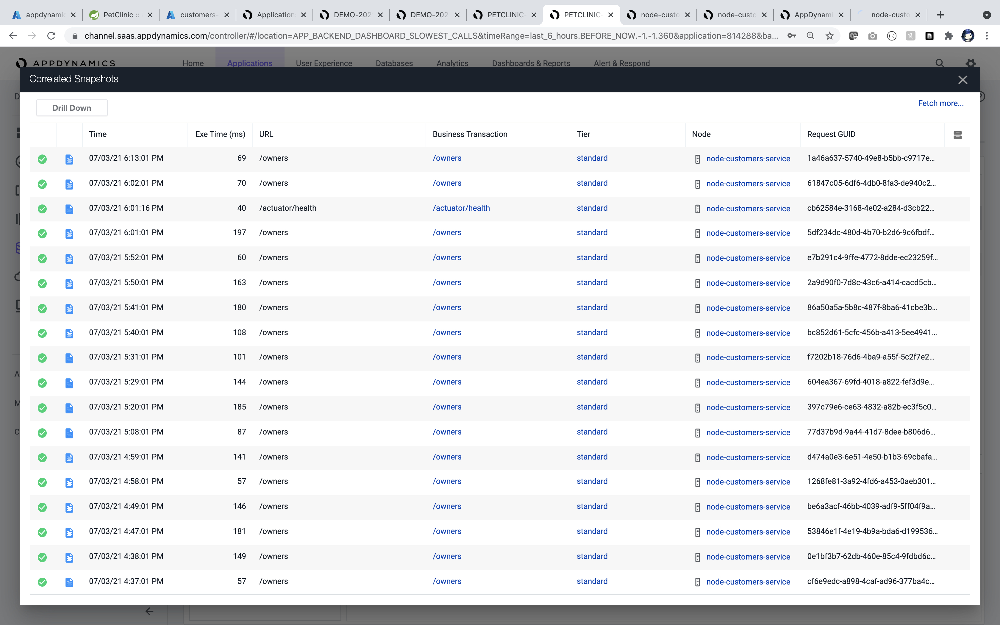
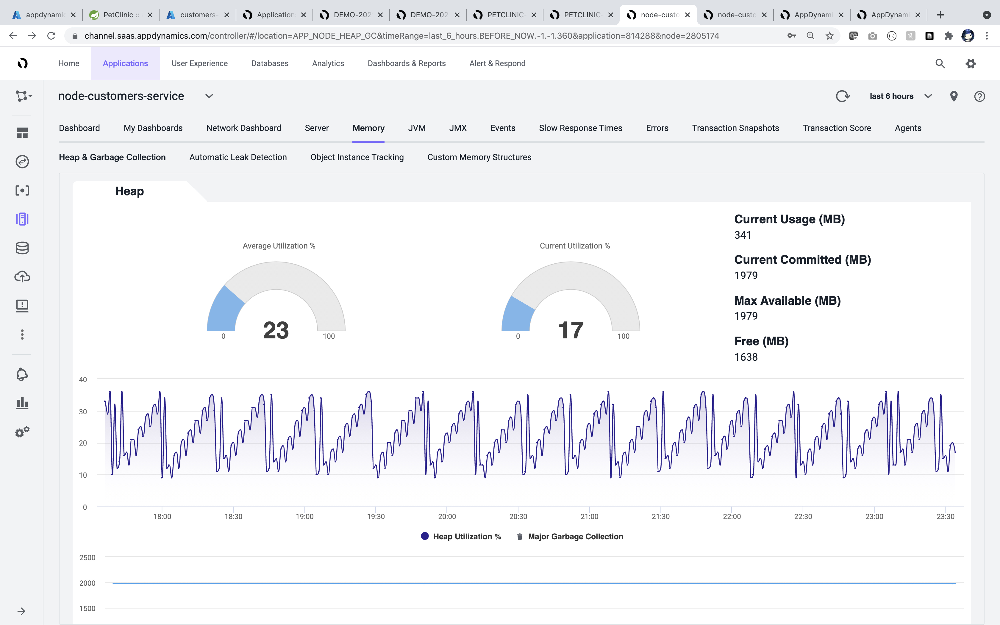
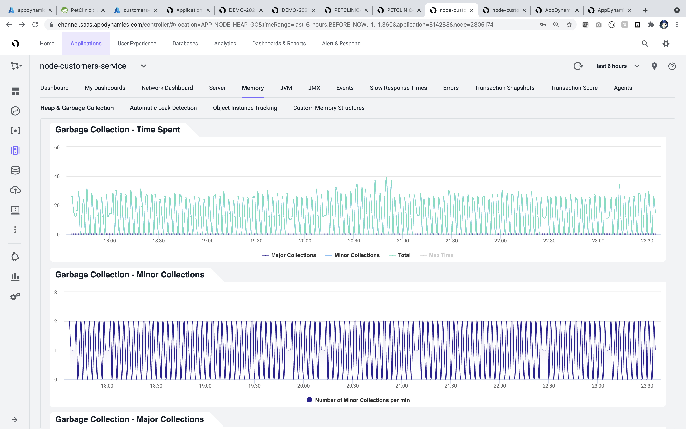

# How to monitor with AppDynamics Java agent (Preview)

> [!Note]
> This document is in progress and will undergo further editorial review.


This feature enables monitoring of Azure Spring Cloud apps with the **AppDynamics** Java agent.

With the **AppDynamics** Java agent, you can:

- Consume the **AppDynamics** Java agent.
- Configure the **AppDynamics** Java agent using Environment Variables.
- Check all monitoring data from the **AppDynamics** dashboard.

## Prerequisite
To monitor your Spring Cloud workloads with **AppDynamics**, **you** must integrate Agent with your Azure Spring Cloud application. You will need the following to use these features:
* **AppDynamics** account.
* [Install the Azure CLI](https://docs.microsoft.com/cli/azure/install-azure-cli).

## Leverage the AppDynamics Java in-process Agent with Azure CLI

Use the following procedure to access the agent:

1. Create an instance of Azure Spring Cloud.
2. Create an application.
    ```shell
      az spring-cloud app create --name "appName" --is-public true \
      -s "resourceName" -g "resourceGroupName"
    ```
3. Create a deployment with the **AppDynamics** agent and **Environment Variables**.
   >You should already get the `APPDYNAMICS_AGENT_ACCOUNT_ACCESS_KEY`, `APPDYNAMICS_AGENT_ACCOUNT_NAME` and `APPDYNAMICS_CONTROLLER_HOST_NAME` to connect to AppDynamics. And customize other variables as your wish.
    ```shell
    az spring-cloud app deploy --name "appName" --jar-path app.jar \
       -s "resourceName" -g "resourceGroupName" \
       --jvm-options="-javaagent:/opt/agents/appdynamics/java/javaagent.jar" \
       --env APPDYNAMICS_AGENT_APPLICATION_NAME=<YOUR_APPLICATION_NAME> \
             APPDYNAMICS_AGENT_ACCOUNT_ACCESS_KEY=<YOUR_AGENT_ACCESS_KEY> \
             APPDYNAMICS_AGENT_ACCOUNT_NAME=<YOUR_AGENT_ACCOUNT_NAME> \
             APPDYNAMICS_AGENT_NODE_NAME=<YOUR_AGENT_NODE_NAME> \
             APPDYNAMICS_AGENT_TIER_NAME=<YOUR_AGENT_TIER_NAME> \
             APPDYNAMICS_CONTROLLER_HOST_NAME=<YOUR_APPDYNAMICS_CONTROLLER_HOST_NAME> \
             APPDYNAMICS_CONTROLLER_SSL_ENABLED=true \
             APPDYNAMICS_CONTROLLER_PORT=443
    ```

  Azure Spring Cloud pre-installs the **AppDynamics** Java agent to the following path. Customers can leverage the agent from applications' **Jvm Options**, as well as configure the agent using the [AppDynamics Java agent environment variables](https://docs.appdynamics.com/21.7/en/application-monitoring/install-app-server-agents/java-agent/install-the-java-agent/use-environment-variables-for-java-agent-settings).

  ```shell
  /opt/agents/appdynamics/java/javaagent.jar
  ```

## Leverage the AppDynamics Java in-process Agent with Azure Portal

You can also leverage this agent from portal with the following procedure. 

1. Find the app from **Settings**/**Apps** in the navigation pane.

   

2. Click the application to jump to the **Overview** page.

   

3. Click **Configuration** in the left navigation pane to add/update/delete the **Environment Variables** of the application.

   

4. Click **General settings** to add/update/delete the **Jvm Option** of the application.

   

## Review the Reports on AppDynamics Dashboard
1. You can take a overview of your apps in the **AppDynamics** dashboard
   
2. You can find the overall information for your apps
   - `api-gateway`
   
   - `customers-service`
   
3. You can find the basic information for database calls
   
4. You can dig deeper to find slowest database calls
   
   
5. You can find the memory usage analysis
  
6. You can find the garbage collection process
  
7. You can find slowest transactions 

8. You can define more metrics for JVM


## AppDynamics Agent Logging

By default, Azure Spring Cloud will print the **info** level logs of the **AppDynamics Agent** to `STDOUT`. The logs will be mixed with the application logs. You can find the explicit agent version from the application logs.

You can also get the logs of **AppDynamics** agent from:

* Azure Spring Cloud Logs.
* Azure Spring Cloud Application Insights.
* Azure Spring Cloud LogStream.

## AppDynamics Agent Update/Upgrade

The **AppDynamics Agent** will update/upgrade regularly with JDK (quarterly). Agent update/upgrade may impact the following scenarios.

* Existing applications using **AppDynamics Agent** before update/upgrade will be unchanged.
* Existing applications that use **AppDynamics Agent** before update/upgrade require restart or redeploy to engage new version of **Dynatrace Agent**.
* Applications created after update/upgrade will use the new version of **AppDynamics Agent**.

## Vnet Injection Instance Outbound Traffic Configuration

For vnet injection instances of Azure Spring Cloud, you need to make sure the outbound traffic is configured correctly for **AppDynamics Agent**.

## Limitaions
>TODO: need a limitaion document for integrate appdynamics with Azure Spring Cloud

## Next Step
* [Use distributed tracing with Azure Spring Cloud](how-to-distributed-tracing.md)
