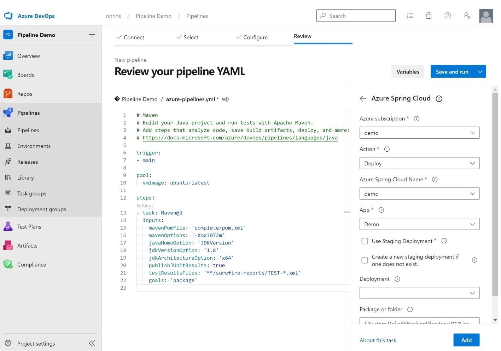
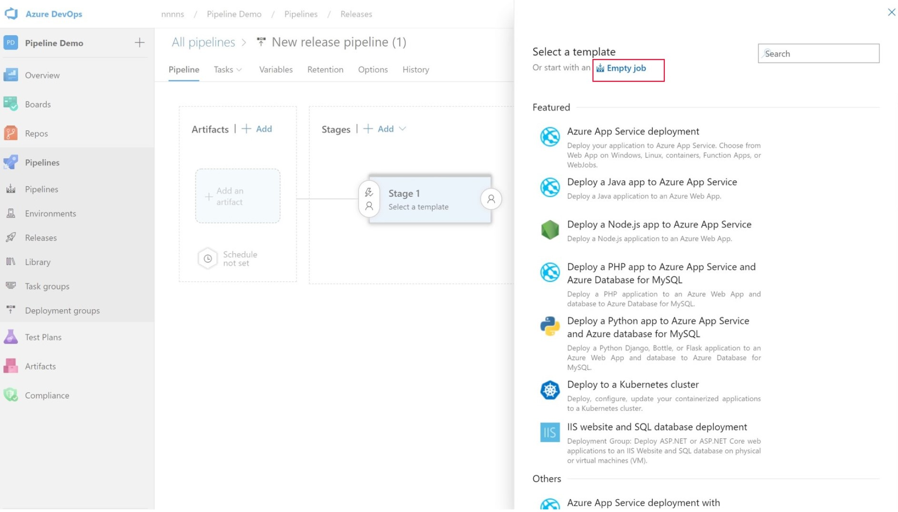
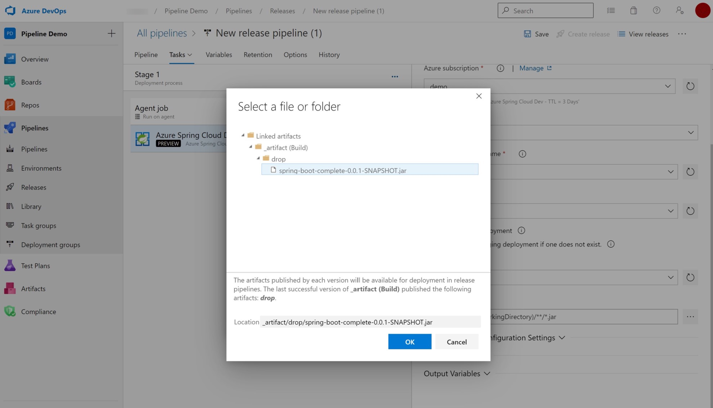
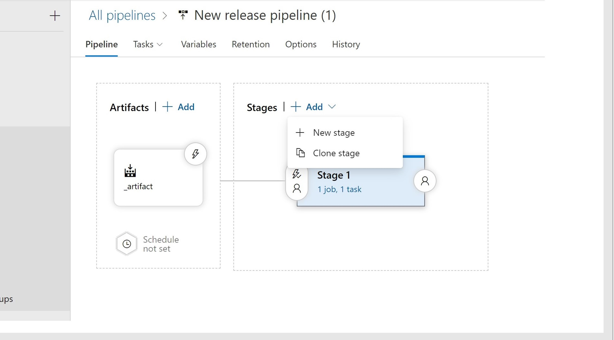

# Automate application deployments to Azure Spring Cloud

This article shows you how to use the [Azure Spring Cloud task for Azure Pipelines](/azure/devops/pipelines/tasks/deploy/azure-spring-cloud) to deploy applications.

Continuous integration and continuous delivery tools let you quickly deploy updates to existing applications with minimal effort and risk. Azure DevOps helps you organize and control these key jobs. 

The following video describes end-to-end automation using tools of your choice, including Azure Pipelines.

<br>

> [!VIDEO https://www.youtube.com/embed/D2cfXAbUwDc?list=PLPeZXlCR7ew8LlhnSH63KcM0XhMKxT1k_]

::: zone pivot="programming-language-csharp"

## Create an Azure Resource Manager service connection

Read [this article](/azure/devops/pipelines/library/connect-to-azure) to learn how to create an Azure Resource Manager service connection to your Azure DevOps project. Be sure to select the same subscription you are using for your Azure Spring Cloud service instance.

## Build and deploy apps


### Deploy artifacts

You can build and deploy your projects using a series of tasks. This snippet defines variables, a .NET Core task to build the application, and an Azure Spring Cloud task to deploy the application.

```yaml
variables:
  workingDirectory: './steeltoe-sample'
  planetMainEntry: 'Microsoft.Azure.SpringCloud.Sample.PlanetWeatherProvider.dll'
  solarMainEntry: 'Microsoft.Azure.SpringCloud.Sample.SolarSystemWeather.dll'
  planetAppName: 'planet-weather-provider'
  solarAppName: 'solar-system-weather'
  serviceName: '<your service name>'


steps:
# Restore, build, publish and package the zipped planet app
- task: DotNetCoreCLI@2
  inputs:
    command: 'publish'
    publishWebProjects: false
    arguments: '--configuration Release'
    zipAfterPublish: false
    modifyOutputPath: false
    workingDirectory: $(workingDirectory)

# Deploy the planet app
- task: AzureSpringCloud@0
  inputs:
    azureSubscription: '<Service Connection Name>'
    Action: 'Deploy'
    AzureSpringCloud: $(serviceName)
    AppName: 'testapp'
    UseStagingDeployment: false
    DeploymentName: 'default'
    Package: $(workingDirectory)/src/$(planetAppName)/publish-deploy-planet.zip
    RuntimeVersion: 'NetCore_31'
    DotNetCoreMainEntryPath: $(planetMainEntry)

# Deploy the solar app
- task: AzureSpringCloud@0
  inputs:
    azureSubscription: '<Service Connection Name>'
    Action: 'Deploy'
    AzureSpringCloud: $(serviceName)
    AppName: 'testapp'
    UseStagingDeployment: false
    DeploymentName: 'default'
    Package: $(workingDirectory)/src/$(solarAppName)/publish-deploy-solar.zip
    RuntimeVersion: 'NetCore_31'
    DotNetCoreMainEntryPath: $(solarMainEntry)
```

::: zone-end
::: zone pivot="programming-language-java"

## Set up Spring Cloud Instance and DevOps project
1.	Go to your Azure Spring Cloud instance and create a new app. 
2.	Go to Azure DevOps website and create a new project under a chosen organization. If you do not have a DevOps organization, you could create one for free.
3.	Go to repo section and import demo code from [this link](https://github.com/spring-guides/gs-spring-boot) to repo.

## Create an Azure Resource Manager service connection

Read [this article](/azure/devops/pipelines/library/connect-to-azure) to learn how to create an Azure Resource Manager service connection to your Azure DevOps project. Be sure to select the same subscription you are using for your Azure Spring Cloud service instance.

## Build and deploy apps
DevOps provides you with convenient ways to deploy your app. The following displays how to do it.

### Deploy artifacts via pipeline

1. Click on Pipelines blade and create a new pipeline with a Maven template.
2. Edit yml file:

> * Change mavenPomFile under Maven task to 'complete/pom.xml'.
> * Click show assistance on the right side and choose Azure Spring Cloud template.
> * Choose the service connection you just created for Azure Subscription. Choose your Spring Cloud Instance and App Instance. 
> * Disable “Use Staging Deployment”.
> * Change package or folder to complete/target/spring-boot-complete-0.0.1-SNAPSHOT.jar.
> * Add this task to your pipeline.

  
> This Azure Spring Cloud task setting demo is displayed in the following image.
[ ](media/spring-cloud-how-to-cicd/pipeline-task-setting.jpg#lightbox)

> Or you can build and deploy your projects using following template. This snippet first defines a Maven task to build the application, followed by a second task that deploys the JAR file using the Azure Spring Cloud task for Azure Pipelines.

```yaml
steps:
- task: Maven@3
  inputs:
    mavenPomFile: 'pom.xml'
- task: AzureSpringCloud@0
  inputs:
    azureSubscription: '<your service connection name>'
    Action: 'Deploy'
    AzureSpringCloud: <your Azure Spring Cloud service>
    AppName: <app-name>
    UseStagingDeployment: false
    DeploymentName: 'default'
    Package: ./target/your-result-jar.jar
```

3. Click save and run, and then wait for job to be done.

### Blue-green deployments

The deployment shown in the previous section immediately receives application traffic upon deployment. Sometimes, developers want to test their applications in the production environment but before the application receives any customer traffic.

#### Edit pipleline file
The following snippet builds the application the same way as above and then deploys it to a staging deployment. In this example, the staging deployment must already exist. For an alternative approach, see [Blue-green deployment strategies](concepts-blue-green-deployment-strategies.md).

```yaml
steps:
- task: Maven@3
  inputs:
    mavenPomFile: 'pom.xml'
- task: AzureSpringCloud@0
  inputs:
    azureSubscription: '<your service connection name>'
    Action: 'Deploy'
    AzureSpringCloud: <your Azure Spring Cloud service>
    AppName: <app-name>
    UseStagingDeployment: true
    Package: ./target/your-result-jar.jar
- task: AzureSpringCloud@0
  inputs:
    azureSubscription: '<your service connection name>'
    Action: 'Set Production'
    AzureSpringCloud: <your Azure Spring Cloud service>
    AppName: <app-name>
    UseStagingDeployment: true
```

#### Use Release Blade
The follow steps demonstrate how to enable blue-green deployment via Release Blade.

1.	Click on Pipelines blade and create a new pipeline for Maven build and Publish artifact
> *	Choose Maven template and change mavenPomFile to ‘complete/pom.xml’
> *	Click on show assistance on the right side and choose publish build artifact template
> *	Change Path to public to complete/target/spring-boot-complete-0.0.1-SNAPSHOT.jar
> *	Click on save and run

2.	Go to Releases blade. Add a new pipeline, and choose an empty job to edit.
> [ ](media/spring-cloud-how-to-cicd/Choose-empty-template.jpg#lightbox)
> * Create a new job and search for “Azure Spring Cloud” template.
> [ ](media/spring-cloud-how-to-cicd/Create-new-job.jpg#lightbox)
> * Fill this task with your app's information. 
> * Disable "use staging deployment". Click "create a new staging deployment" and enter deployment name.
> [ ](media/spring-cloud-how-to-cicd/Fill-the-job-template.jpg#lightbox)
> * Click on save.

3.  Click on the artifact and choose the pipeline that publish the artifact. Then, click on the task in the stage 1, and then change package or folder to the artifact address. Save changes.
[ ](media/spring-cloud-how-to-cicd/Change-artifact-path.jpg#lightbox)

4. Click on clone stage and modify this stage
> * Change action to “Set Production Deployment”
> * Fill blanks of this task.
> [ ](media/spring-cloud-how-to-cicd/Clone-the-stage.jpg#lightbox)

5.	Click “create release”, the deployment will automatically start.

Click “view release” to check current release status. Wait job to be done. Go to Azure portal and check your app status.

### Deploy from source

It is possible to deploy directly to Azure without a separate build step.

```yaml
- task: AzureSpringCloud@0
  inputs:
    azureSubscription: '<your service connection name>'
    Action: 'Deploy'
    AzureSpringCloud: <your Azure Spring Cloud service>
    AppName: <app-name>
    UseStagingDeployment: false
    DeploymentName: 'default'
    Package: $(Build.SourcesDirectory)
```

::: zone-end

## Next steps

* [Quickstart: Deploy your first Azure Spring Cloud application](./quickstart.md)
