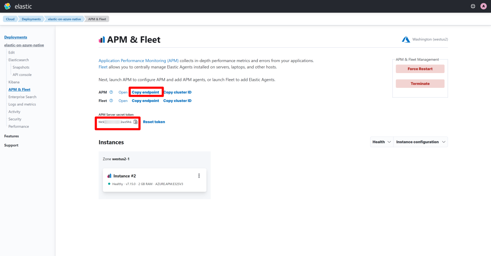
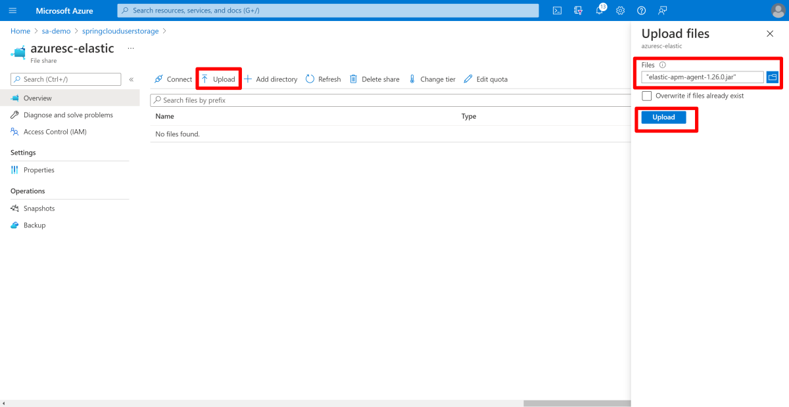
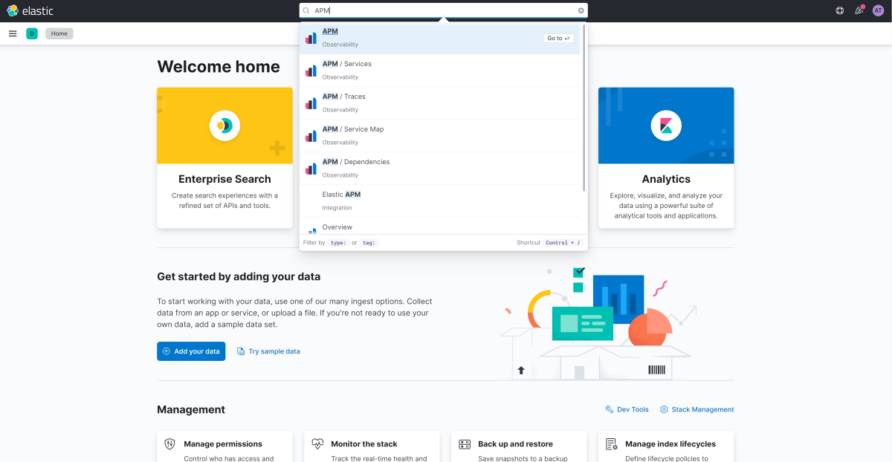
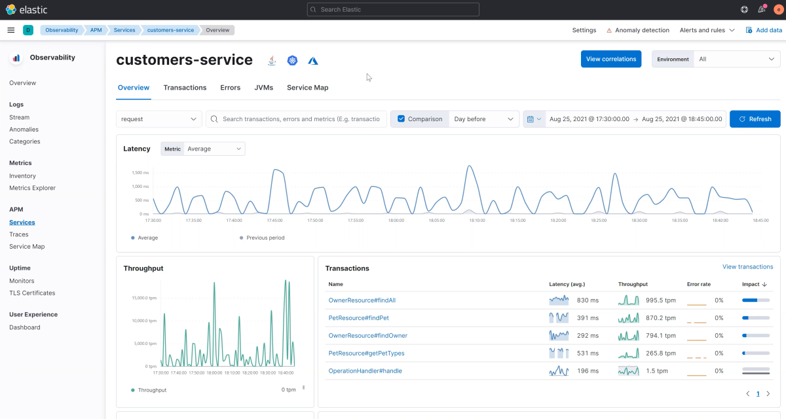
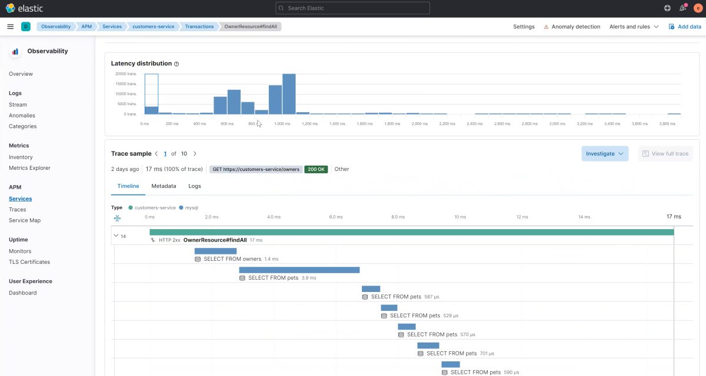
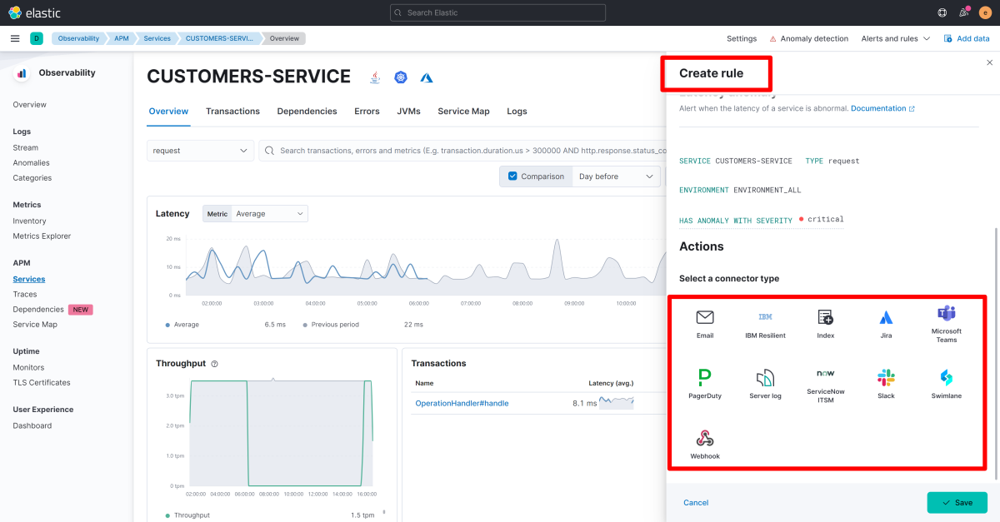

# How to monitor Spring Boot apps with Elastic APM Java Agent

This article explains how to use Elastic APM Agent to monitor Spring Boot applications running in Azure Spring Cloud. It involves two steps that this article dives deep into:

1. Mount custom persistent storage with Elastic APM Java agent binary to Azure Spring Cloud service.

1. Activate Elastic APM Java agent for the Azure Spring Cloud applications.

With the Elastic Observability Solution you can achieve unified observability for your Azure Spring Cloud Applications by 

* Monitor apps using the Elastic APM Java Agent by using persistent storage with Azure Spring Cloud
* Leverage Diagnostic Settings to ship Azure Spring Cloud logs to Elastic [Analyze logs with Elastic(ELK) using diagnostics settings](https://github.com/hemantmalik/azure-docs/blob/master/articles/spring-cloud/how-to-elastic-diagnostic-settings.md)

> [Introduction to Elastic Observability Solution](https://www.youtube.com/watch?v=uCX24hRBULY)

## Prerequisites

* [Azure CLI](/cli/azure/install-azure-cli)
* [Deploy Elastic on Azure](https://www.elastic.co/blog/getting-started-with-the-azure-integration-enhancement)
* [Elastic APM Endpoint and Secret Token from the Elastic Deployment](https://www.elastic.co/guide/en/cloud/current/ec-manage-apm-and-fleet.html)

## Monitor Azure Spring Cloud Applications using Elastic APM

The following sections use Spring Petclinic service as an example to walk through the steps of how to activate Elastic APM Java agent for your Azure Spring Cloud Applications using the persistent storage feature.

### Deploy Spring Petclinic Application

1. Follow the guide [here](https://github.com/Azure-Samples/spring-petclinic-microservices) to deploy Microservices based Spring Petclinic application to Azure Spring Cloud. Follow this guide until the [Deploy Spring Boot applications and set environment variables](https://github.com/Azure-Samples/spring-petclinic-microservices#deploy-spring-boot-applications-and-set-environment-variables) step.

   You can use the Azure Spring Cloud extenstion for Azure CLI to create an Azure Spring Cloud application using CLI

   ```azurecli
   az spring-cloud app create \
      --resource-group "<your-resource-group-name>" \
      --service "<your-Azure-Spring-Cloud-instance-name>" \
      --name "<your-spring-app-name>" \
      --is-public true
   ```

### Enable custom persistent storage for  Azure Spring Cloud service

1. Follow the steps [here](how-to-custom-persistent-storage.md) to enable your custom persistent storage.

1. You can use the following Azure CLI command to add persistent storage for your Azure Spring Cloud apps.

   ```azurecli
   az spring-cloud app append-persistent-storage \
      --persistent-storage-type AzureFileVolume \
      --share-name <your-azure-fileshare-name> \
      --mount-path <unique-mount-path> \
      --storage-name <your-mounted-storage-name> \
      -n <your-azure-spring-cloud-app-name> \
      -g <your-resource-group-name> \
      -s <your-azure-spring-cloud-service-name>
      ```

### Activate Elastic APM Java Agent

1. Before proceeding ahead you would need Elastic APM server connectivity information handy. This assumes you have   [deployed Elastic on Azure](https://www.elastic.co/blog/getting-started-with-the-azure-integration-enhancement).

1. From Azure Portal, click on the **Manage Elastic Cloud Deployment** on the *Overview* blade  of your Elastic Deployment.

   

1. Under your deployment on Elastic Cloud Console, click on APM & Fleet section to get Elastic APM Server endpoint and secret token

   

1. Download Elastic APM Java Agent from [Maven Central](https://search.maven.org/search?q=g:co.elastic.apm%20AND%20a:elastic-apm-agent)

   

1. Upload Elastic APM Agent to custom persistent storage  enabled earlier. Go to Azure Fileshare and click on *Upload* to add the agent jar file.

   

1. Once you have the Elastic APM endpoint and secret token, you can use following Azure CLI command to activate Elastic APM Java agent when deploying applications.

```azurecli
az  spring-cloud app deploy --name <your-app-name> \
    --artifact-path <unique-path-to-your-app-jar-on-custom-storage> \
    --jvm-options='-Xms2048m -Xmx2048m -Dspring.profiles.active=mysql -javaagent:<elastic-apm-java-agent-location-from-mounted-storage>' \
    --env ELASTIC_APM_SERVICE_NAME=<your-app-name> \
          ELASTIC_APM_APPLICATION_PACKAGES='<your-app-package-name>' \
          ELASTIC_APM_SERVER_URL='<replace-with-your-Elastic-APM-server-url>' \
          ELASTIC_APM_SECRET_TOKEN='<replace-with-your-Elastic-APM-secret-token>'
```

### Automate provisioning

You can also run a provisioning automation pipeline using Terraform or an Azure Resource Manager template (ARM template). This pipeline can provide a complete hands-off experience to instrument and monitor any new applications that you create and deploy.

#### Automate provisioning using Terraform

To configure the environment variables in a Terraform template, add the following code to the template, replacing the *\<...>* placeholders with your own values. For more information, see [Manages an Active Azure Spring Cloud Deployment](https://registry.terraform.io/providers/hashicorp/azurerm/latest/docs/resources/spring_cloud_active_deployment).

```terraform
resource "azurerm_spring_cloud_java_deployment" "example" {
  ...
  jvm_options = "-javaagent:<unique-path-to-your-app-jar-on-custom-storage>"
  ...
    environment_variables = {
      "ELASTIC_APM_SERVICE_NAME"="<your-app-name>",
      "ELASTIC_APM_APPLICATION_PACKAGES"="<your-app-package>",
      "ELASTIC_APM_SERVER_URL"="<replace-with-your-Elastic-APM-server-url>",
      "ELASTIC_APM_SECRET_TOKEN"="<replace-with-your-Elastic-APM-secret-token>"
  }
}
```

#### Automate provisioning using an ARM template

To configure the environment variables in an ARM template, add the following code to the template, replacing the *\<...>* placeholders with your own values. For more information, see [Microsoft.AppPlatform Spring/apps/deployments](/azure/templates/microsoft.appplatform/spring/apps/deployments?tabs=json).

```arm
"deploymentSettings": {
  "environmentVariables": {
    "ELASTIC_APM_SERVICE_NAME"="<your-app-name>",
    "ELASTIC_APM_APPLICATION_PACKAGES"="<your-app-package>",
    "ELASTIC_APM_SERVER_URL"="<replace-with-your-Elastic-APM-server-url>",
    "ELASTIC_APM_SECRET_TOKEN"="<replace-with-your-Elastic-APM-secret-token>"
  },
  "jvmOptions": "-javaagent:<unique-path-to-your-app-jar-on-custom-storage>",
  ...
}
```

### Upgrading Elastic APM Java Agent

Refer to documentation for [Upgrade versions](https://www.elastic.co/guide/en/cloud/current/ec-upgrade-deployment.html) for Elastic Cloud on Azure. [Breaking Changes](https://www.elastic.co/guide/en/apm/server/current/breaking-changes.html) for APM is another good starting point for planning your upgrade. Once APM Server is upgraded, you will upload the Elastic APM Java agent jar file in the custom persistent storage and restart apps with updated jvm options pointing to upgraded Elastic APM Java agent jar. 

### Monitoring Applications and metrics with Elastic APM

1. From the Azure Portal, click on Kibana link from the overview blade of Elastic Deployment to open Kibana. 

   

1. Once Kibana is open, search for APM in the search bar and click on APM.

   

1. Kibana APM is the curated application to support Application Monitoring workflows. Here you can view high-level details such as request/response times, throughput, transactions in a service with most impact on the duration.

   

1. You can drill down in a specific transaction to understand the a transaction specific details such as the distributed tracing.

   

1. Elastic APM Java agent also captures the JVM metrics from the Azure Spring Cloud apps that are available with Kibana App for users for troubleshooting.

   

1. Using the inbuilt AI engine in the Elastic solution, you can also enable Anomaly Detection on the Azure Spring Cloud Services and choose an appropriate action  - such as Teams notification, creation of a JIRA issue, a webhook based API call and others.

   

## Next steps

* [Quickstart: Deploy your first Spring Boot app in Azure Spring Cloud](./quickstart.md)
* [Deploy Elastic on Azure](https://www.elastic.co/blog/getting-started-with-the-azure-integration-enhancement)
