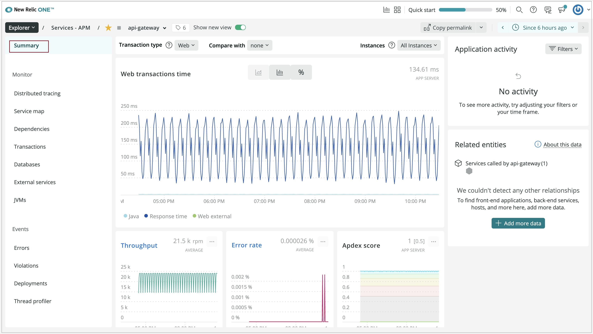

# How to monitor with New Relic in-process agent (Preview)

This feature enables monitoring Azure Spring Cloud apps with the **New Relic** Java in-process agent.

Using the **New Relic** Java in-process agent, you can:
* Consume the **New Relic** java in-process agent.
* Configure the **New Relic** java in-process agent using **Environment Variables**.
* Check all monitoring data from **New Relic** dashboard.

## Prerequisites

* A **New Relic** account.
* The [Azure CLI version, 2.0.67 or later](/cli/azure/install-azure-cli).

## Leverage the New Relic java in process agent

Use the following procedure to access the in-process agent:

1. Create an instance of Azure Spring Cloud.

2. Create an application.

    ```shell
      az spring-cloud app create --name "appName" --is-public true \
      -s "resourceName" -g "resourceGroupName"
    ```

3. Create a deployment with **New Relic** agent and **Environment Variables**.

    ```shell
    az spring-cloud app deploy --name "appName" --jar-path app.jar \
       -s "resourceName" -g "resourceGroupName" \
       --jvm-options="-javaagent:/opt/agents/newrelic/java/newrelic-agent.jar" \
       --env NEW_RELIC_APP_NAME=appName NEW_RELIC_LICENSE_KEY=newRelicLicenseKey
    ```

  Azure Spring Cloud pre-installs the **New Relic** java agent to following path. Customers can leverage the agent from applications' **Jvm Options**, as well as configure the agent using the [New Relic java agent environment variables](https://docs.newrelic.com/docs/agents/java-agent/configuration/java-agent-configuration-config-file/#Environment_Variables).

  ```shell
  /opt/agents/newrelic/java/newrelic-agent.jar
  ```

## Portal

You can also leverage this agent from portal with the following procedure. 

1. Find the app from **Settings**/**Apps** in the navigation pane.

   

2. Click the application to jump to the **Overview** page.

   

3. Click **Configurations** in the left navigation pane to add/update/delete the **Environment Variables** of the application.

   

4. Click **General settings** to add/update/delete the `Jvm Option` of the application.

   

5. View the application **Summary** page from the **New Relic** dashboard.

   

6. View the Java Virtual Machines (JVM) of the application from **New Relic** dashboard.

   

7. Profile the application from the **New Relic** dashboard.

   

## New Relic Java Agent Logging

By default, Azure Spring Cloud will print the logs of **New Relic** java agent to `STDOUT`. It will mixed with the application logs. You can find the explicit agent version from the application logs.

## New Relic Java Agent Update/Upgrade

The **New Relic** java agent will update/upgrade regularly with JDK, there agent update/upgrade may impact below scenarios.

* Your existed applications with **New Relic** java agent before update/upgrade will be unchanged.
* Your new created applications after update/upgrade will take the new version of **New Relic** java agent.
* Your existed applications need to restart or redeploy to take the new version of **New Relic** java agent.

## Vnet Injection Instance Outbound Traffic Configuration

For vnet injection instance of Azure Spring Cloud, you need to make sure the outbound traffic is configured correctly for **New Relic** java agent. Please reference the doc of [Networks of New Relic](https://docs.newrelic.com/docs/using-new-relic/cross-product-functions/install-configure/networks/#agents).

## Next steps