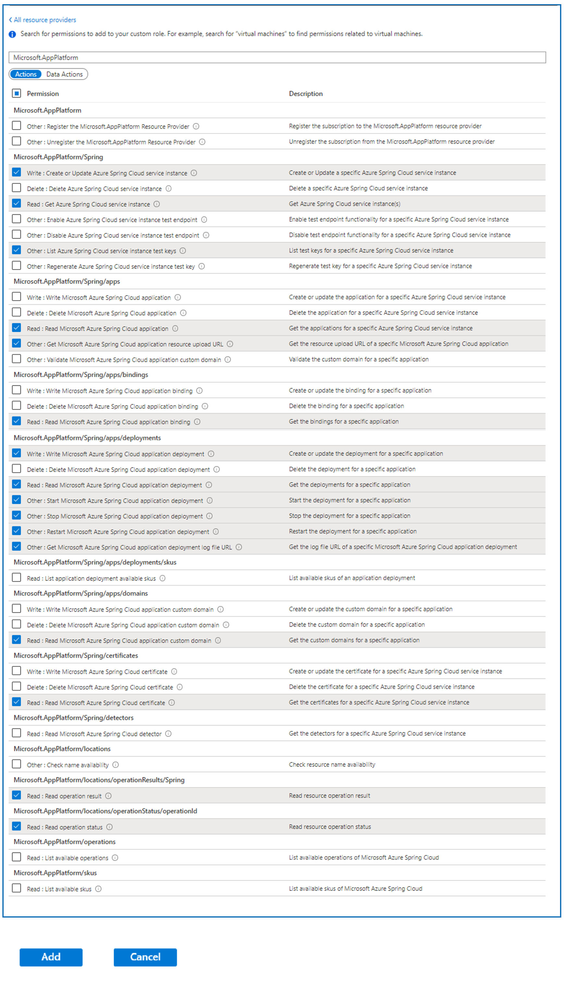
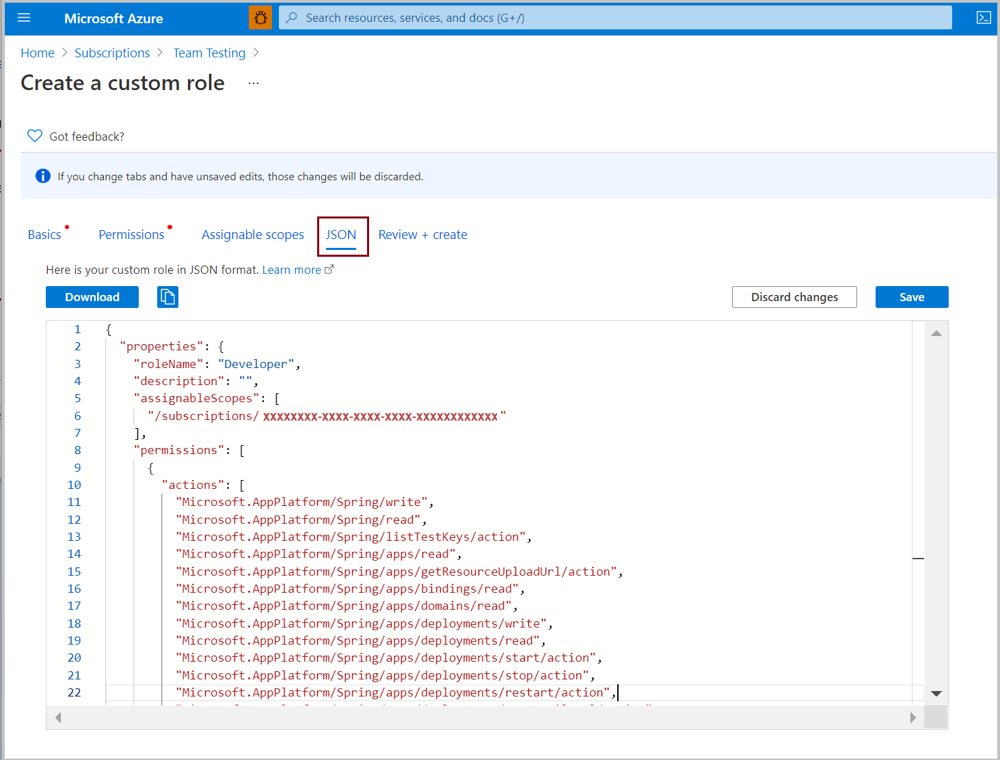
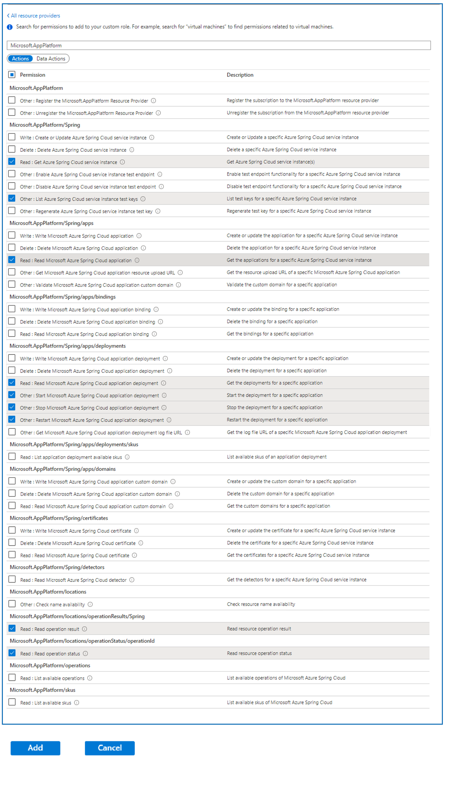

# How to use permissions in Azure Spring Cloud
This article shows you how to create custom roles that delegate permissions to Azure Spring Cloud resources. Custom roles extend [Azure built-in roles](../role-based-access-control/built-in-roles.md) with various stock permissions.

We will implement the following custom roles:

* **Developer role**: 
    * Deploy
    * Test
    * Restart apps
    * Can apply and make changes to app configurations in the git repository
    * Can get the log stream
* **Ops - Site Reliability Engineering**: 
    * Restart apps
    * Get log streams
    * Cannot make changes to apps or configurations
* **Azure Pipelines/Jenkins/GitHub Actions role**:
    * Can perform create, read, update, delete operations
    * Can create and configure everything in Azure Spring Cloud and apps within service instance: Azure Pipelines, Jenkins or GitHub Actions, using Terraform or ARM Templates

## Define Developer role

The developer role includes permissions to restart apps and see their log streams, but cannot make changes to apps, configuration.

### Navigate subscription and resource group Access control (IAM)

Follow these steps to start defining a role.

1. In the Azure portal, open the subscription and resource group where you want the custom role to be assignable.
2. Open **Access control (IAM)**.
3. Click **+ Add**.
4. Click **Add custom role**.
#### [Portal](#tab/Azure-portal)
5. Click **Next**.

   

6. Click **Add permissions**.

   

### Search for Azure Spring Cloud permissions:
7. In the search box, search for *Microsoft.app*.
Select *Microsoft Azure Spring Cloud*.

   

8. Select the permissions for the developer role:

From **Microsoft.AppPlatform/Spring**, select:
* Write : Create or Update Azure Spring Cloud service instance
* Read : Get Azure Spring Cloud service instance
* Other : List Azure Spring Cloud service instance test keys

From **Microsoft.AppPlatform/Spring/apps**, select:
* Read : Read Microsoft Azure Spring Cloud application
* Other : Get Microsoft Azure Spring Cloud application resource upload URL

From **Microsoft.AppPlatform/Spring/apps/bindings**, select:
* Read : Read Microsoft Azure Spring Cloud application binding

From **Microsoft.AppPlatform/Spring/apps/deployments**, select:
* Write : Write Microsoft Azure Spring Cloud application deployment
* Read : Read Microsoft Azure Spring Cloud application deployment
* Other : Start Microsoft Azure Spring Cloud application deployment
* Other : Stop Microsoft Azure Spring Cloud application deployment
* Other : Restart Microsoft Azure Spring Cloud application deployment
* Other : Get Microsoft Azure Spring Cloud application deployment log file URL

From **Microsoft.AppPlatform/Spring/apps/domains**, select:
* Read : Read Microsoft Azure Spring Cloud application custom domain

From **Microsoft.AppPlatform/Spring/certificates**, select:
* Read : Read Microsoft Azure Spring Cloud certificate

From **Microsoft.AppPlatform/locations/operationResults/Spring**, select:
* Read : Read operation result

From **Microsoft.AppPlatform/locations/operationStatus/operationId**, select:
* Read : Read operation status

    [  ](media/spring-cloud-permissions/developer-permissions-box.png#lightbox)

9. Click **Add**.

10. Review the permissions.

11. Click **Review and create**.

#### [JSON](#tab/JSON)
5. Click **Next**.

   

The following JSON file defines the Developer role.

```json
{
  "properties": {
    "roleName": "Developer",
    "description": "",
    "assignableScopes": [
      "/subscriptions/799c12ba-353c-44a1-883d-84808ebb2216"
    ],
    "permissions": [
      {
        "actions": [
          "Microsoft.AppPlatform/Spring/write",
          "Microsoft.AppPlatform/Spring/read",
          "Microsoft.AppPlatform/Spring/listTestKeys/action",
          "Microsoft.AppPlatform/Spring/apps/read",
          "Microsoft.AppPlatform/Spring/apps/getResourceUploadUrl/action",
          "Microsoft.AppPlatform/Spring/apps/bindings/read",
          "Microsoft.AppPlatform/Spring/apps/domains/read",
          "Microsoft.AppPlatform/Spring/apps/deployments/write",
          "Microsoft.AppPlatform/Spring/apps/deployments/read",
          "Microsoft.AppPlatform/Spring/apps/deployments/start/action",
          "Microsoft.AppPlatform/Spring/apps/deployments/stop/action",
          "Microsoft.AppPlatform/Spring/apps/deployments/restart/action",
          "Microsoft.AppPlatform/Spring/apps/deployments/getLogFileUrl/action",
          "Microsoft.AppPlatform/Spring/certificates/read",
          "Microsoft.AppPlatform/locations/operationResults/Spring/read",
          "Microsoft.AppPlatform/locations/operationStatus/operationId/read"
        ],
        "notActions": [],
        "dataActions": [],
        "notDataActions": []
      }
    ]
  }
}
```
6. Review the permissions.

7. Click **Review and create**.
---


## Define DevOps engineer role
This procedure defines a role with permissions to deploy, test, and restart Azure Spring Cloud apps.
#### [Portal](#tab/Azure-portal)

1. Repeat the procedure to navigate subscription, resource group,and access Access control (IAM).
2. Select the permissions for the DevOps engineer role:

From **Microsoft.AppPlatform/Spring**, select:
* Write : Create or Update Azure Spring Cloud service instance
* Delete : Delete Azure Spring Cloud service instance
* Read : Get Azure Spring Cloud service instance
* Other : Enable Azure Spring Cloud service instance test endpoint
* Other : Disable Azure Spring Cloud service instance test endpoint
* Other : List Azure Spring Cloud service instance test keys
* Other : Regenerate Azure Spring Cloud service instance test key

From **Microsoft.AppPlatform/Spring/apps**, select:
* Write : Write Microsoft Azure Spring Cloud application
* Delete : Delete Microsoft Azure Spring Cloud application
* Read : Read Microsoft Azure Spring Cloud application
* Other : Get Microsoft Azure Spring Cloud application resource upload URL
* Other : Validate Microsoft Azure Spring Cloud application custom domain

From **Microsoft.AppPlatform/Spring/apps/bindings**, select:
* Write : Write Microsoft Azure Spring Cloud application binding
* Delete : Delete Microsoft Azure Spring Cloud application binding
* Read : Read Microsoft Azure Spring Cloud application binding

From **Microsoft.AppPlatform/Spring/apps/deployments**, select:
* Write : Write Microsoft Azure Spring Cloud application deployment
* Delete : Delete Azure Spring Cloud application deployment
* Read : Read Microsoft Azure Spring Cloud application deployment
* Other : Start Microsoft Azure Spring Cloud application deployment
* Other : Stop Microsoft Azure Spring Cloud application deployment
* Other : Restart Microsoft Azure Spring Cloud application deployment
* Other : Get Microsoft Azure Spring Cloud application deployment log file URL

From **Microsoft.AppPlatform/Spring/apps/deployments/skus**, select:
* Read : List application deployment available skus

From **Microsoft.AppPlatform/locations**, select:
* Other : Check name availability

From Microsoft.AppPlatform/locations/operationResults/Spring select:
Read : Read operation result

From **Microsoft.AppPlatform/locations/operationStatus/operationId**, select:
* Read : Read operation status

From **Microsoft.AppPlatform/skus**, select:
* Read : List available skus

   [  ](media/spring-cloud-permissions/dev-ops-permissions.png#lightbox)

3. Click **Add**.

4. Review the permissions.

5. Click **Review and create**.

#### [JSON](#tab/JSON)
The following JSON file defines the DevOps engineer role.

```json
{
  "properties": {
    "roleName": "DevOps engineer",
    "description": "",
    "assignableScopes": [
      "/subscriptions/799c12ba-353c-44a1-883d-84808ebb2216"
    ],
    "permissions": [
      {
        "actions": [
          "Microsoft.AppPlatform/Spring/write",
          "Microsoft.AppPlatform/Spring/delete",
          "Microsoft.AppPlatform/Spring/read",
          "Microsoft.AppPlatform/Spring/enableTestEndpoint/action",
          "Microsoft.AppPlatform/Spring/disableTestEndpoint/action",
          "Microsoft.AppPlatform/Spring/listTestKeys/action",
          "Microsoft.AppPlatform/Spring/regenerateTestKey/action",
          "Microsoft.AppPlatform/Spring/apps/write",
          "Microsoft.AppPlatform/Spring/apps/delete",
          "Microsoft.AppPlatform/Spring/apps/read",
          "Microsoft.AppPlatform/Spring/apps/getResourceUploadUrl/action",
          "Microsoft.AppPlatform/Spring/apps/validateDomain/action",
          "Microsoft.AppPlatform/Spring/apps/bindings/write",
          "Microsoft.AppPlatform/Spring/apps/bindings/delete",
          "Microsoft.AppPlatform/Spring/apps/bindings/read",
          "Microsoft.AppPlatform/Spring/apps/deployments/write",
          "Microsoft.AppPlatform/Spring/apps/deployments/delete",
          "Microsoft.AppPlatform/Spring/apps/deployments/read",
          "Microsoft.AppPlatform/Spring/apps/deployments/start/action",
          "Microsoft.AppPlatform/Spring/apps/deployments/stop/action",
          "Microsoft.AppPlatform/Spring/apps/deployments/restart/action",
          "Microsoft.AppPlatform/Spring/apps/deployments/getLogFileUrl/action",
          "Microsoft.AppPlatform/Spring/apps/deployments/skus/read",
          "Microsoft.AppPlatform/locations/checkNameAvailability/action",
          "Microsoft.AppPlatform/locations/operationResults/Spring/read",
          "Microsoft.AppPlatform/locations/operationStatus/operationId/read",
          "Microsoft.AppPlatform/skus/read"
        ],
        "notActions": [],
        "dataActions": [],
        "notDataActions": []
      }
    ]
  }
}
```
---
## Define Ops - Site Reliability Engineering role
This procedure defines a role with permissions to deploy, test, and restart Azure Spring Cloud apps.
#### [Portal](#tab/Azure-portal)
1. Repeat the procedure to navigate subscription, resource group,and access Access control (IAM).

2. Select the permissions for the Ops - Site Reliability Engineering role:

From **Microsoft.AppPlatform/Spring**, select:
* Read : Get Azure Spring Cloud service instance
* Other : List Azure Spring Cloud service instance test keys

From **Microsoft.AppPlatform/Spring/apps**, select:
* Read : Read Microsoft Azure Spring Cloud application

From **Microsoft.AppPlatform/apps/deployments**, select:
* Read : Read Microsoft Azure Spring Cloud application deployment
* Other : Start Microsoft Azure Spring Cloud application deployment
* Other : Stop Microsoft Azure Spring Cloud application deployment
* Other : Restart Microsoft Azure Spring Cloud application deployment

From **Microsoft.AppPlatform/locations/operationResults/Spring**, select:
* Read : Read operation result

From **Microsoft.AppPlatform/locations/operationStatus/operationId**, select:
* Read : Read operation status

   [  ](media/spring-cloud-permissions/ops-sre-permissions.png#lightbox)

3. Click **Add**.

4. Review the permissions.

5. Click **Review and create**.
#### [JSON](#tab/JSON)
The following JSON file defines the Ops - Site Reliability Engineering role.
```json
{
  "properties": {
    "roleName": "Ops - Site Reliability Engineering",
    "description": "",
    "assignableScopes": [
      "/subscriptions/799c12ba-353c-44a1-883d-84808ebb2216"
    ],
    "permissions": [
      {
        "actions": [
          "Microsoft.AppPlatform/Spring/read",
          "Microsoft.AppPlatform/Spring/listTestKeys/action",
          "Microsoft.AppPlatform/Spring/apps/read",
          "Microsoft.AppPlatform/Spring/apps/deployments/read",
          "Microsoft.AppPlatform/Spring/apps/deployments/start/action",
          "Microsoft.AppPlatform/Spring/apps/deployments/stop/action",
          "Microsoft.AppPlatform/Spring/apps/deployments/restart/action",
          "Microsoft.AppPlatform/Spring/apps/deployments/getLogFileUrl/action",
          "Microsoft.AppPlatform/locations/operationResults/Spring/read",
          "Microsoft.AppPlatform/locations/operationStatus/operationId/read"
        ],
        "notActions": [],
        "dataActions": [],
        "notDataActions": []
      }
    ]
  }
}
```
---
## Define Azure Pipelines/Provisioning role

This Jenkins/Github Actions role can create and configure everything in Azure Spring Cloud and apps with a service instance. This role is for releasing or deploying code.
#### [Portal](#tab/Azure-portal)

1. Repeat the procedure to navigate subscription, resource group, and access Access control (IAM).

2. Open the **Permissions** options.

3. Select the permissions for the Azure Pipelines/Provisioning role:
  
From **Microsoft.AppPlatform/Spring**, select:
* Write : Create or Update Azure Spring Cloud service instance
* Delete : Delete Azure Spring Cloud service instance
* Read : Get Azure Spring Cloud service instance
* Other : Enable Azure Spring Cloud service instance test endpoint
* Other : Disable Azure Spring Cloud service instance test endpoint
* Other : List Azure Spring Cloud service instance test keys
* Other : Regenerate Azure Spring Cloud service instance test key

From **Microsoft.AppPlatform/Spring/apps**, select:
* Write : Write Microsoft Azure Spring Cloud application
* Delete : Delete Microsoft Azure Spring Cloud application
* Read : Read Microsoft Azure Spring Cloud application
* Other : Get Microsoft Azure Spring Cloud application resource upload URL
* Other : Validate Microsoft Azure Spring Cloud application custom domain

From **Microsoft.AppPlatform/Spring/apps/bindings**, select:
* Write : Write Microsoft Azure Spring Cloud application binding
* Delete : Delete Microsoft Azure Spring Cloud application binding
* Read : Read Microsoft Azure Spring Cloud application binding

From **Microsoft.AppPlatform/Spring/apps/deployments**, select:
* Write : Write Microsoft Azure Spring Cloud application deployment
* Delete : Delete Azure Spring Cloud application deployment
* Read : Read Microsoft Azure Spring Cloud application deployment
* Other : Start Microsoft Azure Spring Cloud application deployment
* Other : Stop Microsoft Azure Spring Cloud application deployment
* Other : Restart Microsoft Azure Spring Cloud application deployment
* Other : Get Microsoft Azure Spring Cloud application deployment log file URL

From **Microsoft.AppPlatform/skus**, select:
* Read : List available skus

From **Microsoft.AppPlatform/locations**, select:
* Other : Check name availability

From **Microsoft.AppPlatform/locations/operationResults/Spring**, select:
* Read : Read operation result

From **Microsoft.AppPlatform/locations/operationStatus/operationId**, select:
* Read : Read operation status

From **Microsoft.AppPlatform/skus**, select:
* Read : List available skus

   [  ](media/spring-cloud-permissions/pipelines-permissions-box.png#lightbox)  

4. Click **Add**.

5. Review the permissions.

6. Click **Review and create**.
#### [JSON](#tab/JSON)
The following JSON file defines the Azure Pipelines/Provisioning role.
```json
{
  "properties": {
    "roleName": "Azure Pipelines/Provisioning",
    "description": "",
    "assignableScopes": [
      "/subscriptions/799c12ba-353c-44a1-883d-84808ebb2216"
    ],
    "permissions": [
      {
        "actions": [
          "Microsoft.AppPlatform/Spring/write",
          "Microsoft.AppPlatform/Spring/delete",
          "Microsoft.AppPlatform/Spring/read",
          "Microsoft.AppPlatform/Spring/enableTestEndpoint/action",
          "Microsoft.AppPlatform/Spring/disableTestEndpoint/action",
          "Microsoft.AppPlatform/Spring/listTestKeys/action",
          "Microsoft.AppPlatform/Spring/regenerateTestKey/action",
          "Microsoft.AppPlatform/Spring/apps/write",
          "Microsoft.AppPlatform/Spring/apps/delete",
          "Microsoft.AppPlatform/Spring/apps/read",
          "Microsoft.AppPlatform/Spring/apps/getResourceUploadUrl/action",
          "Microsoft.AppPlatform/Spring/apps/validateDomain/action",
          "Microsoft.AppPlatform/Spring/apps/bindings/write",
          "Microsoft.AppPlatform/Spring/apps/bindings/delete",
          "Microsoft.AppPlatform/Spring/apps/bindings/read",
          "Microsoft.AppPlatform/Spring/apps/deployments/write",
          "Microsoft.AppPlatform/Spring/apps/deployments/delete",
          "Microsoft.AppPlatform/Spring/apps/deployments/read",
          "Microsoft.AppPlatform/Spring/apps/deployments/start/action",
          "Microsoft.AppPlatform/Spring/apps/deployments/stop/action",
          "Microsoft.AppPlatform/Spring/apps/deployments/restart/action",
          "Microsoft.AppPlatform/Spring/apps/deployments/getLogFileUrl/action",
          "Microsoft.AppPlatform/skus/read",
          "Microsoft.AppPlatform/locations/checkNameAvailability/action",
          "Microsoft.AppPlatform/locations/operationResults/Spring/read",
          "Microsoft.AppPlatform/locations/operationStatus/operationId/read"
        ],
        "notActions": [],
        "dataActions": [],
        "notDataActions": []
      }
    ]
  }
}
```
---
## See also
* [Create or update Azure custom roles using the Azure portal](../role-based-access-control/custom-roles-portal.md)

For more information about three methods that define a custom permissions see:
* [Clone a role](../role-based-access-control/custom-roles-portal.md#clone-a-role)
* [Start from scratch](../role-based-access-control/custom-roles-portal.md#start-from-scratch)
* [Start from JSON](../role-based-access-control/custom-roles-portal.md#start-from-json)
