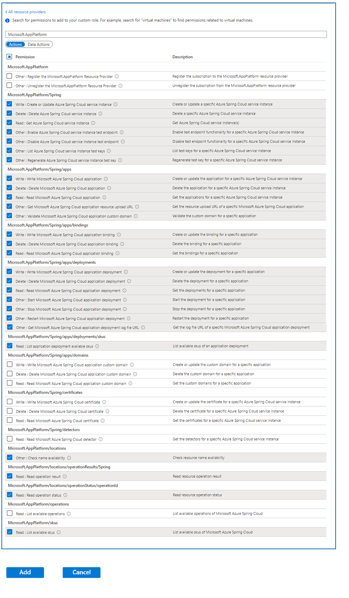
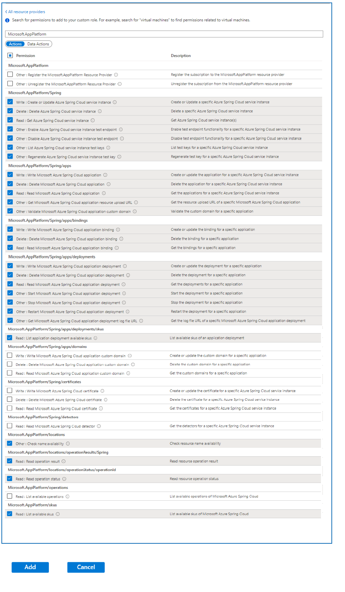

# How to use permissions in Azure Spring Cloud
This article shows you how to create custom roles that delegate permissions to Azure Spring Cloud resources. Custom roles extend [Azure built-in roles](../role-based-access-control/built-in-roles.md) with various stock permissions.

We'll implement the following custom roles.

* **Developer role**: 
    * Deploy
    * Test
    * Restart apps
    * Apply and make changes to app configurations in the Git repository
    * Get log streams
* **Ops - Site Reliability Engineering role**: 
    * Restart apps
    * Get log streams
    * Can't make changes to apps or configurations
* **Azure Pipelines / Jenkins / GitHub Actions role**:
    * Perform create, read, update, and delete operations
    * Use Terraform or ARM templates to create and configure everything in Azure Spring Cloud and apps within a service instance: Azure Pipelines, Jenkins, and GitHub Actions

## Define the Developer role

The Developer role includes permissions to restart apps and see their log streams. This role can't make changes to apps or configurations.


#### [Portal](#tab/Azure-portal)
1. In the Azure portal, open the subscription where you want to assign the custom role.
2. Open **Access control (IAM)**.
3. Select **Add**.
4. Select **Add custom role**.
5. Select **Next**:

   

6. Select **Add permissions**:

   


7. In the search box, search for **Microsoft.app**. Select **Microsoft Azure Spring Cloud**:

   

8. Select the permissions for the Developer role.

   Under **Microsoft.AppPlatform/Spring**, select:
   * **Write : Create or Update Azure Spring Cloud service instance**
   * **Read : Get Azure Spring Cloud service instance**
   * **Other : List Azure Spring Cloud service instance test keys**

   Under **Microsoft.AppPlatform/Spring/apps**, select:
   * **Read : Read Microsoft Azure Spring Cloud application**
   * **Other : Get Microsoft Azure Spring Cloud application resource upload URL**

   Under **Microsoft.AppPlatform/Spring/apps/bindings**, select:
   * **Read : Read Microsoft Azure Spring Cloud application binding**

   Under **Microsoft.AppPlatform/Spring/apps/deployments**, select:
   * **Write : Write Microsoft Azure Spring Cloud application deployment**
   * **Read : Read Microsoft Azure Spring Cloud application deployment**
   * **Other : Start Microsoft Azure Spring Cloud application deployment**
   * **Other : Stop Microsoft Azure Spring Cloud application deployment**
   * **Other : Restart Microsoft Azure Spring Cloud application deployment**
   * **Other : Get Microsoft Azure Spring Cloud application deployment log file URL**

   Under **Microsoft.AppPlatform/Spring/apps/domains**, select:
   * **Read : Read Microsoft Azure Spring Cloud application custom domain**

   Under **Microsoft.AppPlatform/Spring/certificates**, select:
   * **Read : Read Microsoft Azure Spring Cloud certificate**

   Under **Microsoft.AppPlatform/locations/operationResults/Spring**, select:
   * **Read : Read operation result**

   Under **Microsoft.AppPlatform/locations/operationStatus/operationId**, select:
   * **Read : Read operation status**

    [  ](media/spring-cloud-permissions/developer-permissions-box.png#lightbox)

9. Select **Add**.

1. Review the permissions.

11. Select **Review and create**.

#### [JSON](#tab/JSON)
1. In the Azure portal, open the subscription where you want to assign the custom role.
2. Open **Access control (IAM)**.
3. Select **Add**.
4. Select **Add custom role**.
5. Select **Next**.

6. Select the **JSON** tab.

7. Select **Edit**, and then delete the default text:

   

8. Paste in the following JSON to define the Developer role:

   ```json
   {
     "properties": {
       "roleName": "Developer",
       "description": "",
       "assignableScopes": [
         "/subscriptions/xxxxxxxx-xxxx-xxxx-xxxx-xxxxxxxxxxxx"
       ],
       "permissions": [
         {
           "actions": [
             "Microsoft.AppPlatform/Spring/write",
             "Microsoft.AppPlatform/Spring/read",
             "Microsoft.AppPlatform/Spring/listTestKeys/action",
             "Microsoft.AppPlatform/Spring/apps/read",
             "Microsoft.AppPlatform/Spring/apps/getResourceUploadUrl/action",
             "Microsoft.AppPlatform/Spring/apps/bindings/read",
             "Microsoft.AppPlatform/Spring/apps/domains/read",
             "Microsoft.AppPlatform/Spring/apps/deployments/write",
             "Microsoft.AppPlatform/Spring/apps/deployments/read",
             "Microsoft.AppPlatform/Spring/apps/deployments/start/action",
             "Microsoft.AppPlatform/Spring/apps/deployments/stop/action",
             "Microsoft.AppPlatform/Spring/apps/deployments/restart/action",
             "Microsoft.AppPlatform/Spring/apps/deployments/getLogFileUrl/action",
             "Microsoft.AppPlatform/Spring/certificates/read",
             "Microsoft.AppPlatform/locations/operationResults/Spring/read",
             "Microsoft.AppPlatform/locations/operationStatus/operationId/read"
           ],
           "notActions": [],
           "dataActions": [],
           "notDataActions": []
         }
       ]
     }
   }
   ```
   

9. Select **Save**.

10. Review the permissions.

11. Select **Review and create**.
---


## Define the DevOps Engineer role
This procedure defines a role that has permissions to deploy, test, and restart Azure Spring Cloud apps.

#### [Portal](#tab/Azure-portal)
1. Repeat steps 1 through 4 in the procedure for adding the Developer role. 

2. Select the permissions for the DevOps Engineer role:

   Under **Microsoft.AppPlatform/Spring**, select:
   * **Write : Create or Update Azure Spring Cloud service instance**
   * **Delete : Delete Azure Spring Cloud service instance**
   * **Read : Get Azure Spring Cloud service instance**
   * **Other : Enable Azure Spring Cloud service instance test endpoint**
   * **Other : Disable Azure Spring Cloud service instance test endpoint**
   * **Other : List Azure Spring Cloud service instance test keys**
   * **Other : Regenerate Azure Spring Cloud service instance test key**

   Under **Microsoft.AppPlatform/Spring/apps**, select:
   * **Write : Write Microsoft Azure Spring Cloud application**
   * **Delete : Delete Microsoft Azure Spring Cloud application**
   * **Read : Read Microsoft Azure Spring Cloud application**
   * **Other : Get Microsoft Azure Spring Cloud application resource upload URL**
   * **Other : Validate Microsoft Azure Spring Cloud application custom domain**

   Under **Microsoft.AppPlatform/Spring/apps/bindings**, select:
   * **Write : Write Microsoft Azure Spring Cloud application binding**
   * **Delete : Delete Microsoft Azure Spring Cloud application binding**
   * **Read : Read Microsoft Azure Spring Cloud application binding**

   Under **Microsoft.AppPlatform/Spring/apps/deployments**, select:
   * **Write : Write Microsoft Azure Spring Cloud application deployment**
   * **Delete : Delete Azure Spring Cloud application deployment**
   * **Read : Read Microsoft Azure Spring Cloud application deployment**
   * **Other : Start Microsoft Azure Spring Cloud application deployment**
   * **Other : Stop Microsoft Azure Spring Cloud application deployment**
   * **Other : Restart Microsoft Azure Spring Cloud application deployment**
   * **Other : Get Microsoft Azure Spring Cloud application deployment log file URL**

   Under **Microsoft.AppPlatform/Spring/apps/deployments/skus**, select:
   * **Read : List application deployment available skus**

   Under **Microsoft.AppPlatform/locations**, select:
   * **Other : Check name availability**

   Under **Microsoft.AppPlatform/locations/operationResults/Spring** select:
   * **Read : Read operation result**

   Under **Microsoft.AppPlatform/locations/operationStatus/operationId**, select:
   * **Read : Read operation status**

   Under **Microsoft.AppPlatform/skus**, select:
   * **Read : List available skus**

   [  ](media/spring-cloud-permissions/dev-ops-permissions.png#lightbox)

3. Select **Add**.

4. Review the permissions.

5. Select **Review and create**.

#### [JSON](#tab/JSON)

1. Repeat steps 1 through 4 from the procedure for adding the Developer role. 
2. Select **Next**.

3. Select the **JSON** tab.

4. Select **Edit**, and then delete the default text:

   

5. Paste in the following JSON to define the DevOps Engineer role:

   ```json
   {
     "properties": {
       "roleName": "DevOps engineer",
       "description": "",
       "assignableScopes": [
         "/subscriptions/xxxxxxxx-xxxx-xxxx-xxxx-xxxxxxxxxxxx"
       ],
       "permissions": [
         {
           "actions": [
             "Microsoft.AppPlatform/Spring/write",
             "Microsoft.AppPlatform/Spring/delete",
             "Microsoft.AppPlatform/Spring/read",
             "Microsoft.AppPlatform/Spring/enableTestEndpoint/action",
             "Microsoft.AppPlatform/Spring/disableTestEndpoint/action",
             "Microsoft.AppPlatform/Spring/listTestKeys/action",
             "Microsoft.AppPlatform/Spring/regenerateTestKey/action",
             "Microsoft.AppPlatform/Spring/apps/write",
             "Microsoft.AppPlatform/Spring/apps/delete",
             "Microsoft.AppPlatform/Spring/apps/read",
             "Microsoft.AppPlatform/Spring/apps/getResourceUploadUrl/action",
             "Microsoft.AppPlatform/Spring/apps/validateDomain/action",
             "Microsoft.AppPlatform/Spring/apps/bindings/write",
             "Microsoft.AppPlatform/Spring/apps/bindings/delete",
             "Microsoft.AppPlatform/Spring/apps/bindings/read",
             "Microsoft.AppPlatform/Spring/apps/deployments/write",
             "Microsoft.AppPlatform/Spring/apps/deployments/delete",
             "Microsoft.AppPlatform/Spring/apps/deployments/read",
             "Microsoft.AppPlatform/Spring/apps/deployments/start/action",
             "Microsoft.AppPlatform/Spring/apps/deployments/stop/action",
             "Microsoft.AppPlatform/Spring/apps/deployments/restart/action",
             "Microsoft.AppPlatform/Spring/apps/deployments/getLogFileUrl/action",
             "Microsoft.AppPlatform/Spring/apps/deployments/skus/read",
             "Microsoft.AppPlatform/locations/checkNameAvailability/action",
             "Microsoft.AppPlatform/locations/operationResults/Spring/read",
             "Microsoft.AppPlatform/locations/operationStatus/operationId/read",
             "Microsoft.AppPlatform/skus/read"
           ],
           "notActions": [],
           "dataActions": [],
           "notDataActions": []
         }
       ]
     }
   }
   ```
6. Review the permissions.

7. Select **Review and create**.
---
## Define the Ops - Site Reliability Engineering role
This procedure defines a role that has permissions to deploy, test, and restart Azure Spring Cloud apps.


#### [Portal](#tab/Azure-portal)
1. Repeat steps 1 through 4 from the procedure for adding the Developer role. 
2. Select the permissions for the Ops - Site Reliability Engineering role:

   Under **Microsoft.AppPlatform/Spring**, select:
   * **Read : Get Azure Spring Cloud service instance**
   * **Other : List Azure Spring Cloud service instance test keys**

   Under **Microsoft.AppPlatform/Spring/apps**, select:
   * **Read : Read Microsoft Azure Spring Cloud application**

   Under **Microsoft.AppPlatform/apps/deployments**, select:
   * **Read : Read Microsoft Azure Spring Cloud application deployment**
   * **Other : Start Microsoft Azure Spring Cloud application deployment**
   * **Other : Stop Microsoft Azure Spring Cloud application deployment**
   * **Other : Restart Microsoft Azure Spring Cloud application deployment**

   Under **Microsoft.AppPlatform/locations/operationResults/Spring**, select:
   * **Read : Read operation result**

   Under **Microsoft.AppPlatform/locations/operationStatus/operationId**, select:
   * **Read : Read operation status**

   [ ](media/spring-cloud-permissions/ops-sre-permissions.png#lightbox)

3. Select **Add**.

4. Review the permissions.

5. Select **Review and create**.

#### [JSON](#tab/JSON)
1. Repeat steps 1 through 4 from the procedure for adding the Developer role. 
2. Select **Next**.

3. Select the **JSON** tab.

4. Select **Edit**, and then delete the default text:

   

5. Paste in the following JSON to define the Ops - Site Reliability Engineering role:
 
   ```json
   {
     "properties": {
       "roleName": "Ops - Site Reliability Engineering",
       "description": "",
       "assignableScopes": [
         "/subscriptions/xxxxxxxx-xxxx-xxxx-xxxx-xxxxxxxxxxxx"
       ],
       "permissions": [
         {
           "actions": [
             "Microsoft.AppPlatform/Spring/read",
             "Microsoft.AppPlatform/Spring/listTestKeys/action",
             "Microsoft.AppPlatform/Spring/apps/read",
             "Microsoft.AppPlatform/Spring/apps/deployments/read",
             "Microsoft.AppPlatform/Spring/apps/deployments/start/action",
             "Microsoft.AppPlatform/Spring/apps/deployments/stop/action",
             "Microsoft.AppPlatform/Spring/apps/deployments/restart/action",
             "Microsoft.AppPlatform/Spring/apps/deployments/getLogFileUrl/action",
             "Microsoft.AppPlatform/locations/operationResults/Spring/read",
             "Microsoft.AppPlatform/locations/operationStatus/operationId/read"
           ],
           "notActions": [],
           "dataActions": [],
           "notDataActions": []
         }
       ]
     }
   }
   ```
6. Review the permissions.

7. Select **Review and create**.
---
## Define the Azure Pipelines / Jenkins / GitHub Actions role

This role can create and configure everything in Azure Spring Cloud and apps with a service instance. This role is for releasing or deploying code.

#### [Portal](#tab/Azure-portal)

1. Repeat steps 1 through 4 from the procedure for adding the Developer role. 
2. Open the **Permissions** options.

3. Select the permissions for the Azure Pipelines / Jenkins / GitHub Actions role:
  
   Under **Microsoft.AppPlatform/Spring**, select:
   * **Write : Create or Update Azure Spring Cloud service instance**
   * **Delete : Delete Azure Spring Cloud service instance**
   * **Read : Get Azure Spring Cloud service instance**
   * **Other : Enable Azure Spring Cloud service instance test endpoint**
   * **Other : Disable Azure Spring Cloud service instance test endpoint**
   * **Other : List Azure Spring Cloud service instance test keys**
   * **Other : Regenerate Azure Spring Cloud service instance test key**

   Under **Microsoft.AppPlatform/Spring/apps**, select:
   * **Write : Write Microsoft Azure Spring Cloud application**
   * **Delete : Delete Microsoft Azure Spring Cloud application**
   * **Read : Read Microsoft Azure Spring Cloud application**
   * **Other : Get Microsoft Azure Spring Cloud application resource upload URL**
   * **Other : Validate Microsoft Azure Spring Cloud application custom domain**

   Under **Microsoft.AppPlatform/Spring/apps/bindings**, select:
   * **Write : Write Microsoft Azure Spring Cloud application binding**
   * **Delete : Delete Microsoft Azure Spring Cloud application binding**
   * **Read : Read Microsoft Azure Spring Cloud application binding**

   Under **Microsoft.AppPlatform/Spring/apps/deployments**, select:
   * **Write : Write Microsoft Azure Spring Cloud application deployment**
   * **Delete : Delete Azure Spring Cloud application deployment**
   * **Read : Read Microsoft Azure Spring Cloud application deployment**
   * **Other : Start Microsoft Azure Spring Cloud application deployment**
   * **Other : Stop Microsoft Azure Spring Cloud application deployment**
   * **Other : Restart Microsoft Azure Spring Cloud application deployment**
   * **Other : Get Microsoft Azure Spring Cloud application deployment log file URL**

   Under **Microsoft.AppPlatform/Spring/apps/deployments/skus**, select:
   * **Read : List application deployment available skus**

   Under **Microsoft.AppPlatform/locations**, select:
   * **Other : Check name availability**

   Under **Microsoft.AppPlatform/locations/operationResults/Spring**, select:
   * **Read : Read operation result**

   Under **Microsoft.AppPlatform/locations/operationStatus/operationId**, select:
   * **Read : Read operation status**

   Under **Microsoft.AppPlatform/skus**, select:
   * **Read : List available skus**

   [  ](media/spring-cloud-permissions/pipelines-permissions-box.png#lightbox)  

4. Select **Add**.

5. Review the permissions.

6. Select **Review and create**.
#### [JSON](#tab/JSON)

1. Repeat steps 1 through 4 from the procedure for adding the Developer role. 
2. Select **Next**.

3. Select the **JSON** tab.

4. Select **Edit**, and then delete the default text:

   

5. Paste in the following JSON to define the Azure Pipelines / Jenkins / GitHub Actions role:

   ```json
   {
     "properties": {
       "roleName": "Azure Pipelines/Provisioning",
       "description": "",
       "assignableScopes": [
         "/subscriptions/xxxxxxxx-xxxx-xxxx-xxxx-xxxxxxxxxxxx"
       ],
       "permissions": [
         {
           "actions": [
             "Microsoft.AppPlatform/Spring/write",
             "Microsoft.AppPlatform/Spring/delete",
             "Microsoft.AppPlatform/Spring/read",
             "Microsoft.AppPlatform/Spring/enableTestEndpoint/action",
             "Microsoft.AppPlatform/Spring/disableTestEndpoint/action",
             "Microsoft.AppPlatform/Spring/listTestKeys/action",
             "Microsoft.AppPlatform/Spring/regenerateTestKey/action",
             "Microsoft.AppPlatform/Spring/apps/write",
             "Microsoft.AppPlatform/Spring/apps/delete",
             "Microsoft.AppPlatform/Spring/apps/read",
             "Microsoft.AppPlatform/Spring/apps/getResourceUploadUrl/action",
             "Microsoft.AppPlatform/Spring/apps/validateDomain/action",
             "Microsoft.AppPlatform/Spring/apps/bindings/write",
             "Microsoft.AppPlatform/Spring/apps/bindings/delete",
             "Microsoft.AppPlatform/Spring/apps/bindings/read",
             "Microsoft.AppPlatform/Spring/apps/deployments/write",
             "Microsoft.AppPlatform/Spring/apps/deployments/delete",
             "Microsoft.AppPlatform/Spring/apps/deployments/read",
             "Microsoft.AppPlatform/Spring/apps/deployments/start/action",
             "Microsoft.AppPlatform/Spring/apps/deployments/stop/action",
             "Microsoft.AppPlatform/Spring/apps/deployments/restart/action",
             "Microsoft.AppPlatform/Spring/apps/deployments/getLogFileUrl/action",
             "Microsoft.AppPlatform/skus/read",
             "Microsoft.AppPlatform/locations/checkNameAvailability/action",
             "Microsoft.AppPlatform/locations/operationResults/Spring/read",
             "Microsoft.AppPlatform/locations/operationStatus/operationId/read"
           ],
           "notActions": [],
           "dataActions": [],
           "notDataActions": []
         }
       ]
     }
   }
   ```
6. Select **Add**.

7. Review the permissions.
---
## See also
* [Create or update Azure custom roles using the Azure portal](../role-based-access-control/custom-roles-portal.md)

For more information about three methods that define custom permissions, see:
* [Clone a role](../role-based-access-control/custom-roles-portal.md#clone-a-role)
* [Start from scratch](../role-based-access-control/custom-roles-portal.md#start-from-scratch)
* [Start from JSON](../role-based-access-control/custom-roles-portal.md#start-from-json)
