# Quickstart:  - Monitor Application End-to-End

**This article applies to:** ❌ Basic/Standard tier ✔️ Enterprise tier

This quickstart shows you how monitor apps running Azure Spring Cloud Enterprise tier using Application Insights and Log Analytics.

## Prerequisites

- An Azure account with an active subscription. [Create an account for free](https://azure.microsoft.com/free/?WT.mc_id=A261C142F).
- A license for Azure Spring Cloud Enterprise Tier. For more information, see [View Azure Spring Cloud Enterprise Tier Offer in Azure Marketplace](./how-to-enterprise-marketplace-offer.md).
- [The Azure CLI version 2.0.67 or higher](/cli/azure/install-azure-cli).
- [Git](https://git-scm.com/).
- [jq](https://stedolan.github.io/jq/download/)
- [!INCLUDE [install-enterprise-extension](includes/install-enterprise-extension.md)]
- Complete the previous quickstarts in this series:
  - [Build and deploy apps to Azure Spring Cloud using the Enterprise Tier](./quickstart-deploy-enterprise.md)
  - [Integrate with Azure Database for PostgreSQL and Azure Cache for Redis](./quickstart-integrate-azure-database-and-redis-enterprise.md)
  - [Securely Load Application Secrets using Key Vault](./quickstart-key-vault-enterprise.md)

## Update Applications

The Application Insights connection string must be provided manually to the Order Service (ASP.NET core) and Cart Service (python) applications. The following instructions describe how to provide this connection string and increase the sampling rate to Application Insights.

> [!NOTE]
> Currently only the buildpacks for Java and NodeJS applications support Application Insights instrumentation. This will be changed in future iterations.

1. Retrieve the Application Insights connection string and set it in Key Vault using the following commands:

    ```azurecli
    INSTRUMENTATION_KEY=$(az monitor app-insights component show \
        --resource-group=<resource-group>
        --app <app-insights-name> | jq -r '.connectionString')

    az keyvault secret set \
        --vault-name <key-vault-name> \
        --name "ApplicationInsights--ConnectionString" --value ${INSTRUMENTATION_KEY}
    ```

> [!NOTE]
> By default, the app insights name is the same name as the spring cloud service.

1. Update the sampling rate for the Application Insights binding to increase the amount of data available using the following command:

    ```azurecli
    az spring-cloud build-service builder buildpack-binding set \
        --resource-group <resource-group> \
        --service <spring-cloud-service> \
        --builder-name default \
        --name default \
        --type ApplicationInsights \
        --properties sampling-rate=100 connection_string=${INSTRUMENTATION_KEY}
    ```

1. Restart applications to reload configuration using the following commands:

    ```azurecli
    az spring-cloud app restart \
        --resource-group <resource-group> \
        --service <spring-cloud-service> \
        --name cart-service

    az spring-cloud app restart \
        --resource-group <resource-group> \
        --service <spring-cloud-service> \
        --name order-service

    az spring-cloud app restart \
        --resource-group <resource-group> \
        --service <spring-cloud-service> \
        --name catalog-service

    az spring-cloud app restart \
        --resource-group <resource-group> \
        --service <spring-cloud-service> \
        --name frontend

    az spring-cloud app restart \
        --resource-group <resource-group> \
        --service <spring-cloud-service> \
        --name identity-service
    ```

    For the Java and NodeJS applications, this will allow the new sampling rate to take effect. For the non-java applications, this will allow them to access the newly added Instrumentation Key from the Key Vault.

## Logs

There are two ways to see logs on Azure Spring Cloud: **Log Streaming** of real-time logs per app instance or **Log Analytics** for aggregated logs with advanced query capability

### Log Streaming

Generate traffic in the Application by moving through the application, viewing the catalog, and placing orders. The following commands can be used to continuously generate traffic (until canceled):

    ```azurecli
    GATEWAY_URL=$(az spring-cloud gateway show \
        --resource-group <resource-group> \
        --service <spring-cloud-service> | jq -r '.properties.url')

    cd traffic-generator
    GATEWAY_URL=https://${GATEWAY_URL} ./gradlew gatlingRun-com.vmware.acme.simulation.GuestSimulation
    ```

Use the following command to get the latest 100 lines of application console logs from the Catalog Service:

    ```azurecli
    az spring-cloud app logs \
        --resource-group <resource-group> \
        --name catalog-service \
        --service <spring-cloud-service> \
        --lines 100
    ```

By adding the `--follow` option you can get real-time log streaming from an app. Try log streaming for the Catalog Service using the following command:

    ```azurecli
    az spring-cloud app logs \
        --resource-group <resource-group> \
        --name catalog-service \
        --service <spring-cloud-service> \
        --follow
    ```

> [!TIP]
> You can use az spring-cloud app logs `--help` to explore more parameters and log stream functionalities.

### Log Analytics

Open the Log Analytics that you created - you can find the Log Analytics in the same Resource Group where you created an Azure Spring Cloud service instance.

In the Log Analytics page, selects `Logs` blade and run any of the sample queries supplied below for Azure Spring Cloud.

Type and run the following Kusto query to see application logs:

```kusto
    AppPlatformLogsforSpring 
    | where TimeGenerated > ago(24h) 
    | limit 500
    | sort by TimeGenerated
    | project TimeGenerated, AppName, Log
```

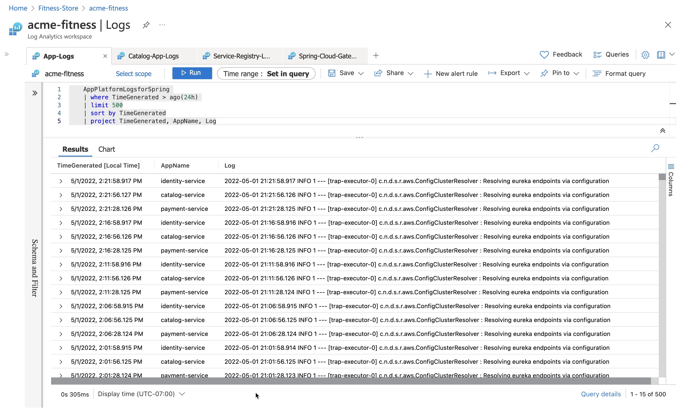

Type and run the following Kusto query to see `catalog-service` application logs:

```kusto
    AppPlatformLogsforSpring 
    | where AppName has "catalog-service"
    | limit 500
    | sort by TimeGenerated
    | project TimeGenerated, AppName, Log
```

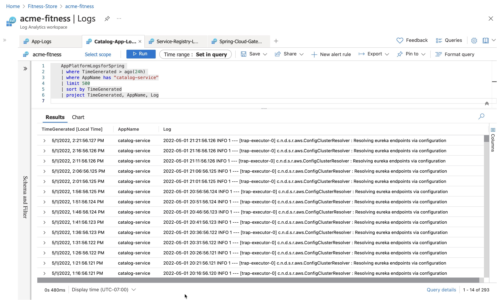

Type and run the following Kusto query  to see errors and exceptions thrown by each app:
```kusto
    AppPlatformLogsforSpring 
    | where Log contains "error" or Log contains "exception"
    | extend FullAppName = strcat(ServiceName, "/", AppName)
    | summarize count_per_app = count() by FullAppName, ServiceName, AppName, _ResourceId
    | sort by count_per_app desc 
    | render piechart
```


Type and run the following Kusto query to see all in the inbound calls into Azure Spring Cloud:

```kusto
    AppPlatformIngressLogs
    | project TimeGenerated, RemoteAddr, Host, Request, Status, BodyBytesSent, RequestTime, ReqId, RequestHeaders
    | sort by TimeGenerated
```

Type and run the following Kusto query to see all the logs from the managed Spring Cloud
Config Gateway managed by Azure Spring Cloud:

```kusto
    AppPlatformSystemLogs
    | where LogType contains "SpringCloudGateway"
    | project TimeGenerated,Log
```

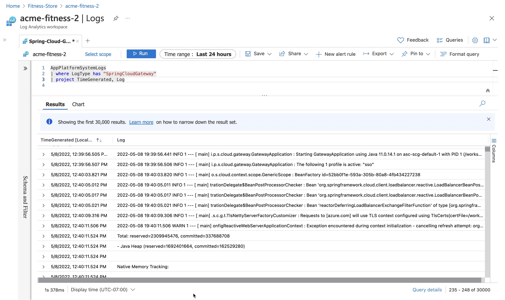

Type and run the following Kusto query to see all the logs from the managed Spring Cloud
Service Registry managed by Azure Spring Cloud:

```kusto
    AppPlatformSystemLogs
    | where LogType contains "ServiceRegistry"
    | project TimeGenerated, Log
```

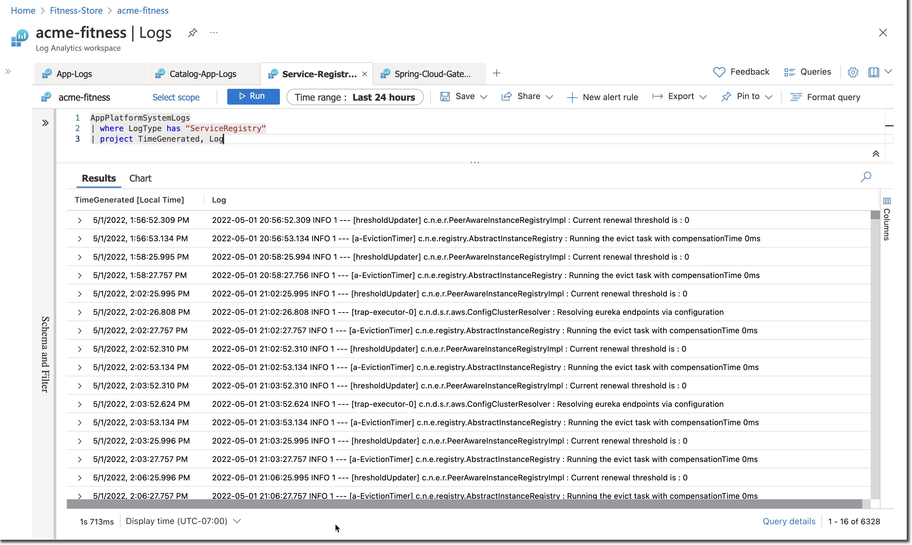

## Tracing

Open the Application Insights created by Azure Spring Cloud and start monitoring Spring Boot applications. You can find the Application Insights in the same Resource Group where you created an Azure Spring Cloud service instance.

Navigate to the `Application Map` blade:

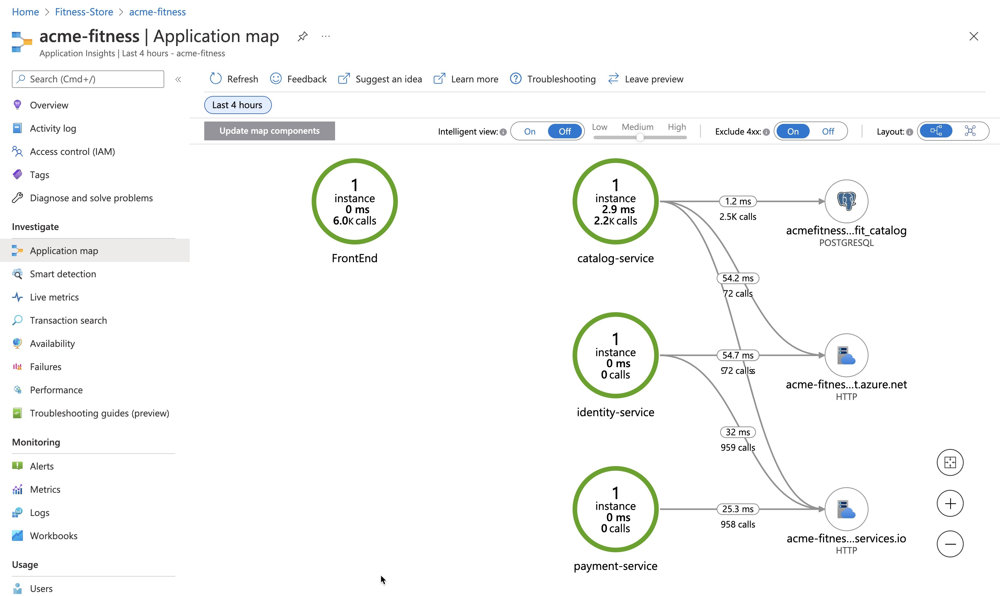

Navigate to the `Peforamnce` blade:

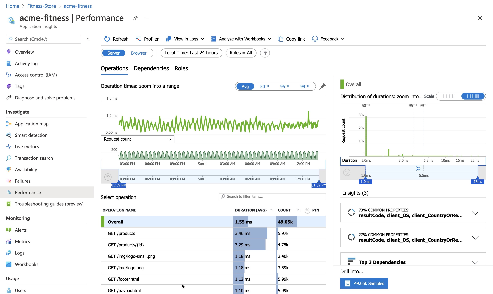

Navigate to the `Performance/Dependenices` blade - you can see the performance number for dependencies,
particularly SQL calls:

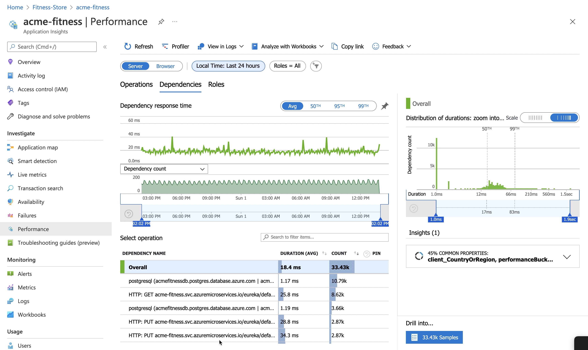

Navigate to the `Performance/Roles` blade - you can see the performance metrics for individual instances or roles:


Click on a SQL call to see the end-to-end transaction in context:

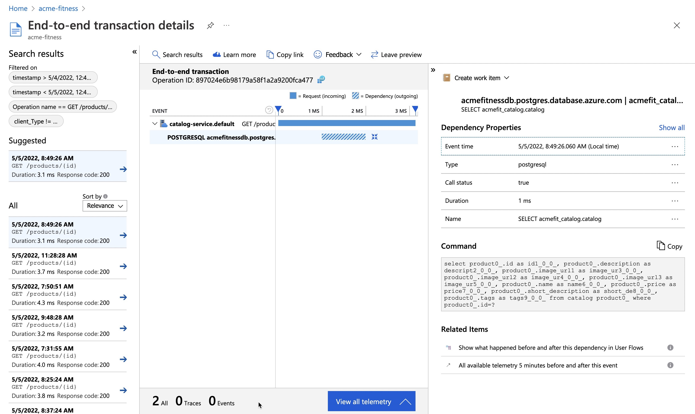

Navigate to the `Failures/Exceptions` blade - you can see a collection of exceptions:


## Metrics

Navigate to the `Metrics` blade - you can see metrics contributed by Spring Boot apps, Spring Cloud modules, and dependencies. The chart below shows `http_server_requests` and `Heap Memory Used`:

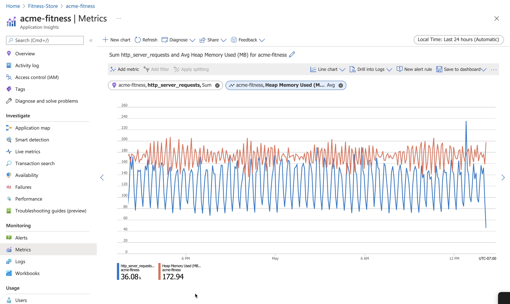

Spring Boot registers a lot number of core metrics: JVM, CPU, Tomcat, Logback, etc. 
The Spring Boot auto-configuration enables the instrumentation of requests handled by Spring MVC.
The REST controllers `ProductController`, and `PaymentController` have been instrumented by the `@Timed` Micrometer annotation at class level.

- `acme-catalog` application has the following custom metrics enabled:
  - @Timed: `store.products`
- `acem-payment` application has the following custom metrics enabled:
  - @Timed: `store.payment`

You can see these custom metrics in the `Metrics` blade:

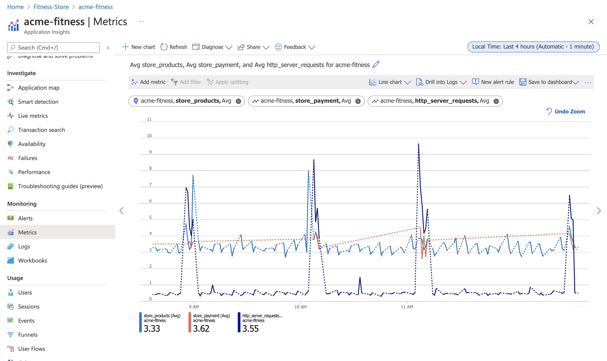

Navigate to the `Live Metrics` blade - you can see live metrics on screen with low latencies < 1 second:

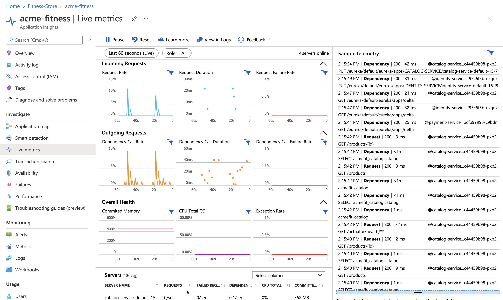

## Working with Other Monitoring Tools

In addition to Application Insights, Azure Spring Cloud enterprise tier supports exporting metrics to other tools including:

- AppDynamics
- ApacheSkyWalking
- Dynatrace
- ElasticAPM
- NewRelic

Additional bindings can be added to a builder in Tanzu Build Service using the following command:

    ```azurecli
    az spring-cloud build-service builder buildpack-binding create \
        --resource-group <resource-group> \
        --service <spring-cloud-service> \
        --builder-name <builder-name> \
        --name <binding-name> \
        --type <ApplicationInsights|AppDynamics|ApacheSkyWalking|Dynatrace|ElasticAPM|NewRelic> \
        --properties <connection-properties>
        --secrets <secret-properties>
    ```

## Clean up resources

If you plan to continue working with subsequent quickstarts and tutorials, you might want to leave these resources in place. When no longer needed, delete the resource group, which deletes the resources in the resource group. To delete the resource group by using Azure CLI, use the following commands:

```azurecli
echo "Enter the Resource Group name:" &&
read resourceGroupName &&
az group delete --name $resourceGroupName &&
echo "Press [ENTER] to continue ..."
```

## Next steps

> [!div class="nextstepaction"]
> [Quickstart: Set Request Rate Limits](./quickstart-set-request-rate-limits-enterprise.md)
