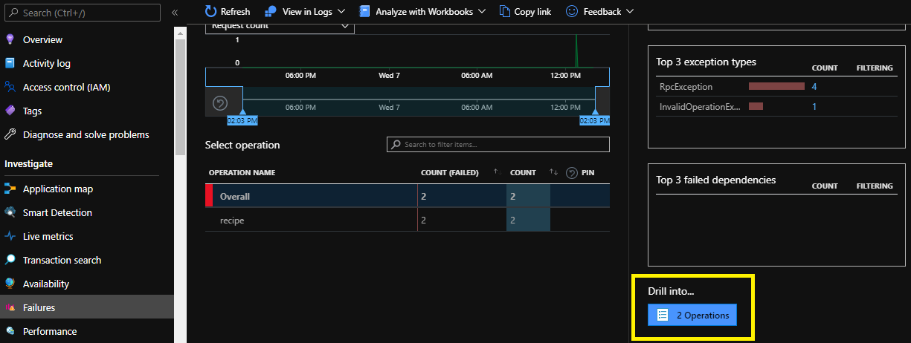
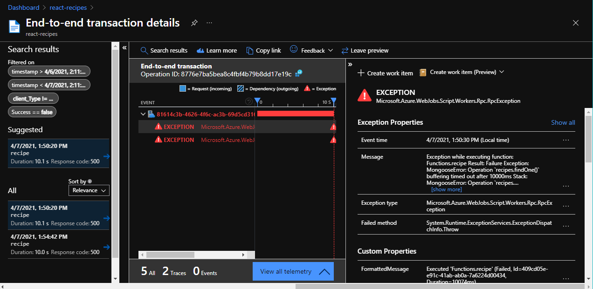

# Troubleshooting deployment and runtime errors

When deploying your application things may not go exactly as planned despite best efforts. This article provides a set of steps to walk through when troubleshooting deployment and other issues for your app on Static Web Apps, and includes the most common issues.

## Retrieve deployment error messages

The Azure Static Web Apps deployment workflow uses the [Oryx build process](https://github.com/microsoft/Oryx/blob/master/doc/runtimes/nodejs.md#build). For Node.js, this process will automatically run the following commands:

```bash
npm install
npm run build # if specified in package.json
npm run build:azure # if specified in package.json
```

Any errors raised by this process will be logged in the GitHub workflow run. You can retrieve those logs in GitHub.

1. Navigate to the GitHub repository for your static web app
1. Click *Actions*

    > ![NOTE]
    > Any failed workflow runs will be displayed with a red *X* rather than a green check mark

1. Click the link for the workflow run you wish to validate
1. Click *Build and Deploy Job* to open the details of the deployment
1. Click *Build And Deploy* to display the log

    

1. Review the logs and any error messages

    > ![NOTE]
    > Some warning error messages may display in red, such as notes about *.oryx_prod_node_modules* and *workspace*. These are part of the normal deployment process.

If any packages fail to install or other issues are raised you will see the original error messages here, just as if you ran the `npm` commands locally.

### Confirm folder configuration

Azure Static Web Apps needs to know which folders to use to host your application. This configuration is confirmed at the end of the build process, and errors are logged in the GitHub workflow run. When reviewing the logs if you see one of the following error messages it's an indication the folder configuration for your workflow is incorrect:

- App Directory Location: '/*folder*' is invalid. Could not detect this directory. Please verify your workflow reflects your repository structure.
- The app build failed to produce artifact folder: '*folder*'. Please ensure this property is configured correctly in your workflow file.
- Either no Api directory was specified, or the specified directory was not found. Azure Functions will not be created.

There are three folder locations specified in the workflow. Ensure the settings match both your project and any configured bundler jobs

- *app_location*
  - Root of the source code to be deployed. This will typically be */* or the location of the JavaScript and HTML for your project.
- *output_location*
  - Name of the folder created by any build process from a bundler such as webpack. This folder both needs to be created by the build process, and a subdirectory under the *app_location*
- *api_location*
  - Root of your Azure Functions hosted by Azure Static Web Apps. This points to the root folder of all Azure Functions for your project, typically *api*.
  
  > ![NOTE]
  > Error messages generated by an incorrect *api_location* configuration may still build successfully, as Azure Static Web Apps does not require serverless code.

## Use Application Insights to locate 500 errors

To find error messages generated by your application while running you can add [Application Insights](https://docs.microsoft.com/azure/azure-monitor/app/app-insights-overview) to your static web app. If you do not already have an instance of Application Insights created, you can both create and configure your static web app to use this new instance in the Azure Portal.

1. Open your static web app in the Azure Portal

  

1. On the Application Insights page, set *Enable Application Insights* to *Yes*

  

1. Click *Save*

Your static web app is now configured to use Application Insights.

### Read runtime error messages

After creating the Application Insights instance you will be able to explore any new error messages generated. Application Insights will log the full error message and stack trace generated by the error.

1. Inside the Azure Portal, open the Resource Group your static web app is included in
1. Click on the Application Insights instance created, which will have the same name as your static web app if created using the steps above
1. Under *Investigate*, click *Failures*
1. Scroll down until you see *Drill into* on the right side
1. Under *Drill into* a button will be displayed listing the number of recently failed operations

  

1. Click the button which says *x Operations* to open a panel displaying the recent failed operations

  

1. You can now select the errors you wish to explore by clicking on them

  

## Environmental variables

Many web applications use environmental variables for storing keys, connection strings, and other potentially sensitive or environment specific settings. Azure Static Web Apps supports environmental variables through Application Settings. Application Settings are key/value pairs which are set as environmental variables for your application, and are retrievable using the same syntax you would use for any other such values. When deploying, double check any environmental variables are set as Application Settings.

1. Open your static web app in the Azure Portal
1. Click *Configuration*
1. The *Configuration* screen displays the list of all Application Settings

  

1. To add a new one, click *Add*, set the *Name* and *Value*, then click *OK* and *Save*

  
