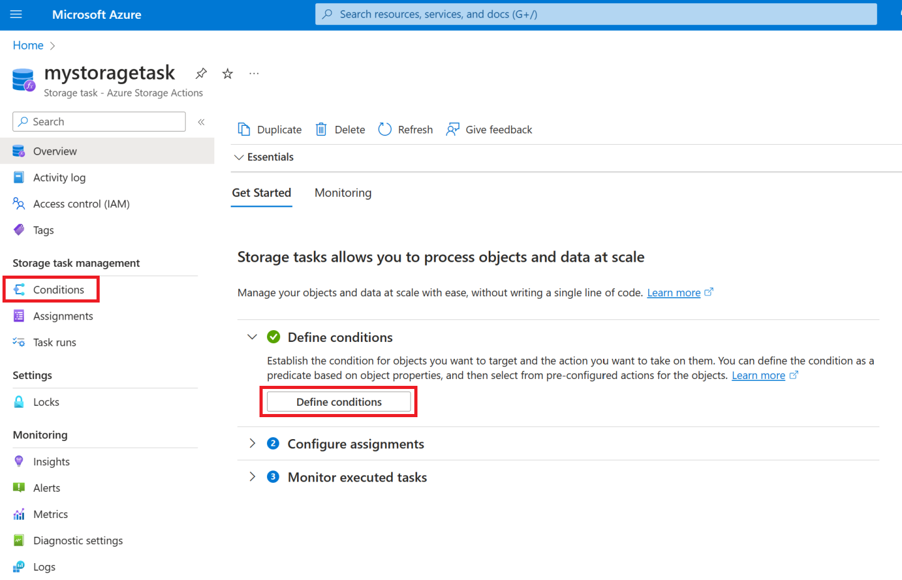
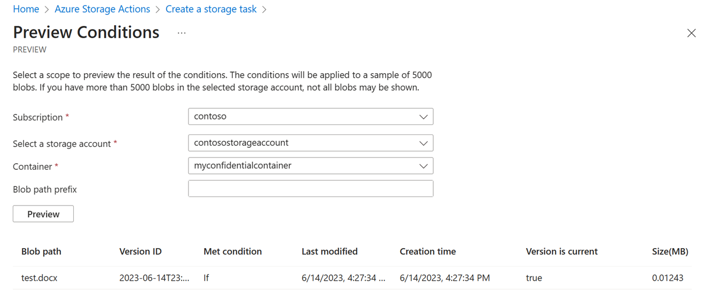

# Define storage task conditions and operations

You can use a visual editor to define the conditions and operations of a storage task.

> [!IMPORTANT]
> Azure Storage Actions is currently in PREVIEW and is available these [regions](../overview.md#supported-regions).
> See the [Supplemental Terms of Use for Microsoft Azure Previews](https://azure.microsoft.com/support/legal/preview-supplemental-terms/) for legal terms that apply to Azure features that are in beta, preview, or otherwise not yet released into general availability.

An _operation_ is an action taken on each object that meets the conditions defined in the task. A _condition_ contains one or more conditional _clauses_. Each clause defines the relationship between a property and a value. To execute an operation defined in the storage task, the terms of that relationship must be met by each object.

To learn more, see [Properties, operators, and operations in storage task conditions](storage-task-properties-operators-operations.md).

## Open the conditions editor

Navigate to the storage task in the Azure portal and then under **Storage task management**, select **Conditions**.

> [!div class="mx-imgBorder"]
> 

The **Visual builder** tab of the **Conditions** pane appears. 

## Define conditions

Define a condition by adding clauses. A clause defines the relationship between a property and a value. To execute an operation defined in the storage task, the terms of that relationship must be met by each object.

### Add and remove clauses

To add a clause, select **Add new clause**, and to remove a clause, select the delete icon(:::image type="icon" source="../media/storage-tasks/storage-task-conditions-operations-edit/conditions-delete-icon.png":::) that appears next to it.

> [!div class="mx-imgBorder"]
> 

### Specify the terms of a clause

To define a clause, choose a property, specify a value for that property, and then choose an operator that relates them together.

#### Choose a property

In the **Blob property** drop-down list, choose a property. See [Supported blob properties](storage-task-properties-operators-operations.md#supported-properties-in-a-clause).

The following example selects the **Blob name** property.

> [!div class="mx-imgBorder"]
> 

#### Choose a value and operator

In the **Property value** box, enter a value and in the **Operator** drop-down list, choose an operator. See [Supported Operators](storage-task-properties-operators-operations.md#supported-operators-in-a-clause).

The following example specifies a value of `.log` along with the **Ends with** operator. This condition allows the operation defined in this storage task to execute only on blobs that have a `.log` file extension.

> [!div class="mx-imgBorder"]
> 

#### Use a wildcard in string values

You can use the `*` and `?` wildcard characters in the value of a string property. The `*` character represents zero or more characters while a `?` character represents exactly one character.

For example, if you want your clause to evaluate to true only for blobs that are Word documents, you would use the string `*.docx`. However, if you want only documents are named with a single character such as `1.docx` or `2.docx`, then you would use the string `?.docx`.  

You can use the `*` or `?` anywhere in a string. You can escape these characters by adding a `\` just before the character.

#### Reference a value from object metadata

Clauses that include a date and time property can reference a value from the metadata of a container or an index tag of a blob. These values are obtained dynamically at runtime when the task executes.

In your storage account, you can add a key to the metadata of a container or to the index tags of a blob. The value of that key must be a [ISO 8601](https://en.wikipedia.org/wiki/ISO_8601#Durations)-formatted time interval. For example, you might add a key named `retainfor` along with a string value of `PT5M` which represents an interval of five minutes.

To reference a key, select the **Edit** link that appears in the **Property value** column. Then, in the **Select a value** dialog box, select **Container metadata** or **Blob Index tags**.

The following example adds the **Creation time** property, the **Earlier than** operator, and references a key named `retainFor` in the index tags of each blob that is evaluated.

> [!div class="mx-imgBorder"]
> 

This condition tests whether a blob was created earlier than a certain time duration relative to now (the current date and time). For example, if the value retrieved from the `retainFor` tag is five minutes, then this condition checks if the blob was created more than 5 minutes ago.

> [!NOTE]
> In the **Code** tab, you'll see the logic of this example represented in a slightly different way. The generated code tests whether the current time is greater than creation time plus the time interval. Both representations yield the same result.

If the key is not present for an evaluated object, then the condition evaluates to false. If the key value is a string that does not conform to the [ISO 8601](https://en.wikipedia.org/wiki/ISO_8601#Durations) standard, then an error is reported in the execution report.

#### Apply And / Or to a clause

You add **And** or **Or** to a clause. Specify **And** if you want to target objects that meet the criteria in both the current clause and the previous clause of the condition. Specify **Or** to target objects that meet the criterion in either the current clause or the previous clause.

The following example shows clauses that use **And**. In this example, the storage task targets objects that have a `.log` extension and which have a tag named `Archive-Status` set to `Ready`.

> [!div class="mx-imgBorder"]
> 

### Change the order of clauses

You can arrange clauses in an order that you believe will improve the performance of a task run. For example, instead of first testing all blobs in an account against a name filter, you might elevate a clause that targets a specific container. That small adjustment can prevent the task from performing unnecessary evaluations.

First, select the clause. Then, select **Move clause up** or **Move clause down** to change its position in the list.

The following example shows the result of selecting a clause and then selecting **Move clause up**.

> [!div class="mx-imgBorder"]
> 

### Group and ungroup clauses

Grouped clauses operate as a single unit separate from the rest of the clauses. Grouping clauses is similar to putting parentheses around a mathematical equation or logic expression. The **And** or **Or** operator for the first clause in the group applies to the whole group.

Select the checkbox that appears next to each clause you want to group together. Then, select **Group**.

The following example shows two conditions grouped together. In this example, the operation executes if a blob has the `.log` extension and either a tag named `Archive-Status` is set to the value of `Ready` or the file has not been accessed in 120 days.

> [!div class="mx-imgBorder"]
> 

To ungroup clauses, select the ungroup icon (:::image type="icon" source="../media/storage-tasks/storage-task-conditions-operations-edit/ungroup-icon.png":::) or select each clause in the group, and select **Ungroup**.

## Preview the effect of conditions

You can view a list of blobs that would be impacted by the conditions that you've defined. In the conditions editor, select **Preview conditions**.

> [!div class="mx-imgBorder"]
> 

In the **Preview Conditions**, you can specify a target subscription, storage account and container. Because a preview can only show up to 5000 blobs, you can also specify a prefix to narrow the list.

> [!div class="mx-imgBorder"]
> 

## Define operations

An operation is an action taken on each object that meets the conditions defined in the task.  

### Add and remove operations

To add an operation, select **Add new operation**, and to remove an operation, select the delete icon(:::image type="icon" source="../media/storage-tasks/storage-task-conditions-operations-edit/conditions-delete-icon.png":::) that appears next to it.

> [!div class="mx-imgBorder"]
> 

#### Choose an operation

In the **Operation** drop-down list, choose an operation. See [Supported operations](storage-task-properties-operators-operations.md#supported-operations).

The following example selects the **Set blob tags** property.

> [!div class="mx-imgBorder"]
> 

#### Choose a parameter

Enter or select the parameters that are appropriate for the operation.

The following example sets the `Archive-Status` tag to the value `Archived`.  

> [!div class="mx-imgBorder"]
> 

### Change the order of operations

You can arrange operations in any order.

In this example, the existing order makes sense. Blobs are first archived and the tags are set. It wouldn't make sense to set the tag before changing the tier just in case the attempt to change the tier of a blob didn't succeed. If the set blob tag operation appeared first in the list, you might consider moving that operation beneath the set blob tier operation.

To move an operation, select the checkbox that appears beside it. Then, select **Move operation up** or **Move operation down** to change its position in the list.

## See also

- [Azure Storage Actions Overview](../overview.md)
