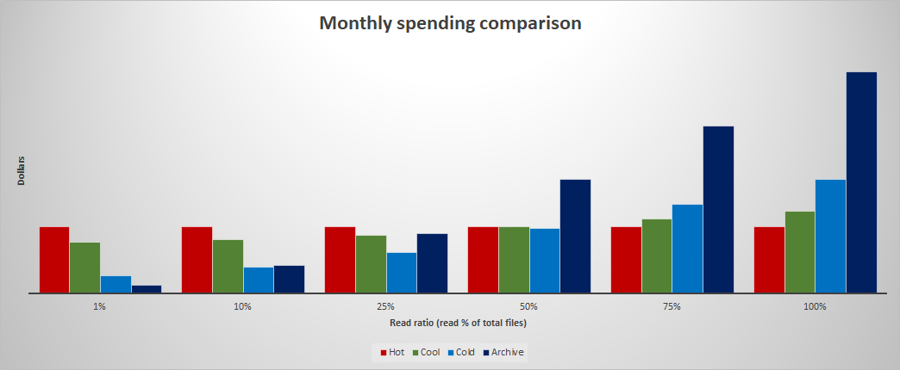
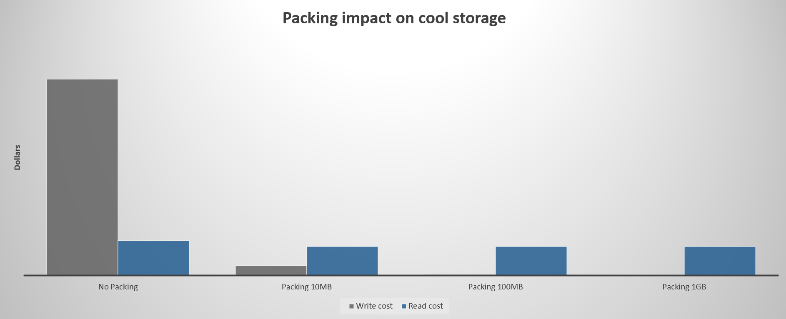

# Best practices for using blob access tiers

This article provides best practice guidelines that help you use access tiers to optimize performance and reduce costs. To learn more about access tiers, see [Hot, Cool, and Archive access tiers for blob data](access-tiers-overview.md?tabs=azure-portal). 

> [!NOTE]
> This article uses fictitious prices in all calculations. For official prices, see [Azure Blob Storage pricing](https://azure.microsoft.com/pricing/details/storage/blobs/) or [Azure Data Lake Storage pricing](https://azure.microsoft.com/pricing/details/storage/data-lake/). For more information about how to choose the correct pricing page, see [Understand the full billing model for Azure Blob Storage](../common/storage-plan-manage-costs.md).

## Upload data to the most cost-efficient access tiers

When you migrate data to Azure Blob Storage, try to choose the most appropriate access tier based upon your estimated read patterns. If you predict that data will be read often, choose a warmer tier. If data is rarely accessed, consider a cooler tier. Choosing the most optimal tier up front as opposed to ingesting data and then moving that data to other tiers, can reduce costs and save time. 

If you change tiers, you'll pay the cost of writing to the initial tier, and then pay the cost of writing to the second tier. If you change tiers by using a lifecycle management policy, then you'll also incur the cost of listing operations and policies require a day to take effect and a day to complete execution.

To determine which tier makes the most sense, analyze the current or expected read patterns of the data that you plan to ingest into Azure. The following chart shows the impact on monthly spending given various read percentages. This chart assumes a monthly ingest of 1,000,000 files totaling 10,240 GB in size.

For example, the second pair of bars assumes that workloads read 100,000 files (10% of 1,000,000 files) and 1,024 GB (10% of 10,240 GB). Assuming the fictitious pricing, the estimated monthly cost of cool storage is $175.99 and the estimated monthly cost of archive storage is $90.62.

> [!div class="mx-imgBorder"]
> 

For guidance about how to upload to a specific access tier, see [Set a blob's access tier](access-tiers-online-manage.md). For offline data movement to the desired tier, see [Azure Data Box](/products/databox/).

## Move data into the most cost-efficient access tiers

For data already uploaded to Azure Blob Storage, you should periodically analyze how your blobs and containers are stored, organized, and used in production. To gather telemetry, enable [blob inventory reports](blob-inventory.md) and enable [last access time tracking](lifecycle-management-policy-configure.md#optionally-enable-access-time-tracking). Analyze use patterns by using tools such as Azure Synapse or Azure Databricks, and then use lifecycle management policies to move data to tiers which optimize the cost of those blobs based on use patterns. For example, data not accessed for more than 30 days might be more cost efficient if placed into the cool tier. Consider archiving data not accessed for over 180 days. 

For examples of policy definitions, see [Manage the Azure Blob Storage lifecycle](lifecycle-management-overview.md?tabs=azure-portal).

To learn about how to analyze your data, see [Tutorial: Analyze blob inventory reports](storage-blob-inventory-report-analytics.md).

To learn about ways to analyze individual containers in your storage account. See these articles:

- [Calculate blob count and total size per container using Azure Storage inventory](calculate-blob-count-size.md)

- [How to calculate Container Level Statistics in Azure Blob Storage with Azure Databricks](https://techcommunity.microsoft.com/t5/azure-paas-blog/how-to-calculate-container-level-statistics-in-azure-blob/ba-p/3614650)

Your analysis might reveal append or page blobs not in active use. For example, you might have log files (append blobs) that are no longer being written to, but you'd like to store them for compliance reasons. Similarly, you might want to back up disks or disk snapshots (page blobs). You can move append and page blobs into cooler tiers as well.  However, you must first convert them to block blobs. For guidance, see [topic link goes here](archive-cost-estimation.md).

## Pack small files before moving data to cooler tiers

To reduce the cost of reading and writing data, consider packing small files into larger ones by using file formats such as TAR or ZIP. Each read or write operation incurs a cost so reducing the number of operations required to transfer data will reduce costs. Use the [this worksheet](https://azure.github.io/Storage/docs/backup-and-archive/azure-archive-storage-cost-estimation/azure-archive-storage-cost-estimation.xlsx) to analyze the impact of packing files and determine whether the overhead involved in packing and unpacking files is worth the savings.

The following chart shows the relative impact of packing files for the cool tier. The read cost assumes a monthly read percentage of 30%.

> [!div class="mx-imgBorder"]
> 

Writing to the archive tier is less expensive than writing to the cool tier. However, the cost of reading from the archive tier is higher. The following chart shows the relative impact of packing files for the archive tier. The read cost assumes a monthly read percentage of 30%.

> [!div class="mx-imgBorder"]
> 

## Next steps

- [Set a blob's access tier](access-tiers-online-manage.md)
- [Archive a blob](archive-blob.md)
- [Optimize costs by automatically managing the data lifecycle](lifecycle-management-overview.md)
- [Estimate the cost of archiving data](archive-cost-estimation.md)
