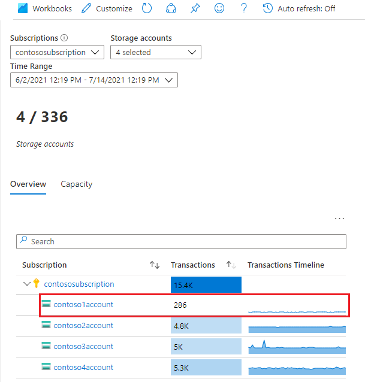
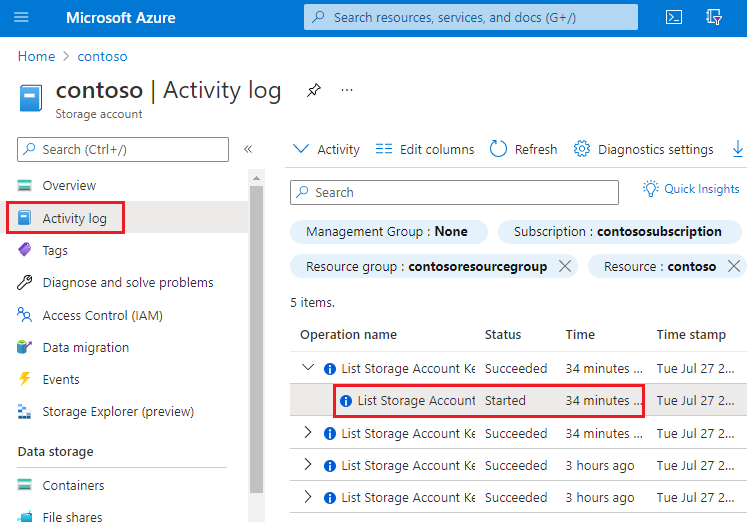

# Best practices for monitoring Azure Blob Storage

This article introduces some of most used scenarios and what best practices you can do to address these scenarios with Azure Storage monitoring data and Azure Monitor feature experiences. 

## Identify storage accounts with no or low use

When you have many storage accounts, you may need to evaluate which ones are in no or low use thus to reduce those accounts to improve management efficiency. Storage Insights is a dashboard on top of Azure Storage metrics and logs. You can use Storage Insights it to examine the transaction volume and used capacity of all your accounts. To set that up, see [Monitoring your storage service with Azure Monitor Storage insights](../../azure-monitor/insights/storage-insights-overview.md).

### Analyze transaction volume

From the [Storage Insights view in Azure monitor](../../azure-monitor/insights/storage-insights-overview.md#view-from-azure-monitor), sort your accounts in ascending order by using the **Transactions** column. The following image shows an account with very low transaction volume over the specified period. 

> [!div class="mx-imgBorder"]
> 

Click the account link to learn more about these transactions. In this example, most requests are made to the Blob Storage service. 

> [!div class="mx-imgBorder"]
> 

To determine what sorts of requests are being made, drill into the **Transactions by API name** chart. 

> [!div class="mx-imgBorder"]
> 

In this example, all requests are listing operations or requests for account property information. That reveals that users are only examining the contents of the account or the account configuration properties. There are no read and write transactions. This might lead you to believe that the account is not being used in a significant way. 

### Analyze used capacity

From the [Storage Insights view in Azure monitor](../common/storage-insights-overview.md#view-from-azure-monitor), sort your accounts in ascending order by using the **Account used capacity** column. The following image shows an account with lower capacity volume comparing with others. 

> [!div class="mx-imgBorder"]
> 

You can use Storage Explorer to examine them. For large numbers of blobs, consider generating a report by using a [Blob Inventory policy](blob-inventory.md). 

## Monitor use of a container

In scenarios that you partition your customers’ data by container, you would want to monitor how much capacity has been used by each user. You can use Azure Storage blob inventory to take an inventory of blobs with size information and aggregate the size and count on container level. For guidance, see [Calculate blob count and total size per container using Azure Storage inventory](calculate-blob-count-size.md).

You might also want to evaluate the traffic at the container level. You can query logs and aggregate on container level. Here's a query to get the number of read transactions and the number of bytes read for a container.

```kusto
StorageBlobLogs
| where OperationName  == "GetBlob"
| extend ContainerName = split(parse_url(Uri).Path, "/")[1]
| summarize ReadSize = sum(ResponseBodySize), ReadCount = count() by tostring(ContainerName)
```

You can also do the same to obtain statistics for write operations. Note that more than one type of operation can count as a write operation. To learn more about which operations are considered read and write operations, see either [Azure Blob Storage pricing](https://azure.microsoft.com/pricing/details/storage/blobs/) or [Azure Data Lake Storage pricing](https://azure.microsoft.com/pricing/details/storage/data-lake/)

```kusto
StorageBlobLogs
| where OperationName == "PutBlob" or
  OperationName == "PutBlock" or
  OperationName == "PutBlockList" or
  OperationName == "AppendBlock" or 
  OperationName == "SnapshotBlob" or
  OperationName == "CopyBlob" or 
  OperationName == "SetBlobTier" 
| extend ContainerName = split(parse_url(Uri).Path, "/")[1]
| summarize WriteSize = sum(RequestBodySize), WriteCount = count() by tostring(ContainerName)
```

To learn more about writing Log Analytic queries, see [Log Analytics](../../azure-monitor/logs/log-analytics-tutorial.md). To learn more, see the logs schema in [Azure Blob Storage monitoring data reference](monitor-blob-storage-reference.md#resource-logs-preview).

## Audit account activity

In most cases, you would need to audit activities on your storage accounts for security and compliance. Operations on storage accounts are in two categories: Control Plane and Data Plane. Typically, when you send an ARM request to create a storage account or update a property of an existing storage account, it’s a control plane operation. See more details in [Azure Resource Manager](../../azure-resource-manager/management/overview.md). When you upload a blob to a storage account or download a blob from a storage account, it’s a data plane operation. See more details in [Azure Storage API](https://docs.microsoft.com/rest/api/storageservices/). 

The section introduces how to identify information of when, who, what and how for auditing control plane operations and data plane operations. 

### Control plane audit

Control plane operation is an Azure Resource Management operation. A typical control plane operation on storage account is creating a storage account or updating a property of an existing storage account. ARM operation is captured in Azure activity log. Go to Azure Portal > Storage Account > Activity log to access [Azure activity log](../../azure-monitor/essentials/activity-log.md). The following example shows how you can identify information of when, who, what and how a control plane operation: 

> [!div class="mx-imgBorder"]
> 

Note that you may not always see some identity information, like email address, or name due to your Azure AD configurations. You are recommended to use Object Identifier to look up in your Active Directory > Users > Search with Object ID. 

### Data plane audit

A request that is sent to and processed on storage service endpoint is data plane operation. See more details in [Azure Storage API](https://docs.microsoft.com/rest/api/storageservices/). A typical data plane operation is uploading a blob to a storage account or downloading a blob from a storage account. Data plane operations are captured in [Azure resource logs for Storage](monitor-blob-storage.md#analyzing-logs). 

You can [configure Diagnostic setting](monitor-blob-storage.md#send-logs-to-azure-log-analytics) to export logs to Log Analytics workspace for native query experience. The following example shows how to query storage logs in Log Analytics to identify information of when, who, what, how: 

```kusto
StorageBlobLogs 
| where TimeGenerated > ago(3d) 
| project TimeGenerated, AuthenticationType, RequesterObjectId, OperationName, Uri
```
The following table shows how this query provides you each item of information.

|Information | query field | 
|--|--|
|When|`TimeGenerated`|
|Who|`AuthenticationType`, `RequesterObjectId`|
|What|`Uri`|
|How|`OperationName`|

For the *who* part of this information, `AuthenticationType` shows which type of authentication was used to make a request. This field can show any of the types of authentication that Azure Storage supports. This includes the use of an account key, a SAS token, or Azure Active Directory (Azure AD) authentication. 

If a request was authenticated by using Azure AD, the friendly name of the security principal is not always available. If the security principal is a user in Azure Active directory, then the user principal name or *UPN* might be available. However, in certain scenarios such as cross Azure AD tenant authentication, it might not be available. The UPN is also not available in cases where the security principal is service principal, or a system-wide or user-assigned managed identity.

The `RequesterObjectId` field provides the most reliable way to identify the security principal when Azure AD authentication is used. You can find the friendly name of that security principal by taking the value of the `RequesterObjectId` field, and searching for the security principal in Azure AD page of the Azure portal. The following screenshot shows a search result in Azure AD.

> [!div class="mx-imgBorder"]
> 


If you want to improve your ability to audit based on identity, we recommended that you transition to Azure AD, and prevent shared key and SAS authentication. That way you can audit specific identities. For example, this query shows the number of read operations and the bytes read by a specific OAuth security principal.

```kusto
StorageBlobLogs
| where TimeGenerated > ago(3d) 
  and OperationName  == "GetBlob" 
  and AuthenticationType == "OAuth"
| summarize BytesRead = sum(ResponseBodySize), ReadCount = count() by RequesterObjectId, OperationName, AuthenticationType
```

## Optimize cost for infrequent queries

This is a scenario that applies in cases where massive logs are needed to keep but for infrequent query, for example, due to compliance or security obligation. For a massive number of transactions, the cost of using Log Analytics might be high relative to just archiving to storage and using other query techniques. Log Analytics makes sense when customers want to leverage rich capabilities on Log Analytics. One way to reduce the cost of querying data is to archive logs to a storage account and then query logs in a Synapse workspace.

With Azure Synapse, you can create server-less SQL pool to query log data when you need. This would save your spending significantly. 

1. Export logs to storage account. See [Creating a diagnostic setting](monitor-blob-storage.md#creating-a-diagnostic-setting).

2. Create and configure a Synapse workspace. See [Quickstart: Create a Synapse workspace](../../synapse-analytics/quickstart-create-workspace.md).

2. Query logs. See [Query JSON files using serverless SQL pool in Azure Synapse Analytics](../../synapse-analytics/sql/query-json-files.md).

   Here's an example:

   ```sql
    select
        JSON_VALUE(doc, '$.time') AS time,
        JSON_VALUE(doc, '$.properties.accountName') AS accountName,
        JSON_VALUE(doc, '$.identity.type') AS identityType,    
        JSON_VALUE(doc, '$.identity.requester.objectId') AS requesterObjectId,
        JSON_VALUE(doc, '$.operationName') AS operationName,
        JSON_VALUE(doc, '$.callerIpAddress') AS callerIpAddress,
        JSON_VALUE(doc, '$.uri') AS uri
        doc
    from openrowset(
            bulk 'https://demo2uswest4log.blob.core.windows.net/insights-logs-storageread/resourceId=/subscriptions/xxxxxxxx-xxxx-xxxx-xxxx-xxxxxxxxxxxx/resourceGroups/mytestrp/providers/Microsoft.Storage/storageAccounts/demo2uswest/blobServices/default/y=2021/m=03/d=19/h=*/m=*/PT1H.json',
            format = 'csv', fieldterminator ='0x0b', fieldquote = '0x0b'
        ) with (doc nvarchar(max)) as rows
    order by JSON_VALUE(doc, '$.time') desc

   ```

## See also

- [Monitoring Azure Blob Storage](monitor-blob-storage.md).
- [Tutorial: Use Kusto queries in Azure Data Explorer and Azure Monitor](../../data-explorer/kusto/query/tutorial.md?pivots=azuremonitor).
- [Get started with log queries in Azure Monitor](../../azure-monitor/logs/get-started-queries.md).

  

