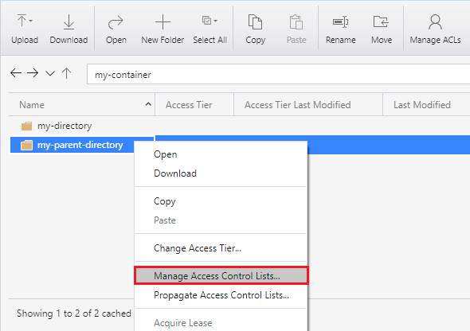
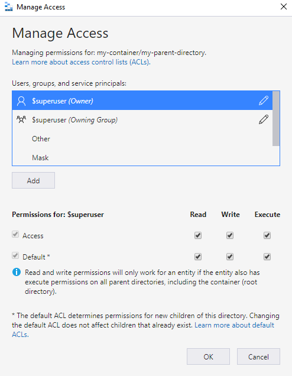
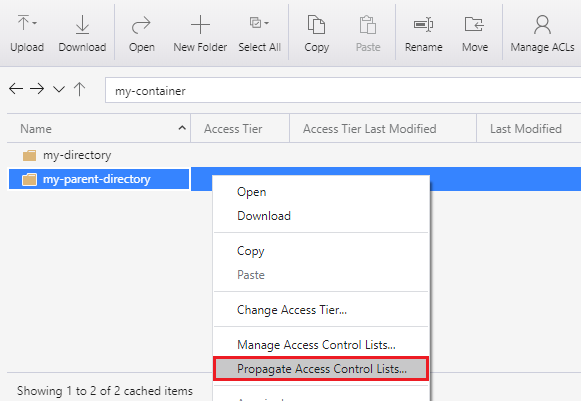

# Use the Azure portal to manage ACLs in Azure Data Lake Storage Gen2

This article shows you how to use [Azure portal](https://ms.portal.azure.com/) to manage access control lists (ACLs) in storage accounts that has hierarchical namespace (HNS) enabled.

You can use the Azure portal to view, and then update the ACLs of directories and files. ACL inheritance is available for new child items that are created under a parent directory. But if you want to apply ACL settings recursively on the existing child items of a parent directory without having to make these changes individually for each child item, you must use Azure Storage Explorer. For more information, see [Use Azure Storage Explorer to manage ACLs in Azure Data Lake Storage Gen2](data-lake-storage-explorer-acl.md). 

This article shows you how to modify the ACL of file or directory.

## Prerequisites

- An Azure subscription. See [Get Azure free trial](https://azure.microsoft.com/pricing/free-trial/).

- A storage account that has hierarchical namespace (HNS) enabled. Follow [these](../common/storage-account-create.md) instructions to create one.

## Section goes here.

Put something here.

## Manage an ACL

Right-click the container, a directory, or a file, and then click **Manage Access Control Lists**.  The following screenshot shows the menu as it appears when you right-click a directory.

> [!div class="mx-imgBorder"]
> 

The **Manage Access** dialog box allows you to manage permissions for owner and the owners group. It also allows you to add new users and groups to the access control list for whom you can then manage permissions.

> [!div class="mx-imgBorder"]
> 

To add a new user or group to the access control list, select the **Add** button. Then, enter the corresponding Azure Active Directory (Azure AD) entry you wish to add to the list and then select **Add**.  The user or group will now appear in the **Users and groups:** field, allowing you to begin managing their permissions.

> [!NOTE]
> It is a best practice, and recommended, to create a security group in Azure AD and maintain permissions on the group rather than individual users. For details on this recommendation, as well as other best practices, see [Access control model in Azure Data Lake Storage Gen2](data-lake-storage-explorer-acl.md).

Use the check box controls to set access and default ACLs. To learn more about the difference between these types of ACLs, see [Types of ACLs](data-lake-storage-access-control.md#types-of-acls).

## Apply ACLs recursively

You can apply ACL entries recursively on the existing child items of a parent directory without having to make these changes individually for each child item.

To apply ACL entries recursively, Right-click the container or a directory, and then click **Open Storage Explorer**.  The following screenshot shows the menu as it appears when you right-click a directory.

> [!div class="mx-imgBorder"]
> 

## Next steps

Learn about the Data Lake Storage Gen2 permission model.

> [!div class="nextstepaction"]
> [Access control model in Azure Data Lake Storage Gen2](./data-lake-storage-access-control-model.md)
