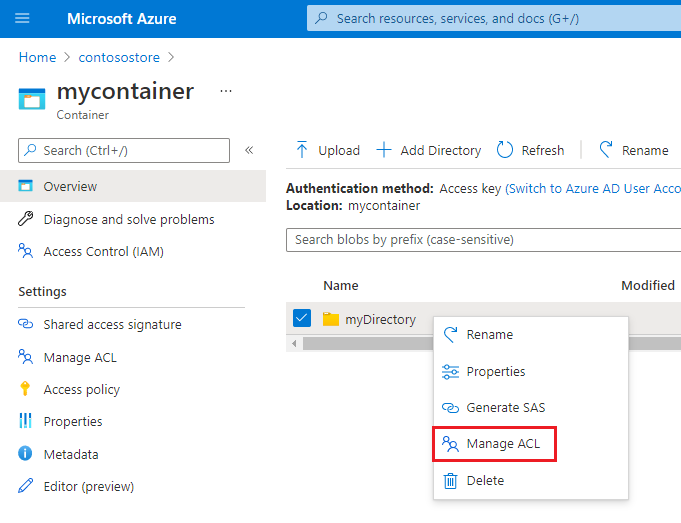
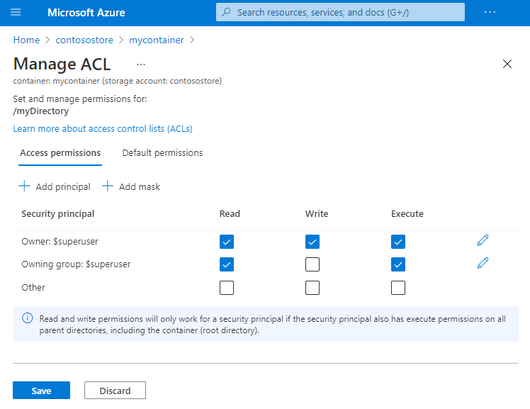
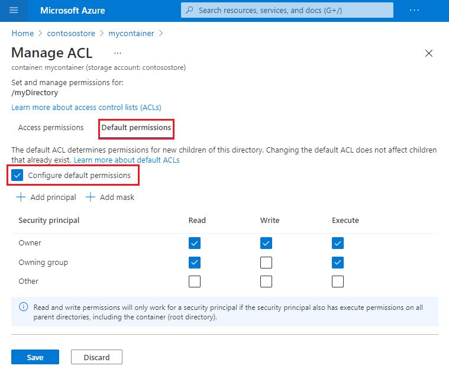

# Use the Azure portal to manage ACLs in Azure Data Lake Storage Gen2

This article shows you how to use [Azure portal](https://ms.portal.azure.com/) to manage access control lists (ACLs) in storage accounts that has hierarchical namespace (HNS) enabled.

You can use the Azure portal to view, and then update the ACLs of directories and files. ACL inheritance is available for new child items that are created under a parent directory. But if you want to apply ACL settings recursively on the existing child items of a parent directory without having to make these changes individually for each child item, you must use Azure Storage Explorer. For more information, see [Use Azure Storage Explorer to manage ACLs in Azure Data Lake Storage Gen2](data-lake-storage-explorer-acl.md). 

This article shows you how to modify the ACL of file or directory.

## Prerequisites

- An Azure subscription. See [Get Azure free trial](https://azure.microsoft.com/pricing/free-trial/).

- A storage account that has hierarchical namespace (HNS) enabled. Follow [these](../common/storage-account-create.md) instructions to create one.

- One of the following security permissions:

  - You user identity has been assigned the [Storage Blob Data Owner](../../role-based-access-control/built-in-roles.md#storage-blob-data-owner) role in the scope of the either the target container, storage account, parent resource group or subscription.  

  - Owning user of the target container, directory, or blob to which you plan to apply ACL settings. 
  
## Section goes here.

Put something here.

## Manage an ACL

1. Sign in to the [Azure portal](https://portal.azure.com/) to get started.

2. Locate your storage account and display the account overview.

3. Select **Containers** under **Data storage**.
   
   The containers in the storage account appear. 

   > [!div class="mx-imgBorder"]
   > 

5. Navigate to any container, directory, or blob, then, right-click the object and select **Manage ACL**.

   > [!div class="mx-imgBorder"]
   > 

   The **Access permissions** tab of the **Manage ACL** page appears. Use the controls in this tab to manage access to the object. This page allows you to manage permissions the **access acl** of an item. 

   > [!div class="mx-imgBorder"]
   > 

   Use the check box controls to set access and default ACLs. To learn more about the difference between these types of ACLs, see [Types of ACLs](data-lake-storage-access-control.md#types-of-acls).

6. To manage the default ACL of a directory, select the **default permissions** tab. This tab appears only for directories. To configure the default ACL, select the **Configure default permissions** checkbox.

   > [!div class="mx-imgBorder"]
   > 

   You can also add a *security principal* to the ACL. A security principal is an object that represents a user, group, service principal, or managed identity that is defined in Azure Active Directory (AD).

7. To a *security principal* to the ACL, click the **Add principal** button, find the security principal by using the search box, and then click the **Select** button. 

   > [!div class="mx-imgBorder"]
   > 

   > [!NOTE]
   > We recommend that you create a security group in Azure AD, and then maintain permissions on the group rather than for individual users. For details on this recommendation, as well as other best practices, see [Access control model in Azure Data Lake Storage Gen2](data-lake-storage-explorer-acl.md).

## Apply ACLs recursively

You can apply ACL entries recursively on the existing child items of a parent directory without having to make these changes individually for each child item. However, you can't apply ACL entries recursively by using the Azure portal. 

To apply ACLs recursively, use Azure Storage Explorer, PowerShell, or the Azure CLI. If you prefer to write code, you can also use the .NET, Java, Python, or Node.js APIs. You can find the complete list of guides here: [How to set ACLs](data-lake-storage-access-control.md#how-to-set-acls). 

Learn about the Data Lake Storage Gen2 permission model.

> [!div class="nextstepaction"]
> [Access control model in Azure Data Lake Storage Gen2](./data-lake-storage-access-control-model.md)
