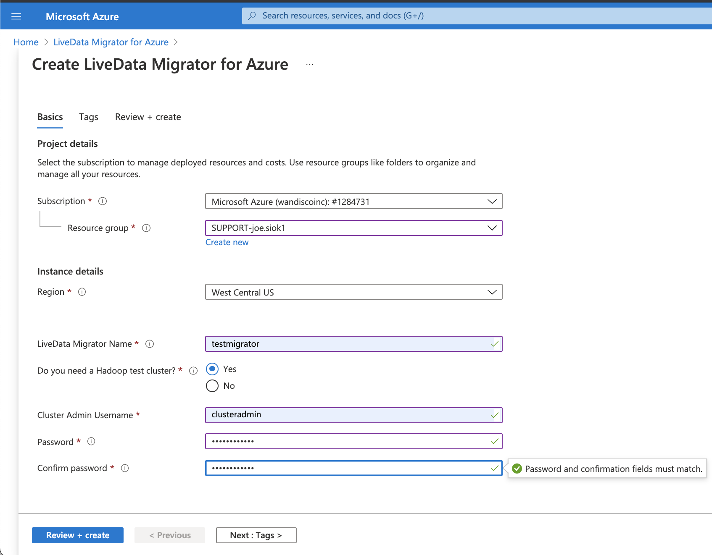
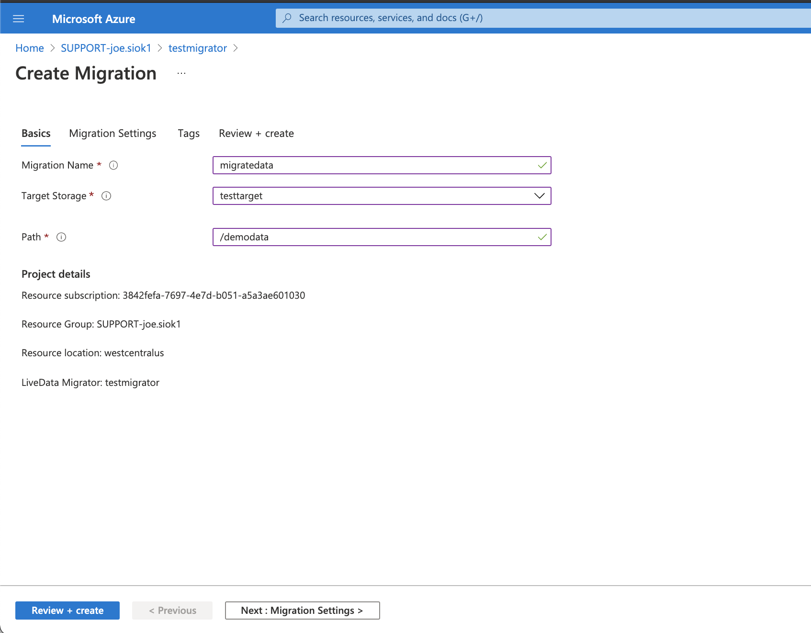
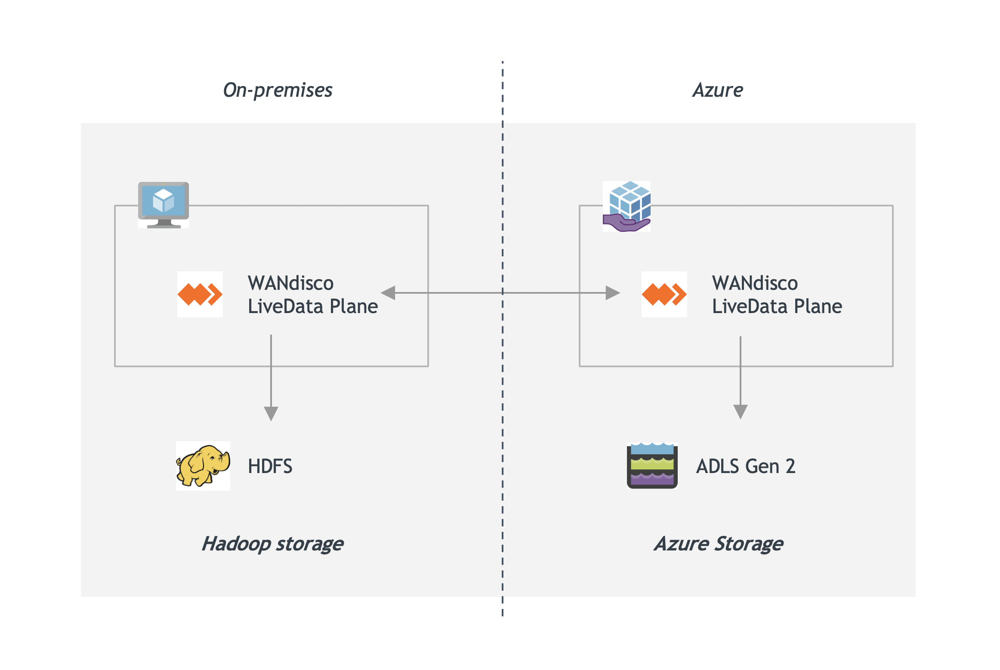

# Meet demanding migration requirements with WANdisco LiveData Platform for Azure (preview)

Migrate on-premises Hadoop data to Azure Data Lake Storage Gen2 by using [WANdisco LiveData Platform for Azure](https://docs.wandisco.com/live-data-platform/docs/landing/). This platform eliminates the need for application downtime, remove the chance of data loss, and ensure data consistency even while operations continue on-premises.  

> [!NOTE]
> WANdisco LiveData Platform for Azure is in public preview. For regional availability, see [Supported regions](https://docs.wandisco.com/live-data-platform/docs/prereq#supported-regions).

The platform consists of two services: [LiveData Migrator for Azure](https://www.wandisco.com/products/livedata-migrator-for-azure) to migrate actively used data from on-premises environments to Azure storage, and [LiveData Plane for Azure](https://www.wandisco.com/products/livedata-plane-for-azure) which ensures that all modified data or ingest data are replicated consistently. 

> [!div class="mx-imgBorder"]
> 

You can manage both services by using the Azure portal and the Azure CLI, and both follow the same metered, pay-as-you-go billing model as all other Azure services. LiveData Platform for Azure consumption will appear on the same monthly Azure bill and will provide a consistent and convenient way to track and monitor your usage.

Unlike migrating data _offline_ by [copying static information to Azure Data Box](./data-lake-storage-migrate-on-premises-hdfs-cluster.md), or by using Hadoop tools like [DistCp](https://hadoop.apache.org/docs/current/hadoop-distcp/DistCp.html), you can maintain full operation of your business systems during _online_ migration with WANdisco LiveData for Azure. Keep your big data environments operating even while moving their data to Azure.

>[!VIDEO https://www.youtube.com/embed/KRrmcYPxEho]

## Key features of WANdisco LiveData Platform for Azure

[WANdisco LiveData Platform for Azure](https://docs.wandisco.com/live-data-platform/docs/landing/) uses a unique, wide-area network capable consensus engine to achieve data consistency, and to conduct data replication at scale while applications can continue to modify the data under replication.  

Key features of the platform include the following:

- **Data consistency**: Solve the challenges of migrating large data volumes between environments and keeping those data consistent across storage systems throughput migration, even while they are under continual change. Employ WANdisco's unique, wide-area network capable consensus engine directly in Azure to achieve data consistency and to migrate data with consistency guarantees throughout data changes.

- **Maintain operations**: Because applications can continue to create, modify, read, and delete data during migration, there is no need to disrupt business operations or introduce an outage window just to migrate big data to Azure. Continue to operate applications, analytics infrastructure, ingest jobs, and other processing.

- **Validate outcomes**: End-to-end validation that your data can be used effectively once migrated to Azure requires that you run production application workloads against them. Only a LiveData Service provides this without introducing the risk of data divergence, by maintaining data consistency regardless of whether change occurs at the source or target of your migration. Test and validate application behavior without risk or change to your processes and systems.

- **Reduce complexity**: Eliminate the need to create and manage scheduled jobs to copy data by migrating data through automation. Use the deep integration with Azure as a control plane to manage and monitor migration progress, including selective data replication, Hive metadata, data security and confidentiality.

- **Efficiency**: Maintain high throughput and performance, and scale to big data volumes easily. With control of bandwidth consumption, you can ensure that you can meet your migration goals without impacting other system operations.

## Migrate big data faster without risk

The first service of WANdisco LiveData Platform for Azure is [LiveData Migrator for Azure](https://www.wandisco.com/products/livedata-migrator-for-azure); a  solution for migrating actively used data from on-premises environments to Azure storage. LiveData Migrator for Azure is provisioned and managed entirely from the Azure portal or Azure CLI, and operates alongside your Hadoop cluster on-premises without any configuration change, application modifications, or service restarts to begin migrating data immediately.

> [!div class="mx-imgBorder"]
> 

Big data migrations can be complex and challenging. Moving petabytes of information without disrupting business operations has been impossible to achieve with offline data copy technologies. [LiveData Migrator for Azure](https://www.wandisco.com/products/livedata-migrator-for-azure) offers simple deployment and can establish a LiveData Service with continuous data migration and replication while applications read, write, and modify the data being migrated.

Performing a migration is as simple as these three steps:

1. Provision the LiveData Migrator instance from the Azure portal to your on-premises Hadoop cluster. No cluster change or downtime is needed, and applications can continue to operate.

   > [!div class="mx-imgBorder"]
   >

2. Define the target Azure Data Lake Storage Gen2-enabled storage account.

   > [!div class="mx-imgBorder"]
   >

3. Define the location of the data that you want to migrate, for example: `/user/hive/warehouse`, and start the migration.

   > [!div class="mx-imgBorder"]
   > 

Monitor your migration progress through standard Azure tooling including the Azure CLI and Azure portal, and continue to use your on-premises environment throughout. Before you start, review these [prerequisites](https://docs.wandisco.com/live-data-platform/docs/prereq/).

## Replicate data under active change

Large-scale migrations of on-premises data lakes to Azure need application testing and validation. Being able to do this without the risk of introducing data changes that will create multiple sources of truth that cannot be easily reconciled is critical to eliminating risk and minimizing the cost of moving to Azure. [LiveData Plane for Azure](https://www.wandisco.com/products/livedata-plane-for-azure) uses WANdisco's coordination engine technology to overcome these concerns.

> [!div class="mx-imgBorder"]
> 

Keep your data consistent across on-premises Hadoop clusters and Azure storage with LiveData Plane for Azure after initial migration:

1. Provision LiveData Plane for Azure on-premises and in Azure, starting from the Azure portal. No application changes are required.

2. Configure replication rules that cover that data locations that you want to keep consistent, for example: `/user/contoso/sales/region/WA`.

3. Run applications that access and modify data in either location as a Hadoop-compatible file system as you need.

LiveData Plane for Azure keeps your data consistent without imposing significant overhead on cluster operation or application performance. Modify or ingest data while all changes are replicated consistently.

## Next steps

- [LiveData Platform for Azure](https://docs.wandisco.com/live-data-platform/docs/landing/) for Azure is used like any other Azure resource, and is available in preview now. 

- Understand the [prerequisites](https://docs.wandisco.com/live-data-platform/docs/prereq/), plan your migration, and complete a large-scale migration rapidly with LiveData Migrator for Azure.

- Try out the LiveData Migrator without needing to have an on-premise Hadoop cluster by using the [HDFS Sandbox](https://docs.wandisco.com/live-data-platform/docs/create-sandbox-intro/).

## See also

- [LiveData Migrator for Azure on Azure Marketplace](https://azuremarketplace.microsoft.com/marketplace/apps/wandisco.ldm?tab=Overview)

- [LiveData Plane for Azure on Azure Marketplace](https://azuremarketplace.microsoft.com/marketplace/apps/wandisco.ldp?tab=Overview)

- [LiveData Migrator for Azure plans and pricing](https://azuremarketplace.microsoft.com/marketplace/apps/wandisco.ldm?tab=PlansAndPrice)

- [LiveData Plane for Azure plans and pricing](https://azuremarketplace.microsoft.com/marketplace/apps/wandisco.ldp?tab=PlansAndPrice) 

- [LiveData Platform for Azure Frequently Asked Questions](https://docs.wandisco.com/live-data-platform/docs/faq/)

- [Known Issues with LiveData Platform for Azure](https://docs.wandisco.com/live-data-platform/docs/known-issues/)

- [Introduction to Azure Data Lake Storage Gen2](data-lake-storage-introduction.md)