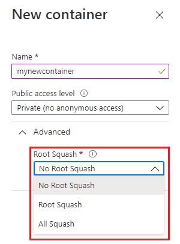

# Mount Blob storage by using the Network File System (NFS) 3.0 protocol

You can mount a container in Blob storage from a Linux-based Azure Virtual Machine (VM) or a Linux system that runs on-premises by using the NFS 3.0 protocol. This article provides step-by-step guidance. To learn more about NFS 3.0 protocol support in Blob storage, see [Network File System (NFS) 3.0 protocol support in Azure Blob Storage](network-file-system-protocol-support.md).

## Step 1: Create an Azure Virtual Network (VNet)

Your storage account must be contained within a VNet. A VNet enables clients to securely connect to your storage account. To learn more about VNet, and how to create one, see the [Virtual Network documentation](../../virtual-network/index.yml).

> [!NOTE]
> Clients in the same VNet can mount containers in your account. You can also mount a container from a client that runs in an on-premises network, but you'll have to first connect your on-premises network to your VNet. See [Supported network connections](network-file-system-protocol-support.md#supported-network-connections).

## Step 2: Configure network security

The only way to secure the data in your account is by using a VNet and other network security settings. Any other tool used to secure data including account key authorization, Azure Active Directory (AD) security, and access control lists (ACLs) are not yet supported in accounts that have the NFS 3.0 protocol support enabled on them.

To secure the data in your account, see these recommendations: [Network security recommendations for Blob storage](security-recommendations.md#networking).

## Step 3: Create and configure a storage account

To mount a container by using NFS 3.0, You must create a storage account. You can't enable existing accounts.

NFS 3.0 protocol is supported for standard general-purpose v2 storage accounts and for premium block blob storage accounts. For more information on these types of storage accounts, see [Storage account overview](../common/storage-account-overview.md).

As you configure the account, choose these values:

|Setting | Premium performance | Standard performance  
|----|---|---|
|Location|All available regions |All available regions    
|Performance|Premium| Standard
|Account kind|BlockBlobStorage| General-purpose V2
|Replication|Locally-redundant storage (LRS)| Locally-redundant storage (LRS), Zone-redundant storage (ZRS)
|Connectivity method|Public endpoint (selected networks) or Private endpoint |Public endpoint (selected networks) or Private endpoint
|Secure transfer required|Disabled|Disabled
|Hierarchical namespace|Enabled|Enabled
|NFS V3|Enabled |Enabled 

You can accept the default values for all other settings. 

## Step 4: Create a container

Create a container in your storage account by using any of these tools or SDKs:

|Tools|SDKs|
|---|---|
|[Azure portal](https://portal.azure.com)|[.NET](data-lake-storage-directory-file-acl-dotnet.md#create-a-container)|
|[AzCopy](../common/storage-use-azcopy-v10.md#transfer-data)|[Java](data-lake-storage-directory-file-acl-java.md)|
|[PowerShell](data-lake-storage-directory-file-acl-powershell.md#create-a-container)|[Python](data-lake-storage-directory-file-acl-python.md#create-a-container)|
|[Azure CLI](data-lake-storage-directory-file-acl-cli.md#create-a-container)|[JavaScript](data-lake-storage-directory-file-acl-javascript.md)|
||[REST](/rest/api/storageservices/create-container)|

> [!NOTE]
> By default, the root squash option of a new container is `no root squash`. But you can change that to `root squash` or `all squash`. For information about these squash options, see your operating system documentation.

The following image shows the squash options as they appear in the Azure portal.

> [!div class="mx-imgBorder"]
> 

## Step 5: Mount the container

Create a directory on your Linux system, and then mount a container in the storage account.

1. On a Linux system, create a directory.

   ```
   mkdir -p /mnt/test
   ```

2. Mount a container by using the following command.

   ```
   mount -o sec=sys,vers=3,nolock,proto=tcp <storage-account-name>.blob.core.windows.net:/<storage-account-name>/<container-name>  /mnt/test
   ```

   - Replace the `<storage-account-name>` placeholder that appears in this command with the name of your storage account.  

   - Replace the `<container-name>` placeholder with the name of your container.

---

## Resolve common errors

|Error | Cause / resolution|
|---|---|
|`Access denied by server while mounting`|Ensure that your client is running within a supported subnet. See the [Supported network locations](network-file-system-protocol-support.md#supported-network-connections).|
|`No such file or directory`| Make sure to type the mount command and it's parameters directly into the terminal. If you copy and paste any part of this command into the terminal from another application, hidden characters in the pasted information might cause this error to appear.|
|`EINVAL ("Invalid argument"`) |This error can appear when a client attempts to:<li>Write to a blob that was created from a blob endpoint.<li>Delete a blob that has a snapshot or is in a WORM (Write Once, Read Many) state.|
|`EROFS ("Read-only file system"`) |This error can appear when a client attempts to:<li>Write to a blob or delete a blob that has an active lease.<li>Write to a blob or delete a blob that is in a WORM state. |
|`NFS3ERR_IO/EIO ("Input/output error"`) |This error can appear when a client attempts to read, write, or set attributes on blobs that are stored in the archive access tier. |

## See also

- [Network File System (NFS) 3.0 protocol support in Azure Blob Storage](network-file-system-protocol-support.md)
- [Known issues with Network File System (NFS) 3.0 protocol support in Azure Blob Storage](network-file-system-protocol-known-issues.md)
