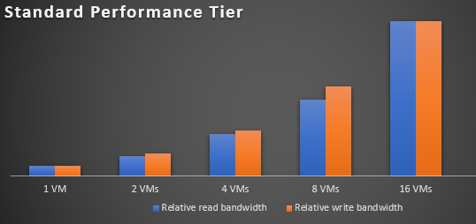
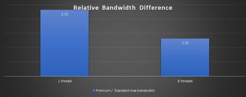

# Network File System (NFS) 3.0 performance considerations in Azure Blob storage (preview)

Blob storage now supports the Network File System (NFS) 3.0 protocol. You can optimize the performance of your storage requests by using the guidance in this article. To learn more about NFS 3.0 support in Azure Blob Storage, see [Network File System (NFS) 3.0 protocol support in Azure Blob storage (preview)](network-file-system-protocol-support.md).

> [!NOTE]
> NFS 3.0 protocol support in Azure Blob storage is in public preview. It supports GPV2 storage accounts with standard tier performance in the following regions: Australia East, Korea Central, and South Central US. The preview also supports block blob with premium performance tier in all public regions.

The scalability and performance target of a blob storage account with NFS 3.0 support is the same as any regular blob storage accounts. The target is defined in this article. The request rate and bandwidth achieved by your storage account depends upon the size of files stored, the access patterns utilized, and the type of workload your application performs. This article outlines the considerations to help you achieve the best scalability and performance.
Hierarchical namespace 

This service is best suited for processing high throughput, high scale read heavy workloads such as media processing, risk simulations, genomics sequencing, etc. Any other workload type using multiple readers and many threads requiring high bandwidth should be considered for this service and is very likely a good candidate. 

## Increase clients count to increase throughput 

Applications can achieve higher throughput with more clients. Azure blob storage scales linearly until it reaches the maximum storage account egress and ingress limit. The two graphs below show relative read and write throughput with different numbers of VMs.

Standard storage accounts.

> [!div class="mx-imgBorder"]
> 

Premium storage accounts.

> [!div class="mx-imgBorder"]
> 

## Use premium performance tier for small scale applications

Not all applications can scale up by adding more clients. For those applications, Azure premium block blob storage account offers consistent low-latency and high transaction. The premium block blob storage account can reach maximum bandwidth with fewer threads/clients. For example, with a single client, premium performance tier blob storage account can achieve 2.3x bandwidth compared to the same setup with a standard performance general purpose v2 storage accounts. 
The graph below shows the difference in achieved bandwidth between premium and standard performance storage accounts. As the number of clients increases, the difference between standard and premium storage accounts decreases.  

> [!div class="mx-imgBorder"]
> 

## Avoid frequent overwrites 

An NFS overwrite operations, especially the partial in-place file edits, are the combination of several underlying blob operations: a read, a modify, and a write operation. With all other factors for performance such as size of the IO and performance tier of the blob storage account being the same, it takes longer time to complete an overwrite operation than a new write operation.  
An application which requires frequent in place edits is not suited for NFS enabled blob storage accounts. 

## Latency considerations

Latency, sometimes referenced as response time, is the amount of time that an application must wait for a request to be completed.
Azure Storage offers two different performance options for block blobs: premium and standard.
For workloads which are more sensitive to latency, we recommend using premium block blobs as it offers significantly lower and more consistent latency than standard block blobs   via high-performance SSD disks. For more information, see Latency in Blob storage. 

## Best practice 

To achieve most of the performance, we recommend using the following, if applicable:
•	Use VMs with sufficient network bandwidth. Details on the VM available bandwidth can be found on Microsoft Docs.
•	Use 5.3+ kernel version and mount using nconnect=16 option
•	Use multiple mountpoints when your workloads allows you to

## Metadata operations
 
NFS file system metadata operations are mapped to hierarchical namespace operations and blob operations. Application and workloads that perform a lot of metadata operations are not expected to perform well and are not recommended for this service. 
[TODO] this part needs work. add more about metadata operation relates to the namespace design? 

## HPC Cache Integration 

Azure HPC Cache speeds access to your data for high-performance computing (HPC) tasks. By caching files in Azure blob storage, Azure HPC Cache brings the scalability of cloud computing to your existing workflow.
You can add/remove HPC cache in front of a NFS 3.0 enabled storage account. Depends on the size of the HPC cache, you can significantly lower the latency and increase IOPS of your data access. 
Learn more at [insert HPC cache for NFS 3.0 link]

## Next steps

To get started, see [Mount Blob storage by using the Network File System (NFS) 3.0 protocol (preview)](network-file-system-protocol-support-how-to.md).
