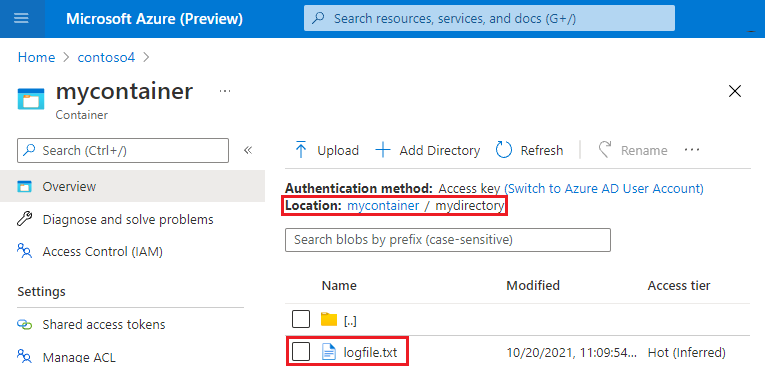

# Connect to Azure Blob Storage by using the SSH File Transfer Protocol (SFTP)

This article shows you how to securely connect to the Blob Storage endpoint of an Azure Storage account by using an SFTP client, and then upload and download files. 

Before you can authorize access, you must first enable SFTP support. See [Enable or disable SFTP support](secure-file-transfer-protocol-support-how-to.md).

To learn more about SFTP support for Azure Blob Storage, see [SSH File Transfer Protocol (SFTP) in Azure Blob Storage](secure-file-transfer-protocol-support.md).

## Prerequisites

- Enable SFTP support for Azure Blob Storage. See [Enable or disable SFTP support](secure-file-transfer-protocol-support-how-to.md).

- Authorize access to SFTP clients. See [Authorize access to clients](secure-file-transfer-protocol-support-authorize-access.md).

- If you're connecting from an on-premises network, make sure that your client allows outgoing communication through port 22 used by SFTP.

## Connect an SFTP client

You can use any SFTP client to securely connect and then transfer files. The following screenshot shows a Windows PowerShell session that uses [Open SSH](/windows-server/administration/openssh/openssh_overview) and password authentication to connect and then upload a file named `logfile.txt`.  

> [!div class="mx-imgBorder"]
> 

> [!NOTE]
> The SFTP username is `storage_account_name`.`username`.  In the example above the `storage_account_name` is "contoso4" and the `username` is "contosouser."  The combined username becomes `contoso4.contosouser` for the SFTP command.

> [!NOTE]
> You might be prompted to trust a host key. Valid host keys are published [here](secure-file-transfer-protocol-host-keys.md).  

After the transfer is complete, you can view and manage the file in the Azure portal. 

> [!div class="mx-imgBorder"]
> 

> [!NOTE]
> The Azure portal uses the Blob REST API and Data Lake Storage Gen2 REST API. Being able to interact with an uploaded file in the Azure portal demonstrates the interoperability between SFTP and REST.

See the documentation of your SFTP client for guidance about how to connect and transfer files.

## Connect using a custom domain

When using custom domains the connection string is `myaccount.myuser@customdomain.com`. If home directory hasn't been specified for the user, it's `myaccount.mycontainer.myuser@customdomain.com`.
	
> [!IMPORTANT]
> Ensure your DNS provider does not proxy requests. Proxying may cause the connection attempt to time out.

## Connect using a private endpoint

When using a private endpoint the connection string is `myaccount.myuser@myaccount.privatelink.blob.core.windows.net`. If home directory hasn't been specified for the user, it's `myaccount.mycontainer.myuser@myaccount.privatelink.blob.core.windows.net`.
	
> [!NOTE]
> Ensure you change networking configuration to "Enabled from selected virtual networks and IP addresses" and select your private endpoint, otherwise the regular SFTP endpoint will still be publicly accessible.

## Related content

- [SSH File Transfer Protocol (SFTP) support for Azure Blob Storage](secure-file-transfer-protocol-support.md)
- [Enable or disable SSH File Transfer Protocol (SFTP) support in Azure Blob Storage](secure-file-transfer-protocol-support-how-to.md)
- [Authorize access to Azure Blob Storage from an SSH File Transfer Protocol (SFTP) client](secure-file-transfer-protocol-support-authorize-access.md)
- [Limitations and known issues with SSH File Transfer Protocol (SFTP) support for Azure Blob Storage](secure-file-transfer-protocol-known-issues.md)
- [Host keys for SSH File Transfer Protocol (SFTP) support for Azure Blob Storage](secure-file-transfer-protocol-host-keys.md)
- [SSH File Transfer Protocol (SFTP) performance considerations in Azure Blob storage](secure-file-transfer-protocol-performance.md)