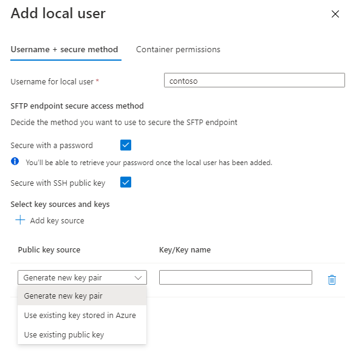
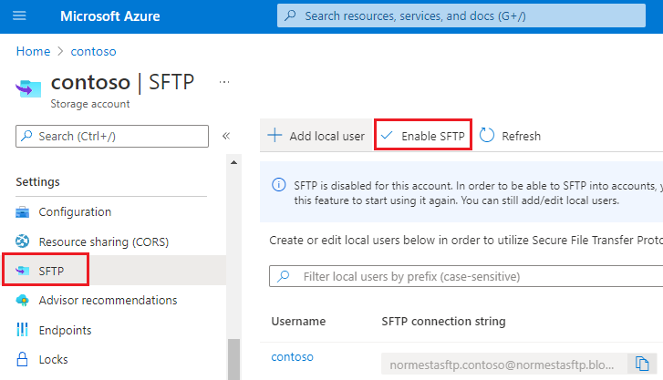

# Connect to Azure Blob Storage by using the Secure File Transfer (SFTP) protocol (preview)

You can securely connect to an Azure Storage account by using an SFTP client, and then manage your objects by using file system semantics. This article provides step-by-step guidance that helps you use SFTP to interact with Azure Blob Storage. To learn more about SFTP protocol support in Azure Blob Storage, see [Secure File Transfer (SFTP) protocol support in Azure Blob Storage](secure-file-transfer-protocol-support.md).

> [!IMPORTANT]
> SFTP protocol support is currently in PREVIEW and is available in the following regions: North US, Central US, East US, Canada, West Europe, North Europe, Australia, Switzerland, Germany West Central, and East Asia.
>
> See the [Supplemental Terms of Use for Microsoft Azure Previews](https://azure.microsoft.com/support/legal/preview-supplemental-terms/) for legal terms that apply to Azure features that are in beta, preview, or otherwise not yet released into general availability.
>
> To enroll in the preview, see [this form](https://forms.microsoft.com/Pages/ResponsePage.aspx?id=v4j5cvGGr0GRqy180BHbR2EUNXd_ZNJCq_eDwZGaF5VUOUc3NTNQSUdOTjgzVUlVT1pDTzU4WlRKRy4u).

## Prerequisites

- A standard general-purpose v2 or premium block blob storage account. For more information on these types of storage accounts, see [Storage account overview](../common/storage-account-overview.md).

- Account redundancy option of the storage account is set to either locally-redundant storage (LRS) or zone-redundant storage (ZRS).

- The hierarchical namespace feature of the account must be enabled. To enable the hierarchical namespace feature, see [Upgrade Azure Blob Storage with Azure Data Lake Storage Gen2 capabilities](upgrade-to-data-lake-storage-gen2-how-to.md).

- If you're connecting from an on-premises network, make sure that your client allows outgoing communication through port 22. The SFTP protocol uses that port.

## Register the SFTP feature

1. Sign in to the [Azure portal](https://portal.azure.com/).

2. Locate your subscription, and in configuration page of your subscription, select **Preview features**.

3. In the **Preview features** page, select the **AllowSFTP** feature, and then select **Register**.

4. Make sure to verify that the feature is registered before continuing.
    
   In the **Preview features** page of your subscription, locate the **AllowSFTP** feature, and then make sure that **Registered** appears in the **State** column.

## Add local users

Local users are a new form of identity management designed to secure connections from SFTP clients. To connect an SFTP client to an Azure Storage endpoint, the client must provide the password or SSH public key associated with a local user. To learn more about local users, see [Local users](secure-file-transfer-protocol-support.md#local-users). 

This section helps you to configure a local user, choose an authentication method, and set permissions on containers and directories. Repeat the steps in this section for each local user that you want to add.

1. In the [Azure portal](https://portal.azure.com/), navigate to your storage account.

2. Select **SFTP**, and then in the SFTP configuration page, select **Add local user**. 

   > [!div class="mx-imgBorder"]
   > 

3. In the **Add local user** configuration page, add the name of a user, and then select which methods of authentication you'd like associate with this local user. 

   > [!div class="mx-imgBorder"]
   > 

   If you select **Secure with a password**, then your password will appear when you've completed all of the steps in the **Add local user** configuration page.

   If you select **Secure with SSH public key**, then select **Add key source** to specify a key. 

   You can generate a new key pair, use an existing key stored in Azure, or specify an existing public key.  To learn more about these options, see [Authentication methods](secure-file-transfer-protocol-support.md#authentication-methods).

   > [!div class="mx-imgBorder"]
   > 

4. Select **Next** to move to the **Container permissions** tab of the configuration page.

5. In the **Container permissions** section, choose the containers that you want to make available to this local user. Then, choose which types of operations you want to enable this local user to perform.

   > [!div class="mx-imgBorder"]
   > 

6. In the **Home directory** edit box, type the name of the container or the directory path (including the container name) that will be the default location associated with this this local user. If the connecting SFTP client doesn't reference a specific directory, the request will operate on data in the **Home directory**. 

   To learn more about the home directory, see [Directory permissions](secure-file-transfer-protocol-support.md#directory-permissions).

7. Choose the **Add button** to add the local user.

   If you chose to secure data with a password, then your password appears in a dialog box. This password can't be generated again, so make sure to copy the password, and then store it in a place where you can find it. 

   If you chose to generate a new key pair, then you'll be prompted to download the private key of that key pair.

## Enable SFTP support

1. In the [Azure portal](https://portal.azure.com/), navigate to your storage account.

2. Select **SFTP**, and then select **Enable SFTP**.

   > [!div class="mx-imgBorder"]
   > 

   >[!NOTE]
   > If no local users appear in the SFTP configuration page, you'll need to add at least one of them. To add local users, see the [Add a local user](#add-local-users) section of this article.

## Connect to Azure Blob Storage and transfer data

Put any guidance here - if appropriate.

Put guidance for using password or key as part of the process.

---

## Resolve common errors

|Error | Cause / resolution|
|---|---|
|`Error`|Cause / resolution |

## See also

- [Secure File Transfer (SFTP) protocol support in Azure Blob Storage](secure-file-transfer-protocol-support.md)
- [Known issues with Secure File Transfer (SFTP) protocol support in Azure Blob Storage](secure-file-transfer-protocol-known-issues.md)
