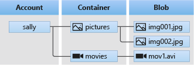

# Explore the .NET object model for Azure Blob Storage

Put a cool introduction here.

Blob storage offers three types of resources:

- The storage account

- A container in the storage account

- A blob in the container

The following diagram shows the relationship between these resources.

## Understand the object model

Use the following .NET classes to interact with these resources:

- [BlobServiceClient](/dotnet/api/azure.storage.blobs.blobserviceclient): The `BlobServiceClient` class allows you to manipulate Azure Storage resources and blob containers.

- [BlobContainerClient](/dotnet/api/azure.storage.blobs.blobcontainerclient): The `BlobContainerClient` class allows you to manipulate Azure Storage containers and their blobs.

- [BlobClient](/dotnet/api/azure.storage.blobs.blobclient): The `BlobClient` class allows you to manipulate Azure Storage blobs.

## Another subhead

Put something here.

## See also

[Get started with Azure Blob Storage and .NET](storage-blob-dotnet-get-started.md)